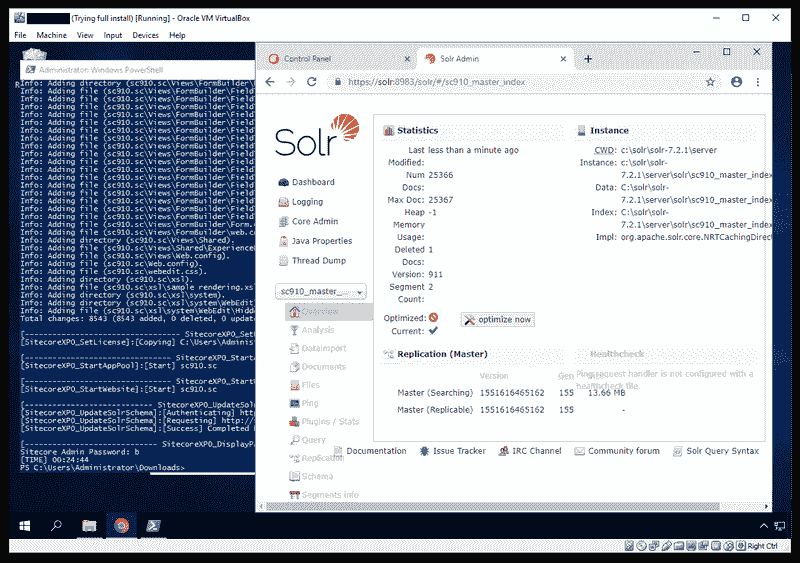

# 用 SIF 安装 Solr 的第二次尝试

> 原文：<https://dev.to/jermdavis/a-second-attempt-at-installing-solr-with-sif-17k9>

最近 [Steve McGill](https://twitter.com/steviemcgill) 问我在自动化 Sitecore 的 Solr 设置时是否尝试过使用 SIF 的证书创建。我意识到我没有努力去研究这可能是如何工作的——这似乎是一些研究的绝佳借口……

那么，我最初尝试通过 SIF 安装 Solr，现在需要做些什么来让它工作呢？

如果你看一下标准的 SIF V2 脚本，那么它们利用`createcert.json`文件来生成证书。标准设置传递一些参数，如证书的名称和保存位置，脚本处理生成工作并确保它是可信的。所以可以第三次调用它来为 Solr 生成一个证书，并把它写到磁盘上。这将意味着改变我最初的 Solr SIF 脚本，这样它就可以获取一个已经生成的文件并安装它，而不是生成它需要的证书。

这意味着对 PowerShell 进行一些调整…

## 更改我的脚本…

当我检查我的原始代码是否仍可用于此时，我注意到 PowerShell 向我发出了许多警告，告诉我`Write-TaskInfo`已经贬值，我应该使用`Write-Information`来代替。所以我做了一个快速搜索和替换来改变整个`SolrInstall-SIF-Extension.psm1`文件。

Solr 的 SIF 扩展最大的逻辑变化是我们不再需要生成证书。如果我们只需要复制一个已经生成的证书——那么`Invoke-EnsureSSLCertificateTask`的代码就简单多了:

```
function  Invoke-EnsureSSLCertificateTask  {  [CmdletBinding(SupportsShouldProcess=$true)]  param(  [parameter(Mandatory=$true)]  [bool]$solrSSL,  [parameter(Mandatory=$true)]  [string]$solrName,  [parameter(Mandatory=$true)]  [string]$solrHost,  [parameter(Mandatory=$true)]  [string]$certificateStore,  [parameter(Mandatory=$true)]  [string]$sourceCert  )  PROCESS  {  if($solrSSL)  {  Write-Information  -Message  "$sourceCert"  -Tag  "Copying the site cert to $certificateStore"  copy  $sourceCert  $certificateStore  }  }  } 
```

Enter fullscreen mode Exit fullscreen mode

添加了一个新参数`$sourceCert`,指定查找生成的证书的路径。逻辑发生了变化，去掉了所有原始的“生成并信任证书”代码，取而代之的是从新的源位置到原来位置的简单复制操作。我也可以去掉那些不需要的参数，这些参数曾经被用来生成一个证书，但是我意识到我没有这样做。另一天的任务…

新证书的位置及其密码也需要传入到`Invoke-ConfigureSolrTask`中，SIF 调用它来修改默认的 Solr 配置，这样它就可以沿着链传递下去……

```
function  Invoke-ConfigureSolrTask  {  [CmdletBinding(SupportsShouldProcess=$true)]  param(  [parameter(Mandatory=$true)]  [bool]$solrSSL,  [parameter(Mandatory=$true)]  [string]$solrHost,  [parameter(Mandatory=$true)]  [string]$solrRoot,  [parameter(Mandatory=$true)]  [string]$certificateStore,  [parameter(Mandatory=$true)]  [string]$CertificatePassword  )  PROCESS  {  if($solrSSL)  {  Write-Information  -Message  "HTTPS"  -Tag  "Configuring Solr for HTTPS access"  configureHTTPS  $solrHost  $solrRoot  $certificateStore  $CertificatePassword  }  else  {  Write-Information  -Message  "HTTP"  -Tag  "Configuring Solr for HTTP access"  configureHTTP  $solrHost  $solrRoot  }  }  } 
```

Enter fullscreen mode Exit fullscreen mode

…到`configureHTTPS`方法。它已经知道如何将 Solr 指向证书，但是在我的原始代码中，为了简单起见，我硬编码了证书密码。SIF 不使用简单的默认密码，所以我们需要能够传入正确的密码，并且需要将其放入 config:

```
function  configureHTTPS  {  Param(  [string]$solrHost,  [string]$solrRoot,  [string]$certStore,  [string]$CertificatePassword  )  $solrConfig  =  "$solrRoot\bin\solr.in.cmd"  if(!(Test-Path  -Path  "$solrConfig.old"))  {  if($pscmdlet.ShouldProcess("$solrConfig",  "Rewriting Solr config file for HTTPS"))  {  $cfg  =  Get-Content  $solrConfig  Rename-Item  $solrConfig  "$solrRoot\bin\solr.in.cmd.old"  $newCfg  =  $cfg  |  %  {  $_  -replace  "REM set SOLR_SSL_KEY_STORE=etc/solr-ssl.keystore.jks",  "set SOLR_SSL_KEY_STORE=$certStore"  }  $newCfg  =  $newCfg  |  %  {  $_  -replace  "REM set SOLR_SSL_KEY_STORE_PASSWORD=secret",  "set SOLR_SSL_KEY_STORE_PASSWORD=$CertificatePassword"  }  $newCfg  =  $newCfg  |  %  {  $_  -replace  "REM set SOLR_SSL_TRUST_STORE=etc/solr-ssl.keystore.jks",  "set SOLR_SSL_TRUST_STORE=$certStore"  }  $newCfg  =  $newCfg  |  %  {  $_  -replace  "REM set SOLR_SSL_TRUST_STORE_PASSWORD=secret",  "set SOLR_SSL_TRUST_STORE_PASSWORD=$CertificatePassword"  }  $newCfg  =  $newCfg  |  %  {  $_  -replace  "REM set SOLR_HOST=192.168.1.1",  "set SOLR_HOST=$solrHost"  }  $newCfg  |  Set-Content  $solrConfig  }  Write-Information  -Message  "$solrConfig"  -Tag  "Solr config updated for HTTPS access"  }  else  {  Write-Information  -Message  "$solrConfig"  -Tag  "Solr config already updated for HTTPS access - skipping"  }  } 
```

Enter fullscreen mode Exit fullscreen mode

这就是安装 Solr 所需的代码更改。我意识到我可以在这里做的另一个调整是从这个文件中去掉“不使用 HTTPS 安装 Solr”的代码路径，因为我们总是使用 HTTPS。但同样，这是我有更多空闲时间时的工作。

接下来是将其绑定到 SIF 的配置:

## 调整 SIF 的 Solr 安装扩展

上一次我[使用 SIF](https://jermdavis.wordpress.com/2017/11/13/solr-installs-with-sif/) 在 Sitecore 旁边安装 Solr 时，是针对 Sitecore 的早期版本。因此，在我们讨论证书之前，还需要做一些更改…

v9.1 要求的 Solr 版本是 Solr 7.2.1。这在描述我们对 SIF 的 Solr 需求的 json 文件中指定。所以让我们更新这个参数。我也有一个新版本的 Java 在我测试的虚拟机上运行，所以也需要更新:

```
{  "Parameters"  :  {  "JREVersion":  {  "Type":  "string",  "DefaultValue":  "1.8.0_202",  "Description":  "What version of the Java Runtime should "  },  "SolrVersion":  {  "Type":  "string",  "DefaultValue":  "7.2.1",  "Description":  "What version of Solr should be downloaded for install"  }  }  } 
```

Enter fullscreen mode Exit fullscreen mode

我还决定我想要一个解决 JRE 路径问题的方法。根据您使用的是 64 位还是 32 位 Java，您会在不同的位置获得 Java 程序文件文件夹。所以我决定添加一个参数，它使用哪个程序文件文件夹，并为我使用的 64 位版本的 Java 配置这个参数:

```
{  "Parameters"  :  {  "ProgFilesFolder":  {  "Type":  "string",  "DefaultValue":  "C:\\Program Files",  "Description":  "Where certificates got exported to after generation"  }  }  } 
```

Enter fullscreen mode Exit fullscreen mode

然后，该参数被用来帮助从原始脚本中计算出正确的 JRE 路径变量:

```
{  "Variables"  :  {  "JREPath":  "[concat(parameter('ProgFilesFolder'), '\\Java\\jre', parameter('JREVersion'))]"  },  } 
```

Enter fullscreen mode Exit fullscreen mode

由于我们更改了 PowerShell 中的一些方法签名，任务绑定需要更新:

```
{  "Tasks"  :  {  "Rewrite Solr config file":  {  "Type":  "ConfigureSolr",  "Params":  {  "solrSSL":  "[parameter('SolrUseSSL')]",  "solrHost":  "[parameter('SolrHost')]",  "solrRoot":  "[variable('SolrInstallFolder')]",  "certificateStore":  "[variable('CertStoreFile')]",  "CertificatePassword":  "[parameter('CertificatePassword')]"  }  },  "Ensure trusted SSL certificate exists (if required)":  {  "Type":  "EnsureSSLCertificate",  "Params":  {  "solrSSL":  "[parameter('SolrUseSSL')]",  "solrName":  "[variable('SolrName')]",  "solrHost":  "[parameter('SolrHost')]",  "certificateStore":  "[variable('CertStoreFile')]",  "sourceCert":  "[variable('SourceCert')]"  }  }  }  } 
```

Enter fullscreen mode Exit fullscreen mode

这些更改需要传入一些额外的数据。源证书名称将是路径、我们用于 Solr 的主机名和“.”的组合。pfx”扩展名。因为这涉及到计算，这意味着我们需要将它设置为一个变量:

```
 "Variables"  :  {  "SourceCert":  "[concat(parameter('CertFilePath'), parameter('SolrHost'), '.pfx')]"  } 
```

Enter fullscreen mode Exit fullscreen mode

这意味着我们还为整个 SIF 脚本增加了两个新参数，在我们将找到证书的文件夹中，还有证书文件的密码:

```
{  "Parameters"  :  {  "CertFilePath":  {  "Type":  "string",  "DefaultValue":  "c:\\certificates\\",  "Description":  "Where certificates got exported to after generation"  },  "CertificatePassword":  {  "Type":  "string",  "DefaultValue":  "SIF-Default",  "Description":  "The password set on the certificate"  }  } 
```

Enter fullscreen mode Exit fullscreen mode

这是对我最初的 SIF 流程的必要修改。[JSON 文件](https://gist.github.com/jermdavis/989cdec72ede2824012d81ce8610ed37#file-solrserver-json)和[PowerShell 文件](https://gist.github.com/jermdavis/989cdec72ede2824012d81ce8610ed37#file-solrinstall-sif-extension-psm1)在一个 gist 中可用。

## 调整基础 SIF 配置

现在，添加 Solr 的 SIF 扩展已经就绪，接下来需要做的是将它连接到 Sitecore 的整个 SIF 流程中。这涉及到更改整个 SIF 流程 json 文件和与之相关的 powershell 脚本。我在这里做一个开发者安装，所以我在做`XP0-SingleDeveloper`文件。

在`XP0-SingleDeveloper.json`中要做的第一个改变是我们需要触发 Solr 证书的创建，然后调用我们在上面创建的 Solr install。这些需要插入到`Includes`部分的顶部，这样它们首先出现:

```
{  "Includes":  {  "SolrCertificates":  {  "Source":  ".\\createcert.json"  },  "Solr":  {  "Source":  ".\\SolrServer.json"  }  }  } 
```

Enter fullscreen mode Exit fullscreen mode

为了使这些工作，需要一些进一步的参数。首先，有一些参数定义了脚本的其余部分如何工作:

```
{  "Parameters":  {  "SolrExportPassword":  {  "Type":  "String",  "DefaultValue":  "testpassword",  "Description":  "Password to export the solr cert with."  },  "CertPath":  {  "Type":  "String",  "DefaultValue":  "c:\\certificates",  "Description":  "where exported certs go"  },  "SolrHost":  {  "Type":  "String",  "DefaultValue":  "localhost",  "Description":  "The Solr host name to use."  }  }  } 
```

Enter fullscreen mode Exit fullscreen mode

我们不希望 SIF 为 Solr 证书生成密码，所以我们需要为此定义一个值。我们需要告诉 Solr 安装脚本在哪里可以找到生成的证书，以及 Solr 的主机名应该是什么。

其中一些值需要传递给脚本的其他部分。当您希望将一个值传递给特定的包含脚本时，SIF 定义了一个特殊的命名约定。如果参数名以包含名称和冒号为前缀，则它特定于该包含。此外，它们没有为这些参数定义默认值，而是定义了对另一个参数名称的引用——实际上是复制了那个值:

```
{  "Parameters":  {  "SolrCertificates:CertificateName":  {  "Type":  "String",  "Reference":  "SolrHost",  "Description":  "Override to pass SolrCertificateName value to SolrCertificates config."  },  "SolrCertificates:ExportPassword":  {  "Type":  "String",  "Reference":  "SolrExportPassword",  "Description":  "Password to export the solr cert with."  },  "Solr:CertificatePassword":  {  "Type":  "String",  "Reference":  "SolrExportPassword",  "Description":  "Password the solr cert was exported with."  }  }  } 
```

Enter fullscreen mode Exit fullscreen mode

完成这些更改后，您需要调整调用 JSON 数据的 PowerShell。我在这里做的更改是传入`SolrHost`值，但是如果您想更改上面的默认值:
，也可以传入密码

```
# Solr host name  $SolrHost  =  "solr";  # Install XP0 via combined partials file.  $singleDeveloperParams  =  @{  Path  =  "$SCInstallRoot\XP0-SingleDeveloper.json"  SqlServer  =  $SqlServer  SqlAdminUser  =  $SqlAdminUser  SqlAdminPassword  =  $SqlAdminPassword  SitecoreAdminPassword  =  $SitecoreAdminPassword  SolrHost  =  $SolrHost  SolrUrl  =  $SolrUrl  SolrRoot  =  $SolrRoot  SolrService  =  $SolrService  Prefix  =  $Prefix  XConnectCertificateName  =  $XConnectSiteName  IdentityServerCertificateName  =  $IdentityServerSiteName  IdentityServerSiteName  =  $IdentityServerSiteName  LicenseFile  =  $LicenseFile  XConnectPackage  =  $XConnectPackage  SitecorePackage  =  $SitecorePackage  IdentityServerPackage  =  $IdentityServerPackage  XConnectSiteName  =  $XConnectSiteName  SitecoreSitename  =  $SitecoreSiteName  PasswordRecoveryUrl  =  $PasswordRecoveryUrl  SitecoreIdentityAuthority  =  $SitecoreIdentityAuthority  XConnectCollectionService  =  $XConnectCollectionService  ClientSecret  =  $ClientSecret  AllowedCorsOrigins  =  $AllowedCorsOrigins  } 
```

Enter fullscreen mode Exit fullscreen mode

同样，SIF json 和 powershell 的这些变化也是这篇文章的主旨。

## 结论

在进行了大量的黑客攻击，恢复了我的虚拟机，修复了我自己的一些愚蠢的错误之后(如果 SIF 抱怨你的 json 格式不好，不要忘记使用`Get-Content YourFileNameHere.json | ConvertFrom-Json`来检查它！)有效:

[](https://jermdavis.files.wordpress.com/2019/03/solrruns-1.png)

我怀疑这里可以做更多的调整，使它更漂亮、更灵活，但这是一个好的开始…