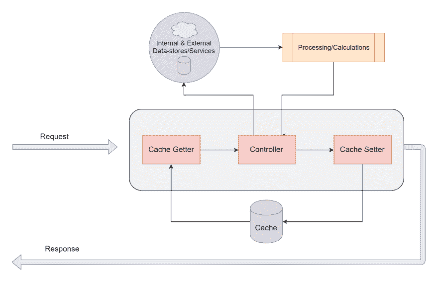

# 节点 REST APIs 的简单缓存策略，第 1 部分

> 原文：<https://dev.to/vigzmv/a-simple-caching-strategy-for-node-rest-apis-part-1-72a>

你好，世界，这是关于“如何让你的 REST APIs 运行得更快”的 2 部分系列的开始🚀".这些来自我的个人经历和我建立的项目。

一段时间以前，我在一个市场平台上工作，用户可以在那里列出他们要销售的产品。在主页上，它会加载一堆产品，与产品的自我数据，它还会加载一些统计数据，以前的销售历史，最近的列表数据等。我们还允许用户在页面上进行排序、过滤和更多操作，而无需重新加载或重新获取以获得快速体验。但这是有代价的。对于发送所有这些数据的 API，它必须进行大量的计算，最终需要花费几百毫秒，在 200-400 毫秒的范围内，在高流量时更糟。所以我们开始寻找改善的方法。本系列将讨论这些方法。

[](https://res.cloudinary.com/practicaldev/image/fetch/s--sS8Pv2iN--/c_limit%2Cf_auto%2Cfl_progressive%2Cq_auto%2Cw_880/https://thepracticaldev.s3.amazonaws.com/i/zgk84wvux91z0t5f3ty4.png)

**第 1 部分:节点 REST APIs 的简单缓存策略**
第 2 部分:[缓存失效](https://dev.to/vigzmv/a-simple-cache-invalidation-strategy-part-2-4alc)😭

所以让我们直接进入第一部分

这是我们将要研究的终点。它只是接受一些查询，从数据库获取数据，处理数据并返回一个 JSON 响应。

```
// products/routes.js

router.get(
  '/',
  processQuery,
  productsController.index,
  responseHandler
) 
```

好了，现在让我们添加一些缓存💸！

对于本例，我们将使用[节点缓存](https://www.npmjs.com/package/node-cache)，我们将它放在一个文件中，然后只需更改几行就可以轻松地用任何缓存存储替换它。

首先，安装节点缓存包。

`$ npm install node-cache --save`

我们将创建一个缓存中间件，它可以很容易地与我们想要的任何端点一起使用。这就是中间件的样子。

```
// middlewares/cache.js

const NodeCache = require('node-cache')

// stdTTL: time to live in seconds for every generated cache element.
const cache = new NodeCache({ stdTTL: 5 * 60 })

function getUrlFromRequest(req) {
  const url = req.protocol + '://' + req.headers.host + req.originalUrl
  return url
}

function set(req, res, next) {
  const url = getUrlFromRequest(req)
  cache.set(url, res.locals.data)
  return next()
}

function get(req, res, next) {
  const url = getUrlFromRequest(req)
  const content = cache.get(url)
  if (content) {
    return res.status(200).send(content)
  }
  return next()
}

module.exports = { get, set } 
```

让我们一个一个地检查功能。

1.  `getUrlFromRequest`接受请求并返回完整的请求 URL。
    我们使用这个 URL 作为缓存的唯一键。

2.  `set`将我们处理过的响应(`res.locals.data`)保存到缓存中，并将完整的 URL 作为关键字。

3.  `get`使用 URL 作为键来检索先前存储的缓存响应，如果找到数据，它将作为响应发送回来，否则请求将被转发到下一个中间件。

我们的缓存中间件准备好了！让我们把它和我们的产品路线联系起来。

```
// products/routes.js

const cache = require('./cache-middleware') // 👈 import our cache middleware

router.get( 
  '/',
  cache.get,  // 👈
  processQuery,
  productsController.index,
  cache.set, // 👈
  responseHandler
) 
```

仅此而已，我们的端点已经快了！但是怎么做😯？？

我们已经将我们的两个中间件`get`和`set`添加到路线中。当一个新的请求进来时，它将首先通过`cache.get`，因为我们在缓存中还没有任何东西，请求向下传递到下一个中间件并到达`cache.set`，这将在接下来的 5 分钟内在缓存中保存响应。

接下来 5 分钟内出现的任何请求都将能够从`cache.get`中检索到该缓存，并立即将其返回给用户。不进行任何计算。数据库没有被触动。

通过这样做，我们能够将我们的响应时间降低到仅仅几毫秒🎉。

但是，是的，这不是最终的解决方案，这种方法有一些小问题。网站上的用户不会获得实时数据，显示的数据最多可能是 5 分钟前的。虽然这种方法可能适用于某些用例，但这不是我们可以接受的解决方案，我们的用户需要实时数据。所以我们必须深入调查。我们必须调查**缓存失效**😈，我们将在我们的[下一部分](https://dev.to/vigzmv/a-simple-cache-invalidation-strategy-part-2-4alc)中讨论。👋

在推特 | [Github](https://github.com/vigzmv) 上关注我，我制作并发布很酷的东西。👨‍💻