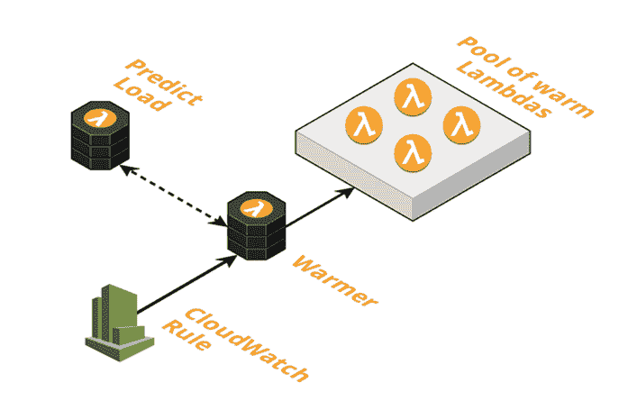

# 一项智能服务，让 AWS Lambda 保持温暖

> 原文：<https://dev.to/byrro/a-smart-service-to-keep-aws-lambda-warm-48pc>

在许多情况下，冷启动会产生疼痛。例如，当服务于实时客户请求时，每一毫秒都是减少跳出率、放弃购物车、提高转化率等的关键。即使在后台处理中，每当一个新容器需要启动时，在内存中加载相同的信息也是浪费时间和金钱。

一个免费的服务来帮助开发者保持一个 Lambdas 池的温度，灵活地调整每个函数的并发需求，将会非常方便。在本文中，我概述了我将如何实现这样一个服务。作为一名支持无服务器监控的开发者，我经常看到关于冷启动的抱怨，我们的目标是提供一种简单免费的方法来解决这个问题。

[](https://res.cloudinary.com/practicaldev/image/fetch/s--Rgd2jjsO--/c_limit%2Cf_auto%2Cfl_progressive%2Cq_auto%2Cw_880/https://thepracticaldev.s3.amazonaws.com/i/y9g9wtl7azl9yxlpdt5i.jpg) 
*图片由[卢克·波特](https://unsplash.com/photos/DSF_kiOFxO0?utm_source=unsplash&utm_medium=referral&utm_content=creditCopyText)在 [Unsplash](https://unsplash.com/search/photos/warm?utm_source=unsplash&utm_medium=referral&utm_content=creditCopyText)*

# 定义

### 保温功能

我们知道 AWS 在终止一个空闲的 Lambda 容器之前需要一些时间。通常需要多长时间各不相同，但可以肯定的是，大多数容器在 5 分钟内不会被杀死，所以我们就这样吧。

在频率和成本之间有一个权衡:较高的频率使冷启动的可能性最小化，但也更昂贵，反之亦然。

### 并发

随着并发请求的到来，我们将需要尽可能多的容器。为此，我们需要并发发送多个“热请求”。多少？我们将使用[时间序列建模](https://www.analyticsvidhya.com/blog/2015/12/complete-tutorial-time-series-modeling/)来回答这个问题。

# 解

以下是应对这些挑战的概要计划。我们会使用:

*   CloudWatch:定期触发升温过程(例如每 5 分钟一次)
*   取暖器:调用羊肉并使其保持温暖的逻辑
*   预测:预测在任何时间点需要多少集装箱

示意图:

[](https://res.cloudinary.com/practicaldev/image/fetch/s--ageZUBuU--/c_limit%2Cf_auto%2Cfl_progressive%2Cq_auto%2Cw_880/https://thepracticaldev.s3.amazonaws.com/i/oyovhpvgkxazpb8fnv2o.png)

### 一池温暖的羊肉

我们的功能将需要在代码中稍加修改，以处理“热请求”。为了在预热容器时将执行时间保持在最短，我们将尽可能短地终止处理。我们应该这样做:

```
if event['get_warm'] == True:
    return {'warmed': True} 
```

### 触发(CloudWatch)

CloudWatch 会定期触发更暖的 Lambda，比如每 5 分钟一次。时间频率应根据每个功能进行调整，以适应不同的项目需求。

### (λ)变暖

会调用并加热我们选择的羊肉。它应该处理上面讨论的并发问题。为了让这个 Lambda 工作，我们可以使用 Jeremy Daly 的开源项目。

[](https://res.cloudinary.com/practicaldev/image/fetch/s--nVkYsO-t--/c_limit%2Cf_auto%2Cfl_progressive%2Cq_auto%2Cw_880/https://thepracticaldev.s3.amazonaws.com/i/2jzfmc6p1ftzq37qlvta.jpg) 
*图片由 [Sandis Helvigs](https://unsplash.com/photos/3A0OWdyBc4M?utm_source=unsplash&utm_medium=referral&utm_content=creditCopyText) 上传 [Unsplash](https://unsplash.com/search/photos/warm?utm_source=unsplash&utm_medium=referral&utm_content=creditCopyText)*

### (λ)预测

加温器 Lambda 将需要知道在每个循环中有多少容器应该被加温。这个 Lambda 将提供这一点。事情是这样的:

首先，预测器将从 CloudWatch metrics 获得给定 Lambda 的最新调用历史。AWS CLI 接口有 [get-metrics-data](https://docs.aws.amazon.com/cli/latest/reference/cloudwatch/get-metric-data.html) 端点，可以提供我们需要的信息。不过，我们将从 AWS SDK 中使用这些数据，而不是命令行(T2，如 boto3 - get_metric_data )，以便自主运行整个过程。CloudWatch 可以向我们提供在过去的几个小时或几天内，每秒钟调用一个函数的次数。我们将使用它作为并发请求度量的代理。它并不完美，但可能是我们能得到的最接近真实数字的了。

然后，时序预测模型将使用调用历史来预测我们的 Lambda 在接下来的 5 分钟内预计会获得的最大并发请求数，并将其提供给更热的 Lambda。

对于时间序列建模，我们计划使用 [StatsModels](https://github.com/statsmodels/statsmodels/) ，这是一个有趣的统计开源项目，为这项任务带来了一些最佳算法的实现。

# 结论

这些是我们对一个简单而有效的保持 Lambda 恒温系统的概述。如果你想在这项服务可以免费使用时得到通知，请在[renato@dashbird.com](mailto:renato@dashbird.com)给我留言。