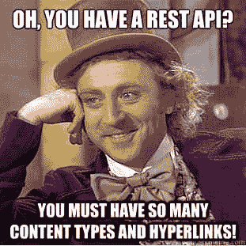
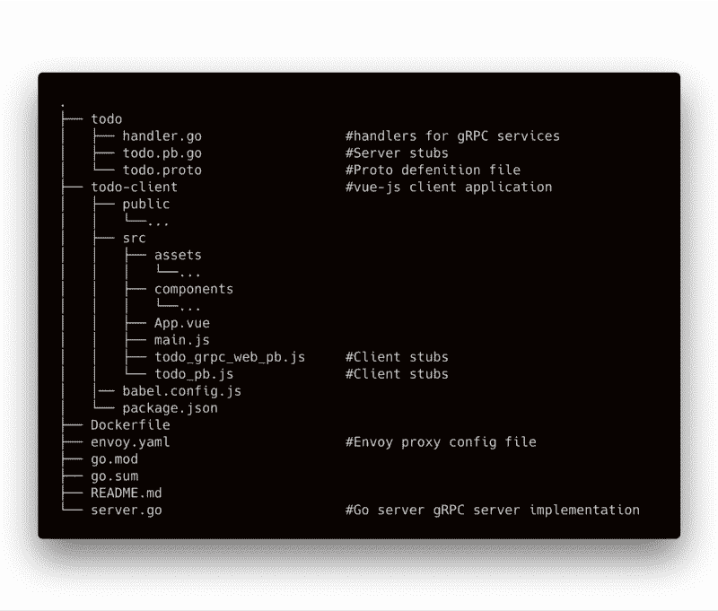

# 使用 grpc-web 和 Vue.js 的 TODO 应用程序

> 原文：<https://dev.to/thearavind/a-todo-app-using-grpc-web-and-vuejs-3p55>

## gRPC 简介

gRPC 是一个开源的现代 RPC 框架，最初由 Google 开发。它使用协议缓冲区作为接口描述语言，protobuf 是一种序列化结构化数据的机制。您只需在 proto 文件中定义您的服务及其数据结构，gRPC 就会自动为您的服务生成各种语言和平台的客户机和服务器存根。使用 profobuf 允许我们使用二进制而不是 JSON 进行通信，这使得 gRPC 更快更可靠。gRPC 的其他一些关键特性是双向流和流量控制、阻塞或非阻塞绑定以及可插拔认证。gRPC 使用 HTTP/2，它使用多路复用技术，客户端和服务器都可以在一个底层 TCP 连接上启动多个流，你可以在这里阅读更多关于 gRPC 的信息。

## [grpc 网站](#grpcweb)

gRPC-Web 是一个 javascript 库，使用它我们可以通过 Web 浏览器直接与 gRPC 服务对话。gRPC-Web 客户端通过一个特殊的网关代理(Envoy proxy)连接到 gRPC 服务，这个代理在我们的例子中是一个 docker 服务，运行在同一台服务器上，它将 GRPC( HTTP/2)与浏览器通信(HTTP/1.1)连接起来

这是游戏规则的改变者，因为最初我们只能将 gRPC 用于服务或微服务之间的通信，而客户端只能使用 REST API 调用来访问数据，但现在通过使用 gRPC，我们可以在整个应用中利用 gRPC 的能力，并消除 REST

## gRPC 为什么比 REST 好

REST 和 gRPC 之间的主要区别是

*   有效负载类型，REST 使用 JSON，gRPC 使用 Protobuff
*   传输协议，REST 使用 HTTP/1.1，gRPC 使用 HTTP/2

因为我们在 gRPC 中使用 Protobuf，所以我们不必关心动词(GET、PUT)和头等。此外，它还减少了我们必须为所有数据模型编写的序列化代码，gRPC 框架生成的存根会处理这些代码。

由于我们在 gRPC 中使用 HTTP/2，现在我们可以流式传输请求和响应，并消除延迟问题、线路阻塞和建立 TCP 连接的复杂性。

## 所需的工具和软件

*   Protoc v3.6.1— Protobuf 编译器，用于生成客户端和服务器存根。
*   go v1.11 —我们的服务器将使用 go lang 构建。
*   NodeJS —构建 Vue。JS 前端 app。
*   Docker —运行特使代理。

## 文件夹结构

## 概述要涵盖的主题

1.  创建原型文件
2.  创建服务器存根和编写 gRPC 服务处理程序
3.  正在创建 gRPC 服务
4.  正在创建特使代理服务
5.  创建客户端存根和客户端应用程序

## 1。原型文件

好了，现在让我们进入代码，原型文件是我们 gRPC 应用程序的核心。使用这个文件，gRPC 框架生成客户端和服务器存根，我们定义我们的数据模型和将要使用这些数据模型的服务，这个文件将放在我们项目根目录下的 todo 文件夹中。