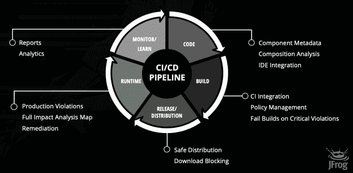

# 转型之旅！2019

> 原文：<https://dev.to/jfrog/a-trip-to-transform-2019-18po>

<figure> 

<figcaption>让你的软件流动起来</figcaption>

</figure>

上周，我有幸参加了一个关于 DevOps 未来的小组讨论。这是转型的一部分！2019 年在德国慕尼黑举行的活动。有趣的是，从酒店我可以看到谷歌办公室，它带来了许多美好的回忆。

该活动的主要目标是让参与者体验改变一家公司以变得更加“智能”意味着什么。分享知识的方式是参与行业领导者、DevOps 领域的初创企业、高管和 SAP 专家之间的公开对话。这次活动只有几条赛道和许多网络选项，这是一个向他人学习的好机会。

### DevOps 面板

当谈到创建一个可以在数字时代蓬勃发展的企业时，DevOps 的好处是显而易见的。更快的部署频率和更低的故障率被证明是采用 DevOps 的一些优势。它为您的(软件)组织带来了更多的速度，并使您能够(更快地)为您的用户增加更多的价值。

<figure>

<figcaption>transform 2019 . de
</figcaption>

</figure>

该小组讨论了采用 DevOps 的趋势、转型之旅中的挑战以及有助于推动成果的最新最佳技术(Psst…如果您希望看到一个应对挑战的好答案，请查看 [JFrog E+](https://jfrog.com/enterprise-plus-platform/) )。

我提出的主要问题是关于安全性以及它如何阻碍 DevOps 的采用。在 DevOps 解决方案中，速度和安全性之间应该如何权衡？

我的回答是不应该有牺牲速度的折衷。安全性应该以一种对开发人员有帮助而不是减缓他们的方式融入到您的开发中。您希望使用一个安装护栏而不是大门的工具，这样您的开发人员就可以保持在铺设好的道路上，而不用花时间通过大门。我在谷歌和网飞都看到了这种方法，而且这种方法对这些公司非常有效。

如何实现这一点？

从速度的角度来看，您希望使用自动化的工具来提出解决方案，而不仅仅是“仅供参考”的信息。任何可以手动完成的事情都应该自动化。此外，该工具应该保护从开发阶段到部署阶段的管道，并在以后监控生产中的一切(参见下面每个阶段的详细信息)。您还希望最大限度地减少误报警报，这样您的开发人员就会对该工具更加信任。换句话说，不仅仅是数量的问题，还有警报的质量问题。

<figure> 

<figcaption>持续安全
</figcaption>

</figure>

就安全方面而言，我们希望工具能够广泛覆盖漏洞(不要局限于 NVD)。它应该有一种与 ide 集成的方式，这样我们的开发人员在构建软件时就可以知道有什么风险。

最后但同样重要的是，您希望工具不只是“告诉”您当前软件包有什么问题，而是您可以采取哪些措施，对吗？因此，它应该提供一个明确的补救途径。例如，一种在漏洞和软件包之间进行精确匹配并提供已修复漏洞的方法(例如，考虑这样一种情况，您无法使用某个版本的 *openSSL* ，但该工具让您知道另一个版本不会受到这些漏洞的影响。)

我被问到的另一个好问题是关于我在讨论开始时提出的一个主张(不要问我为什么):“到 2020 年，DevOps 将成为每个组织的默认设置。”你认为实现这一目标的行动计划是什么？

没有一个答案适合这里的所有人。在每个公司，都会有不同的差距，需要不同的优先顺序。我们知道大多数公司关心的是:**创新**、**安全**和**成本**降低。

*   创新:对于任何希望推动创新和不断改进产品的公司来说，这都是一个关键的成功因素。您从 DevOps 最佳实践中获得的速度有助于您增加构建更多创新服务的可能性。

*   **安全性**:能够在开发周期中尽快发现漏洞，然后在生产中尽可能快地减少漏洞的一个重要方面。强大的开发团队能力至关重要。

*   **成本**:这有助于降低成本(尽早发现错误和/或消除生产中的漏洞)。此外，这对你的内部开发团队来说是一个杠杆点，因为他们可以更快/更好/更便宜地接触到用户。

但是实现这些目标的计划会因公司而异。根据您所在的州、组织的文化和需求，可以考虑一些最佳实践:

*   **为工作选择合适的工具**,投资研究最适合您需求的工具。例如，[一个二进制存储库](https://jfrog.com/artifactory/)，它能够包含您正在使用的所有技术，并为您提供开箱即用的高可用性、扩展选项和安全性。

*   **在小规模或一些次要项目中尝试**(概念验证)，并在内部展示价值。有一个显示新工具/过程价值的内部案例研究是很好的(数据>在大多数争论中的观点)。

*   **自动化** **您的 CI/CD 渠道中可以/应该自动化的一切**。有许多选择来利用工具，如:， [spinnaker](https://www.spinnaker.io/) 等。

*   **作为流程的一部分启用 DevSecOps**而不减慢进度。看看[x 射线](https://jfrog.com/xray/)如何在这方面帮助你。

*   您希望使开发到部署的过程没有摩擦。有许多工具是零散的，你需要与 DIY 文化或“我们可以在这里用一个周末来制作”的错误观念作斗争。有效的方法是比较现有的最佳工具，并根据您关心的标准来衡量它们。例如，您的配置项的总拥有成本是多少？或者在开发阶段发现的安全风险的成本是多少？

*   DIY 作为一种文化，会把你带到一个没有规模经济，没有解决痛点的整体观点的地方。这就是为什么你可能想考虑像 E+ 这样的[平台](https://jfrog.com/enterprise-plus-platform/)

我们还聊了很多其他有趣的话题，比如:

*   DevOps 在未来几年将如何发展？
*   您如何应对 DevOps 转型？
*   当前阻碍采用的挑战是什么，尤其是在监控和可观察性方面？
*   DevOps 之前的生活怎么样？

我希望我们很快会有视频记录，这样我就可以在这里发布它。

直到下一次，坚强起来，祝你在 DevOps 世界的数字化转型中好运。