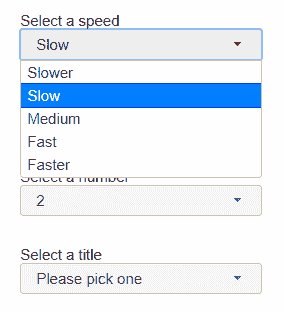

# 可访问性优先:下拉列表(选择)

> 原文：<https://dev.to/link2twenty/accessibility-first-dropdown-select-3ji5>

有一段时间，我一直在思考如何使用不可定制的`select`元素来制作一个可访问的 jQuery-esc 选择菜单。当然，如果你可以不需要定制`select`就去做，本地人总是赢家。

jQuery 的实现:
[](https://res.cloudinary.com/practicaldev/image/fetch/s--3dzrihOb--/c_limit%2Cf_auto%2Cfl_progressive%2Cq_auto%2Cw_880/https://thepracticaldev.s3.amazonaws.com/i/v0bohelkr2g9uxztxq7y.png)

我有一个很好的“概念证明”,并决定在一篇帖子中充实它，但就在那时， [@emmabostian](https://dev.to/emmabostian) 发布了她关于类似内容的精彩帖子。建议你也看看她的文章，真的很不错。

[](/emmabostian) [## 创建自定义的、可访问的下拉菜单

### 艾玛·博斯腾·✨1919 年 2 月 28 日 17 分钟阅读

#html #a11y #javascript](/emmabostian/creating-a-custom-accessible-drop-down-3gmo)

这是我的成品，下面我将回顾一下我做了什么以及为什么做:

[https://jsfiddle.net/link2twenty/rj1q38ok//embedded/result//dark](https://jsfiddle.net/link2twenty/rj1q38ok//embedded/result//dark)

## 要求

为此，我们需要同时支持键盘和鼠标，所以让我们看看[规范](https://www.w3.org/TR/wai-aria-practices/examples/listbox/listbox-collapsible.html)，看看预期的行为是什么。

### 键盘

*   **输入键**，切换列表框的可见性
*   **退出键**，隐藏列表框
*   **向下箭头**，选择列表中的下一个选项
*   **向上箭头**，选择列表中的上一个选项
*   **Home 键**，选择列表中的第一个选项
*   **结束键**，选择列表中的最后一个选项

### 鼠标

*   **点击输入**，切换列表框可见性
*   **点击关闭输入**，隐藏列表框
*   **点击选项**，将选项设置为活动，隐藏列表框

看着规格，我认为这是我们所需要的，但我总是愿意纠正。

## Markup

为此，我使用了 [`<details>`](https://developer.mozilla.org/en-US/docs/Web/HTML/Element/details) 元素，它具有我想要内置的显示和隐藏功能。

我还在一个组中使用单选按钮来允许我存储哪个值是正确的。如果你想要的话，你可以简单地添加`checked`到默认选项。

```
<details id="example_select" class="select_container">
  <summary>--</summary>
  <div class="select">
    <label class="select__option">
      <input type="radio" name="example" value="slower">Slower
    </label>
    <label class="select__option">
      <input type="radio" name="example" value="slow">Slow
    </label>
    <label class="select__option">
      <input type="radio" name="example" value="medium">Medium
    </label>
    <label class="select__option">
      <input type="radio" name="example" value="fast">Fast
    </label>
    <label class="select__option">
      <input type="radio" name="example" value="faster">Faster
    </label>
  </div>
</details> 
```

Enter fullscreen mode Exit fullscreen mode

[https://jsfiddle.net/link2twenty/cdwhouk4//embedded/result,html//dark](https://jsfiddle.net/link2twenty/cdwhouk4//embedded/result,html//dark)

没有风格，你真的可以看到这是如何工作的。我们只有一个简单的单选按钮列表。

## 样式

像往常一样，我不会在这里进入太多的细节，这只是我的偏好。你可能已经注意到我把它弄得看起来像是 jQuery 计数器的一部分，但是你可以做你想做的。

```
details.select_container {
  display: inline-block;
  width: 200px;
  border: 1px solid #c5c5c5;
  border-radius: 3px;
  position: relative;
  color: #454545;
}

details.select_container[open] {
  border-radius: 3px 3px 0 0;
}

details.select_container summary::after {
  content: "\00203A";
  position: absolute;
  right: 12px;
  top: calc(50%);
  transform: translateY(-50%) rotate(90deg);
  pointer-events: none;
}

details.select_container[open] summary::after {
  content: "\002039";
}

details.select_container summary {
  cursor: pointer;
  padding: 6px 12px;
  background: #f6f6f6;
  list-style: none;
}

details.select_container summary::-webkit-details-marker {
  display: none;
}

details.select_container summary:hover {
  background: #ededed;
}

details.select_container .select {
  position: absolute;
  display: flex;
  flex-direction: column;
  border: 1px solid #c5c5c5;
  width: 100%;
  left: -1px;
  border-radius: 0 0 3px 3px;
  background: #fff;
}

details.select_container .select__option {
  cursor: pointer;
  padding: 6px 12px;
}

details.select_container .select:hover .select__option.active {
  background: #fff;
  color: #454545;
}

details.select_container .select__option.active,
details.select_container .select:hover .select__option.active:hover,
details.select_container .select__option:hover {
  background: #007fff;
  color: #fff;
}

details.select_container .select__option input {
  display: none;
} 
```

Enter fullscreen mode Exit fullscreen mode

[https://jsfiddle.net/link2twenty/mqkznt6o//embedded/result,css//dark](https://jsfiddle.net/link2twenty/mqkznt6o//embedded/result,css//dark)

总之，聪明的事情都发生在 javascript 上。

## JavaScript

与过去的项目不同，我使用 JS 来设置所有的 aria 属性，这只是意味着您不必记得这样做，这是一个胜利。像往常一样，我使用了一个类，不是因为你必须这样做，而是因为我喜欢它们。

我不会讲太多的细节，你可以自己读一读，如果有什么不明白的地方，尽管问，但是我会提到`this.mouseDown`和它为什么存在。

当选择菜单失去焦点时，我决定使用`focusout`来关闭它，但是发现我的`click`事件不再工作。经过一点挖掘，我意识到焦点在鼠标按下时丢失了，但是在鼠标抬起时点击被激发了。为了否定这一点，我不得不听鼠标按下我的选项，并防止`focusout`造成麻烦。

```
class detailSelect {
  constructor(container) {
    this.container = document.querySelector(container);
    this.options = document.querySelectorAll(`${container} > .select > .select__option`);
    this.value = this.container.querySelector('summary').textContent;
    this.mouseDown = false;
    this._addEventListeners();
    this._setAria();
    this.updateValue();
  }

  // Private function to set event listeners
  _addEventListeners() {
    this.container.addEventListener('toggle', () => {
      if (this.container.open) return;
      this.updateValue();
    })

    this.container.addEventListener('focusout', e => {
      if (this.mouseDown) return;
      this.container.removeAttribute('open');
    })

    this.options.forEach(opt => {
      opt.addEventListener('mousedown', () => {
        this.mouseDown = true;
      })
      opt.addEventListener('mouseup', () => {
        this.mouseDown = false;
        this.container.removeAttribute('open');
      })
    })

    this.container.addEventListener('keyup', e => {
      const keycode = e.which;
      const current = [...this.options].indexOf(this.container.querySelector('.active'));
      switch (keycode) {
        case 27: // ESC
          this.container.removeAttribute('open');
          break;
        case 35: // END
          e.preventDefault();
          if (!this.container.open) this.container.setAttribute('open', '');
          this.setChecked(this.options[this.options.length - 1].querySelector('input'))
          break;
        case 36: // HOME
          e.preventDefault();
          if (!this.container.open) this.container.setAttribute('open', '');
          this.setChecked(this.options[0].querySelector('input'))
          break;
        case 38: // UP
          e.preventDefault();
          if (!this.container.open) this.container.setAttribute('open', '');
          this.setChecked(this.options[current > 0 ? current - 1 : 0].querySelector('input'));
          break;
        case 40: // DOWN
          e.preventDefault();
          if (!this.container.open) this.container.setAttribute('open', '');
          this.setChecked(this.options[current < this.options.length - 1 ? current + 1 : this.options.length - 1].querySelector('input'));
          break;
      }
    })
  }

  _setAria() {
    this.container.setAttribute('aria-haspopup', 'listbox');
    this.container.querySelector('.select').setAttribute('role', 'listbox');
    const summary = this.container.querySelector('summary');
    summary.setAttribute('aria-label', `unselected listbox`);
    summary.setAttribute('aria-live', `polite`);
    this.options.forEach(opt => {
      opt.setAttribute('role', 'option');
    });
  }

  updateValue(e) {
    const that = this.container.querySelector('input:checked');
    if (!that) return;
    this.setValue(that)
  }

  setChecked(that) {
    that.checked = true;
    this.setValue(that)
  }

  setValue(that) {
    if (this.value == that.value) return;

    const summary = this.container.querySelector('summary');
    const pos = [...this.options].indexOf(that.parentNode) + 1;
    summary.textContent = that.parentNode.textContent;
    summary.setAttribute('aria-label', `${that.value}, listbox ${pos} of ${this.options.length}`);
    this.value = that.value;

    this.options.forEach(opt => {
      opt.classList.remove('active');
      opt.setAttribute('aria-selected', 'false');
    })
    that.parentNode.classList.add('active');
    that.parentNode.setAttribute('aria-selected', 'true');

    this.container.dispatchEvent(new Event('change'));
  }
}

const details = new detailSelect('#example_select'); 
```

Enter fullscreen mode Exit fullscreen mode

然后我们举一个例子

```
const details = new detailSelect('#example_select'); 
```

Enter fullscreen mode Exit fullscreen mode

[https://jsfiddle.net/link2twenty/rj1q38ok//embedded/result,js//dark](https://jsfiddle.net/link2twenty/rj1q38ok//embedded/result,js//dark)

如果我能做得更好，请告诉我，我真的很想听听你的意见。

## 鳍

这是我们在`Accessibility first`系列中的另一篇文章。感谢您的阅读，如果您有任何问题，请随时提问，没有愚蠢的问题。一如既往，请随意使用这些技巧，如果我说错了/做错了什么，请随时纠正我。

再次感谢。
❤🦄🦄🧠❤🦄❤❤🦄