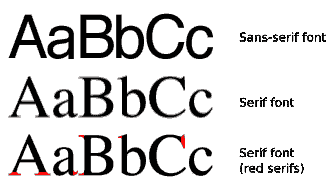

# 方便赶时间的人使用的字体

> 原文：<https://dev.to/papaponmx/accessible-fonts-for-people-in-a-hurry-387>

**TLDR** :
字体可以通过以下方式变得更加友好:

*   使用更大的字体。
*   有无衬线字体系列。
*   更多对比色。
*   如果你首先没有 a11y，你能提供一个 a11y 主题吗？

## 与网络互动的替代方式

我目前的工作和一些帖子激发了这篇文章。商业方面对使应用程序更易访问非常感兴趣，为了方便大多数用户的交互，我们正在做一些繁重的工作。

其中一些包括但不限于:

*   认知障碍(脑损伤、自闭症、发育障碍)和学习障碍(如阅读障碍、计算障碍或多动症)。
*   视力障碍，如低视力、完全或部分失明和色盲。
*   与听力有关的残疾。
*   运动或灵活性损伤，如腕管综合征、关节炎和重复性劳损。

我们大多数人都用鼠标和键盘进行交互，但是有很多人不会。根据他们的情况，我们的用户可能会使用辅助软件或设备，如:

*   像[大白鲨](https://www.freedomscientific.com/products/software/jaws/)、[对讲](https://support.google.com/accessibility/android/answer/6283677?hl=en)这样的屏幕阅读器，
*   一个[巴西键盘](https://www.amazon.com/Braille-Overlays-for-Computer-Keyboards/dp/B00I5PPUKM/ref=sr_1_1_sspa?keywords=braille%20keyboard&qid=1555548524&s=gateway&sr=8-1-spons&psc=1)。
*   一个[开关装置](https://www.youtube.com/watch?v=V1yoOLhx_qA&list=PLNYkxOF6rcICWx0C9LVWWVqvHlYJyqw7g&index=2)或者他们的电话音量按钮也是这样。
*   没有鼠标的键盘。
*   一个 [Chrome 扩展](https://chrome.google.com/webstore/detail/opendyslexic-font-for-chr/cdnapgfjopgaggbmfgbiinmmbdcglnam)由于 dislexya。

## 我们能做些什么

正如你所看到的，有各种各样的情况，就本文的目的而言，视觉障碍是与我们最相关的。请记住，这也包括因某种程度的[近视](https://medical-dictionary.thefreedictionary.com/Miopia)、[散光](https://www.webmd.com/eye-health/astigmatism-eyes)而戴眼镜的人。即使照明不足或显示器不好也会给上网带来一些困难。

让我们从目的开始。大多数开发人员不需要设计，但是有些情况下需要我们的输入，所以我想给你一些[启发](https://www.thefreedictionary.com/heuristic+rule)来做出一些明智的决定。

在这篇文章中，我们的目标是**提高字体的可读性**。根据维基百科:

> 可读性是指读者理解书面文本的难易程度。在自然语言中，文本的可读性取决于它的内容和表现形式。

根据经验，可读性是最重要的。

### 使字体变大

字体有不同的用途，它们有助于确定网站的氛围，甚至可以提醒我们一些事情，帮助我们更好地传达信息。

在一个移动互联网接入越来越多的世界里，较小的字体可能是一个很好的优化，特别是因为移动设备的屏幕更小。然而，超过一定的阈值，它会弄乱可读性，放大可能会破坏你的布局。默认使用更大的字体，可以使我们的布局在放大时不容易断裂。

**更大的字体更容易从远处阅读**。这里是一篇带有用例的[文章。](https://blog.usejournal.com/your-body-text-is-too-small-5e02d36dc902)

### 你能避免衬线吗？

衬线是字母中较大笔画末端的小线条。下图更好地解释了这一点。
[T3】](https://res.cloudinary.com/practicaldev/image/fetch/s--bla_g8Hv--/c_limit%2Cf_auto%2Cfl_progressive%2Cq_auto%2Cw_880/https://upload.wikimedia.org/wikipedia/en/7/79/Serif-Sans-Comparison.png)

在网络的早期，曾经有一个关于为什么无衬线字体更适合低分辨率屏幕的争论。然而，避免它们的原因是:

*   衬线字体会混淆阅读障碍，例如小写的“p”代表“b”，d”或“q”。
*   衬线字体在狭窄的空间会分散注意力。

### 颜色和对比

当两种颜色相似时，如果差别很细微，人们可能察觉不到差别，这就是为什么**对比度很重要**。对比度定义如下:

> [对比](https://www.merriam-webster.com/dictionary/contrast)是具有相似或可比性质的事物之间的差异或不同程度。

听起来很疯狂，两个人可以看到相同的颜色，只有一个十六进制值，但仍然可以看到不同的颜色。如果感知两种颜色差异的能力过高，这就是我们所说的[色盲](https://en.wikipedia.org/wiki/Color_blindness)。

出现的问题是:**我如何判断我使用的颜色是否足够强烈？很高兴你这么问。**

我们用来衡量两种颜色之间对比度的参考单位称为**对比度**4.5:1 的对比度是最低的[网页内容可访问性准则](https://www.w3.org/TR/WCAG/#contrast-minimum)。

这里有**个工具可以帮助你挑选更多对比色**:

*   [http://colorsafe.co/](http://colorsafe.co/)
*   [http://clrs.cc/a11y/](http://clrs.cc/a11y/)

### A11y 主题

在接下来的几个月里，黑色主题变成了很酷的东西、用户喜欢的 T2 和值得炒作的 T4。

#### 提供黑暗主题需要什么？

从第一原理的方法来看，黑暗主题需要两件事:

*   将应用程序中的颜色定义为变量。我知道这可能是不必要的，但是，坚持一会儿。
*   另一种调色板。
*   允许用户切换主题的机制。

我想提出的问题是，我们可以提供一个主题吗？

首先，一个`a11y`主题可以有两件事:

*   **更对比色**，像[莫诺凯木炭高对比主题](https://marketplace.visualstudio.com/items?itemName=74th.monokai-charcoal-high-contrast)的 VS 代码。
*   **阅读障碍友好字体**。

## 进一步资源

检查[对比度](https://contrast-ratio.com/)的工具。
关于[诵读困难字体的视频](https://www.youtube.com/watch?v=VLtYFcHx7ec)。
[低俗小说对话搭配排版](https://www.youtube.com/watch?v=wF8f8w6HPoo)。
CSS 对[使用 Java script](https://css-tricks.com/updating-a-css-variable-with-javascript/)更新变量的技巧。
微软关于[可变字体](https://developer.microsoft.com/en-us/microsoft-edge/testdrive/demos/variable-fonts/)的文章。Paul Boag 的 podscast [关于网页排版的一集](https://boagworld.com/season/10/episode/1016/)。
[海明威 app](http://www.hemingwayapp.com/) 。
文章[关于 a11y 审计](https://addyosmani.com/a11y/)by[Addy Osmani](https://twitter.com/addyosmani)T25】文章:[dislexya 专用字体？](https://web.archive.org/web/20111101034537/http://www.ilo.gw.utwente.nl/ilo/attachments/032_Masterthesis_Leeuw.pdf)

* * *

这就是所有的乡亲，感谢花时间阅读这篇文章。我正在用我所有的博客文章建一个博客。与此同时，你会看到我未来的博客文章，以及这个[报告](https://github.com/papaponmx/blog)中所有以前的文章。

你可以在你喜欢的社交网络上以 [@papaponmx](https://twitter.com/papaponmx) 的身份找到我。

干杯。