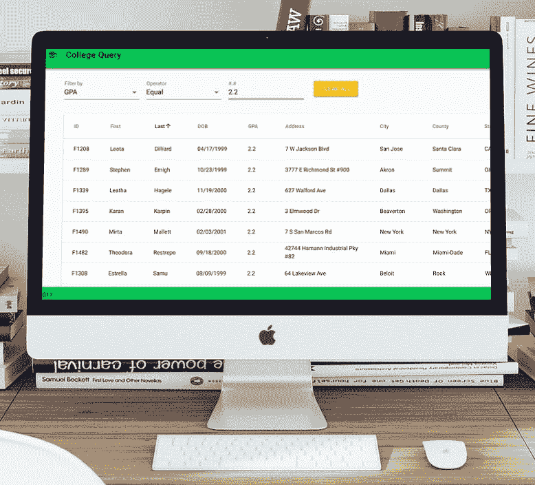
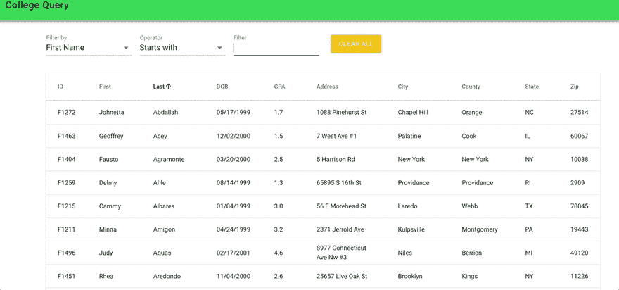

# 使用 Vue 和 Cosmic JS Rest API，轻松地为您的数据添加动态过滤器

> 原文：<https://dev.to/mtermoul/add-dynamic-filters-to-your-data-with-ease-using-vue-cosmic-js-rest-api-445g>

[](https://res.cloudinary.com/practicaldev/image/fetch/s--V0XS96yI--/c_limit%2Cf_auto%2Cfl_progressive%2Cq_auto%2Cw_880/https://thepracticaldev.s3.amazonaws.com/i/kw0vlvan5i4916wpkbvx.jpg)

## TL；速度三角形定位法(dead reckoning)

*   [演示](https://col-admin.cosmicapp1.co/)
*   [源代码](https://github.com/mtermoul/col-admin/)
*   视图
*   [Vuex](https://vuex.vuejs.org/)
*   [消失](https://vuetifyjs.com/en/)
*   [宇宙 JS](https://cosmicjs.com/)

## [T1】简介](#intro)

过滤数据是任何面向数据的应用程序最常见的功能之一，无论是前端应用程序还是后端应用程序。Filter 函数用于在表或数据集中查找满足特定条件的记录。例如，如果网页中有一个名为“图书”的列表，而您只想显示当前正在销售的图书。您可以使用 filter 函数来实现这一点。

## 我们到底在建造什么？

在这个简短的教程中，我们将构建一个包含两部分的单页 web 应用程序。第一部分是学生名单。该列表将显示在一个类似表格的结构中，每个学生有多个列。每一列对应于学生记录的一个数据属性。列表末尾还有一个摘要行，告诉您记录的数量。这是学生数据结构:

```
student: {
    id: unique identifier,
    firstName: string,
    lastName: string,
    dob: date (date of birth),
    gpa: number,
    address: string,
    city: string,
    county: string,
    state: string,
    zip: number
} 
```

第二部分是用户可以用来过滤数据的过滤器。让我们假设用户可以根据列表中显示的任何字段进行筛选。因此，要构建可用于多个字段的通用筛选函数，我们需要根据数据类型对这些筛选进行分组。每种数据类型都允许特定的比较运算符。下表说明了这一逻辑。

```
 string: [contains, startWith]
    date: [equal, greaterThan, lessThan, between]
    number: [equal, greaterThan, lessThan, between]
    lookup: [is, isNot] 
```

因此，基本上我们可以建立 12 个比较函数，可以用于我们所有的字段或我们将来可能添加的任何字段。因此，让我们开始使用我们的应用程序，看看我们如何才能构建这些功能。

## 启动您的 Vue 应用

要启动新的应用程序，您需要安装 [Vue](https://vuejs.org/) 并打开新的终端窗口，然后键入以下内容:

```
# initiating new Vue app
vue create col-admin

Vue CLI v3.0.0-rc.9
┌───────────────────────────┐
│  Update available: 3.5.1  │
└───────────────────────────┘
? Please pick a preset: Manually select features
? Check the features needed for your project: Babel, Router, Vuex, Linter
? Pick a linter / formatter config: Standard
? Pick additional lint features: Lint on save
? Where do you prefer placing config for Babel, PostCSS, ESLint, etc.? In dedicated config files
? Save this as a preset for future projects? No

# adding other js libraries
vue add vue-cli-plugin-vuetify
? Choose a preset: Default (recommended)
✔  Successfully invoked generator for plugin: vue-cli-plugin-vuetify

# adding the backend library
npm install --save cosmicjs 
```

在此之后，我们应该准备好我们的启动应用程序进行定制。如果你想运行该应用程序，只需打开终端窗口并键入`npm run serve`，然后从你的浏览器通过该应用程序的默认 url `http://localhost:8080/`打开该应用程序，你就可以进入下一步了。

## 用 Cosmic JS 设置你的 Rest API

正如我们前面提到的，这个应用程序的目标是显示学生列表，然后使用过滤器功能来缩小列表。对于这个项目，我们将使用 Cosmic JS 来存储我们的数据，并使用 Cosmic JS 自带的内置 Rest API 来提供数据。

*   注册一个免费的宇宙 JS 账户。
*   从[开发仪表板](https://cosmicjs.com/buckets)添加新的存储桶
*   从仪表板添加新的`Object Type`。并为此对象类型指定以下属性

[](https://res.cloudinary.com/practicaldev/image/fetch/s--kIIwvzxK--/c_limit%2Cf_auto%2Cfl_progressive%2Cq_auto%2Cw_880/https://thepracticaldev.s3.amazonaws.com/i/8alz82gy5kw4t0cj8q9b.png)

*   在“对象类型图元字段”选项卡中，添加以下字段:

```
 SID: text field,
    firstName: text field,
    lastName: text field,
    DOB: text field,
    GPA: text field,
    Address: text field,
    City: text field,
    County: text field,
    State: text field,
    Zip: text field 
```

*   向学生表中添加一些数据。如果你愿意，你可以通过在你的账户下导入我的 [col-admin-bucket](https://cosmicjs.com/col-admin/dashboard) 来从 Cosmic JS 复制我的数据表。我已经插入了大约 300 条记录，所以你不必手工键入所有这些信息。
*   通过内置的 Rest API 从这个 url 访问你的 Cosmic JS 数据:`https://api.cosmicjs.com/v1/col-admin/objects?type=students`
*   查看一下 [Cosmic JS API 文档](https://cosmicjs.github.io/rest-api-docs/?javascript),获得所有可用 API 的详细列表。

在此之后，您应该能够通过 Rest API 访问您的后端数据。

## 使用 Vuex 添加数据存储

在我们的项目根文件夹下，让我们添加新文件夹`./src/store/`并将`./src/store.js`移动到存储文件夹下。我们还需要在`./src/api/cosmic.js`下创建新文件

```
const Cosmic = require('cosmicjs')

const config = {
    bucket: {
        slug: process.env.COSMIC_BUCKET || 'col-admin',
        read_key: process.env.COSMIC_READ_KEY,
        write_key: process.env.COSMIC_WRITE_KEY
    }
}

module.exports = Cosmic().bucket(config.bucket) 
```

这个小脚本将作为宇宙 JS 连接对象。

我们还需要在`./src/store/modules/cosmic.js`下为所有与 Cosmic JS 数据相关的函数创建新文件。

```
import Cosmic from '../../api/cosmic' // used for Rest API

const actions = {
    async fetchStudents ({commit, dispatch}) {
        const recordLimit = 25
        let skipPos = 0
        let fetchMore = true

        while (fetchMore) {
            try {
                const params = {
                    type: 'students',
                    limit: recordLimit,
                    skip: skipPos
                }
                let res = await Cosmic.getObjects(params)
                if (res.objects && res.objects.length) {
                    let data = res.objects.map((item) => {
                        return {...item.metadata, id: item.metadata.sid,
                            firstName: item.metadata.firstname,
                            lastName: item.metadata.lastname }
                    })
                    commit('ADD_STUDENTS', data)
                    commit('SET_IS_DATA_READY', true)
                    // if fetched recodrs lenght is less than 25 then we have end of list
                    if (res.objects.length < recordLimit) fetchMore = false
                } else {
                    fetchMore = false
                }
                skipPos += recordLimit
            }
            catch (error) {
                console.log(error)
                fetchMore = false
            }
        }
        dispatch('fetchStates')
    }
}

export default {
    actions
} 
```

到目前为止，我们只有一个函数`fetchStudents`。这个函数将调用 Cosmic JS `getObjects`一次拉 25 条记录。它会在一个 while 循环中这样做，直到我们到达末尾或者找不到更多的记录。我们可以确定数据行的数据结束计数将少于 25 条记录。从 Rest API 获取所有数据后，我们将调用`ADD_STUDENTS`变异来将这些记录存储在 Vuex 状态变量中。有关 Vuex 商店的更多信息，请阅读[文档](https://vuex.vuejs.org)。

在这个函数的末尾还有一个对`fetchStates`的调用。这个函数将简单地遍历所有学生记录，获得唯一的州代码，并将其存储在`states`变量中。这可以在以后的“按州过滤”下拉组件中使用。

这是 Vuex 商店的其余部分。

```
import Vue from 'vue'
import Vuex from 'vuex'
import _ from 'underscore'
import cosmicStore from './modules/cosmic'

Vue.use(Vuex)

export default new Vuex.Store({
    state: {
        isDataReady: false,
        students: [],
        states: []
    },
    getters: {
        students (state) {
            return state.students
        },
        isDataReady (state) {
            return state.isDataReady
        },
        states (state) {
            return state.states
        }
    },
    mutations: {
        SET_STUDENTS (state, value) {
            state.students = value
        },
        SET_IS_DATA_READY (state, value) {
            state.isDataReady = value
        },
        ADD_STUDENTS (state, value) {
            state.students.push(...value)
        },
        SET_STATES (state, value) {
            state.states = value
        }
    },
    actions: {
        fetchStates ({commit, state}) {
            let states = []
            states = _.chain(state.students).pluck('state').uniq().sortBy((value) => value).value()
            commit('SET_STATES', states)
        }
    },
    modules: {
        cosmicStore
    }
}) 
```

## 应用程序样式与 Vuetify

对于这个项目，我们将使用 [Vuetify](https://vuetifyjs.com/en/getting-started/quick-start) 作为我们的前端组件库。这非常有帮助，尤其是如果你喜欢在你的项目中使用[谷歌材质设计](https://material.io/design/introduction/)而没有太多开销的话。另外，Vuetify 非常棒，因为它有大量完全加载的内置 UI 组件。使用 Vue CLI add 命令将 Vuetify 添加到您的项目后，您可以从您的页面模板中引用 Vuetify 组件。
我们来看看`App.vue`主布局。

```
<template>
    <v-app>
        <v-toolbar app color="green accent-4">
            <v-icon>school</v-icon>
            <v-toolbar-title v-text="title"></v-toolbar-title>
            <v-spacer></v-spacer>
        </v-toolbar>

        <v-content>
            <router-view/>
        </v-content>

        <v-footer :fixed="fixed" app color="green accent-4">
            <span>&copy; 2017</span>
        </v-footer>
    </v-app>
</template>

<script>

export default {
  name: 'App',
  data () {
    return {
      fixed: false,
      title: 'College Query'
    }
  }
}
</script> 
```

在上面的模板中，您可以看到我们的应用程序页面布局有三个部分:

*   v-toolbar:哪一个是顶部工具栏组件
*   v-content:将包含任何页面的内部内容
*   v-footer:这将有应用程序的版权和联系信息

## 添加应用视图和组件

你可能会注意到在。/src '文件夹中，有两个文件夹:

*   。/src/components:该文件夹将用于存储可在任何页面中使用的所有 web 组件。目前我们还没有使用任何组件！但是，如果我们的应用程序变得更加复杂，我们可以很容易地将每个页面分成更小的组件。
*   。/src/views:该文件夹用于存储视图。视图相当于网页。目前我们有主页面`Home.vue`和`About.vue`

## 向主页添加数据网格

在`Home.vue`页面中，我们将有两个主要部分:

*   数据过滤器:包含用户可以选择的所有过滤器。
*   数据网格:这是作为数据网格组件显示的学生列表。出于我们的目的，我们将使用 Vuetify `data-table`组件。

让我们来看看主页模板:

```
<template>
    <v-container grid-list-lg>
        <v-layout row wrap>
            <v-flex xs2>
                <v-select
                    :items="filterFields"
                    v-model="filterField"
                    label="Filter by">
                </v-select>
            </v-flex>
            <v-flex xs2>
                <v-select
                    :items="filterOperators"
                    v-model="filterOperator"
                    label="Operator">
                </v-select>
            </v-flex>
            <v-flex xs2 v-show="filterOperator && filterType !== 'lookup'">
                <v-text-field
                    name="filterTerm"
                    :label="filterTermLabel"
                    :mask="filterTermMask"
                    :rules='filterTermRules'
                    return-masked-value
                    v-model="filterTerm"
                ></v-text-field>
            </v-flex>
            <v-flex xs2 v-show="filterOperator === 'between'">
                <v-text-field
                    name="filterTerm2"
                    :label="filterTermLabel"
                    :mask="filterTermMask"
                    :rules='filterTermRules'
                    return-masked-value
                    v-model="filterTerm2"
                ></v-text-field>
            </v-flex>
            <v-flex xs2 v-show="filterType === 'lookup'">
                <v-autocomplete
                  :items="filterLookupItems"
                  :label="filterLookupLabel"
                  v-model="filterLookupValue"
                ></v-autocomplete>
            </v-flex>
            <v-flex xs2>
                <v-btn color="warning" @click="onClearAllFilters">Clear All</v-btn>
            </v-flex>
            <v-flex xs12>

                <v-data-table
                    :headers="headers"
                    :items="filteredStudents"
                    xhide-actions
                    :pagination.sync="pagination"
                    :loading="!isDataReady"
                    class="elevation-1">
                    <template slot="items" slot-scope="props">
                        <td>{{ props.item.id }}</td>
                        <td>{{ props.item.firstName }}</td>
                        <td>{{ props.item.lastName }}</td>
                        <td>{{ props.item.dob | shortDate(dateFilterFormat) }}</td>
                        <td>{{ props.item.gpa | gpaFloat }}</td>
                        <td>{{ props.item.address }}</td>
                        <td>{{ props.item.city }}</td>
                        <td>{{ props.item.county }}</td>
                        <td>{{ props.item.state }}</td>
                        <td>{{ props.item.zip }}</td>
                    </template>

                    <template slot="pageText" slot-scope="props">
                        Total rows: {{ props.itemsLength }}
                    </template>

                </v-data-table>

            </v-flex>
        </v-layout>
    </v-container>
</template> 
```

从上面的代码可以看出。`v-data-table`组件使用`filteredStudents`变量作为它的数据源。在 Vuex 存储中，我们有两个状态变量:

*   students:包含从数据库中提取的所有学生的数组。
*   filterdStudents:一个数组，只包含符合筛选条件的学生。最初，如果没有选择过滤器，那么该变量将与`students`变量具有完全相同的值。

`data-table`组件也有三个部分:

*   头:目前我们将头存储在一个叫做头的数据变量中
*   条目:这是输入`filteredStudents`变量的数据段
*   页脚:将显示分页控件和记录计数信息

## 添加数据过滤器 UI 组件

如 Home.vue 页面模板所示，过滤器组件由以下组件组成:

*   筛选依据:目前我们必须选择一个可用的字段，如名字、姓氏、出生日期...
*   过滤运算符:类似于`Contains`、‘开始于’、‘大于’...运算符将根据字段类型而变化
*   过滤器术语:这是所选过滤器的用户输入。目前，如果我们需要选择一个范围，我们有两个过滤条件。例如，如果用户选择出生日期，那么我们需要两个日期输入字段。
*   Filter lookup:如果需要从给定列表中选择过滤标准，这是一个下拉列表。在我们的应用程序中，当我们需要按州过滤时，我们需要从下拉字段中选择一个值。

## 添加过滤功能

我们可以通过这些变量来总结过滤器的功能:

```
 headers: [
        { text: 'ID', align: 'left', sortable: false, value: 'id' },
        { text: 'First', value: 'firstName' },
        { text: 'Last', value: 'lastName' },
        { text: 'DOB', value: 'dob', dataType: 'Date' },
        { text: 'GPA', value: 'gpa' },
        { text: 'Address', value: 'address' },
        { text: 'City', value: 'city' },
        { text: 'County', value: 'county' },
        { text: 'State', value: 'state' },
        { text: 'Zip', value: 'zip' }
    ], 
```

这是数据表标题。

```
 filterFields: [
        {text: 'First Name', value: 'firstName', type: 'text'},
        {text: 'Last Name', value: 'lastName', type: 'text'},
        {text: 'DOB', value: 'dob', type: 'date'},
        {text: 'GPA', value: 'gpa', type: 'number'},
        {text: 'Address', value: 'address', type: 'text'},
        {text: 'City', value: 'city', type: 'text'},
        {text: 'County', value: 'county', type: 'text'},
        {text: 'Zip', value: 'zip', type: 'number'},
        {text: 'State', value: 'state', type: 'lookup'}
    ], 
```

这是用户可以选择的筛选字段列表。您还可以看到，我为每个过滤字段添加了一个类型。过滤器类型将用于决定调用哪个函数来运行过滤器操作。许多字段将具有相同的数据类型，因此我们不需要调用单独的函数来根据该字段进行过滤。我们将为共享相同数据类型的所有字段调用相同的函数。

```
 filterDefs: {
        text: {contains: {display: 'Contains', function: this.filterByTextContains},
               startsWith: {display: 'Starts with', function: this.filterByTextStartsWith}},
        number: {equal: {display: 'Equal', function: this.filterByNumberEqual, decimalPoint: 1},
                 greater: {display: 'Greater than', function: this.filterByNumberGreater, decimalPoint: 1},
                 less: {display: 'Less than', function: this.filterByNumberLess, decimalPoint: 1},
                 between: {display: 'Between', function: this.filterByNumberBetween, decimalPoint: 1}},
        date: {equal: {display: 'Equal', function: this.filterByDateEqual, format: 'MM/DD/YYYY'},
                 greater: {display: 'Greater than', function: this.filterByDateGreater, format: 'MM/DD/YYYY'},
                 less: {display: 'Less than', function: this.filterByDateLess, format: 'MM/DD/YYYY'},
                 between: {display: 'Between', function: this.filterByDateBetween, format: 'MM/DD/YYYY'}},
        lookup: {is: {display: 'Is', function: this.filterByLookupIs},
                 isNot: {display: 'Is not', function: this.filterByLookupIsNot}}
    }, 
```

filterDefs 变量将存储信息，告诉我们的 UI 对每个字段类型使用哪个操作符。我们还在这个配置变量中指定，当我们需要根据所选字段进行过滤时，要调用哪个 Javascript 函数。这个变量是我自己对过滤函数应该如何配置和设计的解释，但是你当然可以没有它，使用带有许多`if`语句的 Javascript 代码。

最后一部分是我们将为每种过滤器类型调用的实际 Javascript 函数。我不会把它们都列出来，但是让我们从`Home.vue`页看几个例子

```
 ...
    methods: {
        filterByTextContains (list, fieldName, fieldValue) {
            const re = new RegExp(fieldValue, 'i')
            return this.filterByRegExp(list, fieldName, fieldValue, re)
        },
        filterByTextStartsWith (list, fieldName, fieldValue) {
            const re = new RegExp('^' + fieldValue, 'i')
            return this.filterByRegExp(list, fieldName, fieldValue, re)
        },
        filterByRegExp(list, fieldName, fieldValue, regExp) {
            return list.filter(item => {
                if(item[fieldName] !== undefined) {
                    return regExp.test(item[fieldName])
                } else {
                    return true
                }
            })
        },
    ...
    } 
```

上面的代码有两个函数`filterByTextContains`和`filterByTextStartsWith`，用户每次使用文本字段过滤函数时都会调用这两个函数。在这两个函数后面，我们称之为`filterByRegExp`，它基本上是一个使用 Javascript 正则表达式函数的函数。以类似的方式，我为数字字段、日期字段和查找字段编写了过滤函数。我使用了简单的逻辑，如日期比较、数组查找或普通的 JS if 语句。最重要的是，这些函数应该足够通用，可以处理任何字段，并且只需要很少的参数，如应该过滤的数据列表、字段名和字段值。我鼓励你看一看 [Home.vue](https://github.com/mtermoul/col-admin/blob/master/src/views/Home.vue) 的代码，了解完整的细节。

## 使用 Vue 计算的属性、观察器和过滤器

你也可以在里面找到。/src/views/home . vue ' computed、watch 和 filters 下的几个方法。以下是我使用每种类型的方法和原因。

*   计算的:我已经为`students`、`filteredStudents`、`isDataReady`、`states`使用了这些计算的属性。这些属性将在来自 Vuex 商店的底层变量发生变化时自动更新。如果您将计算属性绑定到 UI 元素，并在计算属性中的数据更新时进行 UI 更改或在 UI 部分之间切换，这将非常有用。例如`isDataReady`在数据表中被使用，每当它是`false`时，UI 将播放一个等待动画进度条，告诉用户数据正在加载。一旦`idDataReady`更新为`true`，加载进度条将消失，表格将显示实际数据。

*   观察者:我已经使用了这些被观察的属性`filterField`，和`filterOperator`。不同之处在于，被监视的属性不缓存值，每次底层数据发生变化时，都会调用该函数。我用它来更新主页上的过滤器 UI 元素。

*   过滤器:不要混淆 Vue 过滤器和数据过滤。过滤器是您在逻辑中定义的函数，然后在 html 模板中使用它来格式化字段值。例如，我有`shortDate`和`gpaFloat`函数，它们用于将日期和浮点值格式化为所需的显示格式。您可以使用以下语法从 html 模板中调用过滤函数`<td>{{ props.item.gpa | gpaFloat }}</td>`。

我还想提一下，每当应用程序启动时，我都使用 Vue 生命周期事件挂钩来启动从后端获取数据。我是从`./main.js`文件开始做的

```
...
new Vue({
  store,
  router,
  render: h => h(App),
  created () {
    this.$store.dispatch('fetchStudents')
  }
}).$mount('#app') 
```

如您所见，在应用程序创建的事件中，我们通过调用分派方法来调用 Vuex 动作。如果您想自动触发操作而不等待用户操作，这非常有用。这是最终的结果。请查看应用程序演示以进行试驾。

[](https://res.cloudinary.com/practicaldev/image/fetch/s--m8hOaWvO--/c_limit%2Cf_auto%2Cfl_progressive%2Cq_66%2Cw_880/https://thepracticaldev.s3.amazonaws.com/i/4u3hhp7zio8aa21vxzcr.gif)

## 结论

最后，我想提一下，构建这样的简单应用程序听起来很容易，但是构建一个可扩展的应用程序需要一些思考和一点规划，以确保您的代码可以轻松地允许未来的扩展和更改，而无需重写应用程序。
同样值得一提的是，使用 API ready 后端确实为我们节省了大量时间。最后，我想补充的是，在完成这个应用程序后，我意识到 Home.vue 页面肯定可以被分解成小组件，使其更具可读性和可维护性。因此，如果您想使用 Vue 组件，这可能是下一步。

所以，试试应用程序[演示](http://col-admin.cosmicapp1.co)，看看[源代码](https://github.com/mtermoul/col-admin)，让我知道你的想法。