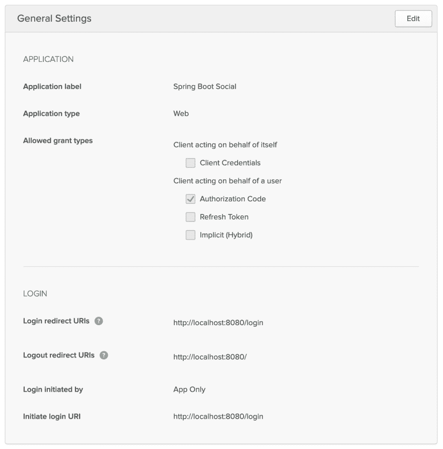
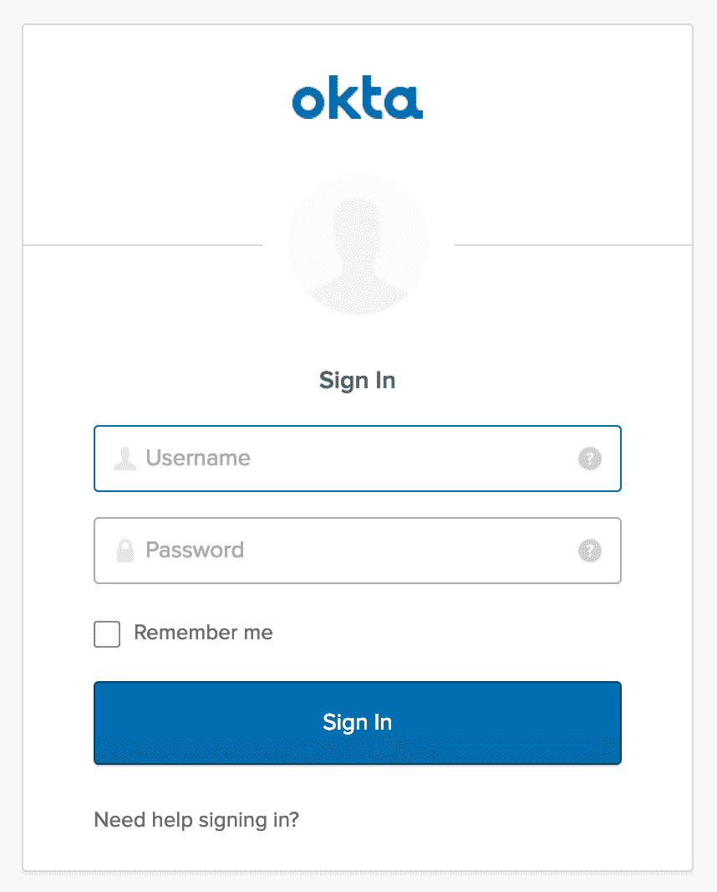
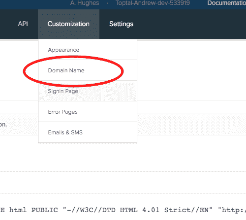
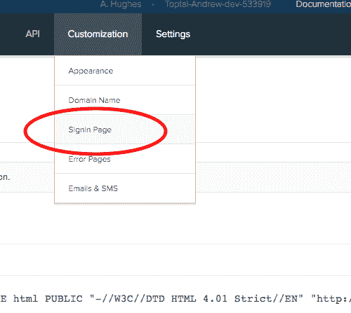
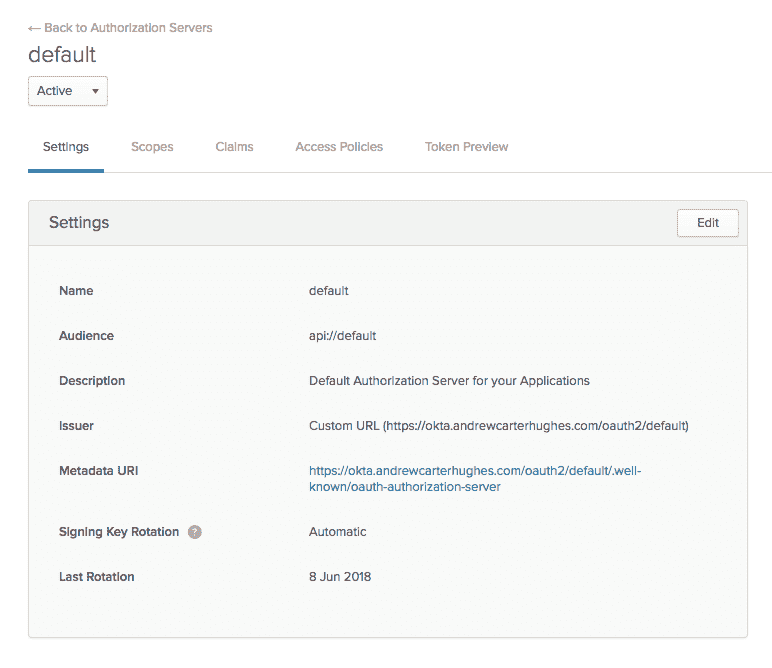
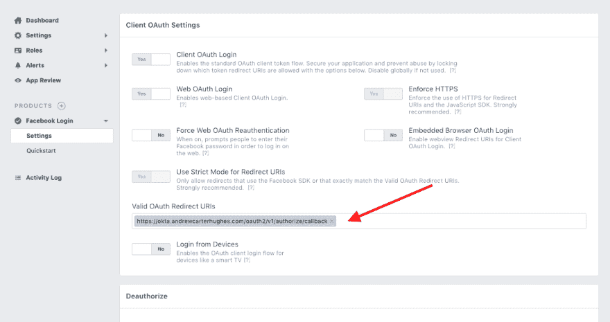
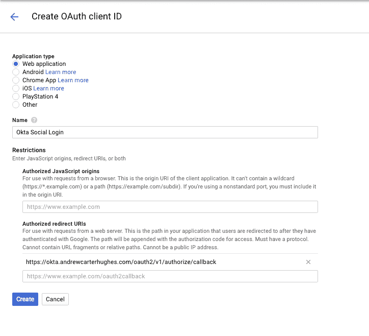
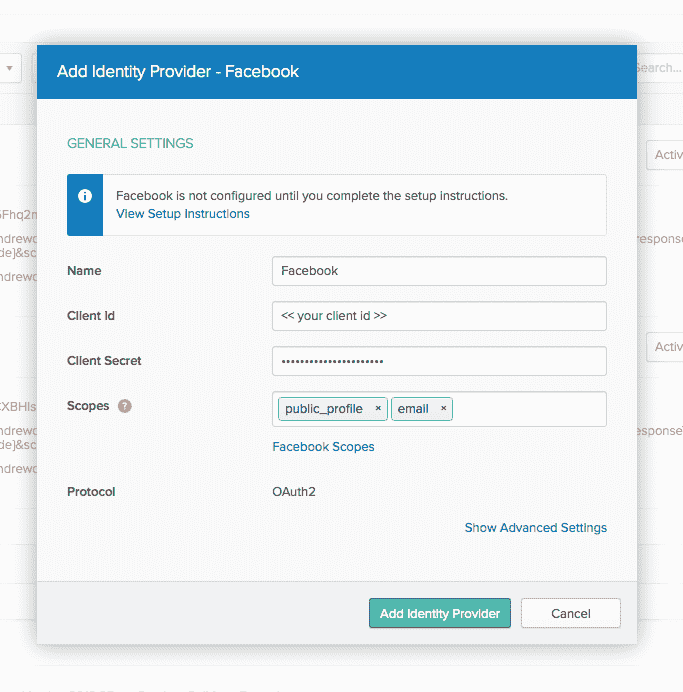
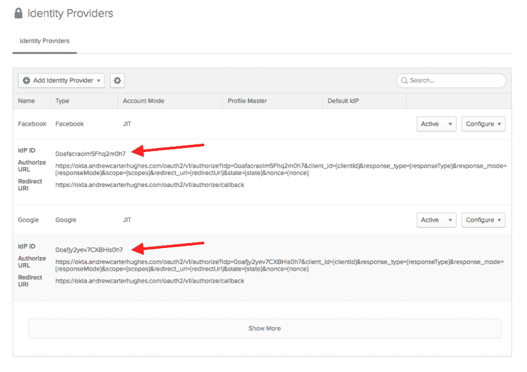
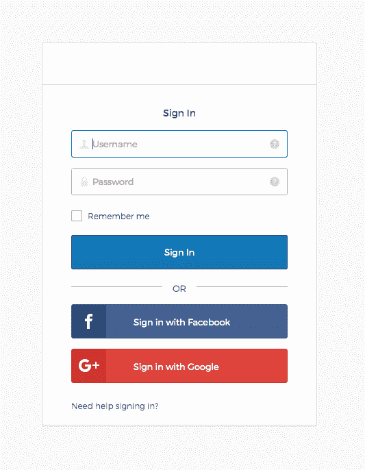

# 添加社交登录以保护您的 JHipster 应用程序

> 原文：<https://dev.to/oktadev/add-social-login-to-secure-your-jhipster-app-4poo>

社交登录是为您的客户提供简单安全的身份验证方法的绝佳方式。为什么要强迫他们创建并忘记另一个密码呢？你的绝大多数用户都会有一个脸书或谷歌的账户，那么为什么不让他们使用这些账户登录呢？

在本教程中，您将集成两个社交登录提供商:谷歌和脸书。您还将使用两个 Okta 特性来定制身份验证体验:托管登录和定制授权服务器域。

Okta 可以托管您的登录页面，并允许您编辑它的外观和感觉。这是一个很好的解决方案，因为您不必担心如何正确编写安全的登录页面，Okta 可以保留相关的代码和模板。但是，您仍然可以应用您的品牌和风格。

使用自己的自定义域进一步增加了一层专业性。除了看到默认的 Okta 认证服务器域，您可以使用您选择的任何域或子域的托管登录页面。

## 用 JHipster 打造 Spring Boot + Angular App

JHipster 是一个开源项目，允许你快速简单地生成一个 Spring Boot 和角度应用程序。甚至包含了对 Okta 开箱即用的支持！要使用 JHipster，你需要安装 [Node.js 10](https://nodejs.org/en/) 和 [Java 8](https://adoptopenjdk.net/) 。然后运行下面的命令来安装 JHipster:

```
npm i -g generator-jhipster@5.8.1 
```

接下来，创建一个目录来创建您的项目。比如`okta-spring-boot-social-login-example`。在终端窗口中导航到目录。在该目录中创建一个`app.jh`文件，并用下面的代码填充它:

```
application {
  config {
    baseName social,
    packageName com.okta.developer.social,
    prodDatabaseType postgresql,
    authenticationType oauth2,
    buildTool gradle,
    clientFramework angular,
    useSass true,
    testFrameworks [protractor]
  }
} 
```

这是 JHipster 的领域语言(JDL)，可用于选择您在创建新应用程序时想要使用的选项。你可以在这里了解更多信息。

运行以下命令创建一个新的 Spring Boot + Angular 应用程序，该应用程序配置为使用 OAuth 2.0 和 OIDC。

```
jhipster import-jdl app.jh 
```

如果您不想使用 JHipster，您可以[克隆我们已经创建了项目的 GitHub repo](https://github.com/oktadeveloper/okta-spring-boot-social-login-example) 。

```
git clone https://github.com/oktadeveloper/okta-spring-boot-social-login-example.git okta-social-login
cd okta-social-login 
```

你还需要一个免费的 developer.okta.com 账户。如果你还没有 Okta 开发者账户，去[developer.okta.com](https://developer.okta.com)注册吧！

您还需要一个 OAuth 2.0 / OpenID Connect 应用程序，我们可以用它来配置社交登录。要创建一个，请登录您的 Okta 开发者帐户，导航至**应用** > **添加应用** > **Web** > **下一步**。选择**授权码**，设置登录重定向 URI 为`http://localhost:8080/login`。点击**完成**，然后点击**编辑**。添加`http://localhost:8080`作为注销重定向 URI。

接下来，创建一个`ROLE_ADMIN`和`ROLE_USER`组，并将用户添加到其中。这些是 JHipster 使用的默认权限。您还需要确保这些组在 ID 令牌中可用。

导航到 **API** > **授权服务器**，点击**授权服务器**页签，编辑默认的授权服务器。点击**索赔**标签和**添加索赔**。将其命名为“groups”，并将其包含在 ID 标记中。将值类型设置为“Groups”，并将过滤器设置为`.*`的正则表达式。

您的 Okta OIDC 应用程序的配置应该与下面的屏幕截图相匹配。这也是你得到你的客户 ID 和客户秘密的地方。

[](https://res.cloudinary.com/practicaldev/image/fetch/s--21J8ahQe--/c_limit%2Cf_auto%2Cfl_progressive%2Cq_auto%2Cw_880/https://developer.okta.com/assets-jekyll/blog/spring-boot-social-login/oidc-app-5e11eb2792169e641d95b7b9cc20926715a6685d0e33a6891a6ef206a09eb4d2.png)

最后，您将需要一个域名，您可以使用它为您的登录页面设置自定义 Okta URL。您需要访问 DNS 区域条目，以便能够为域或子域创建 CNAME 记录。自定义域实际上不需要是子域。它可以是一个普通的、古老的领域。但是对于这个教程，我想更多的人可以在他们已经拥有的域名上建立一个子域(谁没有几十个呢？).

## 为您的 Spring Boot 应用程序配置 OAuth 2.0 设置

默认情况下，您创建(或克隆)的应用程序配置为使用 Keycloak。要更改为 Okta，请修改`src/main/resources/config/application.yml`以使用您的应用程序设置。

```
security:
    oauth2:
        client:
            access-token-uri: https://{yourOktaDomain}/oauth2/default/v1/token
            user-authorization-uri: {yourCustomDomain}
            client-id: {yourClientId}
            client-secret: {yourClientSecret}
            scope: openid profile email
        resource:
            user-info-uri: https://{yourOktaDomain}/oauth2/default/v1/userinfo 
```

您也可以将您的设置保留在应用程序之外，并用环境变量覆盖它们。例如，创建一个`~/.okta.env`文件:

```
export SECURITY_OAUTH2_CLIENT_ACCESS_TOKEN_URI="https://{yourOktaDomain}/oauth2/default/v1/token"
export SECURITY_OAUTH2_CLIENT_USER_AUTHORIZATION_URI="{yourCustomDomain}"
export SECURITY_OAUTH2_RESOURCE_USER_INFO_URI="https://{yourOktaDomain}/oauth2/default/v1/userinfo"
export SECURITY_OAUTH2_CLIENT_CLIENT_ID="{yourClientId}"
export SECURITY_OAUTH2_CLIENT_CLIENT_SECRET="{yourClientSecret}" 
```

然后，在运行应用程序之前运行`source ~/.okta.env`。您也可以将`source ~/.okta.env`添加到您的`.bashrc`或`.zshrc`文件中，这样这些变量总是被设置。

如果您正在使用 git repo 的 starter 应用程序，**请确保更新`application.yml`并填写必要的信息。**你需要以下物品:

*   Okta 应用程序客户端 ID
*   Okta 应用程序客户端机密
*   你的 Okta 网址。大概是:`https://dev-123456.okta.com`

`access-token-uri`、`user-authorization-uri`和`user-info-uri`应该包含您的 Okta URL。在下一节中，您将更新`user-authorization-uri`以使用您的自定义域，但是目前，您可以使用您的 Okta URL。

比如我的`application.yml`看起来是这样的:

```
security:
    oauth2:
        client:
            access-token-uri: https://dev-533919.oktapreview.com/oauth2/default/v1/token
            user-authorization-uri: https://okta.andrewcarterhughes.com/oauth2/default/v1/authorize
            client-id: {myClientId}
            client-secret: {myClientSecret}
            scope: openid profile email
        resource:
            user-info-uri: https://dev-533919.oktapreview.com/oauth2/default/v1/userinfo 
```

您应该能够从终端运行`./gradlew bootRun`来运行应用程序。

要测试这款应用，**注销你的 developer.okta.com 账户**，或者打开一个匿名窗口，然后进入`http://localhost:8080`。点击**标志进入**链接。

这应该会将您重定向到 Okta 登录屏幕。

[](https://res.cloudinary.com/practicaldev/image/fetch/s--sNnpty5D--/c_limit%2Cf_auto%2Cfl_progressive%2Cq_auto%2Cw_880/https://developer.okta.com/assets-jekyll/blog/spring-boot-social-login/okta-login-138c5a84e568f6a702eb508a52f41a3a38dc064eeccadd4c9e8c076fe3a5bac1.png)

登录后，您会在电子邮件中看到一条欢迎信息:

`You are logged in as user "{youremail@domain.com}".`

该应用程序尚未配置为使用自定义域。您将在下一部分中执行此操作。

## 为你的 Spring Boot 应用配置自定义域名

太好了！所以现在你有了一个可以使用 OAuth 2.0 向 Okta 认证的 Spring Boot 应用程序，对吗？下一步是配置 Okta 使用您的自定义域或子域。这是必要的，以便我们可以自定义托管登录表单，并添加“用谷歌登录”和“用脸书登录”按钮。

首先，您需要更新您的`application.yml`文件中的`user-authorization-uri`值(或者关联的`SECURITY_OAUTH2_CLIENT_USER_AUTHORIZATION_URI` env 变量，如果您正在从 shell 加载值的话)。需要更改该值以使用您的自定义域，而不是 Okta 预览域。

我的改成了这个:

```
security:
    oauth2:
        client:
            ...
            user-authorization-uri: https://okta.andrewcarterhughes.com/oauth2/default/v1/authorize
            ... 
```

接下来，您需要配置 Okta 来使用自定义域。

从 developer.okta.com 仪表板的顶部菜单，点击**定制**，选择**域名**。

[](https://res.cloudinary.com/practicaldev/image/fetch/s--vB_5MLV_--/c_limit%2Cf_auto%2Cfl_progressive%2Cq_auto%2Cw_880/https://developer.okta.com/assets-jekyll/blog/spring-boot-social-login/customize-domain-name-b72ec097ad4e91b2b0625b6d0a5a2c7b8dc5366d178dad1374504805f3eff2ee.png)

按照说明添加自定义域名。您需要一个您可以控制的域或子域(可以编辑的区域文件)。

您还需要为域/子域生成一个 SSL 证书。我建议用`certbot`和[来加密](https://letsencrypt.org/)。如果你不知道让我们加密，你应该知道！他们是由 T4 电子前沿基金会(EFF)发起的免费、开放的认证机构。

`certbot`是一个命令行工具，允许您轻松生成免费的 SSL 证书。如果你没有安装`certbot`，[这里有安装它的说明](https://certbot.eff.org/)。

您可以在开发机器上以“手动”模式本地运行`certbot`。您没有在服务器上安装此证书；你在本地生成这个证书，并上传到 Okta，以便他们可以安装它。

下面是`certbot`命令:

```
certbot --config-dir ./config --work-dir work --logs-dir logs -d $YOUR_CUSTOM_DOMAIN --manual --preferred-challenges dns certonly 
```

一旦您生成了 SSL 证书，您需要将证书和私钥交给 Okta 来完成自定义域。DNS 条目将需要几分钟的时间来更新。该网站警告说，这可能需要 48 小时，但这种情况很少发生。

## 自定义托管签到页面

一旦您配置了定制 Okta 域名，从 developer.okta.com 仪表板，点击**定制**顶部菜单，并选择**登录页面**。

[](https://res.cloudinary.com/practicaldev/image/fetch/s--rZcETNMA--/c_limit%2Cf_auto%2Cfl_progressive%2Cq_auto%2Cw_880/https://developer.okta.com/assets-jekyll/blog/spring-boot-social-login/customize-signin-page-92c6e6a5bf9ce41796940bf6b1e8ceb25e18c4a5c12399cf6d77d8cfe6e219b6.png)

现在您有了一个自定义域名，您可以编辑 Okta 登录页面，该页面允许您添加社交登录链接。

你可以验证签到页面是可编辑的，你可以玩模板文件和**保存和发布**并点击**预览**来查看你的更改。

我们还没准备好做任何事情。稍后我们将回到这里添加我们的社交登录按钮。

## 更新默认授权服务器

我们需要更新默认的授权服务器来使用定制的 URL。

从 developer.okta.com 仪表板，进入顶部菜单中的 **API** ，点击**授权服务器**。选择**默认**服务器。点击**编辑**按钮，将**发行人**从“Okta URL”更改为“自定义 URL”。其他一切都应该保持不变。

[](https://res.cloudinary.com/practicaldev/image/fetch/s--61UTAHEs--/c_limit%2Cf_auto%2Cfl_progressive%2Cq_auto%2Cw_880/https://developer.okta.com/assets-jekyll/blog/spring-boot-social-login/custom-issuer-16e43e5e1eb948a7161cb494ea5af2f07e7da0153864c93dabd301843e6ef00c.png)

点击**保存**。现在我们已经准备好为社交登录配置谷歌和脸书了！

Okta [有一些关于配置社交登录的很棒的文档](https://developer.okta.com/authentication-guide/social-login/)，包括一些针对特定社交提供商的提示。

## 配置脸书进行社交登录

*   去 https://developers.facebook.com 注册一个开发者账户，如果你还没有注册的话。
*   前往 https://developers.facebook.com/apps 的脸书应用仪表板:。
*   创建脸书应用程序。创建脸书应用程序的说明可以在这里找到:[https://developers.facebook.com/docs/apps/register](https://developers.facebook.com/docs/apps/register)。
*   一旦你创建了你的 facebook 应用，进入应用仪表板，点击左边的**设置**链接，选择**基本**子菜单。
*   保存应用 ID 和应用密码值。你以后会需要它们的。
*   您还需要添加一个**脸书登录**产品。从左侧菜单中，单击产品旁边的“+”号，添加一个**脸书登录**产品。
*   配置**有效 OAuth 重定向 URIs** ，以将您的重定向 URI 包含在您的自定义域中。我的是:`https://okta.andrewcarterhughes.com/oauth2/v1/authorize/callback`。
*   保存更改。

[](https://res.cloudinary.com/practicaldev/image/fetch/s--j-OcKnyw--/c_limit%2Cf_auto%2Cfl_progressive%2Cq_auto%2Cw_880/https://developer.okta.com/assets-jekyll/blog/spring-boot-social-login/facebook-settings-36e8e0a3995a4c1650e5062eedeaae1499b26e6b993f618c2bde0a70cb33ed4a.png)

## 配置谷歌社交登录

*   去[https://console.developers.google.com](https://console.developers.google.com/)注册一个开发者账户。
*   创建一个 Google API 控制台项目。
*   一旦你的谷歌应用打开，点击**凭证**菜单，然后**创建凭证**，接着是 **OAuth 客户端 ID** 。
*   选择 **Web 应用**类型作为 OAuth 客户端类型。
*   给客户一个名字。
*   复制客户端 ID 和客户端密码，因为您稍后会需要它们。
*   在**授权重定向 URIs** 中填写您定制的重定向网址。这和你给脸书写的是同一个，结尾是`/oauth2/v1/authorize/callback`。
*   点击**创建**。

[](https://res.cloudinary.com/practicaldev/image/fetch/s--OuBap0G4--/c_limit%2Cf_auto%2Cfl_progressive%2Cq_auto%2Cw_880/https://developer.okta.com/assets-jekyll/blog/spring-boot-social-login/google-settings-540f3fdccef0080918a08e85103dea9892c74ba4996b98e863f99640f2a34b97.png)

## 将脸书和谷歌配置为身份提供商

登录您的 developer.okta.com 仪表盘，导航至**用户** > **社交身份和提供商**。

从**添加身份提供商**下拉列表中，选择**脸书**。

[](https://res.cloudinary.com/practicaldev/image/fetch/s--LcPXFo30--/c_limit%2Cf_auto%2Cfl_progressive%2Cq_auto%2Cw_880/https://developer.okta.com/assets-jekyll/blog/spring-boot-social-login/add-facebook-idp-3b5dc843d616946940ab969e487c16d62e9d85258c3728d3669ef4ea5efdbaf5.png)

选个名字。输入您的客户端 ID 和客户端密码值。其他一切都可以保持不变。点击**添加身份提供者**。

使用 Google OAuth 2.0 客户端 ID 中的客户端 ID 和客户端机密，为 Google 再次执行此操作。

Okta 身份提供者页面现在应该是这样的。记下这两个 IdP id,因为你很快就会用到它们。

[](https://res.cloudinary.com/practicaldev/image/fetch/s--ZMsx8j-K--/c_limit%2Cf_auto%2Cfl_progressive%2Cq_auto%2Cw_880/https://developer.okta.com/assets-jekyll/blog/spring-boot-social-login/identity-providers-135740c4727bd7667451214d48b142e1373dd37c2e58a16eeedec717e89c83c7.png)

**注意:**从社交 IdP 获得的访问令牌存储在 Okta 中，可以用来代表用户向 IdP 发出后续请求(当然需要征得同意)。此外，Okta 会自动更新社交提供商的更新，保护您的应用程序免受提供商的反对。

## 定制您的托管登录页面

您需要做的最后一件事是将社交登录 IdPs 添加到您定制的登录页面上的 Okta 登录小部件中。

转到您的 Okta 开发者仪表板。在顶部菜单中选择**定制**，在其下方:**进入**页面。

在此页面上，您需要将身份提供者定义添加到`config`变量中。您还需要上面的 IdP IDs，以及您的自定义 Okta 域和 OIDC 应用程序客户端 ID。

```
<script type="text/javascript">
    // "config" object contains default widget configuration
    // with any custom overrides defined in your admin settings.
    var config = OktaUtil.getSignInWidgetConfig();

    / ***ADD THIS BLOCK HERE*** /
    config.idps = [
        {type: 'FACEBOOK', id: '0oafacraoim5Fhq2m0h7'},
        {type: 'GOOGLE', id: '0oafjy2yev7CXBHis0h7' }
    ];
   / ************************************** /

    // Render the Okta Sign-In Widget
    var oktaSignIn = new OktaSignIn(config);
    oktaSignIn.renderEl({ el: '#okta-login-container' },
        OktaUtil.completeLogin,
        function(error) {
            // Logs errors that occur when configuring the widget.
            // Remove or replace this with your own custom error handler.
            console.log(error.message, error);
        }
    );
</script> 
```

config 属性`idps`是我们配置 Okta 登录小部件以显示社交登录按钮的地方。

查看 Okta 登录小工具的文档，了解更多配置选项。

## 测试你的 Spring Boot App 的社交登录！

退出 developer.okta.com 仪表盘，使用`./gradlew bootRun`重启你的 spring boot 应用。

等待应用程序启动。导航至`http://localhost:8080`。

如果你的脸书和谷歌账户与你的 Okta 开发者账户使用不同的电子邮件地址，你可能需要在 Okta 应用程序中添加一个用户。

托管登录页面现在将显示社交登录按钮！

[](https://res.cloudinary.com/practicaldev/image/fetch/s---xwttoy8--/c_limit%2Cf_auto%2Cfl_progressive%2Cq_auto%2Cw_880/https://developer.okta.com/assets-jekyll/blog/spring-boot-social-login/okta-with-social-5cfbd262c415e936a24ca37f9111d0275867415102509da9f581fab8b1da93ee.png)

## 了解有关 Spring Boot、安全授权和社交登录的更多信息

如果您想了解关于 Spring Boot、Spring Security 或现代应用程序安全性的更多信息，请查看这些优秀的教程:

*   [开始使用 Spring Boot、OAuth 2.0 和 Okta](https://developer.okta.com/blog/2017/03/21/spring-boot-oauth)
*   [在 15 分钟内将单点登录添加到您的 Spring Boot 网络应用中](https://developer.okta.com/blog/2017/11/20/add-sso-spring-boot-15-min)
*   [通过多重身份认证保护您的 Spring Boot 应用](https://developer.okta.com/blog/2018/06/12/mfa-in-spring-boot)
*   [用 Spring Boot 和 GraphQL 构建一个安全的 API](https://developer.okta.com/blog/2018/08/16/secure-api-spring-boot-graphql)

Okta 为 Spring Boot 安全提供的另一个重要资源: [Okta Spring Boot Starter GitHub 项目](https://github.com/okta/okta-spring-boot)。

如果你对这篇文章有任何问题，请在下面添加评论。更多精彩内容，关注 [@oktadev](https://twitter.com/oktadev) 或订阅[我们的 YouTube 频道](https://www.youtube.com/channel/UC5AMiWqFVFxF1q9Ya1FuZ_Q)。