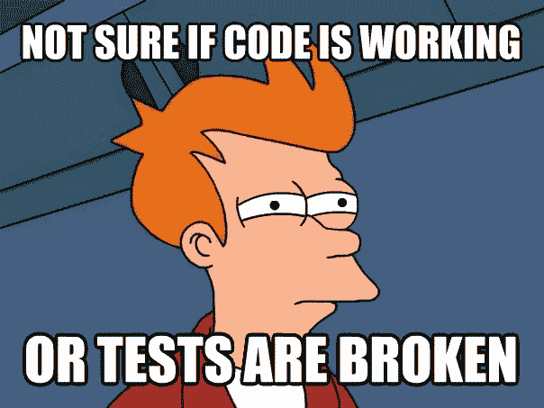
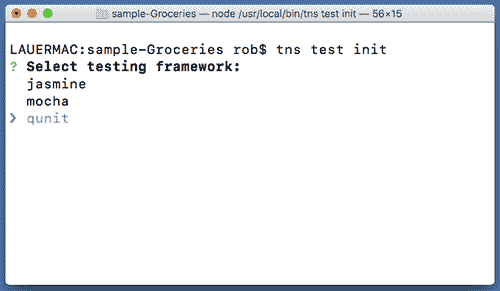
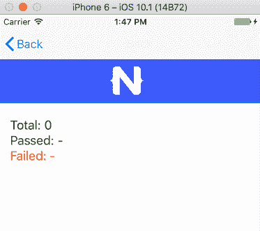
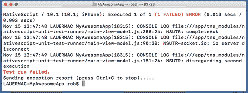
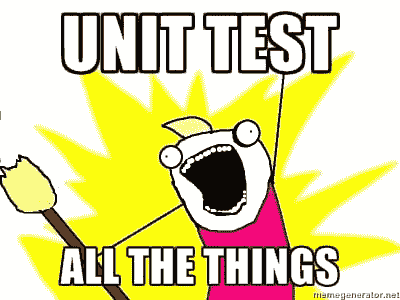

# 向 NativeScript 应用程序添加单元测试

> 原文：<https://dev.to/progress/adding-unit-tests-to-your-nativescript-app-4o7b>

许多开发人员生存的祸根，编写单元测试就像 80 年代的安全带一样流行。我们知道这是一个好主意，但是你怎么能够到你肩上挂着的六块 PBR 呢？

[](https://res.cloudinary.com/practicaldev/image/fetch/s--4Hp3qIri--/c_limit%2Cf_auto%2Cfl_progressive%2Cq_auto%2Cw_880/https://raw.githubusercontent.com/rdlauer/articles/master/nativescript/unit-testing/live-dangerously.jpg)

如果编写和执行单元测试真的很容易，那会怎么样？如果您所了解和喜爱的开源框架(并用来创建跨平台的移动应用程序)包含了对最流行的单元测试框架的支持，会怎么样？

让我们来看看如何使用一些最流行的单元测试框架对您的 [NativeScript](https://www.nativescript.org/) 应用程序进行单元测试。

## 为什么要进行单元测试？

首先，对于单元测试的新手来说，我们应该简单地谈谈*为什么*。

我以前讨厌测试。我宁愿代码->刷新浏览器->出货！当我开始更多地依赖我控制之外的东西时，这一切都改变了——比如远程数据源和具有突破性变化的库。只需要花 4 个小时追踪一个 bug(结果是对某个远程 API 的更改)，就可以意识到向代码中添加简单的自动化测试是一项有价值的时间承诺。

进入[单元测试](https://en.wikipedia.org/wiki/Unit_testing)。单元测试让我们用代码编写测试，来测试我们应用程序的最小部分。理论上，当我们编写代码时，我们应该编写相应的单元测试。通过这种方式，我们最终在应用程序中实现了几乎 100%的测试覆盖率。

通过定期运行这些测试(参见下面的持续集成部分)，我们可以自动确保我们的应用程序按预期运行。

[](https://res.cloudinary.com/practicaldev/image/fetch/s--r8wY5GyD--/c_limit%2Cf_auto%2Cfl_progressive%2Cq_66%2Cw_880/https://raw.githubusercontent.com/rdlauer/articles/master/nativescript/unit-testing/unit-tests-broken.gif)

## 单元测试框架

当然，就像我们生活的 JavaScript 乌托邦中的其他东西一样，有一些单元测试框架使我们的生活变得相当容易，例如:

*   [茉莉](https://jasmine.github.io/)
*   [摩卡](https://mochajs.org/)
*   [QUnit](https://qunitjs.com/)

真是太巧了！恰好 NativeScript 包含了对所有这些框架的开箱即用支持！因此，让我们看看我们如何编写一些单元测试，以及我们如何执行它们来测试我们的应用程序。

## 设置我们的测试

我假设您已经了解了 NativeScript 的基础知识。这是一个开源框架，用于创建跨平台的原生 iOS 和 Android 应用。如果您还没有，请务必阅读[入门教程](http://docs.nativescript.org/angular/start/introduction.html)。

完成了吗？太好了。好了，你已经运行了`npm install -g nativescript`到 [install NativeScript](https://docs.nativescript.org/start/quick-setup) 和`tns create MyAwesomeApp`来初始化你的第一个应用。

接下来，让我们`cd MyAwesomeApp`导航到这个新创建的应用程序目录。

然后，`tns test init`初始化我们的项目进行单元测试。最后，从提供的单元测试框架列表中做出选择:

[](https://res.cloudinary.com/practicaldev/image/fetch/s--zNGvmc5s--/c_limit%2Cf_auto%2Cfl_progressive%2Cq_auto%2Cw_880/https://raw.githubusercontent.com/rdlauer/articles/master/nativescript/unit-testing/pick-framework.png)

接下来会发生什么？一些事情:

*   一个`app/tests`目录被创建，这是你所有测试将被存储的地方。
    *   这个目录还包含一个带有一些样本测试的`examples.js`文件。
*   为所选框架(及其依赖项)安装适当的 native script-unit-test-runner NPM 模块。
*   一个`karma.conf.js`文件被创建在你的项目的根目录中。稍后会有更多关于因果报应的内容。

## 编写我们的测试

创建的`examples.js`文件将包含一些使用您选择的框架的样本测试。因为所有这三个框架在语法上*非常*相似，所以我选择了 [QUnit](https://qunitjs.com/) 作为我的框架选择:

[](https://res.cloudinary.com/practicaldev/image/fetch/s--PP5U01uJ--/c_limit%2Cf_auto%2Cfl_progressive%2Cq_auto%2Cw_880/https://raw.githubusercontent.com/rdlauer/articles/master/nativescript/unit-testing/qunit.png)T3】

```
 // A sample QUnit test
    QUnit.test("equal test", function (assert) {
        assert.equal( 0, 0, "Zero, Zero; equal succeeds" );
        assert.equal( "", 0, "Empty, Zero; equal succeeds" );
        assert.equal( "", "", "Empty, Empty; equal succeeds" );
        assert.equal( 0, false, "Zero, false; equal succeeds" );
    }); 
```

Enter fullscreen mode Exit fullscreen mode

虽然解释*如何*编写单独的测试超出了本文的范围，但是我可以为您提供一些关于每个框架的入门资源:

*   [茉莉](https://jasmine.github.io/pages/getting_started.html)
*   [摩卡](https://mochajs.org/#getting-started)
*   [QUnit](https://qunitjs.com/cookbook/)

既然我在这里关注 QUnit，你应该知道 QUnit 的核心是**断言**的思想。这些是 QUnit 内置的函数，允许我们测试某个语句或函数的结果。最简单的断言可能是`ok()`，它只需要一个参数。如果所述论点为真，我们通过测试，否则我们失败:

```
 QUnit.test("My first QUnit test", function () {
        ok(1 == 1, "Does 1 always = 1?");
    }); 
```

Enter fullscreen mode Exit fullscreen mode

在这个测试函数中，我希望您注意一些事情。首先，`QUnit.test`是 QUnit 用来构建测试用例的。然后我们传入`"My first QUnit test"`作为测试的名称。我们利用`ok()`断言来测试 1 = 1。最后，我们传递一个字符串`"Does 1 always = 1?"`，它允许我们描述单个断言(在一个测试中可以有多个断言)。

现在在现实世界中，您的 NativeScript 测试看起来更像这样:

```
 // require the view model to expose the functionality inside it
    var mainViewModel = require("../main-view-model");

    QUnit.test("Hello World Sample Test:", function (assert) {
        //Assert that the counter equals 42\.        
        assert.equal( mainViewModel.mainViewModel.counter, 42, "Counter, 42; equal succeeds." );

        //Assert that the message is "42 taps left".
        assert.equal( mainViewModel.mainViewModel.message, "42 taps left", "Message, 42 taps left; equal succeeds." );
    }); 
```

Enter fullscreen mode Exit fullscreen mode

> 请注意，您需要[需要模块](https://docs.nativescript.org/runtimes/require)，它公开了您想要测试的功能。

## 执行我们的测试

您可以在任何连接的 iOS 或 Android 设备上运行您的测试，以及任何 Android 模拟器或 iOS 模拟器:

*   使用`tns test android`或`tns test ios`在设备上运行
*   通过在上面的命令中添加`--emulator`标志，在模拟器上运行

例如，如果我在我的 iOS 模拟器上运行`examples.js`测试，你会看到在命令行中构建的应用程序，然后在模拟器中有一个非常简短的显示:

[](https://res.cloudinary.com/practicaldev/image/fetch/s--ChyRNrfO--/c_limit%2Cf_auto%2Cfl_progressive%2Cq_auto%2Cw_880/https://raw.githubusercontent.com/rdlauer/articles/master/nativescript/unit-testing/ios-simulator-tests.png)

等等，我还没看到结果，应用就退出了！我如何知道我的测试是否运行了？刚刚发生了什么！？！

简而言之:

*   CLI 启动了一个 [Karma](https://karma-runner.github.io/1.0/index.html) 服务器，并将项目构建/部署到设备上。
*   它没有启动你 app 的主模块，而是启动了测试运行器的主模块。
*   测试运行人员执行测试，向 Karma 报告，Karma 向命令行报告结果，如下所示:

[](https://res.cloudinary.com/practicaldev/image/fetch/s--7dGLyK_t--/c_limit%2Cf_auto%2Cfl_progressive%2Cq_auto%2Cw_880/https://raw.githubusercontent.com/rdlauer/articles/master/nativescript/unit-testing/cli-test-results.png)

在这种情况下，我的测试失败了，这可以通过红色粗体字看到。

> 如果您想在代码发生变化时自动执行测试，添加`--watch`标志，如`tns test ios --emulator --watch`

[](https://res.cloudinary.com/practicaldev/image/fetch/s--WOIFXlfk--/c_limit%2Cf_auto%2Cfl_progressive%2Cq_auto%2Cw_880/https://raw.githubusercontent.com/rdlauer/articles/master/nativescript/unit-testing/unit-test-all.jpg)

好了，你感觉好点了吗？关于 NativeScript 中单元测试的更多信息，[参考我们的大量文档](https://docs.nativescript.org/tooling/testing)。祝你好运，祝你生日快乐！