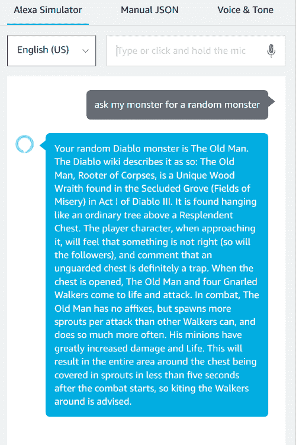
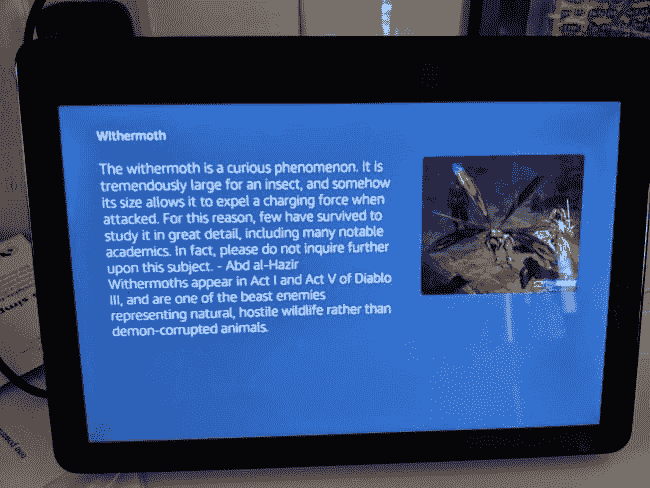

# 给 Alexa 技能添加视觉反馈

> 原文：<https://dev.to/raymondcamden/adding-visual-feedback-to-an-alexa-skill-4m9c>

我已经有一段时间没有写关于构建 Alexa 技能的博客了，但是这个周末我玩了一些我已经想看很久的东西——视觉效果。如果你不知道，有多种方法可以返回 Alexa 技能反应的视觉结果。有多个 Alexa 设备有屏幕(我有一个 Alexa Show 和 Spot ),每当你使用 Alexa 应用程序本身，视觉结果就会显示在那里。公平地说，我愿意打赌很多人甚至不知道 Alexa 应用程序，也不知道它可以显示以前的用途。这是我想看一段时间的东西，如果我早点看就好了。你可以在大约五分钟的工作中添加简单的视觉反馈！

注意，Alexa 设备支持两种视觉反馈。最简单的，也是我今天要讲的，叫做卡。这是“无处不在”的支持，我的意思是它将始终显示在应用程序中，即使你对着一个没有显示屏的设备说话。还有第二种支持方法，称为“显示模板”，适用于带有屏幕的设备。我今天不讨论这个，但是你可以在[文档](https://developer.amazon.com/docs/custom-skills/create-skills-for-alexa-enabled-devices-with-a-screen.html)中读到更多。

好，让我们来演示一下怎么做。

### 我的初始技能

在我继续之前，请注意*我如何*建立技能是完全不相关的。我认为它很棒，所以我想分享一下，但是你可以直接跳到下一节，我将讨论如何修改它来增加卡支持。我还要指出的是，我并没有将这个提交给亚马逊发布，所以你不能自己测试这个，但是请记住，亚马逊让在你自己的设备上构建和测试这些技能变得*超级*容易，这太棒了！

我的技能被称为“我的怪物”，它只是从暗黑破坏神 3 中随机选择一个怪物。在给自己一个任天堂 Switch 作为生日礼物后，我一直玩得很开心，真的很喜欢这个港口。我在 PC 上玩了很多次，可以说 Switch 在这方面做得非常出色。我一点也不想念一只老鼠。

当然，[https://diablo.fandom.com/wiki/Diablo_Wiki](https://diablo.fandom.com/wiki/Diablo_Wiki)有一个很棒的暗黑破坏神维基，因为每个维基都有一个 API，所以我构建了一些代码来解析他们的数据。

我做的第一件事就是简单地查询“动物”类别中的所有页面。我通过一个简单的邮差测试做到了这一点，网址是:[https://diablo.fandom.com/api/v1/Articles/List?类别=动物&限制=999999](https://diablo.fandom.com/api/v1/Articles/List?category=Animals&limit=999999) 。这将返回页面列表。然后你可以去 https://diablo.fandom.com/api/v1/Articles/AsSimpleJson?的[获取更多关于某个页面的信息 id=36097](https://diablo.fandom.com/api/v1/Articles/AsSimpleJson?id=36097) 其中 id 值来自之前 URL 中的初始列表。我编写了一个快速节点脚本来获取每个页面并保存到本地 JSON 文件:

```
const fetch = require('node-fetch');

/*
This array of animals came from hitting:
https://diablo.fandom.com/api/v1/Articles/List?category=Animals&limit=999999
I manually removed "Animals"
No reason to run it again
*/
const animals = require('./animals.json');
//animals.items = animals.items.slice(0,10);

console.log(`Parsing ${animals.items.length} different animals.`);

let data = [];
let calls = [];

animals.items.forEach(a => {
    // its async but it's ok (honest) cuz we add by unique id
    let url = 'https://diablo.fandom.com/api/v1/Articles/AsSimpleJson?id='+a.id;

    let call = new Promise((resolve, reject) => {

        fetch(url)
        .then(res => res.json())
        .then(res => {
            /*
            sample output:

            {
        "sections": [
            {
                "title": "Agustin the Marked",
                "level": 1,
                "content": [
                    {
                        "type": "paragraph",
                        "text": "Agustin the Marked, Carrion Scavenger, is a Unique Corvian Hunter found in the Shrouded Moors in Act II of Diablo III. It can be nominated a bounty."
                    },
                    {
                        "type": "paragraph",
                        "text": "In combat, it has Electrified, Waller and Mortar affixes."
                    }
                ],
                "images": [
                    {
                        "src": "https://vignette.wikia.nocookie.net/diabimg/6/66/Agustin.jpg/revision/latest/scale-to-width-down/180?cb=20170711163543",
                        "caption": ""
                    }
                ]
            }
        ]
            require sections[0], title+level+content+images
            */
            if(res.sections && res.sections.length >= 1 && res.sections[0].title
            && res.sections[0].level && res.sections[0].content && res.sections[0].images && res.sections[0].images.length >= 1
            && res.sections[0].images[0].src) {
                let result = res.sections[0];
                let animal = {
                    title:result.title,
                    level:result.level
                }

                animal.desc = result.content.reduce((prev, cur) => {
                    return prev + '<p>'+cur.text+'</p>';
                }, '');

                animal.image = result.images[0].src;
                data.push(animal);
                resolve(true);
            } else {
                //console.log('skip for '+JSON.stringify(a));
                resolve(true);
            }
        });
    });

    calls.push(call);
});

Promise.all(calls)
.then(() => {
    console.log(data.length + ' animals written to monster.json');
    fs.writeFileSync('./monsters.json', JSON.stringify(data), 'UTF-8');
}); 
```

Enter fullscreen mode Exit fullscreen mode

请注意并行运行 HTTP 调用的承诺的出色使用，以及我对处理文本的`reduce`的大量使用。基本上，我的想法是最终得到一组 JSON 数据，我可以“按原样”使用这些数据，而不是为每个调用动态解析数据。我错过了一两件事，可以更新这个，但让它保持原样。

最终的结果是一大堆怪物——这是其中的一部分。

```
[
    {"title":"Alabaster Fury", 
    "level":1, 
    "desc":"<p>Alabaster Furies are Unique Whitefur Howlers found in the Grace of Inarius Set Dungeon in Diablo III.</p><p>In combat, they have the Mortar and Missile Dampening affixes, the latter effectively forcing the player to fight them in melee. If allowed to charge, they can bash the player out of close combat, which also interferes with the primary task.</p>", "image":"https://vignette.wikia.nocookie.net/diabimg/2/2f/AlabasterF.jpg/revision/latest/scale-to-width-down/180?cb=20170715070656"},
    {"title":"Agustin the Marked", 
    "level":1, 
    "desc":"<p>Agustin the Marked, Carrion Scavenger, is a Unique Corvian Hunter found in the Shrouded Moors in Act II of Diablo III. It can be nominated a bounty.</p><p>In combat, it has Electrified, Waller and Mortar affixes.</p>","image":"https://vignette.wikia.nocookie.net/diabimg/6/66/Agustin.jpg/revision/latest/scale-to-width-down/180?cb=20170711163543"},
    {"title":"Almash the Grizzly", 
    "level":1, 
    "desc":"<p>Almash the Grizzly, The Great Trapper, is a Unique Bogan Trapper found in the Paths of the Drowned in Act V of Diablo III.</p><p>In combat, he has Arcane Enchanted and Jailer affixes, and his ability to hurl traps has a greatly reduced cooldown.</p>","image":"https://vignette.wikia.nocookie.net/diabimg/d/dc/5_Almash_the_Grizzly_c.jpg/revision/latest/scale-to-width-down/180?cb=20140820200154"}
] 
```

Enter fullscreen mode Exit fullscreen mode

接下来我构建了一个 Webtask.io 无服务器任务来选择一个随机的怪物并将结果返回给 Alexa 设备。下面是代码，同样地，大部分的怪物都被删除了。

```
const monsters = [{"title":"Alabaster Fury","level":1,"desc":"<p>Alabaster Furies are Unique Whitefur Howlers found in the Grace of Inarius Set Dungeon in Diablo III.</p><p>In combat, they have the Mortar and Missile Dampening affixes, the latter effectively forcing the player to fight them in melee. If allowed to charge, they can bash the player out of close combat, which also interferes with the primary task.</p>","image":"https://vignette.wikia.nocookie.net/diabimg/2/2f/AlabasterF.jpg/revision/latest/scale-to-width-down/180?cb=20170715070656"}];

/**
 * Returns a random integer between min (inclusive) and max (inclusive)
 * Using Math.round() will give you a non-uniform distribution!
 */
function getRandomInt(min, max) {
    return Math.floor(Math.random() * (max - min + 1)) + min;
}

function getMonster() {
  return monsters[getRandomInt(0, monsters.length - 1)];
}

/**
* @param context {WebtaskContext}
*/
module.exports = function(context, cb) {

  let req = context.body.request;

  let monster = getMonster();
  // make a new desc as Alexa won't grok the Ps (or other html)
  // first attempt, set linebreaks for closing P
  let desc = monster.desc.replace(/<\/p>/g,' \n ');
  // now clean up rest
  desc = desc.replace(/<.*?>/g,' ');

  //used for text
  let result = `Your random Diablo monster is ${monster.title}. The Diablo wiki describes it as so: 
${desc}`;

  var response = {
    "version": "1.0",
    "response" :{
      "shouldEndSession": true,
      "outputSpeech": {
        "type": "PlainText",
        "text": result
        }
        }
  };

  cb(null, response);

}; 
```

Enter fullscreen mode Exit fullscreen mode

你可以看到我修改了一点文字。正如我前面说过的，我构建的用于解析和保存数据的脚本可能已经更新了，所以我没有在运行中这样做。或者，我可以编写另一个节点脚本来读取输出并修复它。因为我不打算发布这个技能，所以我并不担心。这里有一个通过 Alexa 的测试控制台的样本结果。

[](https://res.cloudinary.com/practicaldev/image/fetch/s--N3wqtHXY--/c_limit%2Cf_auto%2Cfl_progressive%2Cq_auto%2Cw_880/https://static.raymondcamden.cimg/2019/04/alexa1.png)

对于一个回答来说，这个有点长了，但是，我只是在测试。好的，那么我们如何在响应中添加一张卡片呢？

首先，阅读优秀的文档！[在技能回复中加入一张卡片](https://developer.amazon.com/docs/custom-skills/include-a-card-in-your-skills-response.html)卡片有多种不同类型，但最简单的是一张简单的卡片。您可以通过简单地将`card`对象添加到您的响应:
来测试它

```
let card = {
    "type": "Simple",
    "title": monster.title,
    "content": desc
};

//stuff...

var response = {
    "version": "1.0",
    "response" :{
        "shouldEndSession": true,
        "outputSpeech": {
            "type": "PlainText",
            "text": result
            },
            "card": card
    }
}; 
```

Enter fullscreen mode Exit fullscreen mode

在上面的例子中，我添加了一张简单的卡片，上面有一个标题，内容与音频响应相同。这是在`card`键中返回的。显然你没必要这么做。您可以使用文本回复作为一种方式来包含音频上可能没有意义的内容。举个例子，我可以想象一种情况，缩略词包含在文本中，但不包含在音频中:

```
Alexa says: "I secretly record things for the National Security Agency"
Alexa prints: "I secretly record things for the National Security Agency (NSA)" 
```

Enter fullscreen mode Exit fullscreen mode

这是一个非常小的差异，但你得到的想法。

添加图像也很容易。把类型切换到`Standard`，把`content`改成`text`(感觉是哑改，主要是我漏了)，然后包含一个`image`对象，最多两个键:`smallImageUrl`和`largeImageUrl`。我已经有了每个怪物的图像，但是没有注意到 wiki 在服务器端重定向到正确的图像文件。我修改了我的代码来处理“猜测”正确的 URL，所以这并不完全完美，但我最终得到了:

```
let card = {
    "type": "Standard",
    "title": monster.title,
    "text": desc,
    "image":{
        "largeImageUrl":image
    }
}; 
```

Enter fullscreen mode Exit fullscreen mode

就是这样！结果是:

[](https://res.cloudinary.com/practicaldev/image/fetch/s--FCRN__rI--/c_limit%2Cf_auto%2Cfl_progressive%2Cq_auto%2Cw_880/https://static.raymondcamden.cimg/2019/04/alexa2.png)

这是我在 Alexa 秀上拍的一张照片。有点刺眼-抱歉。

[](https://res.cloudinary.com/practicaldev/image/fetch/s--weQBqODs--/c_limit%2Cf_auto%2Cfl_progressive%2Cq_auto%2Cw_880/https://static.raymondcamden.cimg/2019/04/alexa3.jpg)

所以不完全是火箭科学，总的来说 Alexa 开发是相当容易的，但我对将这个功能添加到我的技能中是多么容易印象深刻。我有点希望我能早点这么做。