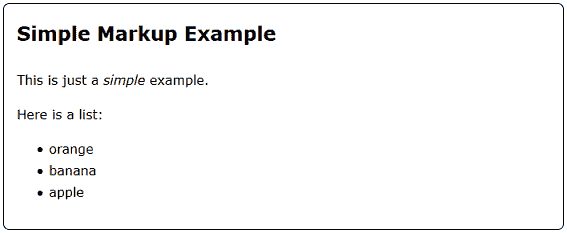

# 文档标记语言相对于所见即所得编辑器的优势

> 原文：<https://dev.to/practicalprogramming/advantages-of-document-markup-languages-vs-wysiwyg-editors-9f6>

# 简介

你有没有想过写文章、用户手册、书或任何其他类型的文本文档的最好工具是什么？

有许多选项可供选择。大多数人使用*所见即所得(WYSIWYG)* 编辑器(也称为*文本处理器*)，如 Google Docs、LibreOffice 或 Word。然而，越来越多的人使用另一种不太为人所知的选择来编写他们的文档:一种*文档标记语言*。

为什么？

你也应该使用文档标记语言而不是所见即所得编辑器吗？让我们看看。

注意:本文不比较或评估不同的写作解决方案/产品。它不会告诉你为什么 X 产品比 y 产品好，这篇文章的目的是指出文档标记语言的一般优点。

# 所见即所得编辑

离线或在线所见即所得编辑器通常是偶尔编写短小或中等大小文档的非技术人员的最佳解决方案。一些网站在网站中集成了自己的所见即所得编辑器，这使得编写格式化文本变得非常容易。WYSIWYG 软件也是设计密集型出版物的正确选择，在这些出版物中，您希望完全控制文档元素的位置、大小、字体和其他视觉属性，并希望在处理文档时立即查看和修整最终结果。这种文件的例子是传单、广告、聚会邀请、海报等。

有许多文字处理器可供选择。

一些文字处理器为特定任务提供高级功能，例如写小说。

然而，正如已经说过的，本文关注的是标记语言，所以让我们继续，看看为什么许多人更喜欢它们而不是 WYSIWYG 编辑器。

# 文档标记语言

注意:熟悉标记语言的读者可以[跳过](#advantages)下面两章。

## 基本概念

一个*文档标记语言*由一组用于注释纯文本的规则和符号(特殊字符)组成。然后，*标记处理器*可以读取注释的文本，以生成样式化的文档(例如，HTML、PDF、ePub 等)。)或任何其他种类的数据。

例如，在一些标记语言中，下划线(`_`)用于强调文本并以斜体显示。写作:

```
A _good_ girl. 
```

...结果在:

一个*好的*女孩。

因此，*标记代码*只是混有标记指令的纯文本。

一个*标记文档*由一个或多个包含标记代码的文本文件组成。

有[多种](https://en.wikipedia.org/wiki/List_of_document_markup_languages)文档标记语言可供选择。

## 简单例子

假设您创建了一个包含以下内容的文本文件(用 Markdown 语法编写):

```
# Simple Markup Example

This is just a _simpe_ example.

Here is a list:

- orange
- banana
- apple 
```

上述文本被标记处理器转换为 HTML 后，浏览器中的结果如下所示:

[](https://res.cloudinary.com/practicaldev/image/fetch/s--I3O15Ki_--/c_limit%2Cf_auto%2Cfl_progressive%2Cq_auto%2Cw_880/https://thepracticaldev.s3.amazonaws.com/i/gn76npgs18pwx77omtjb.png)

最终文档的样式可以定制。这通常是通过修改单独的 CSS 文件来实现的。

## 优点

### 无处不在的优势

所有文档标记语言都是这样工作的:

*   标记文档由*纯文本组成。*

*   内容和演示在*单独的*文件中定义。

    *内容*文件包含文本和标记指令。*展示*文件包含样式表(如 CSS 文件)。

事实证明，这两个简单的概念导致了一系列惊人的实际优势，在下面的章节中解释。

#### 无杂念写作

当你写作时，你关注的是内容，而不是表达。你关注的是你想说什么，而不是它应该如何显示或打印。

此外，您可以定制您的写作环境(编辑器),而不用担心最终结果。例如，您可以使用不同的字体和每行显示不同数量的字符，而不用考虑这会如何影响最终的文档。

因此，当你写作时，更容易*进入心流(状态)*，维基百科[将](https://en.wikipedia.org/wiki/Flow_(psychology))描述为*“一个人在活动过程中完全沉浸在充满活力的专注、完全参与和享受的精神状态”*。

这是一件大事！

#### 选择编辑器

你可以使用*你的*偏好的[文本编辑器](https://en.wikipedia.org/wiki/List_of_text_editors)或者集成开发环境(IDE)来编写你的文档。您并不局限于某个特定的编辑器。没有供应商锁定。

想象一下，一组作者在同一个文档上协作。每个人都只是使用他/她最喜欢的文本编辑器来完成手头的任务。例如，Bob 和 Alice 正在编写新的用户手册，但是 Bob 在 Linux 上使用 Emacs，而 Alice 在 Windows 上使用 Notepad++。

一些高端文本编辑器提供了令人难以置信的强大功能(有些是现成的，有些是通过扩展)，并且高度可定制，因此您可以设置您理想的写作软件。因此，你有一个更愉快的写作体验，你比用所见即所得编辑器更有效率。

#### 选择演示文稿

因为内容和表示是在不同的文件中定义的，所以只需从预定义的样式表集中选择另一个样式表(例如 CSS 文件)就可以更改表示，并根据需要进行调整。如果您的文档是在不同的阅读/打印设备上阅读的，您可以为每个设备使用不同的演示文稿。

有时许多文档使用同一个样式表。因此，在大量文档中，表示保持一致。此外，全局表示更改通常可以在几秒钟内完成，因为只需要更改一个文件。

#### 选择变换

根据您使用的语言和工具，您可以将标记代码转换成不同格式的最终文档，如 HTML、PDF、ePub 等。

如果你的工具不能做到这一点，还有 [Pandoc](http://pandoc.org/) ，这是文档转换的瑞士军刀。在编写时，Pandoc 可以将不少于 31 种输入格式转换为不少于 49 种输出格式。一个工具支持 31 x 49 = 1，519 个转换。

#### 选择文本工具

有许多工具和在线服务可以用来处理纯文本文件——有些可能已经预装在你的电脑上。您可以用它们来处理您的标记文档，以任何您想要的方式。

示例:

*   您可以使用版本控制服务(如 Github、Gitlab 或 Bitbucket)来跟踪更改和问题、协作处理文档、同步不同设备上的文档，以及使用所有其他强大的功能。

*   要了解技术人员的免费工具，请看这个 Unix 文本处理工具列表。如今，你也可以很容易地在 Windows 上安装这些 Linux 工具。

#### 定制工具

大多数编程语言都非常支持读写纯文本文件。因此，程序员更容易开发定制的工具来浏览和操作文档。

例如，可以创建预处理器和后处理器来添加功能和自动执行重复任务。一个具体的例子是一个工具，它显示文档中使用的网站链接的排序列表，并检查任何断开的链接。

此外，*很容易以编程方式创建*文档。例如，可以根据存储在数据库中的结构化数据自动创建产品目录或参考手册。

#### 便携性

由于内容和表示是以纯文本文件定义的，所以文档可以在不同的操作系统(Windows、Unix/Linux、macOS 等)之间移植。).所有的操作系统都对文本文件有很好的支持。

### 语言相关优势

在这一章中，我们将会看到一些文档标记语言的额外优势。

#### 文件拆分

一些标记语言允许你把一个文档分成不同的文件。

例如，一本书的每一章(也可能是每一个子章)可以存储在不同的文件和您选择的目录层次结构中。

当团队协作处理中型或大型文档时，这可能会改变游戏规则，因为它使编辑、重组和协作变得更加方便。

#### 语义标记

有些文档标记语言只支持*表示*标签。他们中的佼佼者更喜欢*语义*标签，而不是*表示*标签。这意味着，当您使用标记时，您指定的*意味着一段文本的*。您不需要指定*如何显示或打印*文本。你定义了*什么*，而不是*如何*。

第一个好处是这使得渲染过程更加灵活。

假设您的文本包含几条需要突出显示的警告消息。如果你使用一种只支持*表示*标签的标记语言，你可以决定积极地在黄色上显示居中的红色文本，就像这样:

[](https://res.cloudinary.com/practicaldev/image/fetch/s--Y26r9-3e--/c_limit%2Cf_auto%2Cfl_progressive%2Cq_auto%2Cw_880/https://thepracticaldev.s3.amazonaws.com/i/3uek43av4k02n6c6d7bu.png)

如果警告显示在彩色屏幕上，这种方法效果很好。但如果文档是在无色打印机上打印的，或者是在黑白电子墨水设备上显示的，结果就是一团糟。

另一方面，在一种提供语义标签的标记语言中，你可以简单地用一个`warning`标签来修饰你的警告。转换过程中使用的样式表指定了*如何显示*所有警告。因此，只需在相应的样式表中更改一个*条目，就可以全局地更改给定输出设备的所有警告的显示。例如，在用于电子墨水设备的样式表中，您可以指定用更大的字体* 用 ***斜体显示警告。此外，如果您有其他必须突出的消息，如错误或提示，您可以使用不同的、特定的标记并单独处理它们，而不会受到任何干扰。***

第二个优点是语义标记为可搜索的文档数据库打开了大门。您可以查询您的标记代码并提取有用的信息。例如，您可以创建一个工具来计算文档中包含的警告数，或者提取警告并将其保存在一个单独的文件中以供进一步研究。

#### 参数

高级标记语言支持嵌入在标记代码中的*参数*。首先通过给名称赋值来定义参数(如`my_email=foo@example.com`)。然后，在文档的后面，使用参数名，而不是值。如果以后值变了，只需要在一个地方改就行了，简单快捷，不容易出错。

这是重要的[不要重复自己(干)](https://en.wikipedia.org/wiki/Don%27t_repeat_yourself)原则的一个应用。它提高了可维护性、生产率和可靠性。这对于所有类型的循环文本和标记属性值都很有用，尤其是在它们会发生变化的情况下。例如:你的电子邮件地址，你的产品的价格，你的狗的名字，或者其他。

#### 高级功能

以下是其他强大选项的简要总结:

##### 实时预览

有时，当输入标记代码时，查看最终文档(例如 HTML 页面)*的预览是很方便的。一旦编辑了标记代码，就可以立即看到效果，而无需重新启动标记处理器。一些编辑器支持这种开箱即用或通过插件提供的即时反馈。例如，您在一个窗口中键入文档，然后在相邻的窗口中看到实时预览。*

你可以把它想象成一个支持 WYSIWYG 的标记编辑器。

##### 公共 API

公共*应用程序接口(API)* 允许程序员以编程方式执行、改变或扩展标记处理器的操作。

最起码，API 允许其他应用程序转换文档。例如，web 服务器可以读取存储在文件中或由用户输入的标记代码，并通过使用 API 动态地将其转换为 HTML。例如，这可以用来提供一个在线标记测试器，这样人们就可以试用标记代码片段，而不需要在他们的 PC 上安装任何东西。

更高级的 API 可以提供额外的功能，例如:

*   更改某些标签的呈现方式

*   向语言中添加更多标签

*   向转换器添加更多输出格式

*   通过从不同来源检索数据，以编程方式创建标记文档。

*   挂钩(也称为扩展点)

    钩子允许程序员在特定事件发生时执行函数。

    例如，一旦标记处理器创建了文档的*抽象语法树(AST)* (即树结构)，扩展点就可以有计划地探索 AST 以提取和报告有用的信息，或者甚至改变它以实现最奢侈的需求。

##### 模板

通过修改包含模板代码的文本文件，模板允许您自定义或重新定义特定标签的呈现。

##### 用户自定义标签

您可以使用配置文件来扩展该语言，将您自己的标记添加到标记语言中，并指定每个标记的呈现方式。

##### 处理器指令

处理器指令是插入标记代码中并由标记处理器解释的特殊指令。

假设有人给学生写了一份试卷。该表包含只有教师才能看到的说明。在这种情况下，只有在为教师打印文档时，才能使用指令来显示特定的文本块。

# 进一步阅读

*   一位使用“超级强大的文本编辑器”(剧透:Emacs)并且不喜欢鼠标的技术作家的建议是:[如何以及为什么抛弃你的文字处理器](http://www.alandmoore.com/blog/2012/08/08/how-and-why-to-dump-your-word-processor/)

*   标题说明了一切:[文字处理器:愚蠢和低效](http://ricardo.ecn.wfu.edu/~cottrell/wp.html)

*   一篇给小说作者的有趣文章(后面是一些有见地的评论):[最佳写书软件:Word vs. Scrivener](https://thewritepractice.com/book-writing-software-word-vs-scrivener/) 。

我将很快发表后续文章，提供更具体的信息和不同文档标记语言的比较。

# 结论

你应该使用所见即所得编辑器还是标记语言？

通常，答案取决于您的用例。

然而，正如本文所展示的，在许多情况下，文档标记语言是更好的选择，因为您可以受益于许多优点。简而言之:

*   当你写作时，你可以*专注于写作*，因为你不必考虑表达，你可以使用你喜欢的文本编辑器和你定制的设置。

*   您的写作环境*更加灵活和强大*，因为您有很多选项来处理纯文本文件。

*   更容易*自动化和定制*你的写作过程，节省时间，减少错误。

最终，设计良好的文档标记语言会让您的写作体验更加愉快，并提高您的工作效率。

你自己有什么体会？请留言分享。

注意:要了解更多信息，请阅读[我们需要一种新的文档标记语言——这就是为什么](https://dev.to/practicalprogramming/we-need-a-new-document-markup-language---here-is-why-5d4c)