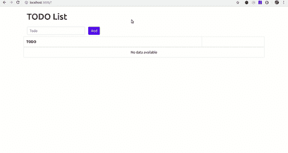
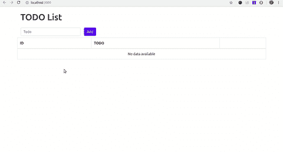
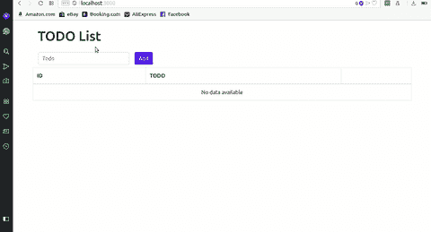

# AlaSQL:一个真正的 Web 浏览器数据库(和 Node.js)

> 原文：<https://dev.to/jorge_rockr/alasql-a-real-database-for-web-browsers-and-nodejs-24gj>

“等等，什么？!"

[](https://i.giphy.com/media/3o7abBP0nMjrdIvaCY/giphy.gif)

是的，这也是我在推特上看到的反应。

在这篇文章中，我将向你解释什么是 **AlaSQL** ，并测试它是否如预期的那样工作。

## 什么是 AlaQSL？

**AlaSQL** 是一个轻量级的客户端内存 SQL 数据库。它是用纯 Javascript 编写的，支持 JOin、GROUP、UNION、IN、ALL 和更多操作。

速度快吗？当然是啦！它利用了 Javascript 的动态特性，而
使用了优化方法。据提交人称:

*   查询被缓存为编译后的函数。

*   连接的表是预先索引的。

*   `WHERE`为连接预先过滤表达式

它能在大多数网络浏览器中工作吗？当然！它可以在所有现代版本的 Chrome、Mozilla、Safari 甚至 IE 上运行。你也可以在 Node.js 上使用它。

它支持 NoSQL 数据库吗？是的！！您可以创建 JSON 表并使用 JSON 对象。

您可以在 **AlaSQL** github 资源库中获得更多信息:

##  [阿格顺](https://github.com/agershun) / [阿拉 sql](https://github.com/agershun/alasql)

### 用于 browser 和 Node.js 的 JavaScript SQL 数据库。处理传统的关系表和嵌套的 JSON 数据(NoSQL)。从 localStorage、IndexedDB 或 Excel 导出、存储和导入数据。

<article class="markdown-body entry-content container-lg" itemprop="text">

AlaSQL 是一个开源项目，每月有超过 200 万的页面浏览量——我们非常感谢所有的贡献。[请帮帮忙](https://github.com/agershun/alasql/labels/Please%20help%20out%21)。

*有问题吗？使用“alasql”标签询问堆栈溢出。*

[](https://github.com/agershun/alasql/actions)[](https://npm-stat.com/charts.html?package=alasql)[](http://open-oss.com)[](https://www.npmjs.com/package/alasql)[](https://github.com/agershun/alasql)[](http://isitmaintained.com/project/agershun/alasql "Average time to resolve an issue")[](https://rawgit.com/agershun/alasql/develop/test/coverage/lcov-report/dist/alasql.fs.js.html)[](https://bestpractices.coreinfrastructure.org/projects/328)[](https://www.jsdelivr.com/package/npm/alasql)[](https://github.com/prettier/prettier)[](https://app.fossa.io/projects/git%2Bgithub.com%2Fagershun%2Falasql?ref=badge_small)

# 阿拉 SQL

## [](http://alasql.org)

alasql-*([àla](http://en.wiktionary.org/wiki/%C3%A0_la)[SQL](http://en.wikipedia.org/wiki/SQL))【ɛskju:ɛl】*-是一个用于 JavaScript 的开源 SQL 数据库，非常注重关系数据和无模式数据的查询速度和数据源灵活性。它适用于网络浏览器、Node.js 和移动应用程序。

该库设计用于:

*   胖客户机上 BI 和 ERP 应用程序的快速内存 SQL 数据处理
*   通过多种格式的数据导入/操作/导出实现简单的 ETL 和持久性选项
*   所有主流浏览器、Node.js 和移动应用

在构建查询时，我们通过利用 JavaScript 的动态特性来关注速度。现实世界的解决方案需要…

</article>

[View on GitHub](https://github.com/agershun/alasql)

## 安装

使用 NPM:
`npm install --save alasql`

使用 CDN:

```
<script src="https://cdn.jsdelivr.net/npm/alasql@0.4"></script> 
```

仅此而已。很简单，是吧？

## 用法

首先，将`alasql`导入到您的代码:

```
// CommonJS style
var alasql = require('alasql');

// ES6 style
import * as alasql from 'alasql';

// Global variable style
window.alasql 
```

然后，开始编写 SQL:

```
alasql("CREATE TABLE test (language INT, hello STRING)");
alasql("INSERT INTO test VALUES (1, 'Hello!')");
alasql("INSERT INTO test VALUES (2, 'Aloha!')");
alasql("INSERT INTO test VALUES (3, 'Bonjour!')");

const results = alasql("SELECT * FROM test WHERE language > 1");
console.log(results);

// Output:
// [{ "language":2, "hello":"Aloha!" },{ "language":3,"hello":"Bonjour!" }] 
```

您甚至可以对一组对象运行查询:

```
const data = [{ id: 1, amount: 10 }, { id: 2, amount: 20 }, { id: 1, amount: 30 }];
const results = alasql('SELECT id, SUM(amount) AS total FROM ? GROUP BY id', [data]);
console.log(results);

// Output:
// [{"id":1,"total":40},{"id":2,"total":20}] 
```

太棒了，对吧？

[](https://i.giphy.com/media/HT4IFvKvQwhCE/giphy.gif)

## 举例

让我们使用`npx create-react-app`工具创建一个新的 React 应用程序，并实现一个基本的待办事项列表应用程序:

```
import React from 'react';

class App extends React.Component {

  constructor(props) {
    super(props);

    this.state = { todo: [] };
  }

  addTodo() {
    const { todo } = this.state;
    const { inputTodo } = this.refs;

    todo.push(inputTodo.value);
    inputTodo.value = "";
    this.setState({ todo });
  }

  removeTodo(index) {
    const { todo } = this.state;

    todo.splice(index, 1);
    this.setState({ todo });
  }

  render() {
    const { todo } = this.state;

    return (
      <main className="container">
        <h1 className="mt-4">TODO List</h1>
        <div className="row mt-4">
          <form className="form-inline">
            <div className="form-group mx-sm-3 mb-2">
              <label for="inputTodo" className="sr-only">Todo</label>
              <input type="text" ref="inputTodo" className="form-control" id="inputTodo" placeholder="Todo"/>
            </div>
            <button type="button" className="btn btn-primary mb-2" onClick={ e => this.addTodo() }>Add</button>
          </form>
        </div>

        <div className="row">
          <table className="table table-bordered">
            <thead>
              <tr>
                <th>TODO</th>
                <th></th>
              </tr>
            </thead>
            <tbody>
              {
              !todo.length &&
              <tr>
                <td colspan="2" className="text-center">
                  No data available
                </td>
              </tr>
              }
              {
              todo.length > 0 && todo.map((x,i) => (
              <tr>
                <td>{ x }</td>
                <td>
                  <button className="btn btn-danger" onClick={ e => this.removeTodo(i) }>
                    x
                  </button>
                </td>
              </tr>
              ))
              }
            </tbody>
          </table>
        </div>
      </main>
      );
  }
}

export default App; 
```

结果是:

[](https://i.giphy.com/media/3gNpPsV0uinCadzIqd/giphy.gif)

它工作起来很神奇，但是如果我重新加载页面，我会丢失所有的待办事项列表。让我们用 **AlaSQL** 来持久化那些 TODOs。

首先，让我们导入 **AlaSQL** 并使用`componentWillMount` hook 创建表:

```
import React from 'react';
import * as alasql from 'alasql';

class App extends React.Component {

  // Constructor ...

  componentWillMount() {
    alasql('CREATE TABLE todo (id INT AUTOINCREMENT PRIMARY KEY, text STRING)');
  }

  // Lines of code ...
}

export default App; 
```

每次加载组件时， **AlaSQL** 都会创建一个表。

现在，我们需要实现一个从数据库中获取所有待办事项的方法，一个插入新待办事项的方法和一个删除它们的方法。

```
import React from 'react';
import * as alasql from 'alasql';

class App extends React.Component {

  // Lines of code ...

  fetchTodos() {
    const result = alasql('SELECT * FROM todo');
    this.setState({ todo: result });
  }

  insertTodo(text) {
    alasql('INSERT INTO todo VALUES ?',
      [{ id: alasql.autoval('todo', 'id', true), text }]);
  }

  deleteTodo(id) {
    alasql('DELETE FROM todo WHERE id = ?', id);
  }

  // Lines of code ...
}

export default App; 
```

如您所见，使用传统的 SQL SELECT、INSERT 和 DELETE 来完成这项工作。`alasql.autoval`获取要插入的下一个 ID，因为我们的表 ID 是可自动递增的。

接下来，让我们重构`addTodo`和`removeTodo`方法，并添加`componentDidMount`钩子从数据库:
中获取 TODOs

```
import React from 'react';
import * as alasql from 'alasql';

class App extends React.Component {

  // Lines of code...

  componentDidMount() {
    this.fetchTodos();
  }

  addTodo() {
    const { inputTodo } = this.refs;

    if (!inputTodo.value) return;

    this.insertTodo(inputTodo.value);
    this.fetchTodos();
    inputTodo.value = "";
  }

  removeTodo(id) {
    this.deleteTodo(id);
    this.fetchTodos();
  }

  // Lines of code ...
}

export default App; 
```

最后，让我们更新 render 方法，添加一个新的 ID 列，并使用 TODO 对象代替纯文本:

```
import React from 'react';
import * as alasql from 'alasql';

class App extends React.Component {

  // Lines of code ...

  render() {
    const { todo } = this.state;

    return (
      <main className="container">
        <h1 className="mt-4">TODO List</h1>
        <div className="row mt-4">
          <form className="form-inline">
            <div className="form-group mx-sm-3 mb-2">
              <label for="inputTodo" className="sr-only">Todo</label>
              <input type="text" ref="inputTodo" className="form-control" id="inputTodo" placeholder="Todo"/>
            </div>
            <button type="button" className="btn btn-primary mb-2" onClick={ e => this.addTodo() }>Add</button>
          </form>
        </div>

        <div className="row">
          <table className="table table-bordered">
            <thead>
              <tr>
                <th>ID</th>
                <th>TODO</th>
                <th></th>
              </tr>
            </thead>
            <tbody>
              {
              !todo.length &&
              <tr>
                <td colspan="3" className="text-center">
                  No data available
                </td>
              </tr>
              }
              {
              todo.length > 0 && todo.map(x => (
              <tr>
                <td>{ x.id }</td>
                <td>{ x.text }</td>
                <td>
                  <button className="btn btn-danger" onClick={ e => this.removeTodo(x.id) }>
                    x
                  </button>
                </td>
              </tr>
              ))
              }
            </tbody>
          </table>
        </div>
      </main>
      );
  }
}

export default App; 
```

使用 **AlaSQL** 的结果是:

[](https://i.giphy.com/media/RkHKubMsAu6e7hLxAD/giphy.gif)

该死，如果我重新加载页面，我又会丢失所有待办事项...为什么？！

[](https://i.giphy.com/media/l2JhtKtDWYNKdRpoA/giphy.gif)

嗯，事实上我们正在使用 **AlaSQL** 并且事实上我们正在将数据插入到一个表中，但是我们还没有创建一个数据库来保存数据。

因此，让我们修改`componentWillMount`钩子，如果它不存在，就创建一个名为`todo_db`的新数据库。

在这种情况下，localStorage 将用作数据库引擎。

```
componentWillMount() {
    alasql(`
      CREATE LOCALSTORAGE DATABASE IF NOT EXISTS todo_db;
      ATTACH LOCALSTORAGE DATABASE todo_db;
      USE todo_db;
    `);
    alasql('CREATE TABLE IF NOT EXISTS todo (id INT AUTOINCREMENT PRIMARY KEY, text STRING)');
} 
```

每次加载组件时， **AlaSQL** 会创建一个不存在的数据库。

以下是最终结果:

[](https://i.giphy.com/media/d2Ng0iJqNKePt8cUin/giphy.gif)

它像预期的那样工作👌。

感谢阅读！您可以在下一个资源库中找到这篇文章的源代码:

## [jorgeramon](https://github.com/jorgeramon)/[alasql-react-example](https://github.com/jorgeramon/alasql-react-example)

### 如何将 AlaSQL 与 React 一起使用的示例

<article class="markdown-body entry-content container-lg" itemprop="text">

这个项目是用 [Create React App](https://github.com/facebook/create-react-app) 引导的。

## 可用脚本

在项目目录中，您可以运行:

### `npm start`

在开发模式下运行应用程序。
打开 [http://localhost:3000](http://localhost:3000) 在浏览器中查看。

如果您进行编辑，页面将重新加载。您还会在控制台中看到任何 lint 错误。

### `npm test`

在交互式观察模式下启动测试运行程序。
详见[运行测试](https://facebook.github.io/create-react-app/docs/running-tests)章节。

### `npm run build`

将生产应用程序构建到`build`文件夹中。
它在生产模式中正确捆绑 React，并优化构建以获得最佳性能。

构建被缩小，并且文件名包括散列。
您的应用已经准备好部署了！

更多信息参见[部署](https://facebook.github.io/create-react-app/docs/deployment)部分。

### `npm run eject`

**注意:这是单向操作。一旦你`eject`，你就不能回去了！**

如果您对构建工具不满意…

</article>

[View on GitHub](https://github.com/jorgeramon/alasql-react-example)