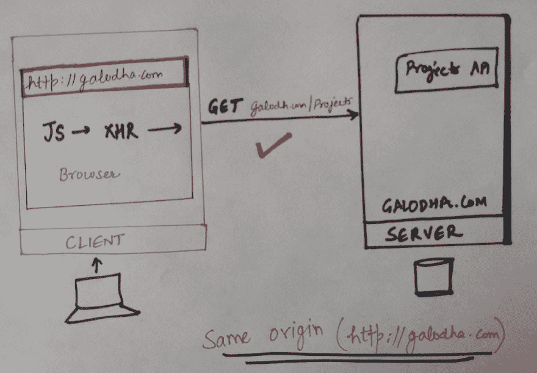
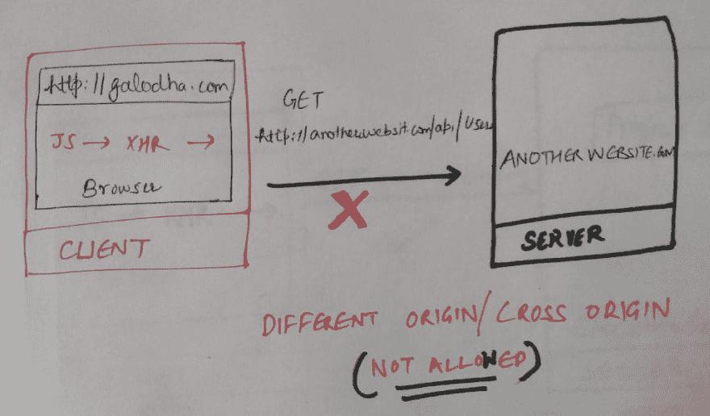
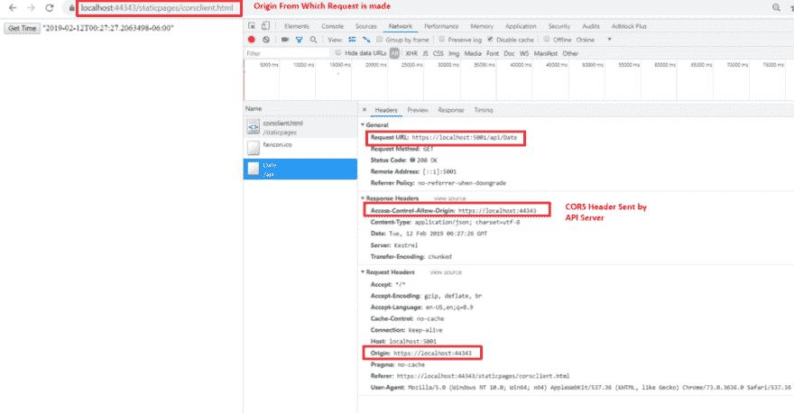
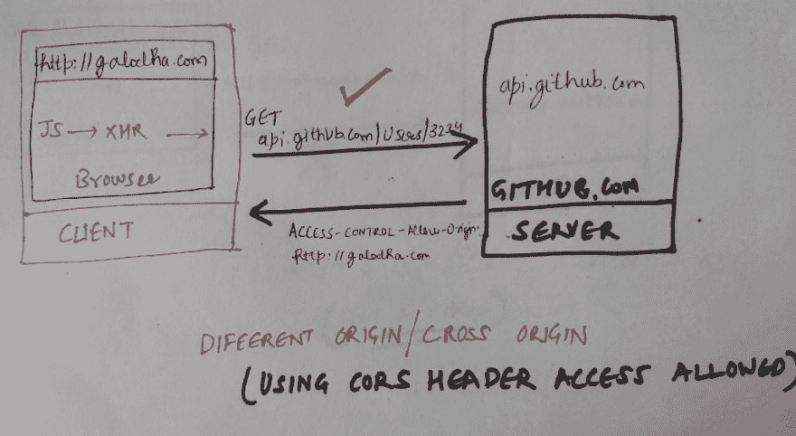
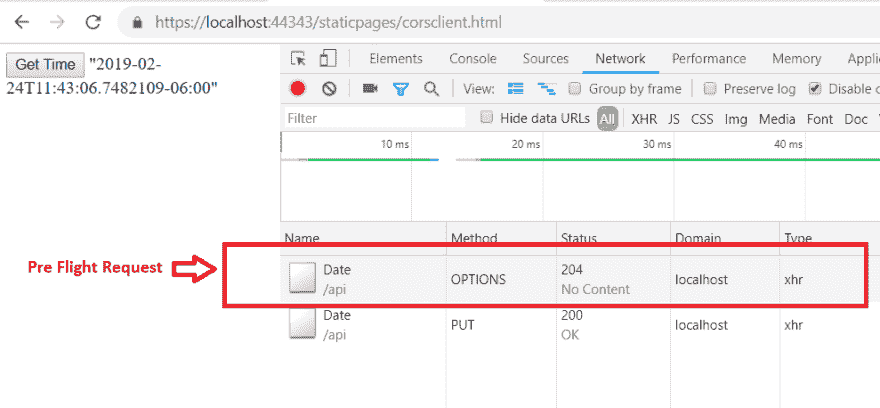

# 你想知道的关于 CORS 的一切

> 原文：<https://dev.to/abhinavgalodha/all-you-wanted-to-know-about-cors-2c4f>

### 简介

*   你想了解 CORS 吗？
*   是不是听起来太复杂而难以理解，你找到的解释大多令人困惑，难以理解？
*   您是否正在构建微服务，并担心与多个前端应用程序集成？
*   你有没有遇到过下面的错误，却一直不明白为什么会发生错误？

本文将使用真实世界的类比对 CORS 进行简单的解释。我们将深入了解您需要了解的细节&CORS 问题的疑难解答。文章还将描述*如何在 Asp.net 核心 web API 中添加*CORS 支持，以使不同域中的多个客户端能够与 API 交互。稍后，我们将演示静态网页访问不同来源的 API 之间的交互。

本文是 CORS 系列两篇文章的第一部分。这一部分提供了 CORS 的介绍，这将有助于你毫不费力地掌握 CORS 的概念，并让你更好地设计，理解和解决 CORS 问题。

在下一部分中，我们将进一步深入细节，编写代码并应用在第一部分中学到的知识来构建一个可以使用 CORS 进行通信的客户机和服务器应用程序。一旦第二部分可用，将添加链接。

### CORS 的重要性&微服务如何塑造现代应用开发？

在现代软件开发中，随着微服务的出现和分布式系统的兴起，越来越多的组件被孤立地开发。正在构建整体应用程序，以 Asp.net 核心 web API 的形式构建更小、更易管理的组件。微服务可以独立于前端进行部署和扩展。此外，由于前端需要与 API 进行通信，因此 API 有责任确保它允许客户端进行交互，并向客户端发送适当的数据以实现安全通信。CORS 形成了一个主要的规范，允许 API 接受来自不同网站的多个请求。

### 什么是 CORS？

CORS 的缩写是跨产地资源共享。

鸣谢:Getty Images

Cors 是浏览器采用的一种安全机制，如 Firefox、Chrome、IE 等。)来防止浏览器呼叫另一个网站。对源之外的资源(如图像或字体)的请求被称为跨源请求。CORS(跨来源资源共享)是管理跨来源请求的规范。

> 一个更天真的解释是——这就像保安人员阻止一个恶意的人进入你的住所，直到他们拥有一定的授权，从而保证你的家人的安全。

### 比喻一个公寓社区

让我们打个比方来理解 CORS。想象一下，你住在一个安全的公寓社区，可以使用所有的设施，过得很开心😄。为了安全起见，只有房客才能进入这个社区。如果你是房客，那么你可以随时进来/出去。对其他任何人来说，许可是被拒绝的。

你在想你的**生日聚会**在你的社区游泳池，想邀请你的朋友。既然游泳池只对房客开放，你会怎么偷偷把你的朋友带进去？

为了让他们进入公寓社区，**你需要建立一个机制，允许你的朋友进入公寓**。其中一个机制可能是给你的朋友一些安全信任并允许访问的独特通行证。

上面的类比是理解 CORS 整体概念的简单解释。住宅公寓的安全概念类似于浏览器使用**同源策略**实现的安全。我将在本文稍后解释 CORS 概念时引用这个例子。

让我们在下一节中理解关于起源的所有这些大惊小怪是什么，以及到底什么是起源。这是容易破译 CORS 的最重要的概念。

### 什么是起源？

让我们来看看到底什么是起源。原点由以下三部分组成:

1.  **协议/方案** : (Http/https)
2.  **主机**:服务器/域名
3.  **端口号**:数值

因此，像[https://galodha.com](https://galodha.com)这样的 URL 代表一个原点。

#### 同源的例子

让我们考虑以下两个属于同一来源的 Url，[https://galodha.com](https://galodha.com)。

[https://galodha.com/image1.jpg](https://galodha.com/image1.jpg)
T3[https://galodha.com/image2.jpg](https://galodha.com/image2.jpg)

以上 Url 具有**相同的协议**(https)**主机** (galodha.com)，以及**端口号**(HTTP 通信默认为 80)。

#### 不同起源的例子

以下是与[https://galodha.com](https://galodha.com)不同起源的例子。其中一个 Url 具有不同的协议，另一个属于不同的主机。

[http://galodha.com/image1.jpg](http://galodha.com/image1.jpg)(不同协议)

[https://github.com/image1.jpg](https://github.com/image1.jpg)(不同主机)

现在，在了解了起源之后，让我们来看看到底什么是同源策略。

### 同源保单是什么意思？

同源策略是浏览器之间标准化的**安全措施。*阻止不同来源之间的交互*，防止跨站请求伪造等攻击。参照我们的类比，同源就像是属于同一个公寓小区的租客。你可以信任你公寓社区的房客，但不会信任其他公寓社区的另一个人，除非他们是你的朋友。**

#### 举例:同源允许通信

下图显示了同一来源的客户端和浏览器之间的通信。浏览网站[https://galodha.com](https://galodha.com)的客户端可以调用[https://galodha.com/projects](https://galodha.com/projects)API 来获取数据。客户端和服务器的原点**(**[**)https://galodha.com**](https://galodha.com)**)**相同，因此允许通信。

<figure> 

<figcaption>共享资源</figcaption>

</figure>

**同源政策非常严格。**这可以防止 JavaScript 跨不同来源发出请求。尽管同源策略可以有效地防止资源来自不同的来源，但它也会阻止服务器和来源已知且可信的客户端之间的合法交互。

#### 举例:跨起源(不同起源)禁止交流。

下图显示了两个不同来源之间的通信。客户端浏览器在原点[https://galodha.com](https://galodha.com)浏览网站，向原点`[https://anotherwebsite.com](https://anotherwebsite.com)的[https://anotherwebsite.com/api/users](https://anotherwebsite.com/api/users)发出 ajax 请求。由于客户端和服务器位于不同的原点，因此通信是被禁止的。

#### 为什么浏览器强制执行同源策略？

实施同源策略是为了防止类似 CSRF 的安全攻击(交叉请求伪造)。

**例子**

如果您正在浏览一个银行网站，在另一个标签页中，在观看您最喜欢的视频时，您有一个广告，**“您中了彩票”**，您被该广告所诱惑，单击该广告，它会打开另一个窗口。该广告是一个恶意网站，并有 ajax 代码将钱从您的帐户发送到恶意网站所有者的帐户。

$.帖子(([https://yourfavouriteBANK.com/transfer](https://yourfavouriteBANK.com/transfer))，{收件人: '恶意所有者'，金额:' 10000000' })，

没有进一步的安全措施，这将工作，因为来自 yourfavouriteBANK.com 的认证 cookies 将被发送和认证你。从一个源到另一个源的所有通信都可以不受限制地进行，并可能导致上述攻击。

更多信息，你可以在这里阅读

CORS 允许在不损害安全性的情况下规避同源策略。

让我们把 CORS 分成更小的部分来更好地理解它。

#### 跨原点

跨域意味着请求的**源**可以与发出请求的域不同*。简单来说，当浏览网站 X 的用户向网站 B 发出另一个请求时，就被认为是跨源。*

在我们的类比中，Origin 是指公寓社区。来自同一个公寓社区的两个租户属于同一个来源。然而，你住在另一个公寓社区的朋友是不同血统或跨血统的。

<figure> 

<figcaption>不同产地</figcaption>

</figure>

#### 资源

资源就像图像、字体、视频、数据等。当我们进行 Ajax 调用时，我们请求一些数据，根据术语，这些数据是资源。

在我们的类比中，游泳池是资源。这是别人有兴趣获得的有价值的财产。

#### 共享

CORS 定义了各种标头，允许浏览器和服务器就允许(和不允许)哪些请求进行通信，并允许共享资源。

在我们的类比中，游泳池是共享的。

在我们的类比中，我们有一个安全的公寓社区，只允许租户访问资源。想象一下，如果不限制对公寓资源的访问，恶意的人可以进入社区并损坏游泳池或其他资源。

<figure> 

<figcaption>共享资源</figcaption>

</figure>

### CORS 如何允许绕过同源政策？

CORS 规范提供了一个**头**值的列表，**浏览器**和**服务器**进行通信和理解，以确保不同的源可以共享资源。

*在我们的类比中，这是* ***唯一通行证*** *，它允许你的朋友通知保安你被允许进入公寓社区。*

客户端向服务器发送请求，服务器通过提供允许的资源以及如何访问资源的信息来做出响应。服务器在响应头中发送信息。每个响应头表示资源共享的一个属性。例如，标题 Access-Control-Allow-Methods 指定了 HTTP 方法(GET、POST、DELETE 等)的列表。)是服务器允许的。

下图显示了 CORS 响应标头如何允许两个不同来源之间的通信。

*   服务器: [https://localhost:5001](https://localhost:5001)
*   客户端: [https://localhost:44343](https://localhost:44343)

由于同源策略，Ajax 请求被阻塞到不同的源。但是，我们已经通过添加响应头 Access-Control-Allow-Origin:[https://localhost:44343](https://localhost:44343)，在[https://localhost:5001](https://localhost:5001)的 API 上启用了 CORS，这允许 [https://localhost:5001](https://localhost:5001) 的 API 接收来自 Origin[https://localhost:44343](https://localhost:44343)的任何请求

<figure>

<figcaption>CORS 各部在行动</figcaption>

</figure>

大多数标题都以“访问控制允许”为前缀。下面给出了几个例子。

*   访问控制允许来源
*   访问控制允许标题
*   访问控制允许方法
*   访问控制允许凭证

其中最重要的是 Access-Control-Allow-Origin，让我们研究一下这个头。

#### 访问-控制-允许-起源

Access-Control-Allow-Origin 标头允许服务器指定服务器将与其共享资源的源列表。

回到我们的类比，这基本上允许指定允许参加泳池派对的朋友名单。您可以指定您希望该团队允许的名称列表。如果你朋友的名字不在名单上，他们就不能进来。

在开发阶段，该值可以设置为*，这意味着服务器将与互联网上的任何域共享所请求的资源。但是请不要在本地开发之外使用这个设置。

#### 举例

来自原点[https://galodha.com](https://galodha.com)的浏览器客户端想要向服务器[https://api.github.com](https://api.github.com)发送请求，由于同源策略，客户端无法向服务器发送请求。但是，当服务器用一个响应头 Access-Control-Allow-Origin:【https://galodha.com】T4 响应客户端时，客户端浏览器允许向 Origin[https://API . github](https://api.github)发出请求。

<figure> 

<figcaption></figcaption>

</figure>

### 飞行前请求

某些时候，在实际请求之前，浏览器会发出一个额外的服务器请求，这也被称为飞行前请求。预检请求使用选项标题。

#### 为什么浏览器会以飞行前请求的形式发送附加请求？不是开销吗？

第一次，我读到了飞行前请求，我对这个概念没有太多的理解，为什么我们需要在实际请求之前发送一个额外的请求。难道不是额外请求的开销吗？

飞行前请求被添加到 CORS 规范中，以允许与不理解 CORS 的旧服务器通信，并防止像删除这样的潜在危险请求。

下面是 Chrome 开发者工具的截图，显示了在实际请求之前的选项请求。这是飞行前的请求。

<figure>

<figcaption>CORS</figcaption>

</figure>

预飞请求

#### 举例:为什么增加飞行前请求？

让我们回到过去，假设一个没有定义 CORS 规范的时代。**服务器不知道 CORS 规范**，但是理解同源规范并且只允许来自同源的请求。

像[https://galodha.com](https://galodha.com)这样的起源被服务器 X 用来在[https://galodha.com/blogs](https://galodha.com/blogs)托管博客。这个服务器 X 知道同源策略，并允许类似于**删除**来自同源的博客帖子的操作。

现在，CORS 规范推出了。新的服务器 Y 被设置来管理位于 URL[https://galodha.com/projects](https://galodha.com/projects)的项目。服务器 Y 支持对相同原点上的项目的获取/发布/删除操作。

这些项目越来越受欢迎，其他网站也有兴趣在其网站上列出这些项目。所以，你需要考虑到从原点[https://galodha.com](https://galodha.com)的 Get 操作。此外，还有开源贡献者，所以你需要提供删除操作，以及从其他网站/来源。幸运的是，CORS 规范已经启动，你知道通过使用 CORS 报头 Access-Control-Allow-Origin:【https://anotherwebsite.com】，我们可以允许来自另一个网站/origin 的请求。此外，使用 CORS 头，访问控制允许方法:获取，发布，删除，我们可以允许从其他网站的获取/发布/删除操作。

到目前为止一切顺利，你的服务器 Y 从其他网站获得了大量的流量。

接下来，一个恶意用户进入，正在使用[https://anotherwebsite.com](https://anotherwebsite.com)并试图在服务器 x 上的 URL[https://galodha.com/blogs](https://galodha.com/blogs)上执行**删除**操作。源[https://galodha.com](https://galodha.com)已经允许来自其他网站对服务器 Y 在[https://galodha.com/Projects](https://galodha.com/Projects)的请求。注意，同源策略只考虑*的方案、主机名和端口号，而不考虑 URL 的完整路径。因此，由于浏览器认为 https://galodha.com/blogs[和 https://galodha.com/projects](https://galodha.com/blogs)属于同一个来源，客户端可以同时向这两者发出请求。*

由于服务器 X 允许来自相同来源的删除操作，并且它对新的 CORS 规范一无所知，那么对于从另一个网站/来源请求的服务器 X 上的删除操作，应该是什么行为？

是否应该允许删除资源？。如果服务器 X 能告诉我它不支持 CORS，那岂不是很棒？我们不能再请求检查一个服务器是否支持 CORS 吗？

是的，你很幸运，CORS 规范定义了飞行前请求，它做的事情和我们上面提到的一样。预检请求会发出额外的请求，以确保服务器是否理解该请求。如果服务器不理解这个请求，那么客户端就不会发出实际的请求。但是，如果服务器理解请求，它将返回适当的响应，说明它允许什么，然后客户端可以发出实际的请求。

#### 什么情况会触发飞行前请求？

飞行前请求并不是针对所有的请求，而是仅适用于某些情况。以下是决定是否提出飞行前请求的条件列表。

*   当实际请求是除 GET、POST 或 HEAD 之外的任何 HTTP 方法时。
*   如果 POST 请求的内容类型不是 application/x-www-form-urlencoded、multipart/form-data 或 text/plain。
*   此外，如果请求包含任何自定义标题，则需要预检请求。像 Accept、Accept-Language、Content-Language 等标题不会触发预检请求。

有某些附加条件可以触发飞行前请求。有关完整列表，请参考[链接](https://developer.mozilla.org/en-US/docs/Web/HTTP/CORS#Simple_requests)。

### 结论

我们更好地了解了起源、构成和起源(方案、主机和端口号)。浏览器为什么实施同源策略，CORS 规范如何允许不同来源之间的通信。我们查看了服务器需要发送给客户端以允许通信的各种 CORS 报头。我希望公寓社区的类比有助于理解安全问题以及安全通行证如何帮助我们绕过它。最后，我们讨论了飞行前的请求，当您第一次看到网络工具栏中弹出的请求时，可能会感到困惑。

我希望你现在对 CORS 有了更好的了解，可以轻松地把你的朋友偷偷带进你安全的公寓社区。这都要感谢 CORS。在下一篇文章中，我们将看看需要在服务器端添加的代码，还将看看一个简单的 Javascript 客户端，它将通过不同的来源进行通信。

*   本文原载[此处](https://developer.mozilla.org/en-US/docs/Web/HTTP/CORS)

### 参考文献

*   [https://developer.mozilla.org/en-US/docs/Web/HTTP/CORS](https://developer.mozilla.org/en-US/docs/Web/HTTP/CORS)
*   [https://stack overflow . com/questions/15381105/CORS-what-the-motivation-behind-introducing-preflight-requests](https://stackoverflow.com/questions/15381105/cors-what-is-the-motivation-behind-introducing-preflight-requests)
*   [https://enable-cors.org/](https://enable-cors.org/)

* * *