# 一个绝对的初学者学习反应，第三部分

> 原文：<https://dev.to/awwsmm/an-absolute-beginner-learns-react-part-iii-1eeh>

这是我第一次学习 React 的 [博文](https://dev.to/awwsmm/an-absolute-beginner-learns-react-part-ii-e15)的延续。我正在努力完成 [ReactJS.org 的教程](https://reactjs.org/tutorial/tutorial.html)，上次，我在构建一个基本的井字游戏方面取得了进展。在这篇博文里，我来完成它！(希望如此！)

* * *

所以当我们上次停下来的时候，我刚刚为用户编写了选择方块的能力。但是他们只能把正方形变成 X 形，没有任何人获胜的机制。显然，我们还有很多工作要做:

[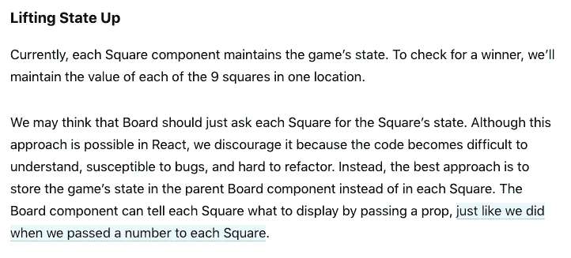](https://res.cloudinary.com/practicaldev/image/fetch/s--hN_48pia--/c_limit%2Cf_auto%2Cfl_progressive%2Cq_auto%2Cw_880/https://thepracticaldev.s3.amazonaws.com/i/5cheffgxhasyb27bszw7.png)

好吧，那么...什么？这篇课文有点混乱。我认为这是在说，我们不希望棋盘必须不断地查询每个方格的状态，以确定是否有人赢得了游戏。听起来好像方块会在更新时将它们的状态发送到棋盘上(这应该只发生一次),棋盘会从那时开始跟踪它。但是，就像我说的，我不确定，因为这段文字不是很清楚。

这一节的标题是“提升状态”,这是我看到的下一段文字:

[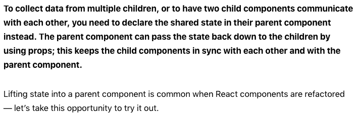](https://res.cloudinary.com/practicaldev/image/fetch/s--PLw-hpG2--/c_limit%2Cf_auto%2Cfl_progressive%2Cq_auto%2Cw_880/https://thepracticaldev.s3.amazonaws.com/i/6vnjub19p2gc9wuuawuk.png)

我不得不读几次来解析它，但是听起来它说的是，无论何时你想要两个组件相互对话，它们必须通过父组件来完成。我不确定为什么。

...还是这段文字(还有之前的文字)说的是*推荐的*做法这么做？是不是因为任何一个孩子都可以将其状态传递给其父，任何一个父都可以设置孩子的状态，但是孩子却不能通过父与*其他*孩子对话？这就是为什么鼓励将状态提升到父节点的原因吗？

在这里做一点解释会很有帮助。

我将这个`constructor`添加到`Board`中，将棋盘的状态初始化为九个空方格:

```
 constructor(props) {
    super(props);
    this.state = {
      squares: Array(9).fill(null)
    };
  } 
```

Enter fullscreen mode Exit fullscreen mode

尽管在示例代码中，在以`squares: Array...`开头的行尾有一个悬空的逗号。我把这个我认为是错别字的悬空逗号去掉。

初始化`this.state.squares`的语法类似于在单个方块
中初始化`this.state.value`的语法

```
 this.state = {
      value: null
    }; 
```

Enter fullscreen mode Exit fullscreen mode

```
 this.state = {
      squares: Array(9).fill(null)
    }; 
```

Enter fullscreen mode Exit fullscreen mode

...除了这一次，我们有一个`9`值的`Array`,而不是单个`Square`中的单个`value`,默认情况下，每个值都设置为`null`。我想是的。

[](https://res.cloudinary.com/practicaldev/image/fetch/s--YvBA8ird--/c_limit%2Cf_auto%2Cfl_progressive%2Cq_auto%2Cw_880/https://thepracticaldev.s3.amazonaws.com/i/22yukgv2ucwvqdfvxon4.png)

我甚至没有意识到发生了什么，但我现在明白了，是的。这里:

```
 renderSquare(i) {
    return <Square value={i} />;
  } 
```

Enter fullscreen mode Exit fullscreen mode

...当我们渲染一个正方形时，我们给它发送值`i`，这个值由它在网格中的位置决定:

```
 <div className="board-row">
          {this.renderSquare(0)}
          {this.renderSquare(1)}
          {this.renderSquare(2)}
        </div> 
```

Enter fullscreen mode Exit fullscreen mode

所以`i = 1, 2, 3, ...`。但是`Square`类中实际的`render()`方法是:

```
 render() {
    return (
      <button className="square"
        onClick={() => this.setState({value: 'X'})}>
        {this.state.value}
      </button>
    );
  } 
```

Enter fullscreen mode Exit fullscreen mode

它完全忽略了传递给它的`i`，它成为了它的`state` :
中未使用的部分

```
 constructor(props) {
    super(props);
    this.state = {
      value: null
    };
  } 
```

Enter fullscreen mode Exit fullscreen mode

...并使用`this.setState({value: 'X'})}`将值设置为`X`，而不管传递给它的值是什么。据推测，接下来，我们将修复这种行为，并允许根据传递给`renderSquare()`的值将状态设置为`X`或`O`。

因为我们已经在`Board.state.squares`中定义了棋盘的状态(我们将在以后更新)，我们可以通过修改`renderSquare()`方法:
将一个方格的状态(从数组中)传递给这个方格

```
 renderSquare(i) {
    return <Square value={i} />;
  } 
```

Enter fullscreen mode Exit fullscreen mode

变成了

```
 renderSquare(i) {
    return <Square value={this.state.squares[i]} />;
  } 
```

Enter fullscreen mode Exit fullscreen mode

> 哇，这部分感觉比其他部分要长得多...

好的，现在游戏的状态保存在`Board`中，任何特定的`Square`都不能直接更新游戏状态，因为对象不能直接编辑其他对象的状态。下一部分有点复杂。

首先，如果`Square`不再跟踪游戏的状态，我们可以完全删除`constructor`，因为它只是设置了`Square` :
的状态

```
class Square extends React.Component {

  constructor(props) {
    super(props);
    this.state = {
      value: null
    };
  }

  render() {
    return (
      <button className="square"
        onClick={() => this.setState({value: 'X'})}>
        {this.state.value}
      </button>
    );
  }

} 
```

Enter fullscreen mode Exit fullscreen mode

变成了

```
class Square extends React.Component {

  render() {
    return (
      <button className="square"
        onClick={() => this.setState({value: 'X'})}>
        {this.state.value}
      </button>
    );
  }

} 
```

Enter fullscreen mode Exit fullscreen mode

然后，我们将从`Board`向`Square`传递一个函数，该函数告诉`Square`如何处理点击，所以

```
 renderSquare(i) {
    return <Square value={this.state.squares[i]} />;
  } 
```

Enter fullscreen mode Exit fullscreen mode

变成了

```
 renderSquare(i) {
    return (
      <Square
        value   = {this.state.squares[i]}
        onClick = {() => this.handleClick(i)}
      />
    );
  } 
```

Enter fullscreen mode Exit fullscreen mode

为了易读性，行被缩进，现在`return`后面必须有一个`()`，包围它的内容。否则，JavaScript 的[自动分号插入](http://www.bradoncode.com/blog/2015/08/26/javascript-semi-colon-insertion/)可能会破坏代码。(*谁认为这是个好主意？*)

当然，这意味着`Square`也应该被更新。在`button`的`onClick`定义:
中，我们应该用`this.props.onClick()`而不是`this.setState({value: 'X'})}`

```
class Square extends React.Component {

  render() {
    return (
      <button className="square"
        onClick={() => this.setState({value: 'X'})}>
        {this.state.value}
      </button>
    );
  }

} 
```

Enter fullscreen mode Exit fullscreen mode

变成了

```
class Square extends React.Component {

  render() {
    return (
      <button className="square"
        onClick={() => this.props.onClick()>
        {this.state.value}
      </button>
    );
  }

} 
```

Enter fullscreen mode Exit fullscreen mode

哦，当然，`this.state.value`应该变成`this.props.value`，因为这个`Square`的状态会从`Board`发送到这个`Square`的`props` :

```
class Square extends React.Component {

  render() {
    return (
      <button className="square"
        onClick={() => this.props.onClick()>
        {this.state.value}
      </button>
    );
  }

} 
```

Enter fullscreen mode Exit fullscreen mode

变成了

```
class Square extends React.Component {

  render() {
    return (
      <button className="square"
        onClick={() => this.props.onClick()>
        {this.props.value}
      </button>
    );
  }

} 
```

Enter fullscreen mode Exit fullscreen mode

我仍然不明白这一切是如何走到一起的，但我想解释即将到来。

[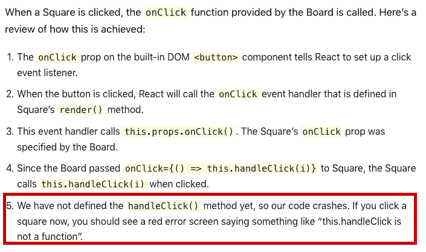](https://res.cloudinary.com/practicaldev/image/fetch/s--9Fh7z1d0--/c_limit%2Cf_auto%2Cfl_progressive%2Cq_auto%2Cw_880/https://thepracticaldev.s3.amazonaws.com/i/ewgyuein9al512n58j19.png)

哦，是的，看，在那里。我再次在终端中运行`npm start`,等待代码运行，等待时间长得令人难以忍受。(*还有人有这个问题吗？*)当它出现时，我在浏览器中得到一个错误页面:

[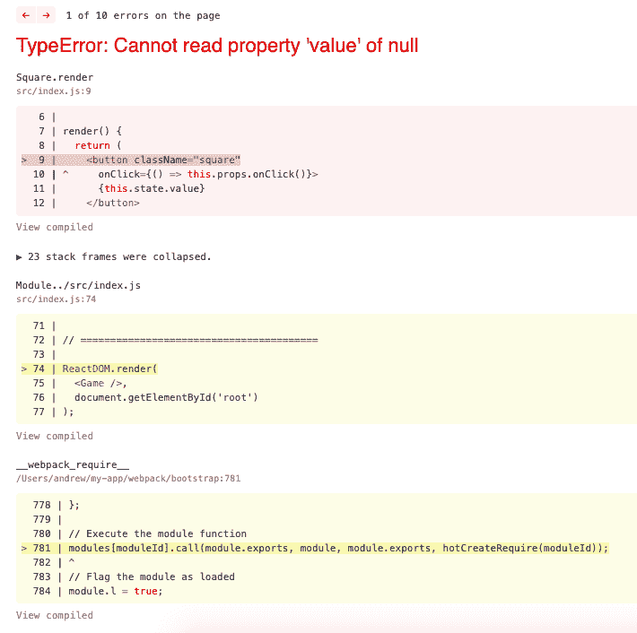](https://res.cloudinary.com/practicaldev/image/fetch/s--CEVdl1kZ--/c_limit%2Cf_auto%2Cfl_progressive%2Cq_auto%2Cw_880/https://thepracticaldev.s3.amazonaws.com/i/g68xhlpsuoxk24ci0a4r.png)

我做了什么？

哦，看起来我忘了在我的代码中将`{this.state.value}`更新为`{this.props.value}`，尽管我已经写在这里了。让我们改变现状，再试一次:

[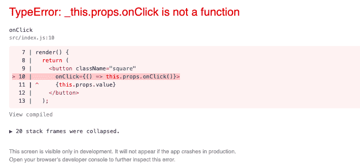](https://res.cloudinary.com/practicaldev/image/fetch/s--6IDFnbUt--/c_limit%2Cf_auto%2Cfl_progressive%2Cq_auto%2Cw_880/https://thepracticaldev.s3.amazonaws.com/i/rxc2wpowcsaajvmjvxmt.png)

太好了，成功了！它应该以那种特定的方式崩溃，因为我们还没有在`this.props`中定义`onClick()`函数。

此外，我正在阅读教程中的一条注释，看起来我错误地命名了这个函数:

[](https://res.cloudinary.com/practicaldev/image/fetch/s--2CwXEbvb--/c_limit%2Cf_auto%2Cfl_progressive%2Cq_auto%2Cw_880/https://thepracticaldev.s3.amazonaws.com/i/beu2ixzh8t6wki2xuvwx.png)

所以我有`this.props.onClick()`的地方，应该改成`this.props.handleClick()`。为了清晰起见，让我在这里复制整个`index.js`文件:

```
import React from 'react';
import ReactDOM from 'react-dom';
import './index.css';

class Square extends React.Component {

  render() {
    return (
      <button className="square"
        onClick={() => this.props.handleClick()}>
        {this.props.value}
      </button>
    );
  }

}

class Board extends React.Component {
  constructor(props) {
    super(props);
    this.state = {
      squares: Array(9).fill(null)
    };
  }

  renderSquare(i) {
    return (
      <Square
        value={this.state.squares[i]}
        onClick={() => this.handleClick(i)}
      />;
    );
  }

  render() {
    const status = 'Next player: X';

    return (
      <div>
        <div className="status">{status}</div>
        <div className="board-row">
          {this.renderSquare(0)}
          {this.renderSquare(1)}
          {this.renderSquare(2)}
        </div>
        <div className="board-row">
          {this.renderSquare(3)}
          {this.renderSquare(4)}
          {this.renderSquare(5)}
        </div>
        <div className="board-row">
          {this.renderSquare(6)}
          {this.renderSquare(7)}
          {this.renderSquare(8)}
        </div>
      </div>
    );
  }
}

class Game extends React.Component {
  render() {
    return (
      <div className="game">
        <div className="game-board">
          <Board />
        </div>
        <div className="game-info">
          <div>{/* status */}</div>
          <ol>{/* TODO */}</ol>
        </div>
      </div>
    );
  }
}

// ========================================

ReactDOM.render(
  <Game />,
  document.getElementById('root')
); 
```

Enter fullscreen mode Exit fullscreen mode

我还遗漏了代码中的一些其他内容。在阅读教程时，在这里记笔记并在终端中编辑代码可能会有点混乱。我觉得以上都是教程到这一步的样子，继续吧。

为了消除第二个错误(“`_this.props.onClick`不是函数”)，并记住我们将`onClick`重命名为`handleClick`，我们现在必须在`Board`中定义一个`handleClick`方法:

> 我不确定我真的从这个教程中学到了什么。更多的只是复制和粘贴预先写好的代码。不过，我会坚持到底。

在`Board`中，我们现在定义`handleClick()`方法:

```
handleClick(i) {
  const squares = this.state.squares.slice();
  squares[i] = 'X';
  this.setState({squares: squares});
} 
```

Enter fullscreen mode Exit fullscreen mode

在我继续阅读之前，让我看看我是否能猜出这是在做什么。首先，它是一个带单个参数`i`的函数，参数是棋盘上方块的索引(*要么是`0-8`要么是`1-9`，不知道 JavaScript 是基于`0`还是基于`1`*)。然后，它在初始化为自己的`state.squares`的方法中创建一个`const` ant 局部变量。我不知道为什么`slice()`需要出现在那里，如果`squares`已经是一个数组。此外，当我们改变下一行中某个元素的值时，为什么将`squares`声明为`const`？最后，我们用`setState`设置状态。看起来在 JavaScript 中变量是通过值传递的，所以我们必须显式地将`squares.state`的值复制到一个局部变量中，我们编辑这个局部变量，然后将编辑过的变量传递回去以改变状态。有多少是正确的？

[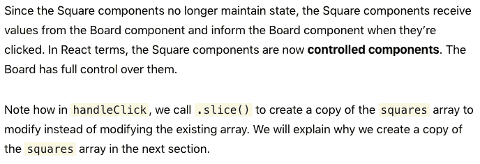](https://res.cloudinary.com/practicaldev/image/fetch/s--bxMt2bp4--/c_limit%2Cf_auto%2Cfl_progressive%2Cq_auto%2Cw_880/https://thepracticaldev.s3.amazonaws.com/i/uuwdghujglcrx7pme3m8.png)

...好吧，我想我以后会知道的。

字面上是下一段开始解释这一点。如果你要在下一次呼吸中谈论它，为什么还要说“我们以后会解释这个”呢？这就是为什么他们建议用他们以前的方式做这件事:

[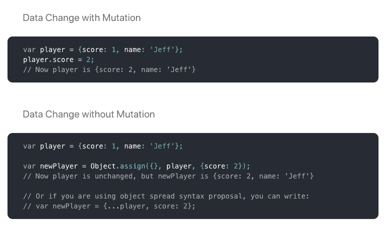](https://res.cloudinary.com/practicaldev/image/fetch/s--04U9DJ0u--/c_limit%2Cf_auto%2Cfl_progressive%2Cq_auto%2Cw_880/https://thepracticaldev.s3.amazonaws.com/i/mkcflvhcf5bhballqton.png)

对我来说，自然的方法是直接编辑`Square`的状态，但是本教程推荐的方法是创建一个新对象，而不是改变现有的对象。本教程建议尽可能地保持对象不可变，这样就可以很容易地检测到变化，应用程序也可以很容易地恢复到以前的状态，还有其他好处。

[](https://res.cloudinary.com/practicaldev/image/fetch/s--icoAIlyV--/c_limit%2Cf_auto%2Cfl_progressive%2Cq_auto%2Cw_880/https://thepracticaldev.s3.amazonaws.com/i/c2cyi49hhz1756y51v1s.png)

> 天哪。好吧。可能是我，因为我没有真正强大的 JavaScript / reactive 前端编程背景，但是这个教程好像是从一个概念跳到另一个概念，基本没有连贯性。头脑中似乎没有明确的目标或学习途径。我感觉我只是在学习一个随机的概念，然后复制一些代码，然后继续下一件事。目前为止还不太喜欢。

[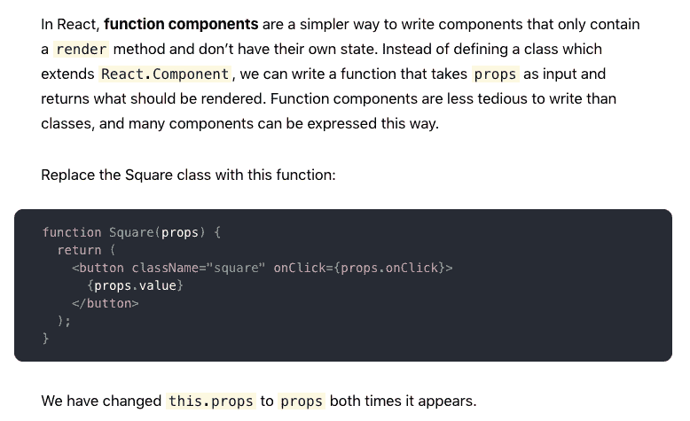](https://res.cloudinary.com/practicaldev/image/fetch/s--SnZX2XU8--/c_limit%2Cf_auto%2Cfl_progressive%2Cq_auto%2Cw_880/https://thepracticaldev.s3.amazonaws.com/i/4pwllztodlk71b6yjqhd.png)

好吧，看起来确实更容易。因为正方形本身没有状态，所以它将通过从`Board`中调用这个函数来呈现。

[](https://res.cloudinary.com/practicaldev/image/fetch/s--wj40huSu--/c_limit%2Cf_auto%2Cfl_progressive%2Cq_auto%2Cw_880/https://thepracticaldev.s3.amazonaws.com/i/em9b8s6d41b8lrcb4u0n.png)

好吧但是为什么？没有给出解释，我们继续下一件事。

在我们改变`Board`中的`renderSquare()`功能之前，我们将添加在板上绘制`O`和`X`的功能。我们在`Board`的`constructor` :
中设置初始状态

```
class Board extends React.Component {
  constructor(props) {
    super(props);
    this.state = {
      squares: Array(9).fill(null)
    };
  } 
```

Enter fullscreen mode Exit fullscreen mode

变成了

```
class Board extends React.Component {
  constructor(props) {
    super(props);
    this.state = {
      squares: Array(9).fill(null),
      xIsNext: true
    };
  } 
```

Enter fullscreen mode Exit fullscreen mode

还有 ***又是*** ，`xIsNext: true`结尾有个悬空逗号，我已经去掉了。这是故意的吗？

所以`xIsNext`是一个布尔值，我们每次渲染一个正方形时都会翻转它。当我们重写`renderSquare()`(我想)时，我们将把`xIsNext`从假翻转为真，反之亦然，并在我们决定画出`X`或`O`之前检查`xIsNext`的状态。我们改变

```
 handleClick(i) {
    const squares = this.state.squares.slice();
    squares[i] = 'X';
    this.setState({squares: squares});
  } 
```

Enter fullscreen mode Exit fullscreen mode

至

```
 handleClick(i) {
    const squares = this.state.squares.slice();
    squares[i] = this.state.xIsNext ? 'X' : 'O';
    this.setState({
      squares: squares,
      xIsNext: !this.state.xIsNext
    });
  } 
```

Enter fullscreen mode Exit fullscreen mode

(同样，去掉一个悬空的逗号。)

[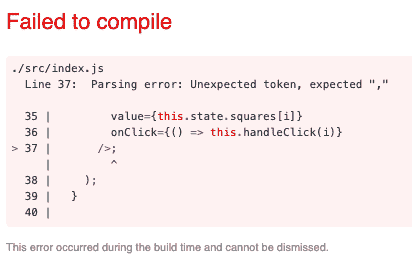](https://res.cloudinary.com/practicaldev/image/fetch/s--pUO7NjuP--/c_limit%2Cf_auto%2Cfl_progressive%2Cq_auto%2Cw_880/https://thepracticaldev.s3.amazonaws.com/i/p3qp9m98khh8soj8m3rd.png)

哎呀，错字了。让我来解决。

[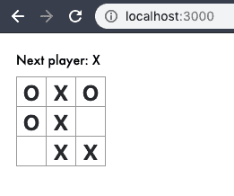](https://res.cloudinary.com/practicaldev/image/fetch/s--Q6E2sf7p--/c_limit%2Cf_auto%2Cfl_progressive%2Cq_auto%2Cw_880/https://thepracticaldev.s3.amazonaws.com/i/3rn93umm5f0hrljxduh8.png)

快到了。游戏仍然没有宣布赢家，正如你在上面看到的。我想这是下一步要做的事情，但在此之前，教程希望我们呈现一条消息，说明该轮到谁了。我们添加一行:

```
 const status = 'Next player: ' + (this.state.xIsNext ? 'X' : 'O'); 
```

Enter fullscreen mode Exit fullscreen mode

...到`Board`的`render()`功能的顶部(现在，它总是说`X`是下一个玩家):

[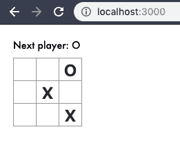](https://res.cloudinary.com/practicaldev/image/fetch/s--Tc9nfcxI--/c_limit%2Cf_auto%2Cfl_progressive%2Cq_auto%2Cw_880/https://thepracticaldev.s3.amazonaws.com/i/pjgke31o0jqb27kf560v.png)

我*刚刚也注意到*，当我编辑`index.js`文件时，React 自动在`localhost:3000`重新渲染页面。这真是太棒了！

好吧，最后一件事:我们如何宣布赢家？

> 我现在真的筋疲力尽了，所以我很高兴这一部分快结束了。

[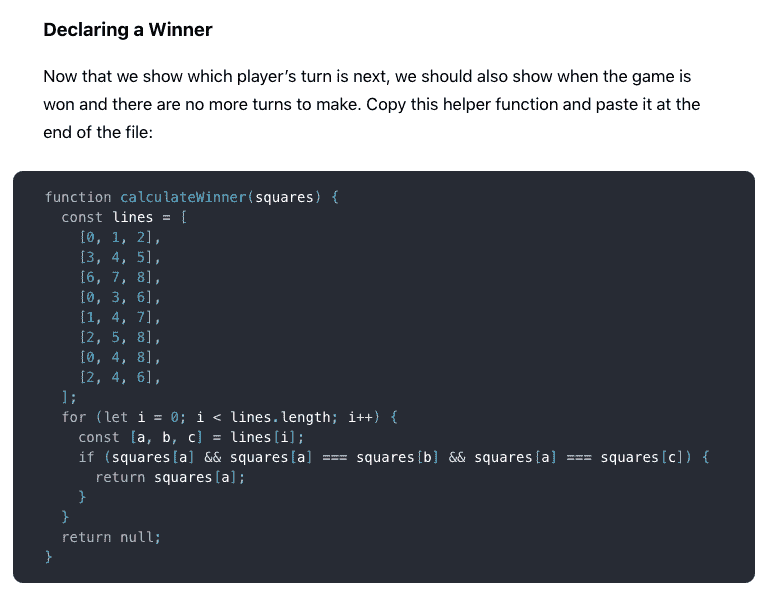](https://res.cloudinary.com/practicaldev/image/fetch/s--RssZLEDB--/c_limit%2Cf_auto%2Cfl_progressive%2Cq_auto%2Cw_880/https://thepracticaldev.s3.amazonaws.com/i/a9k82w1vhi7po79kx1l7.png)

肯定不是这个教程风格的粉丝。0/10.不推荐。

我更喜欢从最小的可理解的代码开始的教程，而不是从一个框架开始，然后一遍又一遍地说“好了，现在把这里的内容复制并粘贴到那里”。呃。

在盲目地复制了一些代码后...

[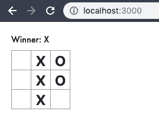](https://res.cloudinary.com/practicaldev/image/fetch/s--Et49idoz--/c_limit%2Cf_auto%2Cfl_progressive%2Cq_auto%2Cw_880/https://thepracticaldev.s3.amazonaws.com/i/9jepqqfwttp3jofwwdnl.png)

...有用！但是我对此并不高兴。

* * *

本教程还有一部分，但我严重缺乏完成它的动力。我想我会尝试一个不同的教程或书籍，从基础开始，并建立在它们之上。

我要在本教程进行到 75%的时候退出。我感到很沮丧，我觉得我并没有真正了解 React。也许 ReactJS.org 的人应该考虑为这个教程做一些焦点小组测试，因为我确信我不是唯一有这种反应的人。

在我之前的一篇帖子的评论中，Kay Pl cer 推荐了他们的书 [React From Zero](https://www.fullstackreact.com/react-from-zero/) ，这本书听起来可能更合我的胃口。我想在我花些时间从这次经历中恢复过来后，我会给 React 第二次机会。