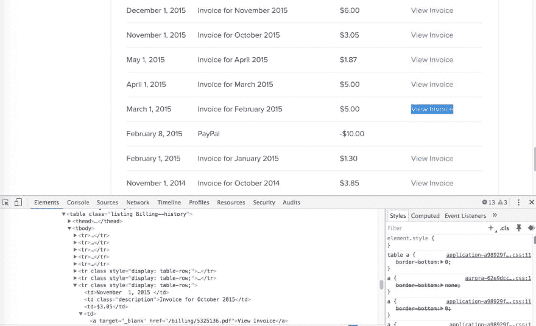

# Java 中的自动账单下载程序

> 原文：<https://dev.to/scrapingbee/an-automatic-bill-downloader-in-java-4277>

在这篇文章中，我将展示如何用 HtmlUnit 从网站下载账单(或任何其他文件)。

建议你先看看这些文章:【Java 网页抓取简介和[自动登录](https://www.scrapingbee.com/blog/how-to-log-in-to-almost-any-websites/)

因为我在数字海洋上主持这个博客(如果你通过这个链接注册，10 美元的信用)，我将展示如何写一个自动下载你所有账单的机器人。

### 登录

为了提交登录表单而不需要检查 dom，我们将使用我在上一篇文章中写的神奇方法。

然后我们要进入账单页面:`https://cloud.digitalocean.com/settings/billing`

```
String baseUrl = "https://cloud.digitalocean.com";
String login = "email";
String password = "password" ;

try {
    WebClient client = Authenticator.autoLogin(baseUrl + "/login", login, password);

    HtmlPage page = client.getPage("https://cloud.digitalocean.com/settings/billing");
    if(page.asText().contains("You need to sign in for access to this page")){
        throw new Exception(String.format("Error during login on %s , check your credentials", baseUrl));
    }
}catch (Exception e) {
    e.printStackTrace();
} 
```

### 提取账单

让我们创建一个名为 Bill 或 Invoice 的新类来表示账单:

```
 public class Bill {

    private String label ;
    private BigDecimal amount ; 
    private Date date;
    private String url ;
//... getters & setters
} 
```

现在我们需要检查 dom，看看如何提取每张账单的描述、金额、日期和 URL。打开您最喜欢的工具:

[](https://res.cloudinary.com/practicaldev/image/fetch/s--WX-OyIpJ--/c_limit%2Cf_auto%2Cfl_progressive%2Cq_auto%2Cw_880/https://www.scrapingbee.cimg/post/java-bill/bills_dom.jpg)

我们在这里很幸运，这是一个干净的大教堂，有一个漂亮的和结构良好的桌子。由于 HtmlUnit 有许多方法来处理 HTML 表格，我们将使用这些方法:

*   `HtmlTable`存储表格并对每一行进行迭代

*   `getCell`选择单元格

然后，使用 Jackson 库，我们将把 Bill 对象导出到 JSON 并打印出来。

```
HtmlTable billsTable = (HtmlTable) page.getFirstByXPath("//table[@class='listing Billing--history']");
for(HtmlTableRow row : billsTable.getBodies().get(0).getRows()){

    String label = row.getCell(1).asText();
    // We only want the invoice row, not the payment one
    if(!label.contains("Invoice")){
        continue ;
    }

    Date date = new SimpleDateFormat("MMMM d, yyyy", Locale.ENGLISH).parse(row.getCell(0).asText());
    BigDecimal amount =new BigDecimal(row.getCell(2).asText().replace("$", ""));
    String url = ((HtmlAnchor) row.getCell(3).getFirstChild()).getHrefAttribute();

    Bill bill = new Bill(label, amount, date, url);
    bills.add(bill);
    ObjectMapper mapper = new ObjectMapper();
    String jsonString = mapper.writeValueAsString(bill) ;

    System.out.println(jsonString); 
```

快完成了，最后一件事就是下载发票。这很简单，我们将使用`Page`对象来存储 pdf，并在其上调用一个`getContentAsStream`。在这样做的时候，最好检查文件是否有正确的内容类型(在我们的例子中是`application/pdf`)

```
Page invoicePdf = client.getPage(baseUrl + url);

if(invoicePdf.getWebResponse().getContentType().equals("application/pdf")){
    IOUtils.copy(invoicePdf.getWebResponse().getContentAsStream(), new FileOutputStream("DigitalOcean" + label + ".pdf"));
} 
```

就这样，这里是输出:

```
{"label":"Invoice for December 2015","amount":0.35,"date":1451602800000,"url":"/billing/XXXXX.pdf"}  {"label":"Invoice for November 2015","amount":6.00,"date":1448924400000,"url":"/billing/XXXX.pdf"}  {"label":"Invoice for October 2015","amount":3.05,"date":1446332400000,"url":"/billing/XXXXX.pdf"}  {"label":"Invoice for April 2015","amount":1.87,"date":1430431200000,"url":"/billing/XXXXX.pdf"}  {"label":"Invoice for March 2015","amount":5.00,"date":1427839200000,"url":"/billing/XXXXX.pdf"}  {"label":"Invoice for February 2015","amount":5.00,"date":1425164400000,"url":"/billing/XXXXX.pdf"}  {"label":"Invoice for January 2015","amount":1.30,"date":1422745200000,"url":"/billing/XXXXXX.pdf"}  {"label":"Invoice for October 2014","amount":3.85,"date":1414796400000,"url":"/billing/XXXXXX.pdf"} 
```

像往常一样，你可以在这个 [Github Repo](https://github.com/ksahin/introWebScraping) 上找到完整的代码

如果你喜欢网络抓取并且厌倦了代理、JS 渲染和验证码，你可以检查我们新的[网络抓取 API](https://www.scrapingbee.com) ，第一批 1000 个 API 调用由我们负责。*