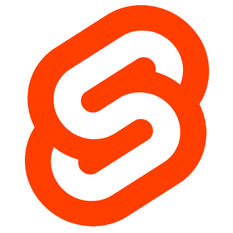

# 苗条的表情词典

> 原文：<https://dev.to/bryce/an-emoji-dictionary-in-svelte-be9>

作为🅱️表情符号的狂热用户，我从表情符号字母表中的几个字母字符中获得了(太多)快乐。

但是我们可以做的不仅仅是用🅱️来代替`b`；我想知道很多单词可以完全用表情符号写成*。让我们来了解一下！*

 *[](https://i.giphy.com/media/l2Je66zG6mAAZxgqI/giphy.gif)

首先，我找到了一本[(英语)字典](https://github.com/dwyl/english-words)，写了一个快速的&脏[锈脚本](https://github.com/brycedorn/emoji-dict/blob/master/src/main.rs)来生成单词。仅仅列出单词并不有趣，它需要交互性！我选择了[苗条的](https://svelte.dev/)来体验它的开发体验(相当不错！)和性能。

<figure>

首先，我用[苗条加载器](https://github.com/sveltejs/svelte-loader)和三个文件做了一个基本的 webpack 配置:

<figcaption>Note: if you want to skip to the end, the source is [here.](https://github.com/brycedorn/emoji-dict/tree/master/web)</figcaption>

</figure>

*   `index.html`，带有一个`<body>`，苗条的应用程序将被安装到那里(就像`ReactDOM`)
*   `main.js`，app 挂载的地方&通过道具
*   `App.svelte`，为元件&的过滤逻辑

* * *

[](https://res.cloudinary.com/practicaldev/image/fetch/s--lDR7Qlyi--/c_limit%2Cf_auto%2Cfl_progressive%2Cq_auto%2Cw_880/https://thepracticaldev.s3.amazonaws.com/i/atloi9557ivpk64uvphk.png)

# JavaScript

在`main.js`中，单词被导入并为组件准备:

```
import words from 'output.txt';

// Associate letters & sequences with their 
// emoji equivalents
const emojiHash = {
    "id": "🆔",
    "a": "🅰️",
        ...
    "soon": "🔜"
};

// Replace the letters/sequences in a string as 
// their respective emoji
const convertToEmoji = (word) => {
    let emojified = String(word);
    regexKeys.forEach((key, i) => {
        emojified = emojified.replace(key, emojiHash[sortedKeys[i]];
    }));
    return emojified;
};

// Render letters/sequences as emoji by running 
// the above function until there are no letters
// remaining
function emojify(word) {
    let emojified = String(word);
    do {
        emojified = convertToEmoji(emojified);
    } while (emojified.split('').some(e => /^[a-zA-Z]+$/.test(e)));
    return emojified;
}; 
```

Enter fullscreen mode Exit fullscreen mode

然后组件被挂载到 DOM:

```
const app = new App({
    target: document.body,
    props: {
        emoji: Object.values(emojiHash),
        sort: 'default',
        words: words.split('\n').map(emojify)
    }
}); 
```

Enter fullscreen mode Exit fullscreen mode

* * *

[](https://res.cloudinary.com/practicaldev/image/fetch/s--pf-5vyuj--/c_limit%2Cf_auto%2Cfl_progressive%2Cq_auto%2Cw_880/https://thepracticaldev.s3.amazonaws.com/i/ji7zisis4c0f4ce2cer1.png)

# 身材苗条

太好了！现在我们已经将格式化的数据输入到组件中，让我们对它做一些事情。

文件是带有一些语法糖的 HTML 文件。基本结构如下:

```
<script>
  // Functions, variables
  export let words;

  function clicky(e) {
    console.log(e.target.innerText);
  }
</script>

<!-- Any styles associated with the component -->
<style>
  .container { 
    background: palevioletred; 
  }
</style>

<!-- The rendered markup -->
<div class="container">
  <ul>
    {#each words as word}
      <li>
        <p on:click={clicky}>
          {word}
        </p>
      </li>
    {/each}
  </ul>
</div> 
```

Enter fullscreen mode Exit fullscreen mode

🎉哒哒！🎉用苗条渲染的单词列表！注意，因为`words`是作为一个属性被传入的，所以需要`export`关键字。

为了简洁起见，我将简单介绍一下添加过滤(如果你想看的话，排序在 [repo](https://github.com/brycedorn/emoji-dict/blob/master/web/App.svelte#L39) 中)。

[](https://res.cloudinary.com/practicaldev/image/fetch/s--Y_mTLm6b--/c_limit%2Cf_auto%2Cfl_progressive%2Cq_auto%2Cw_880/https://thepracticaldev.s3.amazonaws.com/i/ypaz2g1ztab0cya0dor0.png)

在组件的某个地方，让我们为每个表情符号呈现一个复选框列表:

```
Filter:
{#each emoji as moji}
  <label>
    <input on:change={handleFilterClick} type="checkbox" checked={!filteredEmoji.includes(moji)} value={moji}>
    <span>{moji}</span>
  </label>
{/each} 
```

Enter fullscreen mode Exit fullscreen mode

因为我们通过`words`变量呈现列表，所以我们需要更新它来反映过滤器。

```
<script>
  export let words;

  // Keep an immutable version of words in memory
  export let wordsImm = Array.from(words);

  function handleFilterClick(e) {
    const { checked, value } = e.target;

    // Keep immutable version of original prop & make a copy 
    // to apply filters to
    let wordsMut = Array.from(wordsImm);

    // Either add or remove the current emoji from the filters
    if (checked) {
      filteredEmoji.splice(filteredEmoji.indexOf(value), 1);
    } else {
      filteredEmoji.push(value);
    }

    // If there are filters, apply them to list of words
    if (filteredEmoji.length > 0) {
      filteredEmoji.forEach(emoji => {
        wordsMut = wordsMut.filter(word => !word.includes(emoji));
      });
    }

    // Set variable to new list
    words = wordsMut;
  }
</script> 
```

Enter fullscreen mode Exit fullscreen mode

<figure>

当`words`在选择一个过滤器后被更新为过滤(变异)版本时，将触发更新，DOM 将呈现新的列表。

<figcaption>Side-note: this could be refactored to have the filtering in the `{each}`, (preventing the need to update `words`) but I wanted to render the number of words in a different part of the component.</figcaption>

</figure>

# 最后的想法

苗条又好又快！我计划再次使用它，最理想的是在资源密集型/视觉要求更高的情况下，真正将它推向极限(超出 React 会出现问题的范围)。

一旦框架更加成熟，我还想看看如何使用 [Sapper](https://github.com/sveltejs/sapper) 来完成一个更大的项目。

去这里玩吧！[https://bryce.io/emoji-dict](https://bryce.io/emoji-dict)

在 Github 上查看[源。](https://github.com/brycedorn/emoji-dict)*