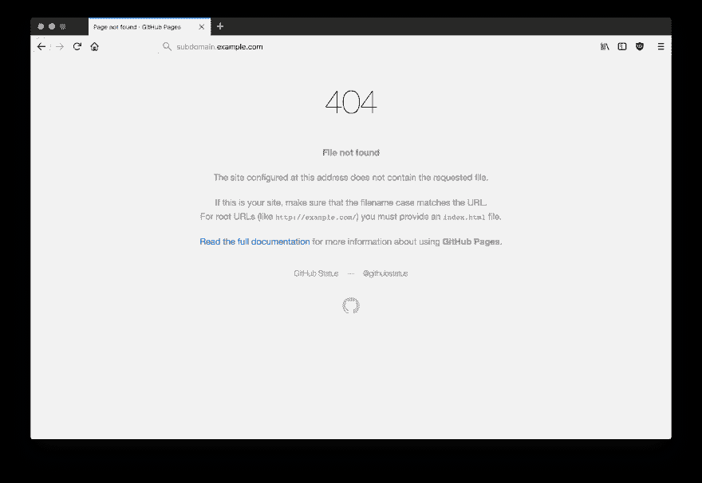

# 分析和防止子域名接管:真正的风险？原因？

> 原文：<https://dev.to/payloadartist/analyzing-and-preventing-sub-domain-takeovers-real-risks-causes-1pg3>

# 0x00 -简介和原因

子域接管形成了一类常见的漏洞，在这类漏洞中，开发人员将指向退役服务的未使用的子域保持原样。开发者通常使用 *SaaS 和 PaaS* 服务，这些服务允许他们通过自己的子域访问该服务。但是，当他们停止这项服务并且不删除 DNS 记录时，如果服务提供商(DNS 记录指向的人)处理不当，这可能会成为一个重大问题。

## 0x01 -是什么...？它们如何影响你？

当子域(subdomain.example.com)指向服务(如 GitHub pages、Heroku 等)时，会出现子域接管漏洞。)已被移除或删除。这使得攻击者能够在正在使用的服务上设置页面，并将其页面指向该子域。例如，如果 subdomain.example.com 指向一个 GitHub 页面，用户决定删除他们的 GitHub 页面，攻击者现在可以创建一个 GitHub 页面，添加一个包含 subdomain.example.com 的 CNAME 文件，并声称 subdomain.example.com。

### 发现它们很容易！

 
*404 页可以给你一个提示*

此类子域上的 404 错误可能是一个提示，即不再存在的服务如果被接管，实际上可能会对您的组织构成威胁。

这不仅会发生在你公司的 GitHub 托管页面上，也会发生在亚马逊 S3 存储桶上，这些存储桶已经不再使用，但仍有一个子域指向它。

因此，攻击者可以利用这些过时的 DNS 记录，在这些平台/服务上注册，并在那里建立自己的页面。

这导致了

*   网络钓鱼。
*   某些情况下的直接账户接管
*   商业信誉受损。
*   劫持仍然服务于 CSS、JS 的旧 cdn 到一个主应用。

## 0x02 -作为攻击者增加更多影响

除了常规的网络钓鱼攻击之外，在某些情况下，cookies 的作用范围可能是所有子域，或者易被接管的特定子域可能会被攻击者通过 **XSS** 和其他客户端攻击媒介窃取。

### 影响——我们来看一个真实世界的案例！

*   [微软 Live Tiles 子域接管！](https://portswigger.net/daily-swig/dead-windows-live-tiles-regain-new-life-in-subdomain-takeover)
*   优步，星巴克等等，都是这次攻击的受害者，但是这些案例都通过他们的漏洞悬赏计划得到了负责任的报道

## 0x03 -更多资源

awesome Ed 创建了一个 GitHub 存储库，用于跟踪易受此类接管攻击的服务。这对于关心这些事情的进攻性测试和防御性开发人员都是有益的，

[在这里查看 can-I-接管-xyz，了解更多关于子域接管的信息，以及哪些服务可能容易受到这种情况的影响。](https://github.com/EdOverflow/can-i-take-over-xyz/blob/master/README.md)

发现错别字/我漏掉的东西？HMU，让我们把这篇文章写得更完整些！