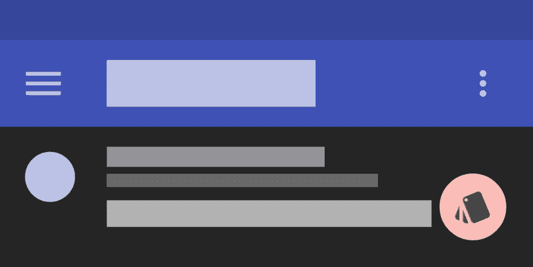

# Android —从视图创建位图

> 原文：<https://dev.to/pranavpandey/android-create-bitmap-from-a-view-3lck>

[](https://res.cloudinary.com/practicaldev/image/fetch/s--XbZtRxeI--/c_limit%2Cf_auto%2Cfl_progressive%2Cq_auto%2Cw_880/https://thepracticaldev.s3.amazonaws.com/i/mzpopz0td65gv5wkq60y.png)

大家好！这是我的第一个编程教程，我将在其中讨论如何在运行时从视图中创建位图。

## 背景

我有一个 Android 的应用程序，用户可以根据自己的要求定制所有的主题颜色。他们还可以以 JSON 的形式复制或共享他们的主题，可以导入 JSON 以实现完全相同的外观，也可以在其他设备之间共享。

最近，我决定从主题预览中生成一张图片，用户可以和 JSON 一起分享，以便在导入之前对主题有所了解。在应用之前，应用内预览已经显示了主题，但我想为社交媒体和其他社区上共享的帖子提供类似的功能。

## 实现

### ~~view . getdrawingccache()~~

最初，我尝试使用视图绘图缓存。虽然，它工作得很好，但大多数与绘图缓存相关的方法在 Android 9 (API 28)中被[否决](https://developer.android.com/reference/android/view/View.html#getDrawingCache())。请检查下面被否决的代码:

```
 /**
     * Creates a bitmap from the supplied view.
     *
     * @param view The view to get the bitmap.
     * @param width The width for the bitmap.
     * @param height The height for the bitmap.
     *
     * @return The bitmap from the supplied drawable.
     */
    public @NonNull static Bitmap createBitmapFromView(@NonNull View view, int width, int height) {
        if (width > 0 && height > 0) {
            view.measure(View.MeasureSpec.makeMeasureSpec(DynamicUnitUtils
                            .convertDpToPixels(width), View.MeasureSpec.EXACTLY),
                    View.MeasureSpec.makeMeasureSpec(DynamicUnitUtils
                            .convertDpToPixels(height), View.MeasureSpec.EXACTLY));
        }

        view.layout(0, 0, view.getMeasuredWidth(), view.getMeasuredHeight());
        view.setDrawingCacheEnabled(true);
        view.buildDrawingCache(true);
        Bitmap bitmap = Bitmap.createBitmap(view.getDrawingCache());
        view.setDrawingCacheEnabled(false);

        return bitmap;
    } 
```

### 画布

由于绘图缓存 API 已被弃用，我发现我们可以通过使用 [Canvas](https://developer.android.com/reference/android/graphics/Canvas) API 来实现类似的结果。请检查下面的新代码:

```
 /**
     * Creates a bitmap from the supplied view.
     *
     * @param view The view to get the bitmap.
     * @param width The width for the bitmap.
     * @param height The height for the bitmap.
     *
     * @return The bitmap from the supplied drawable.
     */
    public @NonNull static Bitmap createBitmapFromView(@NonNull View view, int width, int height) {
        if (width > 0 && height > 0) {
            view.measure(View.MeasureSpec.makeMeasureSpec(DynamicUnitUtils
                            .convertDpToPixels(width), View.MeasureSpec.EXACTLY),
                    View.MeasureSpec.makeMeasureSpec(DynamicUnitUtils
                            .convertDpToPixels(height), View.MeasureSpec.EXACTLY));
        }
        view.layout(0, 0, view.getMeasuredWidth(), view.getMeasuredHeight());

        Bitmap bitmap = Bitmap.createBitmap(view.getMeasuredWidth(),
                view.getMeasuredHeight(), Bitmap.Config.ARGB_8888);
        Canvas canvas = new Canvas(bitmap);
        Drawable background = view.getBackground();

        if (background != null) {
            background.draw(canvas);
        }
        view.draw(canvas);

        return bitmap;
    } 
```

> 传递**高度**或**宽度**的`0`以使用当前视图尺寸。
> 你可以在这里查看`DynamicUnitUtils.convertDpToPixels(float)`方法[的代码。](https://github.com/pranavpandey/dynamic-utils/blob/df2fa843cd1ed0b9fd7c80e236bc99a40d546bba/dynamic-utils/src/main/java/com/pranavpandey/android/dynamic/utils/DynamicUnitUtils.java#L34)

这两种方法的输出是相似的，但是建议使用 canvas API，因为视图绘制缓存方法可能在 Android 的未来版本中不工作。

[](https://res.cloudinary.com/practicaldev/image/fetch/s--oK8GU3aA--/c_limit%2Cf_auto%2Cfl_progressive%2Cq_auto%2Cw_880/https://thepracticaldev.s3.amazonaws.com/i/zv2rucou1m04laikj0d4.png)

### 像素复制

还有另一个用于 Android 7.0 (API 24+)或更高版本设备的 API，您可以使用它来截图 UI。对我来说似乎很复杂，我还没有尝试过。你可以在这里查看官方文档[。](https://developer.android.com/reference/android/view/PixelCopy.html)

## 动态效用

我创建了一个类似的与颜色、设备、绘图、包、任务、SDK 等相关的实用方法的库。您可以用它来执行各种运行时(动态)操作。请访问 GitHub 页面了解更多信息。

##  [普拉纳潘迪](https://github.com/pranavpandey) / [动态效用](https://github.com/pranavpandey/dynamic-utils)

### 在 Android 上执行动态操作的实用函数。

<article class="markdown-body entry-content p-5" itemprop="text">

[](https://raw.githubusercontent.com/pranavpandey/dynamic-utils/master/graphics/dynamic-utils.png)

# 动态效用

[](https://www.apache.org/licenses/LICENSE-2.0.html)[](https://travis-ci.org/pranavpandey/dynamic-utils)[](https://bintray.com/pranavpandey/android/dynamic-utils/_latestVersion)

在 Android 2.3 (API 9)及以上设备上执行包括颜色、设备、可绘制包、任务、sdk 等各种操作的静态方法集合。

> 从 v0.4.0 开始，它使用 [26.x.x 支持库](https://developer.android.com/topic/libraries/support-library/revisions.html#26-0-0)所以，最低 SDK 将是 Android 4.0 (API 14)
> 从 v2.0.0 开始，它使用 [AndroidX](https://developer.android.com/jetpack/androidx/) 所以，首先[将](https://developer.android.com/jetpack/androidx/migrate)你的项目迁移到 AndroidX。

* * *

## 内容

*   [安装](https://github.com/pranavpandey/dynamic-utils#installation)
*   [用途](https://github.com/pranavpandey/dynamic-utils#usage)
    *   [动态变化](https://github.com/pranavpandey/dynamic-utils#dynamicanimutils)
    *   [dynamic cbitbitmap 风格](https://github.com/pranavpandey/dynamic-utils#dynamicbitmaputils)
    *   [动态颜色工具](https://github.com/pranavpandey/dynamic-utils#dynamiccolorutils)
    *   动态 cdevils
    *   [DynamicDrawableUtils](https://github.com/pranavpandey/dynamic-utils#dynamicdrawableutils)
    *   [动态工具](https://github.com/pranavpandey/dynamic-utils#dynamiclinkutils)
    *   [DynamicPackageUtils](https://github.com/pranavpandey/dynamic-utils#dynamicpackageutils)
    *   [动态 skUtils](https://github.com/pranavpandey/dynamic-utils#dynamictaskutils)
    *   [动态结构](https://github.com/pranavpandey/dynamic-utils#dynamicwindowutils)
    *   [dynamiccsdkutils](https://github.com/pranavpandey/dynamic-utils#dynamicsdkutils)
    *   [动态视图工具](https://github.com/pranavpandey/dynamic-utils#dynamicviewutils)
    *   [动态窗口详细信息](https://github.com/pranavpandey/dynamic-utils#dynamicwindowutils)
*   [执照](https://github.com/pranavpandey/dynamic-utils#license)

* * *

## 装置

它可以通过将以下依赖项添加到您的`build.gradle`文件来安装:

```
dependencies {
    // For AndroidX enabled projects.
    implementation 'com.pranavpandey.android:dynamic-utils:3.0.2'
    // For legacy projects.
    implementation 'com.pranavpandey.android:dynamic-utils:1.3.0'
}
```

* * *

## 使用

为了便于理解和使用，根据类别将其分为不同的类。这个库是完全注释的，所以我在下面强调了一些功能，继续探索更多隐藏的功能。

> 如需完整参考，请阅读[文档](https://pranavpandey.github.io/dynamic-utils)。

### 动态 mUtils

…

</article>

[View on GitHub](https://github.com/pranavpandey/dynamic-utils)

这是我第一次尝试写博客，所以我会在以后的文章中不断改进。请评论给出建议，以及希望在以后的帖子中看到的内容。感谢您的宝贵时间！