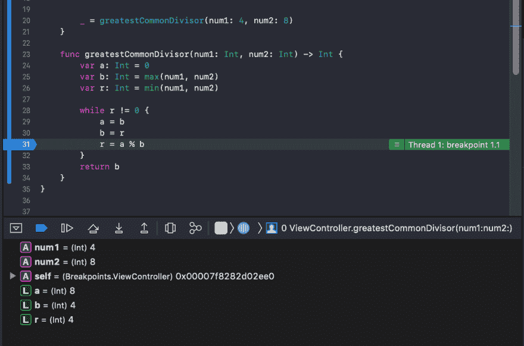
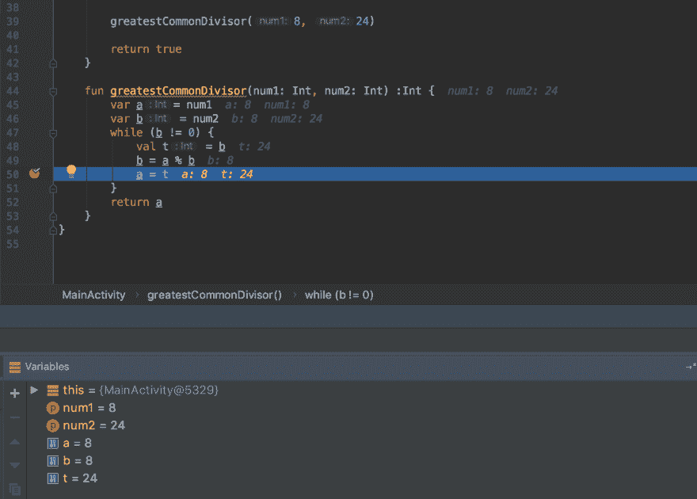
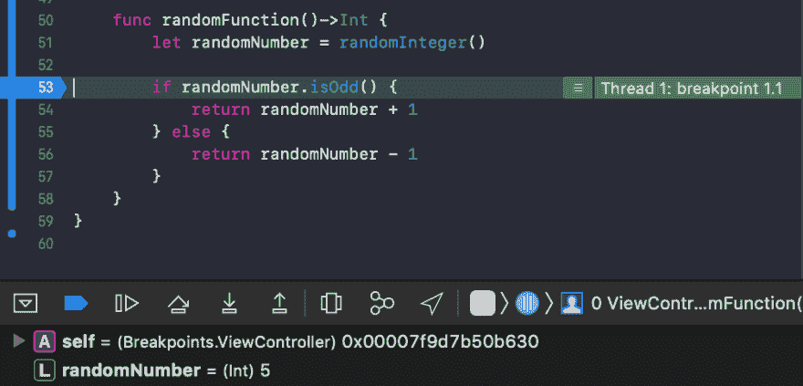
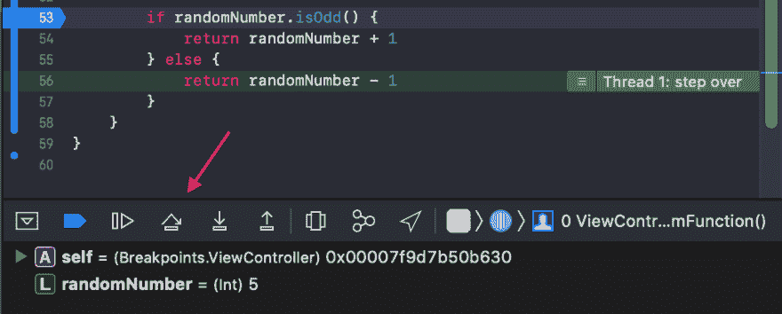

# 带断点的 Android Studio 和 Xcode 应用程序调试:如何从零开始

> 原文：<https://dev.to/bugfenderapp/android-studio-and-xcode-app-debugging-with-breakpoints-how-to-from-zero-2d9p>

为了开始我们的软件开发人员调试系列，我们告诉你如何使用 Xcode 和 Android Studio 一步一步地构建断点，以隔离关于应用性能的关键信息，并在此过程中节省关键时间。

**等级:**初学者

**平台:** iOS/Android

**阅读时间:** 10 分钟

## **好的首先，iOS 和 Android 生态系统上的断点是什么？**

为了回答这个问题，让我们来一次小小的回忆之旅。

在我的第一个计算机编程教程中(非常有想象力地称为*编程入门*，我们用 **Pascal** 编写了一个算法来执行一系列简单的操作，比如将两个数字的和打印到控制台。

一旦写好，我们就按下执行键，等待结果。结果是这样的:

`var
num1, num2: Integer;
begin
// A simple program for adding two numbers.
WriteLn('The result is: ', num1 + num2);
end.`

很快，一些问题开始在我脑海中萦绕(不仅仅是关于为什么导师让我们使用一种 40 年前用来编写苹果 II 的编程语言)。

随着算法变得越来越复杂，并开始计算像[最大公约数](https://brilliant.org/wiki/greatest-common-divisor/)这样的东西，我开始得到意想不到的结果。控制台的输出开始变得不正确。

然后我突然想到。我在写我的第一个 bug。

那时我几乎不知道“调试”这个词是什么意思，所以我做了所有程序员都会做的事情。我在我的代码中添加了一些日志来理解正在发生的事情(又名 *Writeln()* )。

我的控制台的输出现在类似于:

 `$ Now I'm in the iteration 3 of the while loop
$ Var num1 has value: 7
$ Var num2 has value: 15` 

写这些日志有助于理解程序执行的当前状态并发现错误。然而，这并不实用。例如，如果你忘记打印变量的结果，你就需要重写、重新编译和重新运行程序。

如果能暂停程序执行，打印出所有变量的值，岂不是很神奇？嗯，原来已经有人想到这个了。

这正是断点的含义。由于断点的奇迹，应用程序开发人员可以在他们的程序中找到一个特定的点，并告诉他们的 IDE“在这里暂停程序，并捕捉每个变量的值”。

注意:如果你在你的设备上使用 USB 调试，或者在你的手机、ipad、平板电脑等上使用远程调试，这同样适用。

这里有一个来自 [Xcode](https://developer.apple.com/xcode/) 的例子。

在这里，您可以看到 Xcode 已经暂停了第 31 行的执行，并且在下方的窗格中，您可以检查存储值的列表。

(在这一点上，值得一提的是，不管断点如何，您仍然应该有一个好的日志记录策略。不要担心，我们将在以后的章节中讨论这一点)。

## 调试安卓和 iPhone 的 app

### **如何在 Android Studio 和 XCode 上设置断点**

好了，现在让我们创建第一个断点。Xcode 和 [Android Studio](https://developer.android.com/studio) 都提供了惊人的入门选项；其实他们的调试器本质上是一样的。

调试器允许移动应用程序开发人员实时检查变量，并执行更复杂的操作，如计算表达式、在执行过程中修改值，以及一步一步地遵循执行流程。

要设置断点，只需在 Xcode 或 Android Studio 中打开一个项目，然后单击代码行号旁边的 close。

Xcode 里就是这个样子。您将看到一个蓝色箭头出现，表示执行将在到达该点时暂停。

在 Android Studio 中，你可以做完全一样的事情，但是默认情况下调试器不会工作。您需要按下右边的按钮，这显示了一个小错误，而不是左边的“播放按钮”，以确保您正在连接调试器。

结果将与 Xcode 中的结果非常相似。一旦到达您标记的点，程序将停止执行，您将能够检查所有变量的值。

### **遵循程序流程**

如今，每当到达断点时，每个调试器都会暂停来检查程序状态:这是一个基本的通用工具。但是还有一个程序员觉得非常有用的特性。被称为**步。**

一旦暂停了程序的执行并检查了所有变量，您可能想知道继续执行时会发生什么。如果你正在使用 React Native、Xamarin、Unity 或 Ionic 等软件，其行为是相似的。

我们举个例子。假设您正在构建您的应用程序，您需要调试这段代码，它接受一个随机整数，并根据该值是奇数还是偶数返回不同的数字。

这段代码返回了意外的结果，所以您通过在第 53 行设置一个断点来启动调试会话，以检查随机整数是否正确返回。

现在你知道了 *randomNumber* 的值为 5，你可能想确保你的程序继续执行到后面的‘if-else’的‘if’语句中。

为此，您可以在第 54 行和第 56 行设置新的断点，继续执行并再次检查这些值。

但是有更有效的方法。调试器允许你一步一步地“导航”程序的执行。

只需按下**步过**按钮，并检查您的执行如何前进到将被执行的下一行。

这就是你在 Xcode 中的做法。

出乎意料的是，代码一直延续到' else '函数中，这表明函数“ *isOdd()* ”包含一个 bug。

这个例子对于一个“if-else”条件来说似乎很琐碎。但是想象一个有 30 个选项的“switch”句子或者一个“if-elseif-elseif-…-else”链。你不想设置 30 个断点或条件断点。

但是还有更多。

Xcode/Android Studio 调试器不仅仅允许你进入下一行。你也可以进入一个函数内部，**单步执行**，或者前进到当前方法之外的下一行，**单步执行。**或者你可以直接使用 Xcode 调试器命令或者 Android Studio LLDB。

如果你像大多数开发人员一样，你可能在争分夺秒地工作(每天发布的应用程序数量[、紧迫的期限是编码生活中的事实)。但仍然值得在 Xcode 和 Android Studio 中使用这些窗格并进行试验。他们看起来一样，他们是一样的。一旦你掌握了调试器的这些非常基本的功能，你会惊讶地发现你节省了多少时间。](https://www.statista.com/statistics/276703/android-app-releases-worldwide/)

## **接下来是什么？**

好了，我们的入门断点教程到此结束。但是别担心，还有很多等着你呢。检查一段代码只是调试器最基本的用途。你能做的还有很多。

在下一章中，我们将继续讨论断点，但我们也将沉浸在一个全新的世界中。我们将在条件发生时暂停代码的执行，在执行过程中更改变量的值，在调用内部类的方法时触发断点，将调试器附加到 android 进程以及 iOS 和 Android 远程设备调试。

回头见。调试愉快！