# Angular 8 + Spring Boot 2.2:立即构建 CRUD 应用程序！

> 原文：<https://dev.to/oktadev/angular-8-spring-boot-2-2-build-a-crud-app-today-3n98>

如果您是一名超过 15 年的 Java 开发人员，您可能还记得 Java web 框架泛滥的时代。它始于 Struts 和 WebWork。然后 Tapestry、Wicket 和 JSF 出现了，并支持基于组件的框架的思想。Spring MVC 发布于 2004 年(与 Flex 1.0 和 JSF 1.0 在同一个月)，并在接下来的六年中成为 Java web 框架中事实上的标准。

然后 AngularJS 出现了，每个人都开始将他们的 UI 架构转移到 JavaScript。Angular 2 是在 2014 年 Spring Boot 首次亮相的同时宣布的，它花了几年时间才被发布、固化并成为一个可行的选择。这些天，我们称之为角，没有版本号。最近几个版本相当稳定，主要版本之间的升级路径很平滑。

今天，我想向你展示如何用最新最好的 Angular 和 Spring Boot 版本来构建一个应用程序。Angular 8 和 Spring Boot 2.2 都有性能改进，让你的开发者生活更美好。

## Angular 8 有什么新功能？

Angular 8 增加了差分加载、可选的 Ivy 渲染器和作为构建选项的 Bazel。差异加载是指 CLI 构建两个独立的包，作为部署的应用程序的一部分。现代捆绑包是为 evergreen 浏览器提供的，而遗留捆绑包包含了旧浏览器所需的所有 polyfills。

[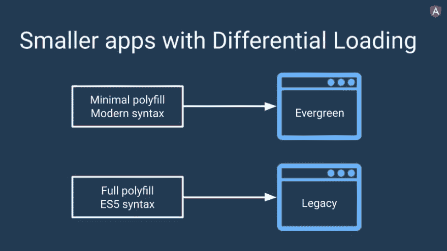](https://res.cloudinary.com/practicaldev/image/fetch/s--jabdT5HP--/c_limit%2Cf_auto%2Cfl_progressive%2Cq_auto%2Cw_880/https://developer.okta.com/assets-jekyll/blog/spring-boot-2-angular-8/differential-loading-slide-96a8f9e28945254efff078756aa5eb95cecd138e7e5d702253160bd968d98c77.jpg)

Ivy 渲染器更小、更快、调试更简单，改进了类型检查，最重要的是向后兼容。

[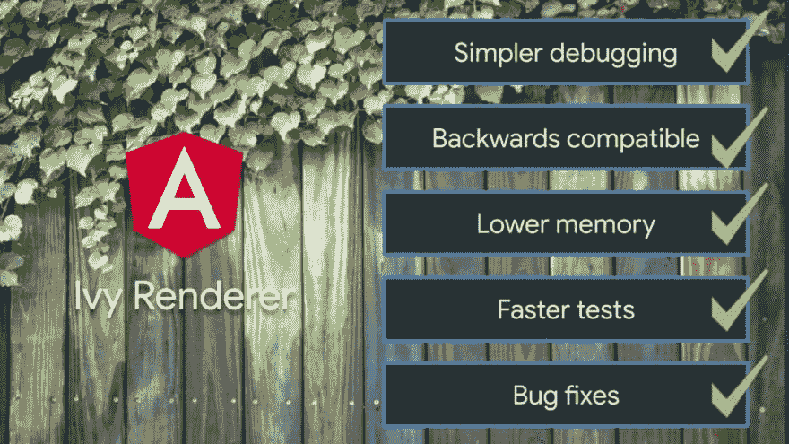](https://res.cloudinary.com/practicaldev/image/fetch/s--CNJGVoUq--/c_limit%2Cf_auto%2Cfl_progressive%2Cq_auto%2Cw_880/https://developer.okta.com/assets-jekyll/blog/spring-boot-2-angular-8/ivy-renderer-slide-e3709642c18741f12cc464edb50cffc6c9a09f28e7247e1b23008bc078d37993.jpg)

*以上两张幻灯片均来自 ng-conf 2019 的 [Day 1 主题演讲。你可以在 YouTube](https://docs.google.com/presentation/d/19yTRqHT1v4SQz5kXCL6OrIWvH9M20029s_ri5Eil03Y/edit?usp=sharing) 上观看主题演讲。*

## Spring Boot 2.2 有什么新功能？

Spring Boot 感受到了 Micronaut 和 Quarkus 等快速启动框架的压力，也做了许多性能改进。默认情况下，JMX 是禁用的，Hibernate 的实体扫描是禁用的，beans 的延迟初始化是启用的。此外，通过使用 Spring Boot 的`@Configuration`类中的`proxyBeanMethods=false`减少了启动时间和内存使用。更多信息参见 [Spring Boot 2.2 发行说明](https://github.com/spring-projects/spring-boot/wiki/Spring-Boot-2.2-Release-Notes)。

如果你还停留在这些框架的老版本上，你可能想看看我以前的几篇文章:

*   [用 Angular 7.0 和 Spring Boot 2.1 构建一个基本的 CRUD 应用](https://dev.to/blog/2018/08/22/basic-crud-angular-7-and-spring-boot-2)
*   [用 Angular 5.0 和 Spring Boot 2.0 构建一个基本的 CRUD 应用](https://dev.to/blog/2017/12/04/basic-crud-angular-and-spring-boot)

这篇文章描述了如何构建一个简单的 CRUD 应用程序来显示酷车列表。它将允许你编辑汽车，并且它将显示来自 [GIPHY](http://giphy.com) 的与汽车名称匹配的动画 gif。您还将了解如何使用 Okta 的 Spring Boot 启动器和 Angular SDK 来保护您的应用程序。下面是应用程序完成时的截图。

[](https://res.cloudinary.com/practicaldev/image/fetch/s--v6EnVgCV--/c_limit%2Cf_auto%2Cfl_progressive%2Cq_auto%2Cw_880/https://developer.okta.com/assets-jekyll/blog/spring-boot-2-angular-8/success-at-last-2af183fc8fdb5605a64c2f3b91a0dfed5dd6b3a3fb2636ea0d54177ab0e8f82b.png)

你需要安装 [Java 11](https://adoptopenjdk.net/) 和 [Node.js 10+](https://nodejs.org/) 来完成本教程。

## 用 Spring Boot 2.2 构建一个 API

要开始使用 [Spring Boot](https://projects.spring.io/spring-boot/) 2.2，请前往 [start.spring.io](https://start.spring.io) 并创建一个新项目，该项目使用 Java 11(在更多选项下)、Spring Boot 2 . 2 . 0 版 M2 和依赖项来创建一个安全的 API: JPA、H2、Rest Repositories、Lombok、Okta 和 Web。

[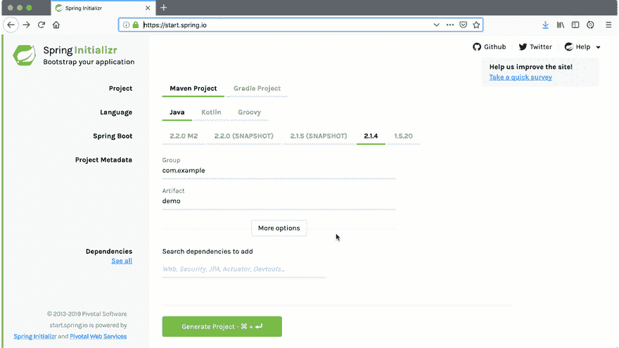](https://res.cloudinary.com/practicaldev/image/fetch/s--BE0bRMwG--/c_limit%2Cf_auto%2Cfl_progressive%2Cq_66%2Cw_880/https://developer.okta.com/assets-jekyll/blog/spring-boot-2-angular-8/start.spring.io-391bddebe50e713866cf678e57cf55c5c3e1e02cfc83b79e2cd584568962172a.gif)

创建一个目录来存放您的服务器和客户端应用程序。我把我的叫做`okta-spring-boot-2-angular-8-example`，但是你可以随便叫你的。

> 如果你更希望看到应用程序运行而不是编写代码，你可以[在 GitHub](https://github.com/oktadeveloper/okta-spring-boot-2-angular-8-example) 上看到例子，或者使用下面的命令克隆并在本地运行。
> 
> ```
> git clone https://github.com/oktadeveloper/okta-spring-boot-2-angular-8-example.git
> cd okta-spring-boot-2-angular-8-example/client
> npm install ng serve &
> cd ../server
> ./mvnw spring-boot:run 
> ```

从 start.spring.io 下载`demo.zip`后，将其展开，将`demo`目录复制到你的 app-holder 目录。将`demo`更名为`server`。打开`server/pom.xml`，注释掉对 Okta 的 Spring Boot 首发的依赖。

```
<!--dependency>
    <groupId>com.okta.spring</groupId>
    <artifactId>okta-spring-boot-starter</artifactId>
    <version>1.1.0</version>
</dependency--> 
```

在您喜欢的 IDE 中打开项目，并在`src/main/java/com/okta/developer/demo`目录中创建一个`Car.java`类。您可以使用 Lombok 的注释来减少样板代码。

```
package com.okta.developer.demo;

import lombok.*;

import javax.persistence.Id;
import javax.persistence.GeneratedValue;
import javax.persistence.Entity;

@Entity
@Data
@NoArgsConstructor
public class Car {
    @Id @GeneratedValue
    private Long id;
    private @NonNull String name;
} 
```

创建一个`CarRepository`类来对`Car`实体执行 CRUD(创建、读取、更新和删除)。

```
package com.okta.developer.demo;

import org.springframework.data.jpa.repository.JpaRepository;
import org.springframework.data.rest.core.annotation.RepositoryRestResource;

@RepositoryRestResource
interface CarRepository extends JpaRepository<Car, Long> {
} 
```

向`DemoApplication`类(在`src/main/java/com/okta/developer/demo/DemoApplication.java`中)添加一个`ApplicationRunner` bean，并使用它向数据库添加一些默认数据。

```
package com.okta.developer.demo;

import org.springframework.boot.ApplicationRunner;
import org.springframework.boot.SpringApplication;
import org.springframework.boot.autoconfigure.SpringBootApplication;
import org.springframework.context.annotation.Bean;
import java.util.stream.Stream;

@SpringBootApplication
public class DemoApplication {

    public static void main(String[] args) {
        SpringApplication.run(DemoApplication.class, args);
    }

    @Bean
    ApplicationRunner init(CarRepository repository) {
        return args -> {
            Stream.of("Ferrari", "Jaguar", "Porsche", "Lamborghini", "Bugatti",
                      "AMC Gremlin", "Triumph Stag", "Ford Pinto", "Yugo GV").forEach(name -> {
                Car car = new Car();
                car.setName(name);
                repository.save(car);
            });
            repository.findAll().forEach(System.out::println);
        };
    }
} 
```

如果您在添加此代码后启动您的应用程序(使用`./mvnw spring-boot:run`),您将在启动时看到控制台中显示的汽车列表。

```
Car(id=1, name=Ferrari)
Car(id=2, name=Jaguar)
Car(id=3, name=Porsche)
Car(id=4, name=Lamborghini)
Car(id=5, name=Bugatti)
Car(id=6, name=AMC Gremlin)
Car(id=7, name=Triumph Stag)
Car(id=8, name=Ford Pinto)
Car(id=9, name=Yugo GV) 
```

**注意:**如果你看到`Fatal error compiling: invalid target release: 11`，那是因为你在用 Java 8。如果改为使用 Java 11，这个错误就会消失。如果你使用的是 [SDKMAN](https://sdkman.io/) ，运行`sdk install java 11.0.2-open`然后运行`sdk default java 11.0.2-open`。

添加一个`CoolCarController`类(在`src/main/java/com/okta/developer/demo`中),返回一个酷车列表，显示在 Angular 客户端中。

```
package com.okta.developer.demo;

import org.springframework.web.bind.annotation.GetMapping;
import org.springframework.web.bind.annotation.RestController;
import java.util.Collection;
import java.util.stream.Collectors;

@RestController
class CoolCarController {
    private CarRepository repository;

    public CoolCarController(CarRepository repository) {
        this.repository = repository;
    }

    @GetMapping("/cool-cars")
    public Collection<Car> coolCars() {
        return repository.findAll().stream()
                .filter(this::isCool)
                .collect(Collectors.toList());
    }

    private boolean isCool(Car car) {
        return !car.getName().equals("AMC Gremlin") &&
                !car.getName().equals("Triumph Stag") &&
                !car.getName().equals("Ford Pinto") &&
                !car.getName().equals("Yugo GV");
    }
} 
```

如果您重启服务器，用浏览器或命令行客户端点击`http://localhost:8080/cool-cars`，您应该会看到过滤后的汽车列表。

```
$ http :8080/cool-cars
HTTP/1.1 200
Content-Type: application/json;charset=UTF-8
Date: Tue, 07 May 2019 18:07:33 GMT
Transfer-Encoding: chunked

[
    {
        "id": 1,
        "name": "Ferrari"
    },
    {
        "id": 2,
        "name": "Jaguar"
    },
    {
        "id": 3,
        "name": "Porsche"
    },
    {
        "id": 4,
        "name": "Lamborghini"
    },
    {
        "id": 5,
        "name": "Bugatti"
    }
] 
```

## 使用 Angular CLI 创建客户端

Angular CLI 是一个命令行实用程序，可以为您生成角度项目。它不仅可以创建新项目，还可以生成代码。这是一个方便的工具，因为它还提供了构建和优化生产项目的命令。它在幕后使用 webpack 进行构建。

安装最新版本的 Angular CLI(在撰写本文时是版本 v8.0.0-rc.3)。

```
npm i -g @angular/cli@v8.0.0-rc.3 
```

在您创建的伞状目录中创建新项目。

```
ng new client --routing --style css --enable-ivy 
```

创建客户端后，导航到其目录，移除`.git`，并安装 Angular Material。

```
cd client
rm -rf .git # optional: .git won't be created if you don't have Git installed
ng add @angular/material 
```

当提示输入主题和其他选项时，选择默认值。

您将使用 Angular Material 的组件来使 UI 看起来更好，尤其是在移动电话上。如果您想了解更多关于角状材料的信息，请参见 [material.angular.io](https://material.angular.io) 。它有大量关于其各种组件以及如何使用它们的文档。右上角的油漆桶将允许你预览可用的主题颜色。

[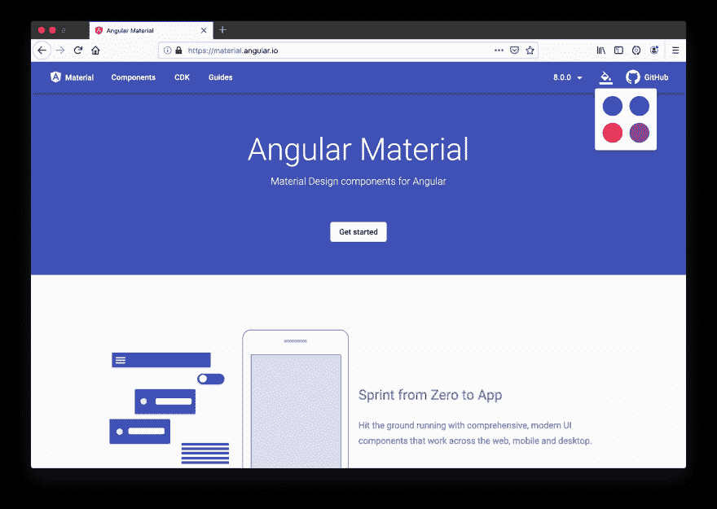](https://res.cloudinary.com/practicaldev/image/fetch/s--Pu35snVS--/c_limit%2Cf_auto%2Cfl_progressive%2Cq_auto%2Cw_880/https://developer.okta.com/assets-jekyll/blog/spring-boot-2-angular-8/material.angular.io-7afb8a74be1d0bb21a7e569b3df9f9336d1e36180e819d33f0d21b7cba400412.png)

## 用 Angular CLI 构建汽车列表页面

使用 Angular CLI 生成可以与酷车 API 对话的汽车服务。

```
ng g s shared/car/car 
```

更新`client/src/app/shared/car/car.service.ts`中的代码，从服务器获取汽车列表。

```
import { Injectable } from '@angular/core';
import { HttpClient } from '@angular/common/http';
import { Observable } from 'rxjs';

@Injectable({
  providedIn: 'root'
})
export class CarService {

  constructor(private http: HttpClient) {
  }

  getAll(): Observable<any> {
    return this.http.get('//localhost:8080/cool-cars');
  }
} 
```

打开`src/app/app.module.ts`，添加`HttpClientModule`作为导入。

```
import { HttpClientModule } from '@angular/common/http';

@NgModule({
  declarations: [
    AppComponent
  ],
  imports: [
    BrowserModule,
    AppRoutingModule,
    BrowserAnimationsModule,
    HttpClientModule
  ],
  providers: [],
  bootstrap: [AppComponent]
}) 
```

生成一个`car-list`组件来显示汽车列表。

```
ng g c car-list 
```

更新`client/src/app/car-list/car-list.component.ts`以使用`CarService`获取列表并在本地`cars`变量中设置值。

```
import { Component, OnInit } from '@angular/core';
import { CarService } from '../shared/car/car.service';

@Component({
  selector: 'app-car-list',
  templateUrl: './car-list.component.html',
  styleUrls: ['./car-list.component.css']
})
export class CarListComponent implements OnInit {
  cars: Array<any>;

  constructor(private carService: CarService) { }

  ngOnInit() {
    this.carService.getAll().subscribe(data => {
      this.cars = data;
    });
  }
} 
```

更新`client/src/app/car-list/car-list.component.html`以显示汽车列表。

```
<h2>Car List</h2>

<div *ngFor="let car of cars">
  {{car.name}}
</div> 
```

更新`client/src/app/app.component.html`以拥有`app-car-list`元素。

```
<div style="text-align:center">
  <h1>
    Welcome to {{ title }}!
  </h1>
</div>

<app-car-list></app-car-list>
<router-outlet></router-outlet> 
```

使用`ng serve -o`启动客户端应用程序。你还不会看到汽车列表，如果你打开你的开发者控制台，你会看到为什么。

[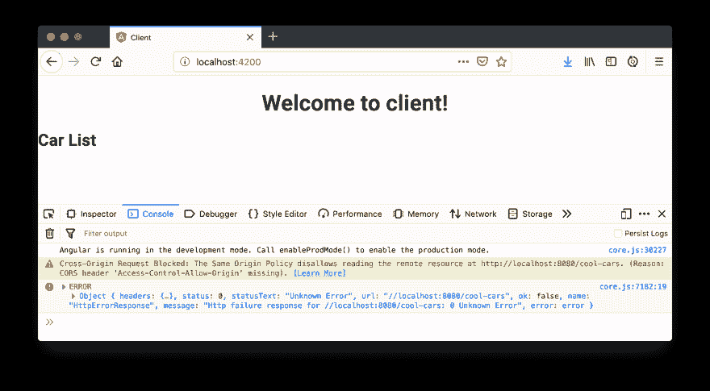](https://res.cloudinary.com/practicaldev/image/fetch/s--AjbYZtS_--/c_limit%2Cf_auto%2Cfl_progressive%2Cq_auto%2Cw_880/https://developer.okta.com/assets-jekyll/blog/spring-boot-2-angular-8/cors-error-6c9fe9000ed788641be53b33a166a8dcf3499d155ac7aec6b380b1a4af86bbe3.png)

发生此错误是因为您尚未在服务器上启用 CORS(跨源资源共享)。

### 在服务器上启用 CORS

要在服务器上启用 CORS，需要给`CoolCarController`(在`server/src/main/java/com/okta/developer/demo/CoolCarController.java`中)添加一个`@CrossOrigin`注释。

```
import org.springframework.web.bind.annotation.CrossOrigin;
...
@GetMapping("/cool-cars")
@CrossOrigin(origins = "http://localhost:4200")
public Collection<Car> coolCars() {
    return repository.findAll().stream()
            .filter(this::isCool)
            .collect(Collectors.toList());
} 
```

在 Spring Boot 版本 2.1.4 和更低版本中，您还可以向您的`CarRepository`添加一个`@CrossOrigin`注释。这将允许您在从 Angular 添加/删除/编辑时与其端点进行通信。

```
import org.springframework.web.bind.annotation.CrossOrigin;

@RepositoryRestResource
@CrossOrigin(origins = "http://localhost:4200")
interface CarRepository extends JpaRepository<Car, Long> {
} 
```

然而，这种[在 Spring Boot 2.2.0.M2](https://github.com/spring-projects/spring-boot/issues/16683) 中不再起作用。好消息是有一个变通办法。您可以向您的`DemoApplication.java`类添加一个`CorsFilter` bean。当您集成 Spring Security 时，这也是必要的；你只是做得早了一点。

```
import org.springframework.boot.web.servlet.FilterRegistrationBean;
import org.springframework.core.Ordered;
import org.springframework.web.cors.CorsConfiguration;
import org.springframework.web.cors.UrlBasedCorsConfigurationSource;
import org.springframework.web.filter.CorsFilter;
import java.util.Collections;

...

public class DemoApplication {
    // main() and init() methods

    @Bean
    public FilterRegistrationBean<CorsFilter> simpleCorsFilter() {
        UrlBasedCorsConfigurationSource source = new UrlBasedCorsConfigurationSource();
        CorsConfiguration config = new CorsConfiguration();
        config.setAllowCredentials(true);
        config.setAllowedOrigins(Collections.singletonList("http://localhost:4200"));
        config.setAllowedMethods(Collections.singletonList("*"));
        config.setAllowedHeaders(Collections.singletonList("*"));
        source.registerCorsConfiguration("/**", config);
        FilterRegistrationBean<CorsFilter> bean = new FilterRegistrationBean<>(new CorsFilter(source));
        bean.setOrder(Ordered.HIGHEST_PRECEDENCE);
        return bean;
    }
} 
```

重启服务器，刷新客户端，您应该会在浏览器中看到汽车列表。

## 添加有棱角的材料

您已经安装了 Angular Material，要使用其组件，您需要导入它们。打开`client/src/app/app.module.ts`并添加动画导入、素材工具栏、按钮、输入、列表和卡片布局。

```
import { MatButtonModule, MatCardModule, MatInputModule, MatListModule, MatToolbarModule } from '@angular/material';

@NgModule({
  ...
  imports: [
    BrowserModule,
    AppRoutingModule,
    BrowserAnimationsModule,
    HttpClientModule,
    MatButtonModule,
    MatCardModule,
    MatInputModule,
    MatListModule,
    MatToolbarModule
  ],
  ...
}) 
```

更新`client/src/app/app.component.html`以使用工具栏组件。

```
<mat-toolbar color="primary">
  <span>Welcome to {{title}}!</span>
</mat-toolbar>

<app-car-list></app-car-list>
<router-outlet></router-outlet> 
```

更新`client/src/app/car-list/car-list.component.html`以使用卡片布局和列表组件。

```
<mat-card>
  <mat-card-title>Car List</mat-card-title>
  <mat-card-content>
    <mat-list>
      <mat-list-item *ngFor="let car of cars">
        
        <h3 mat-line>{{car.name}}</h3>
      </mat-list-item>
    </mat-list>
  </mat-card-content>
</mat-card> 
```

如果您使用`ng serve`运行您的客户端并导航到`http://localhost:4200`，您将看到汽车列表，但没有与之相关联的图像。

[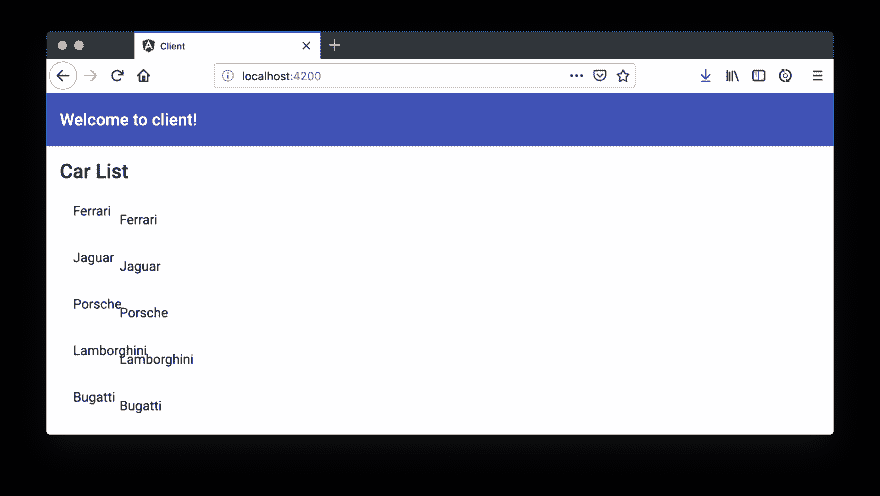](https://res.cloudinary.com/practicaldev/image/fetch/s--CelxrTjL--/c_limit%2Cf_auto%2Cfl_progressive%2Cq_auto%2Cw_880/https://developer.okta.com/assets-jekyll/blog/spring-boot-2-angular-8/car-list-no-images-cb55fd492df65c9183654c948a1e27532a19c93a6973b36859ab251df08ab947.png)

## 用 Giphy 添加动画 gif

要为每辆汽车添加一个`giphyUrl`属性，创建`client/src/app/shared/giphy/giphy.service.ts`并用下面的代码填充它。

```
import { Injectable } from '@angular/core';
import { HttpClient } from '@angular/common/http';
import { map } from 'rxjs/operators';

@Injectable({providedIn: 'root'})
export class GiphyService {

  // This is a Giphy API Key I created. Create your own at https://developers.giphy.com/dashboard/?create=true.
  giphyApi = '//api.giphy.com/v1/gifs/search?api_key=nOTRbUNMgD5mj4XowN2ERoPNudAkK6ft&limit=1&q=';

  constructor(public http: HttpClient) {
  }

  get(searchTerm) {
    const apiLink = this.giphyApi + searchTerm;
    return this.http.get(apiLink).pipe(map((response: any) => {
      if (response.data.length > 0) {
        return response.data[0].images.original.url;
      } else {
        return 'https://media.giphy.com/media/YaOxRsmrv9IeA/giphy.gif'; // dancing cat for 404
      }
    }));
  }
} 
```

更新`client/src/app/car-list/car-list.component.ts`中的代码，设置每辆汽车的`giphyUrl`属性。

```
import { GiphyService } from '../shared/giphy/giphy.service';

export class CarListComponent implements OnInit {
  cars: Array<any>;

  constructor(private carService: CarService, private giphyService: GiphyService) { }

  ngOnInit() {
    this.carService.getAll().subscribe(data => {
      this.cars = data;
      for (const car of this.cars) {
        this.giphyService.get(car.name).subscribe(url => car.giphyUrl = url);
      }
    });
  }
} 
```

现在你的浏览器应该会显示汽车名称列表，旁边还有一个头像图片。

[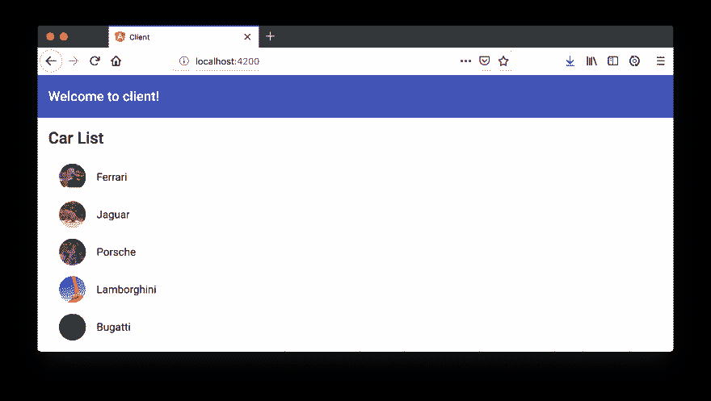](https://res.cloudinary.com/practicaldev/image/fetch/s--kQS494OZ--/c_limit%2Cf_auto%2Cfl_progressive%2Cq_auto%2Cw_880/https://developer.okta.com/assets-jekyll/blog/spring-boot-2-angular-8/car-list-giphy-images-f2e0dfa3b9c612f595f2126745fed71f79f0b8b0ecc2332619ae954af8d2ef11.png)

## 向角度应用添加编辑特征

拥有一个汽车名称和图片的列表是很酷的，但是当你可以和它互动的时候会更有趣！要添加编辑特征，首先要生成一个`car-edit`组件。

```
ng g c car-edit 
```

更新`client/src/app/shared/car/car.service.ts`以获得添加、删除和更新汽车的方法。这些方法与由`CarRepository`及其`@RepositoryRestResource`注释提供的端点对话。

```
import { Injectable } from '@angular/core';
import { HttpClient } from '@angular/common/http';
import { Observable } from 'rxjs';

@Injectable({providedIn: 'root'})
export class CarService {
  public API = '//localhost:8080';
  public CAR_API = this.API + '/cars';

  constructor(private http: HttpClient) {
  }

  getAll(): Observable<any> {
    return this.http.get(this.API + '/cool-cars');
  }

  get(id: string) {
    return this.http.get(this.CAR_API + '/' + id);
  }

  save(car: any): Observable<any> {
    let result: Observable<any>;
    if (car.href) {
      result = this.http.put(car.href, car);
    } else {
      result = this.http.post(this.CAR_API, car);
    }
    return result;
  }

  remove(href: string) {
    return this.http.delete(href);
  }
} 
```

在`client/src/app/car-list/car-list.component.html`中，添加一个到编辑组件的链接。另外，在底部添加一个按钮来添加新车。

```
<mat-card>
  <mat-card-title>Car List</mat-card-title>
  <mat-card-content>
    <mat-list>
      <mat-list-item *ngFor="let car of cars">
        
        <h3 mat-line>
          <a mat-button [routerLink]="['/car-edit', car.id]">{{car.name}}</a>
        </h3>
      </mat-list-item>
    </mat-list>
  </mat-card-content>

  <button mat-fab color="primary" [routerLink]="['/car-add']">Add</button>
</mat-card> 
```

在`client/src/app/app.module.ts`中，导入`FormsModule`。

```
import { FormsModule } from '@angular/forms';

@NgModule({
  ...
  imports: [
    ...
    FormsModule
  ],
  ...
}) 
```

在`client/src/app/app-routing.module.ts`中，添加`CarListComponent`和`CarEditComponent`的路线。

```
import { NgModule } from '@angular/core';
import { Routes, RouterModule } from '@angular/router';
import { CarListComponent } from './car-list/car-list.component';
import { CarEditComponent } from './car-edit/car-edit.component';

const routes: Routes = [
  { path: '', redirectTo: '/car-list', pathMatch: 'full' },
  {
    path: 'car-list',
    component: CarListComponent
  },
  {
    path: 'car-add',
    component: CarEditComponent
  },
  {
    path: 'car-edit/:id',
    component: CarEditComponent
  }
];

@NgModule({
  imports: [RouterModule.forRoot(routes)],
  exports: [RouterModule]
})
export class AppRoutingModule { } 
```

修改`client/src/app/car-edit/car-edit.component.ts`以从 URL 上传递的 id 中获取汽车信息，并添加保存和删除的方法。

```
import { Component, OnDestroy, OnInit } from '@angular/core';
import { Subscription } from 'rxjs';
import { ActivatedRoute, Router } from '@angular/router';
import { CarService } from '../shared/car/car.service';
import { GiphyService } from '../shared/giphy/giphy.service';
import { NgForm } from '@angular/forms';

@Component({
  selector: 'app-car-edit',
  templateUrl: './car-edit.component.html',
  styleUrls: ['./car-edit.component.css']
})
export class CarEditComponent implements OnInit, OnDestroy {
  car: any = {};

  sub: Subscription;

  constructor(private route: ActivatedRoute,
              private router: Router,
              private carService: CarService,
              private giphyService: GiphyService) {
  }

  ngOnInit() {
    this.sub = this.route.params.subscribe(params => {
      const id = params.id;
      if (id) {
        this.carService.get(id).subscribe((car: any) => {
          if (car) {
            this.car = car;
            this.car.href = car._links.self.href;
            this.giphyService.get(car.name).subscribe(url => car.giphyUrl = url);
          } else {
            console.log(`Car with id '${id}' not found, returning to list`);
            this.gotoList();
          }
        });
      }
    });
  }

  ngOnDestroy() {
    this.sub.unsubscribe();
  }

  gotoList() {
    this.router.navigate(['/car-list']);
  }

  save(form: NgForm) {
    this.carService.save(form).subscribe(result => {
      this.gotoList();
    }, error => console.error(error));
  }

  remove(href) {
    this.carService.remove(href).subscribe(result => {
      this.gotoList();
    }, error => console.error(error));
  }
} 
```

更新`client/src/app/car-edit/car-edit.component.html`中的 HTML，得到一个包含汽车名称的表单，并显示来自 Giphy 的图像。

```
<mat-card>
  <form #carForm="ngForm" (ngSubmit)="save(carForm.value)">
    <mat-card-header>
      <mat-card-title><h2>{{car.name ? 'Edit' : 'Add'}} Car</h2></mat-card-title>
    </mat-card-header>
    <mat-card-content>
      <input type="hidden" name="href" [(ngModel)]="car.href">
      <mat-form-field>
        <input matInput placeholder="Car Name" [(ngModel)]="car.name"
               required name="name" #name>
      </mat-form-field>
    </mat-card-content>
    <mat-card-actions>
      <button mat-raised-button color="primary" type="submit"
              [disabled]="!carForm.valid">Save</button>
      <button mat-raised-button color="secondary" (click)="remove(car.href)"
              *ngIf="car.href" type="button">Delete</button>
      <a mat-button routerLink="/car-list">Cancel</a>
    </mat-card-actions>
    <mat-card-footer>
      <div class="giphy">
        
      </div>
    </mat-card-footer>
  </form>
</mat-card> 
```

通过将下面的 CSS 添加到`client/src/app/car-edit/car-edit.component.css`中，在图像周围添加一些填充。

```
.giphy {
  margin: 10px;
} 
```

修改`client/src/app/app.component.html`并删除`<app-car-list></app-car-list>`。

```
<mat-toolbar color="primary">
  <span>Welcome to {{title}}!</span>
</mat-toolbar>

<router-outlet></router-outlet> 
```

完成所有这些更改后，您应该能够添加、编辑或删除任何汽车。下面是显示带有添加按钮的列表的屏幕截图。

[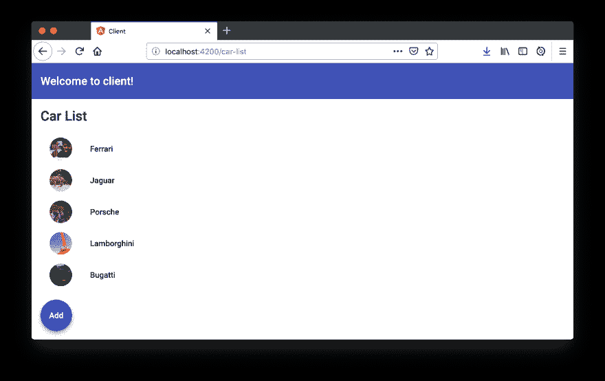](https://res.cloudinary.com/practicaldev/image/fetch/s--Vfh3flrf--/c_limit%2Cf_auto%2Cfl_progressive%2Cq_auto%2Cw_880/https://developer.okta.com/assets-jekyll/blog/spring-boot-2-angular-8/car-list-add-btn-cd39137b8f8a073df4535fec494aa288200273800d1ce25fdb942680d81b2bff.png)

下面的截图显示了编辑您添加的汽车的样子。

[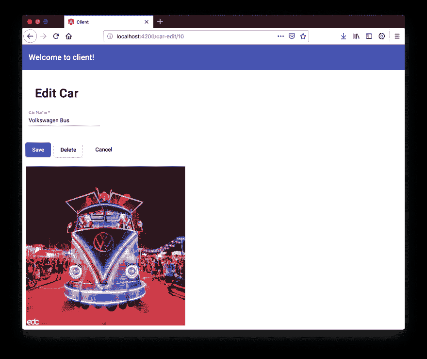](https://res.cloudinary.com/practicaldev/image/fetch/s--kB6ocs-w--/c_limit%2Cf_auto%2Cfl_progressive%2Cq_auto%2Cw_880/https://developer.okta.com/assets-jekyll/blog/spring-boot-2-angular-8/car-edit-6282a191dc88f1bef351e048c1fa64042191d62dae2c03541d74752e81084f86.png)

## 为您的 Spring Boot + Angular 应用添加 OIDC 认证

添加 OIDC 认证是一个很棒的特性，你可以添加到这个应用程序中。如果您想添加审计或个性化您的应用程序(例如，使用评级功能)，知道这个人是谁会很方便。

### 春安+ OIDC

在服务器端，您可以使用 Okta 的 Spring Boot 启动器锁定事情，它利用了 Spring 安全性及其 OIDC 支持。打开`server/pom.xml`并取消 Okta Spring Boot 启动器的注释。

```
<dependency>
    <groupId>com.okta.spring</groupId>
    <artifactId>okta-spring-boot-starter</artifactId>
    <version>1.1.0</version>
</dependency> 
```

现在您需要配置服务器使用 Okta 进行身份验证。为此，您需要在 Okta 创建一个 OIDC 应用程序。

### 在 Okta 创建一个 OIDC App

登录您的 Okta 开发者账户(如果您没有账户，请注册，然后导航至**应用** > **添加应用**。点击**单页应用**，点击下一个的**，给应用取一个你会记住的名字。将`http://localhost:8080`的所有实例更改为`http://localhost:4200`并点击**完成**。**

[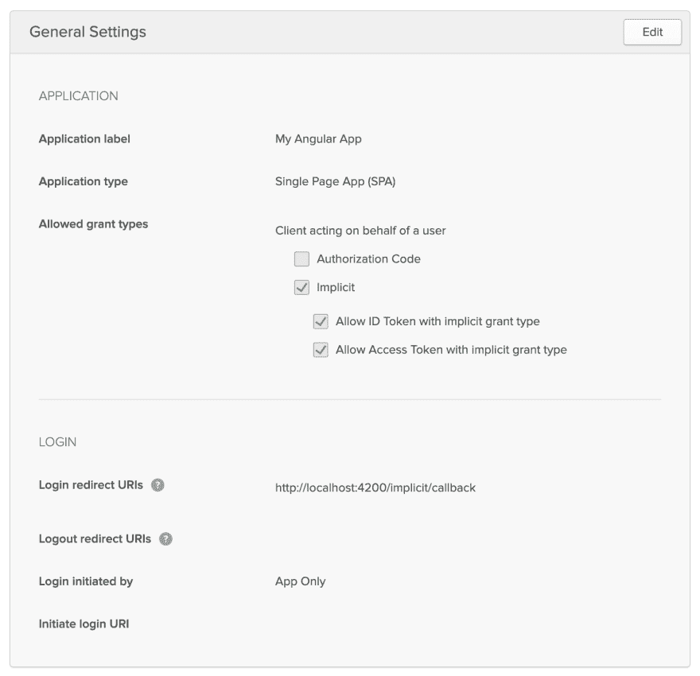](https://res.cloudinary.com/practicaldev/image/fetch/s--xfnimC4S--/c_limit%2Cf_auto%2Cfl_progressive%2Cq_auto%2Cw_880/https://developer.okta.com/assets-jekyll/blog/spring-boot-2-angular-8/oidc-settings-980e05cda53609ed905297c1a0d241c533870cf0222f5ff924117f299c055de7.png)

您会在页面底部看到一个客户 ID。将它和一个`issuer`属性添加到`server/src/main/resources/application.properties`。

```
okta.oauth2.client-id={yourClientId}
okta.oauth2.issuer=https://{yourOktaDomain}/oauth2/default 
```

创建
`server/src/main/java/com/okta/developer/demo/SecurityConfiguration.java`将您的 Spring Boot 应用程序配置为资源服务器。

```
package com.okta.developer.demo;

import org.springframework.security.config.annotation.web.builders.HttpSecurity;
import org.springframework.security.config.annotation.web.configuration.EnableWebSecurity;
import org.springframework.security.config.annotation.web.configuration.WebSecurityConfigurerAdapter;

@EnableWebSecurity
public class SecurityConfiguration extends WebSecurityConfigurerAdapter {

    @Override
    protected void configure(HttpSecurity http) throws Exception {
        http
            .authorizeRequests().anyRequest().authenticated()
            .and()
            .oauth2ResourceServer().jwt();
    }
} 
```

完成这些更改后，您应该能够重新启动应用程序，并在尝试导航到`http://localhost:8080`时看到一个错误。

[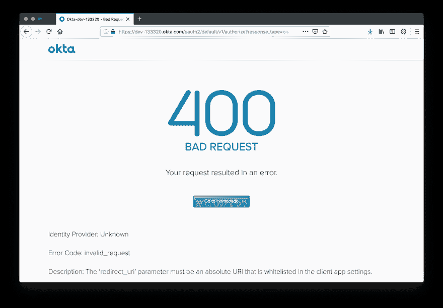](https://res.cloudinary.com/practicaldev/image/fetch/s--RmdkPWJp--/c_limit%2Cf_auto%2Cfl_progressive%2Cq_auto%2Cw_880/https://developer.okta.com/assets-jekyll/blog/spring-boot-2-angular-8/400-error-25aa5f4ff679212a117a84b4468ab7a8fd8decc0cedbaf892144f791307cff70.png)

**注意:**你可以通过在你的应用中添加`http://localhost:8080/login/oauth2/code/okta`作为重定向 URI 来修复这个错误，但这并不能解决问题。如果你想通过 Spring Boot 支持 OIDC 登录，你需要注册一个 **Web** 应用(而不是 SPA ),并在你的`application.properties`中包含一个客户端密码。这不是本教程中的必要步骤。

现在您的服务器被锁定了，您需要配置您的客户机用一个访问令牌与它对话。这就是 Okta 的 Angular SDK 派上用场的地方。

### 秋田的角撑

Okta Angular SDK 是基于 OIDC 构建的 Okta Auth JS T1 的包装器。更多关于 Okta 角图书馆的信息可以在 GitHub 上找到[。](https://github.com/okta/okta-oidc-js/tree/master/packages/okta-angular)

为了简化我们的 Angular SDK 的安装和配置，我们创建了一个@oktadev/schematics 项目来为您完成所有工作。你可以在[使用角度示意图简化你的生活](https://dev.to/blog/2019/02/13/angular-schematics)中阅读更多关于@oktadev/schematics 如何工作的信息。

在安装之前，最好将项目签入源代码控制。如果没有安装 Git，可以将项目复制到另一个位置作为备份。如果您安装了 Git，从项目的根目录运行以下命令。

```
git init
git add .
git commit -m "Initialize project" 
```

要安装和配置 Okta 的 Angular SDK，在`client`目录下运行以下命令:

```
ng add @oktadev/schematics --issuer=https://{yourOktaDomain}/oauth2/default --clientId={yourClientId} 
```

该命令将:

*   安装`@okta/okta-angular`
*   在`auth-routing.module.ts`中为你的 app 配置 Okta 的 Angular SDK
*   将`isAuthenticated`逻辑添加到`app.component.ts`
*   添加一个带有登录和注销按钮的`HomeComponent`
*   使用到`/home`的默认路由和`/implicit/callback`路由配置路由
*   添加一个`HttpInterceptor`，向`localhost`请求添加一个带有访问令牌的`Authorization`报头

`auth-routing.module.ts`文件向`HomeComponent`添加了一条默认路径，因此您需要在`app-routing.module.ts`中删除默认路径。修改`app-routing.module.ts`中的路线，去掉第一条，增加`OktaAuthGuard`。这可以确保用户在访问路由之前通过身份验证。

```
import { OktaAuthGuard } from '@okta/okta-angular';

const routes: Routes = [
  {
    path: 'car-list',
    component: CarListComponent,
    canActivate: [OktaAuthGuard]
  },
  {
    path: 'car-add',
    component: CarEditComponent,
    canActivate: [OktaAuthGuard]
  },
  {
    path: 'car-edit/:id',
    component: CarEditComponent,
    canActivate: [OktaAuthGuard]
  }
]; 
```

修改`client/src/app/app.component.html`以使用材料组件并有一个注销按钮。

```
<mat-toolbar color="primary">
  <span>Welcome to {{title}}!</span>
  <span class="toolbar-spacer"></span>
  <button mat-raised-button color="accent" *ngIf="isAuthenticated"
          (click)="oktaAuth.logout()" [routerLink]="['/home']">Logout
  </button>
</mat-toolbar>

<router-outlet></router-outlet> 
```

您可能会注意到有一个带有`toolbar-spacer`类的 span。为了使这一工作如预期的那样，给`client/src/app/app.component.css`添加一个`toolbar-spacer`规则。

```
.toolbar-spacer {
  flex: 1 1 auto;
} 
```

然后更新`client/src/app/home/home.component.html`使用角材，链接到车单。

```
<mat-card>
  <mat-card-content>
    <button mat-raised-button color="accent" *ngIf="!isAuthenticated"
            (click)="oktaAuth.loginRedirect()">Login
    </button>
    <button mat-raised-button color="accent" *ngIf="isAuthenticated"
            [routerLink]="['/car-list']">Car List
    </button>
  </mat-card-content>
</mat-card> 
```

由于您使用的是`HomeComponent`中的物料组件，而该组件由新添加的`client/src/app/auth-routing.module.ts`管理，因此您需要导入`MatCardModule`。

```
import { MatCardModule } from '@angular/material';

@NgModule({
  ...
  imports: [
    ...
    MatCardModule
  ],
  ...
}) 
```

为了使内容的底部没有底部边框，通过将下面的内容添加到`client/src/styles.css`中，使`<mat-card>`元素充满屏幕。

```
mat-card {
  height: 100vh;
} 
```

现在，如果你重启你的客户端，一切*应该*工作。不幸的是，并没有，因为 [Ivy 还没有实现 CommonJS/UMD 支持](https://github.com/angular/angular/issues/29564)。作为一种变通方法，您可以修改`tsconfig.app.json`来禁用 Ivy。

```
"angularCompilerOptions":  {  "enableIvy":  false  } 
```

停止并重启`ng serve`过程。打开浏览器进入`http://localhost:4200`。

[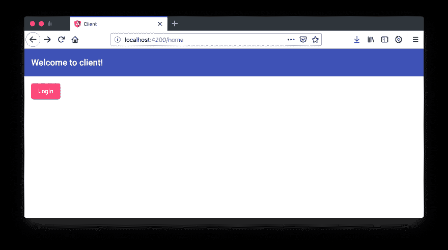](https://res.cloudinary.com/practicaldev/image/fetch/s--cS2G2SnK--/c_limit%2Cf_auto%2Cfl_progressive%2Cq_auto%2Cw_880/https://developer.okta.com/assets-jekyll/blog/spring-boot-2-angular-8/login-button-2f282cf5d2bf12f79d6e509fc1739941a44c93150df466a897eead69047847d4.png)

点击**登录**按钮。如果你已经正确地配置了一切，你将被重定向到 Okta 登录。

[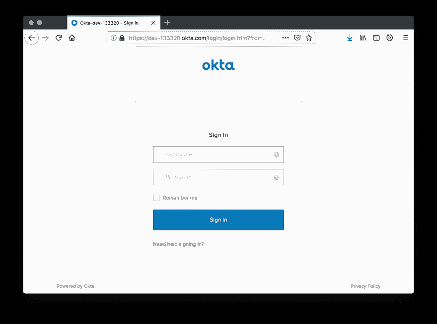](https://res.cloudinary.com/practicaldev/image/fetch/s--UHRJJW4m--/c_limit%2Cf_auto%2Cfl_progressive%2Cq_auto%2Cw_880/https://developer.okta.com/assets-jekyll/blog/spring-boot-2-angular-8/okta-login-07278b9750ab8c6babda66d611b16c385ae764146af9a10c8024b1109a09c42c.png)

输入有效凭据，您将被重定向回您的应用。当一切顺利时，庆祝一下吧！🎉

[](https://res.cloudinary.com/practicaldev/image/fetch/s--v6EnVgCV--/c_limit%2Cf_auto%2Cfl_progressive%2Cq_auto%2Cw_880/https://developer.okta.com/assets-jekyll/blog/spring-boot-2-angular-8/success-at-last-2af183fc8fdb5605a64c2f3b91a0dfed5dd6b3a3fb2636ea0d54177ab0e8f82b.png)

## 了解更多关于 Spring Boot 和棱角分明

很难跟上像 Spring Boot 和 Angular 这样快速发展的框架。这篇文章旨在给你一个关于最新版本的快速入门。关于 Angular 8 的具体变化，参见 Angular 团队对 8.0 版本和 Ivy 的[计划。Spring Boot 请参见其](https://blog.angular.io/a-plan-for-version-8-0-and-ivy-b3318dfc19f7) [2.2 版本说明](https://github.com/spring-projects/spring-boot/wiki/Spring-Boot-2.2-Release-Notes)。

你可以在 GitHub 上的[okta developer/okta-spring-boot-2-angular-8-example](https://github.com/oktadeveloper/okta-spring-boot-2-angular-8-example)看到本教程中开发的应用程序的完整源代码。

这个博客有过多的 Spring Boot 和角度教程。以下是我最喜欢的一些:

*   [用 Angular 和 electronic 构建桌面应用](https://dev.to/blog/2019/03/20/build-desktop-app-with-angular-electron)
*   [将你的 Spring Boot 应用迁移到最新最好的 Spring Security 和 OAuth 2.0](https://dev.to/blog/2019/03/05/spring-boot-migration)
*   [i18n 在 Java 11 中，Spring Boot 和 JavaScript](https://dev.to/blog/2019/02/25/java-i18n-internationalization-localization)
*   [为您的 Angular 应用建立安全登录](https://dev.to/blog/2019/02/12/secure-angular-login)
*   [用 Spring WebFlux 构建反应式 APIs】](https://dev.to/blog/2018/09/24/reactive-apis-with-spring-webflux)

如果您有任何问题，请不要犹豫在下面留下评论，或者在我们的 [Okta 开发者论坛](https://devforum.okta.com/)上询问我们。别忘了在 Twitter 和 YouTube 上关注我们[！](https://twitter.com/oktadev)