# iOS 中的动画:标签栏概念

> 原文：<https://dev.to/heshanfu/animations-in-ios-tab-bar-concepts-36i5>

我们每天都能看到标签栏。

它们引导用户进入应用程序，允许他们在不同的标签之间快速切换。苹果在他们的人机界面指南中提供了一个很好的切入点:

标签栏是半透明的，可能带有背景色，在所有屏幕方向上保持相同的高度，并且在显示键盘时是隐藏的。选项卡栏可以包含任意数量的选项卡，但可视选项卡的数量会因设备大小和方向而异。如果某些标签页由于水平空间有限而无法显示，那么最终可见的标签页就变成了 More 标签页，在一个单独的屏幕上以列表的形式显示额外的标签页
但是谁说手机导航应该是枯燥的呢？

让我们探索标签栏中有趣的动画。我首先关注的是为 iOS 平台设计的产品。并提到了几个在 Swift 中实现动画标签栏的有用指南📚

部分动画来自真实应用。而其他的——只是很好的设计概念，为灵感而生。

你会在你的应用中使用其中的一些吗？

[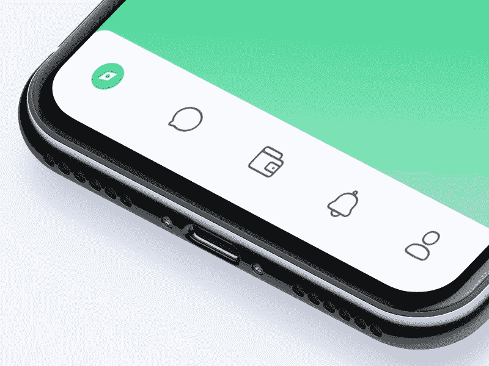](https://res.cloudinary.com/practicaldev/image/fetch/s--S_RgVitd--/c_limit%2Cf_auto%2Cfl_progressive%2Cq_66%2Cw_880/https://cdn.hashnode.com/res/hashnode/image/upload/v1558601028042/7dXHDnKDZ.gif)

Adrian Reznicek 为平台重新设计的微信标签栏

[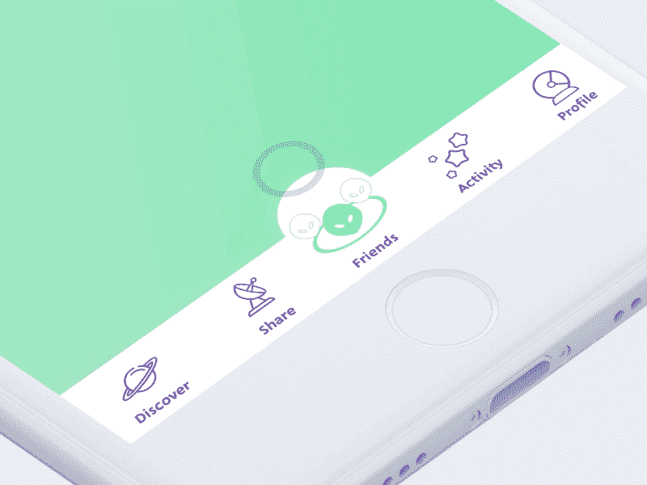](https://res.cloudinary.com/practicaldev/image/fetch/s--vYTwiueR--/c_limit%2Cf_auto%2Cfl_progressive%2Cq_66%2Cw_880/https://cdn-images-1.medium.com/max/800/1%2AlUukV9NDO1NkNT3F03JRpQ.gif)

Cadabra 工作室的动画标签栏概念

[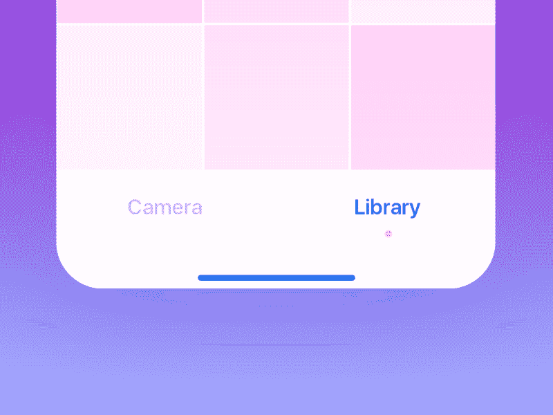](https://res.cloudinary.com/practicaldev/image/fetch/s---DEVgedR--/c_limit%2Cf_auto%2Cfl_progressive%2Cq_66%2Cw_880/https://cdn-images-1.medium.com/max/800/1%2AoT4Y-nMdQaG6vjSuv6U93Q.gif)

相机应用程序标签栏[iPhone X edition]概念由奥列格·弗罗洛夫为神奇独角兽设计

[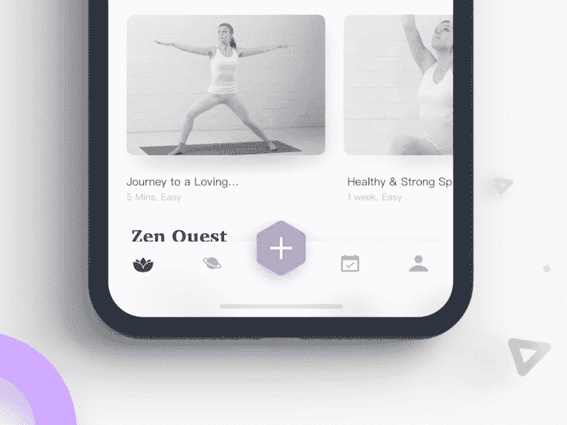](https://res.cloudinary.com/practicaldev/image/fetch/s--7B3-nUQI--/c_limit%2Cf_auto%2Cfl_progressive%2Cq_66%2Cw_880/https://cdn-images-1.medium.com/max/800/1%2A-yusZdPbxBbjGBdvnI4vmA.gif)

Dannniel 的瑜伽应用菜单概念

[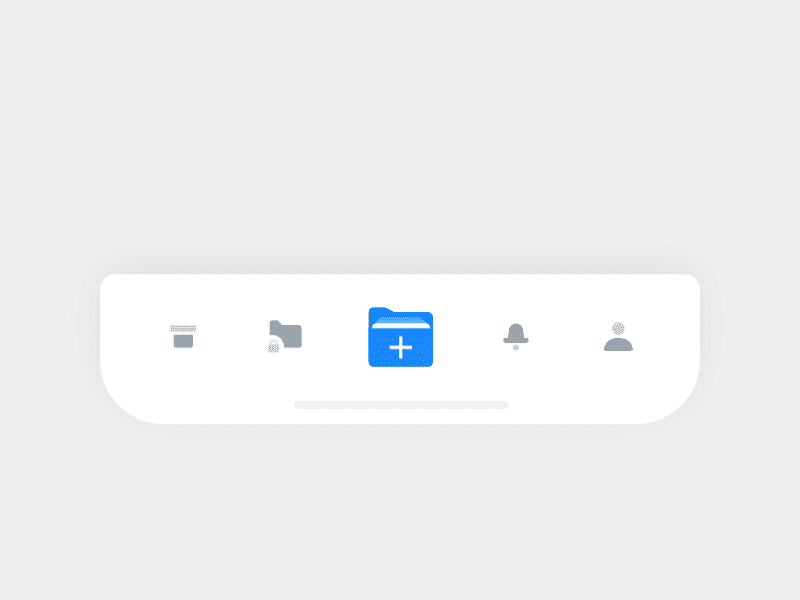](https://res.cloudinary.com/practicaldev/image/fetch/s--p0H84cFo--/c_limit%2Cf_auto%2Cfl_progressive%2Cq_66%2Cw_880/https://cdn-images-1.medium.com/max/800/1%2Ap0todCqWtsVwG8kOFCyPEA.gif)

创建一个新的文档标签栏概念

[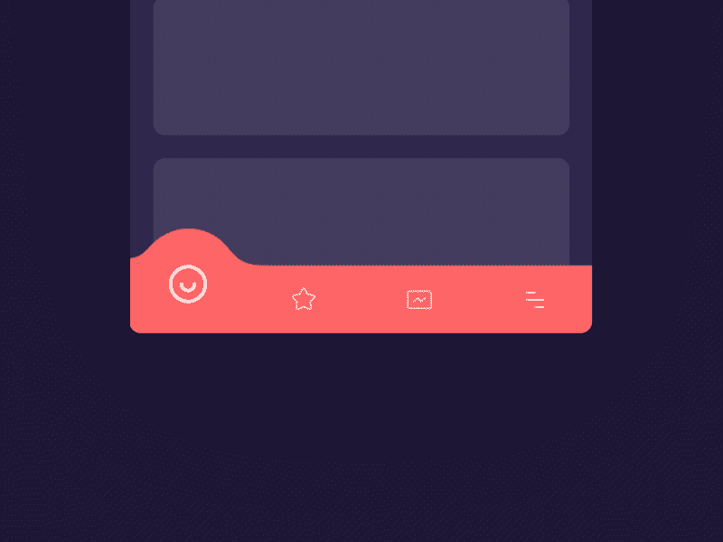](https://res.cloudinary.com/practicaldev/image/fetch/s--fyGH6hJR--/c_limit%2Cf_auto%2Cfl_progressive%2Cq_66%2Cw_880/https://cdn-images-1.medium.com/max/800/1%2AoU5sOkj0PUnLOMHjhEuQhw.gif)

奥列格·弗罗洛夫的流体标签栏交互概念

[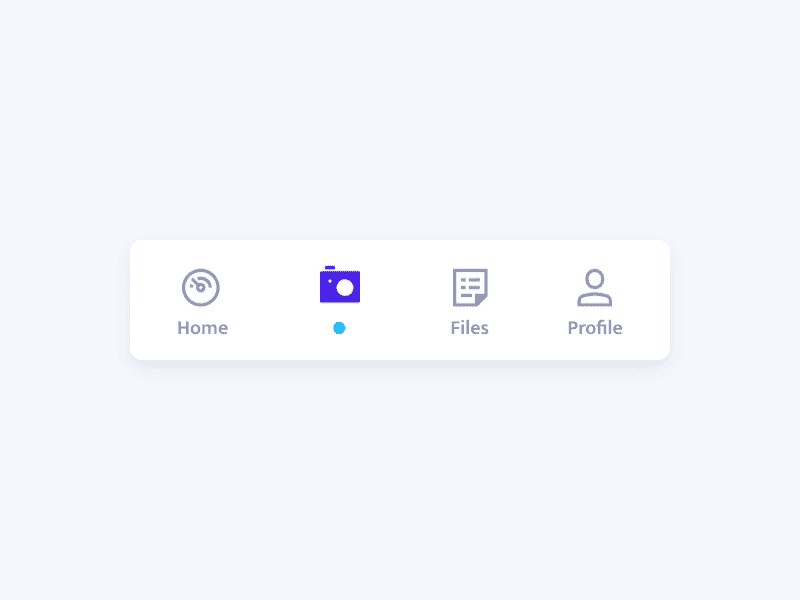](https://res.cloudinary.com/practicaldev/image/fetch/s--mCrUMdkM--/c_limit%2Cf_auto%2Cfl_progressive%2Cq_66%2Cw_880/https://cdn-images-1.medium.com/max/1200/1%2AW0fsXNGi5V6WYCSb-MqEyA.gif)

动画标签栏图标 Andrew McKay 的界面概念

[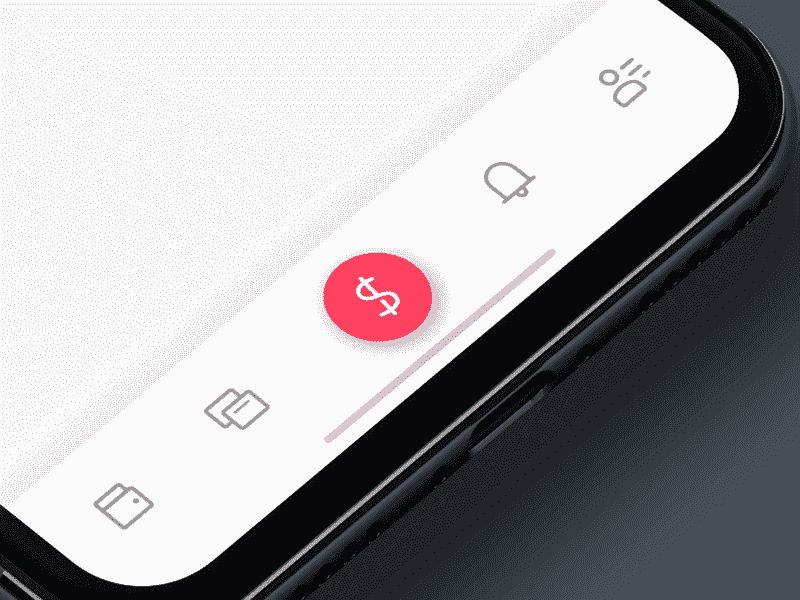](https://res.cloudinary.com/practicaldev/image/fetch/s--LsY2ELjN--/c_limit%2Cf_auto%2Cfl_progressive%2Cq_66%2Cw_880/https://cdn-images-1.medium.com/max/800/1%2APg6_e25gs6GK6CCD2WsbsA.gif)

动画标签栏图标 Andrew McKay 的界面概念

[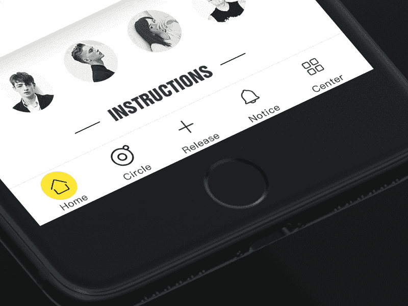](https://res.cloudinary.com/practicaldev/image/fetch/s--iTU7ZJrf--/c_limit%2Cf_auto%2Cfl_progressive%2Cq_66%2Cw_880/https://cdn-images-1.medium.com/max/800/1%2Ag1JuHN9vm1cHWOpSYmvKyA.gif)

按尺寸显示标签栏图标

Aaron Iker 基于 Valentin Tsymbaluk 概念制作的标签栏动态动画

[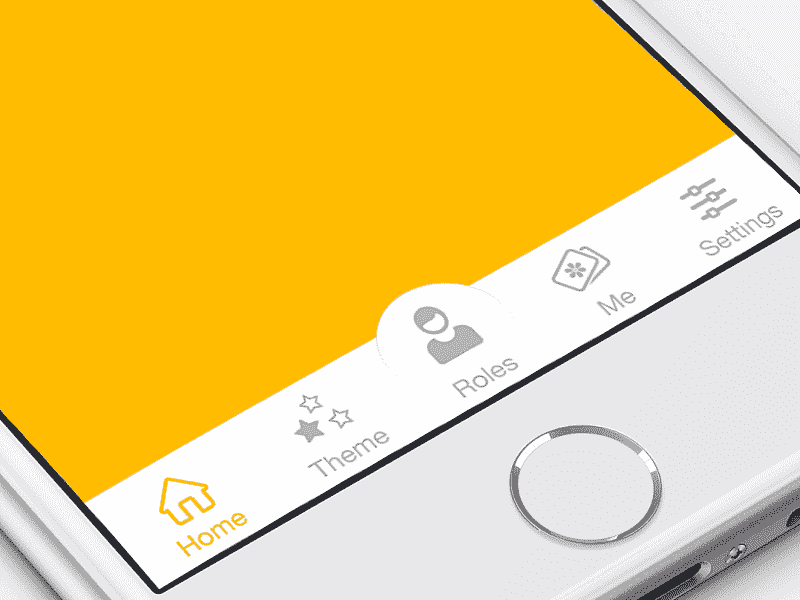](https://res.cloudinary.com/practicaldev/image/fetch/s--bxQK2lj0--/c_limit%2Cf_auto%2Cfl_progressive%2Cq_66%2Cw_880/https://cdn-images-1.medium.com/max/800/1%2AFVjvQgXpRlIBkcPLx9dGig.gif)

动画标签栏图标—界面概念和 Ramotion 的快速实现

[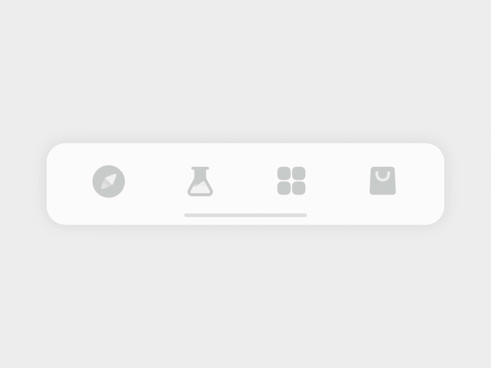](https://res.cloudinary.com/practicaldev/image/fetch/s--r_KRcVQT--/c_limit%2Cf_auto%2Cfl_progressive%2Cq_66%2Cw_880/https://cdn-images-1.medium.com/max/800/1%2A0nOpxIXG4asiLd5ixBxEQA.gif)

标签栏交互概念

[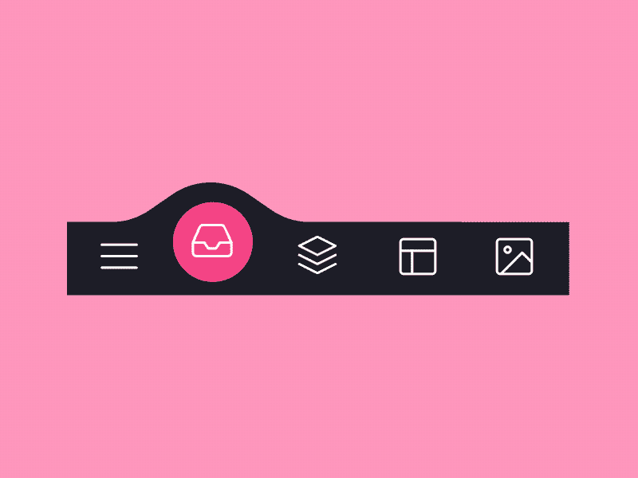](https://res.cloudinary.com/practicaldev/image/fetch/s--5CoeTVol--/c_limit%2Cf_auto%2Cfl_progressive%2Cq_66%2Cw_880/https://cdn-images-1.medium.com/max/800/1%2AO6Kwwvk9OFXesM6qxmTQaw.gif)

毛里西奥·布卡多的动画标签栏概念

[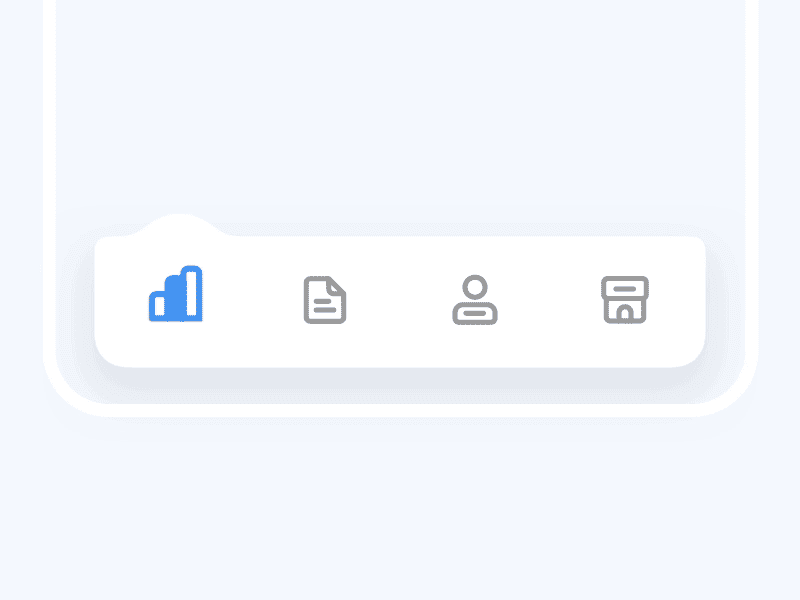](https://res.cloudinary.com/practicaldev/image/fetch/s--yXY6eI58--/c_limit%2Cf_auto%2Cfl_progressive%2Cq_66%2Cw_880/https://cdn-images-1.medium.com/max/800/1%2AN1e50drhdq9D2tXHryG17A.gif)

kaiser 的标签栏交互概念

如果你想练习设计或开发标签栏，这些指南可以帮助你:

*   标签栏上的[人机界面指南](https://developer.apple.com/design/human-interface-guidelines/ios/bars/tab-bars/)，在这里你可以通过 4 分钟的快速阅读了解最佳实践。

*   [指导](https://codewithchris.com/ios-tab-bar-app/)关于“使用 UITabBarViewController 启动 iOS 标签栏应用程序”。

*   29 个已实现的[示例](https://iosexample.com/tag/tab-bars/)。

*   Swift UI 模块[库](https://github.com/Ramotion/animated-tab-bar)用于向 iOS 标签栏添加动画。

希望你喜欢这小小的鼓舞人心的宁静。你也可以查看 iOS 的 30 个漂亮的动画例子，以及你需要知道的关于加载动画的一切

快乐的设计和开发！