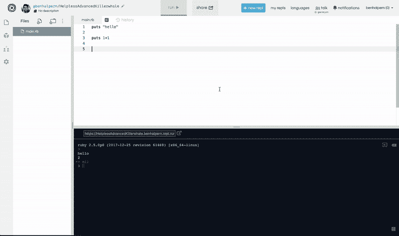
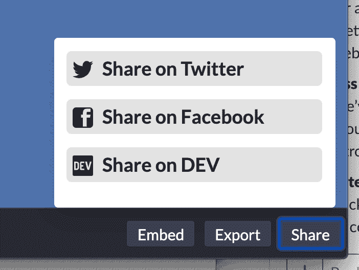

# 宣布平台外“共享到开发”功能

> 原文：<https://dev.to/devteam/announcing-off-platform-share-to-dev-functionality-57j9>

我很高兴与您分享一个非常酷的新功能！

我们已经发布了功能，允许任何人创建“分享到开发”按钮，预先填写开发职位。

基于浏览器的编码平台 repl.it 已经以一种非常巧妙的方式实现了这一点！已经直播了。

这就是它的作用:

DEV 用户已经能够使用 liquid 标签:``嵌入 repl.it 实例有一段时间了，但是该功能现在比以往更加无缝。

该标签将导致这个交互式 repl:

[https://repl.it/@benhalpern/HelplessAdvancedKillerwhale?lite=true](https://repl.it/@benhalpern/HelplessAdvancedKillerwhale?lite=true)

(为这个人为的例子道歉😄)

repl.it 用户可以利用他们一直在做的工作，快速生成一个预先填充的开发帖子。这使得 repl.it 社区中的人们能够与 DEV 和更广泛的软件社区进行无缝共享。repl.it 本身是一个迷人的工具，这种集成使得协作和社区比以往任何时候都更加容易和强大。

我们还与其他几个致力于集成功能的平台保持联系。

### 最酷的部分(IMO)是它的可扩展性

它的工作方式类似于你在网上看到的“分享到 Twitter”链接。这是一个简单的 URL，它接受可读的参数作为`GET`请求——例如，下面是一个开发人员帖子的 Twitter 按钮:

[https://twitter.com/intent/tweet?text = % 22 announting % 20 off-platform % 20% 22 share % 20 to % 20 dev % 22% 20 functionality % 22% 20 by % 20 @ bendhalpern % 20% 23 dev community % 20 https://dev . to/dev team/announting-off-platform-share-to-dev-functionality-57j 9](https://twitter.com/intent/tweet?text=%22Announcing%20off-platform%20%22Share%20to%20DEV%22%20functionality%22%20by%20@bendhalpern%20%23DEVcommunity%20https://dev.to/devteam/announcing-off-platform-share-to-dev-functionality-57j9)

然而，我们的端点接受任意降价。所以只要输入正确，你可以“预填”任何东西。例如，下面是*这篇*文章的 DEV 预填充:

[https://dev.to/new?prefill=-% 0a title % 3A % 20 wow，% 20 share % 20 to % 20 dev % 20 is % 20 真的% 20 酷！%0A 已发布% 3A % 20true %标记% 3A meta % 0A-% 0A % 0A anice % 20 stuff % 20 dev % 20 team！% 0A % 0A % 7B % 25% 20 link % 20 dev team % 2f 宣布脱离平台共享开发功能-57j9%20%25%7D](https://dev.to/new?prefill=---%0Atitle%3A%20Wow,%20Share%20to%20DEV%20is%20really%20cool!%0Apublished%3A%20true%0Atags%3Ameta%0A---%0A%0ANice%20stuff%20DEV%20Team!%0A%0A%7B%25%20link%20devteam%2Fannouncing-off-platform-share-to-dev-functionality-57j9%20%25%7D)

这个 URL 可以作为一个按钮方便地使用:

[分享这篇帖子](https://dev.to/new?prefill=---%0Atitle%3A%20Wow,%20Share%20to%20DEV%20is%20really%20cool!%0Apublished%3A%20true%0Atags%3Ameta%0A---%0A%0ANice%20stuff%20DEV%20Team!%0A%0A%7B%25%20link%20devteam%2Fannouncing-off-platform-share-to-dev-functionality-57j9%20%25%7D)

*仅供参考:URL 必须转义字符，包括换行符(`\n`)。*

单击该链接，您将被带到一个包含一些预填充内容的页面。任何客户端都可以提供不同版本的预填充。

展望未来，我希望使用这个 API 来构建内部特性，以便轻松地“引用”注释等。在网站上。

我们还可以构建浏览器扩展，在 Twitter 和 GitHub 上添加“Share to DEV ”,因为我们已经在这些平台上实现了丰富的嵌入。(这是假设他们不像 repl.it 和其他人那样在本地构建功能😄)

我们实际上已经有了一个 Twitter 浏览器扩展，仍然可以工作，但我们已经多年没有接触了。欢迎 PRs。

## [forem](https://github.com/forem)/[dev Twitter](https://github.com/forem/DevTwitter)

### 将开发人员带到您的 Twitter 浏览体验的头条。

<article class="markdown-body entry-content container-lg" itemprop="text">

# DevTwitter Chrome 扩展

将 [dev.to](https://dev.to) headlines 带入您的 Twitter 浏览体验。

## 安装

去**[Chrome 商店](https://chrome.google.com/webstore/detail/dev-twitter/fhlipionhojfohecgljcljbpblojlaef)** 下载扩展。

要访问开发版本，只需下载或克隆这段代码，并作为解压缩的扩展加载。

## 解压缩扩展

*   如果你下载了代码，解压文件。
*   打开(chrome://extensions/)或在菜单中选择`hamburger menu > More Tools > Extensions`。
*   启用右上角的开发者模式。
*   点击`Load unpacked extension...`，选择 **`chrome-extension`** 文件夹。

## 特征

*   在 Twitter 桌面浏览器的侧边栏上显示其他趋势下的 [dev.to](https://dev.to) 链接，为您的 Twitter 浏览体验带来更多开发者生活。简单，嗯？

## 未来特征

Twitter 是与其他开发人员联系和协作的一个很好的方式，内置这样的功能会很有趣。 [dev.to](https://dev.to) 团队会想办法做到这一点，但是我们非常欢迎大家的贡献。

重要的是…

</article>

[View on GitHub](https://github.com/forem/DevTwitter)

底线是，这一功能建立在我们已经奠定的 markdown/liquid tag 基础之上，应该使软件开发人员的在线交互更加流畅。

如果您想在您的平台上实现“共享到开发”功能，请成为我们的客人。根据您的用例，您可能需要向我们的代码库添加相关的液体标签。请随意提出与您可能需要的任何附加功能相关的问题或拉式请求。

##  [ forem ](https://github.com/forem) / [ forem](https://github.com/forem/forem)

### 为社区赋权🌱

<article class="markdown-body entry-content container-lg" itemprop="text">

# Forem <g-emoji class="g-emoji" alias="seedling" fallback-src="https://github.githubassets.cimg/icons/emoji/unicode/1f331.png">🌱</g-emoji>

**For Empowering Community**

[T11】](https://gitpod.io/#https://github.com/forem/forem)

欢迎来到 [Forem](https://forem.com) 代码库，这个平台为[开发到](https://dev.to)提供动力。我们很高兴你能来。在你们的帮助下，我们可以增强 Forem 的可用性、可伸缩性和稳定性，从而更好地为我们的社区服务。

## 什么是 Forem？

Forem 是用于构建社区的开源软件。为你的同行、客户、粉丝、家人、朋友以及任何其他需要聚集在一起成为集体一员的时间和空间的社区[参见我们的公告帖子](https://dev.to/devteam/for-empowering-community-2k6h)以获得 Forem 是什么的高级概述。

[dev.to](https://dev.to) (或者只是 dev)由 Forem 托管。这是一个软件开发人员的社区，他们撰写文章，参与讨论，并建立自己的专业档案。我们重视支持性和建设性的对话，为所有成员追求伟大的准则和职业发展。该生态系统涵盖从初学者到高级开发人员，欢迎所有人找到自己的位置…

</article>

[View on GitHub](https://github.com/forem/forem)

编码快乐！

更新:这个按钮现在也在 CodePen 上运行了！

