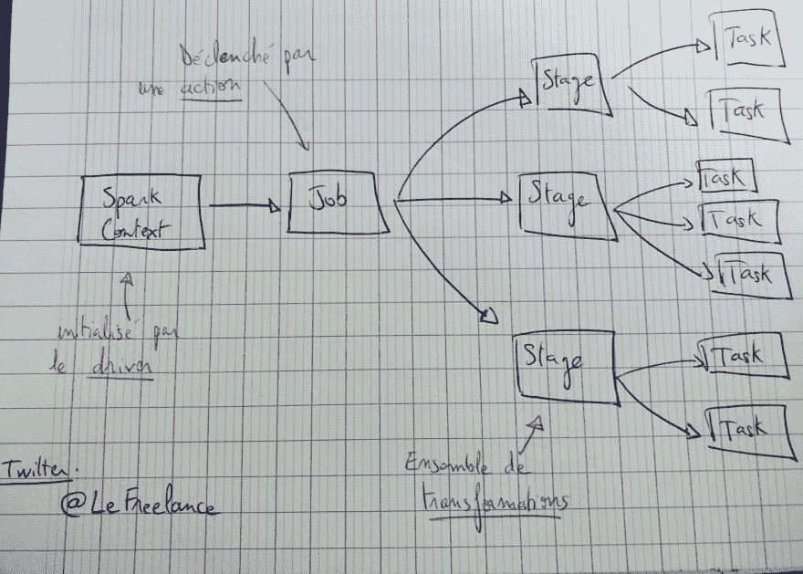

# [反义词]Apache spark:spark 应用程序的结构

> 原文：<https://dev.to/s44d/antiseche-apache-spark-structure-d-une-application-spark-1fhn>

在此小反义词中，我们将返回组成 Apache Spark 应用程序的各个元素。我们将在此处定义构建 Spark 应用程序的主要元素。

# 司机

驱动程式负责建立 SparkContext 并执行应用程式的 main()函数。它是将应用程序中的所有操作和转换转换转换为直接 acyclic graph(Dag)的驱动程序

# Executor

执行者负责执行一项任务，即由驱动程序定义的 Spark 应用程序的一部分。执行者将数据保留在内存或磁盘上。

# 任务

任务是由执行者处理的程序单元。

# 工作

这是多个任务的并行执行。在程式中呼叫动作时会建立工作。

# 阶段

作业分为一组相互依赖的任务，称为“阶段”。每个“阶段”都是一个阶段，在该阶段中，一个或多个转换应用于任务。

# 结构应用

Spark 应用程序首先初始化 SparkContext/SparkSession。然后创建一个或多个*作业*，每个作业都包含*阶段*。每个阶段由一个或多个*任务*组成。

