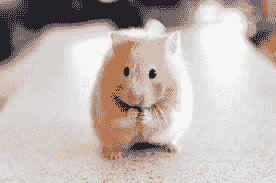
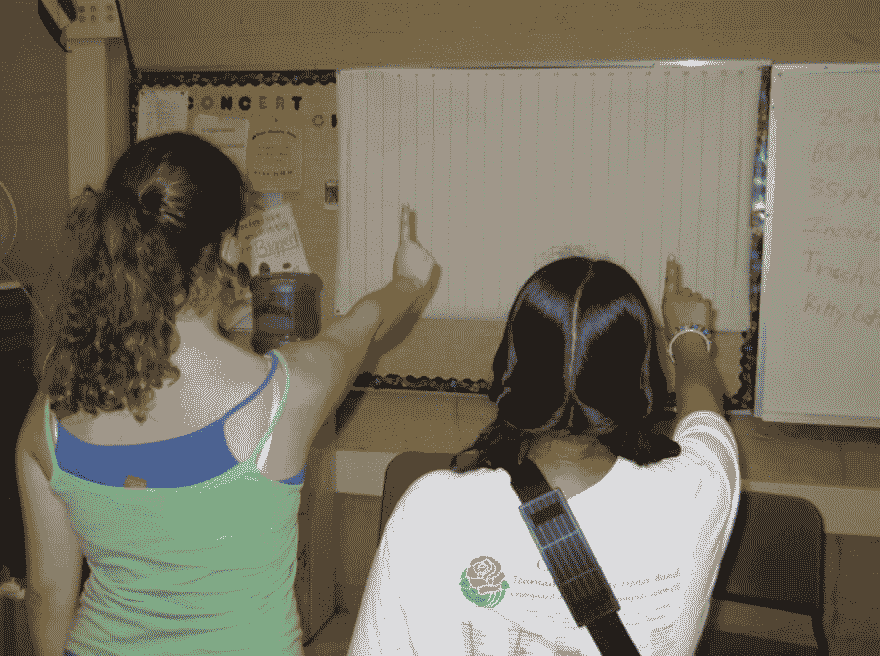
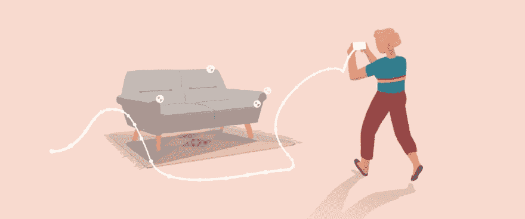
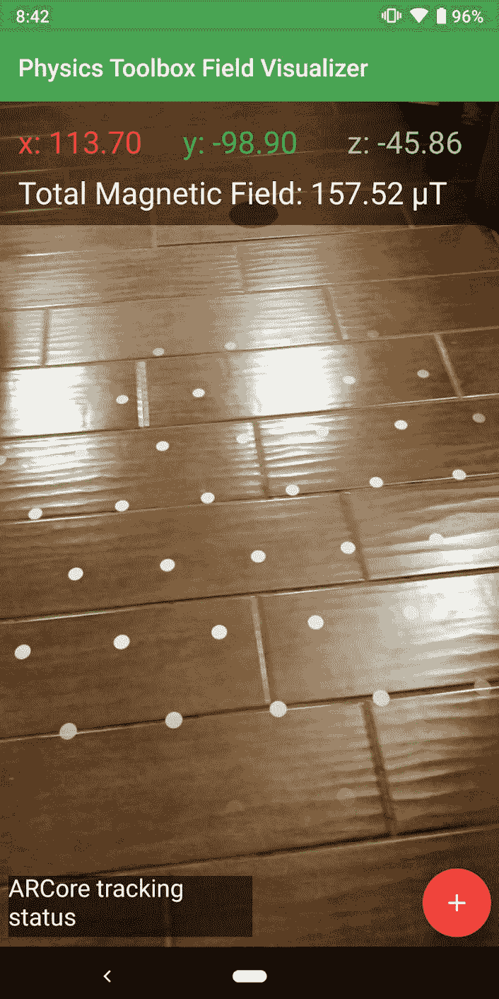
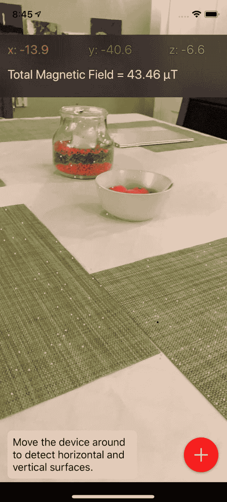

# ARCore 和 ARKit 功能集与仓鼠和达芬奇的比较:它们如何看待世界

> 原文：<https://dev.to/chrystianv1/arcore-and-arkit-feature-sets-compared-to-hamsters-and-davinci-how-they-see-the-world-4n6d>

在这个博客系列的前一篇文章中，我们研究了每个 AR 平台的市场份额、设备兼容性和感知的开发者兴趣。在本文中，我们将研究 ARCore 和 ARKit 提供的主要特性集。总的来说，这两个平台提供了相同的特性集，但是在如何对这些特性进行分类和命名方面有所不同。

ARCore 确定了三个主要特征:(1)运动跟踪，(2)环境理解，以及(3)光线估计。相比之下，ARKit 指的是(1)跟踪和(2)场景理解，但每个 AR 平台的底层技术方面本质上都是一样的。因为谷歌和苹果向开发者提供的关于这些功能如何工作的信息相当有限，所以我们在下面提供一些例子。

#### 追踪特征

正如这项功能的名称所暗示的那样，智能手机 AR 技术可以跟踪移动设备在空间中的位置，并通过视觉和惯性输入来构建其环境的地图。谷歌 ARCore 将此称为[运动追踪](https://developers.google.com/ar/discover/concepts#motion_tracking)，而苹果 ARKit 将此简称为[追踪](https://developer.apple.com/documentation/arkit/understanding_world_tracking_in_arkit)。

ARCore 和 ARKit 使用相机和视觉算法来识别环境中的特征点，例如由颜色和亮度对比度表示的锐利边缘、阴影和直线。与面部识别系统类似，面部识别系统可以根据对这些对象相对于彼此的位置的理解来识别眼睛、鼻子、嘴和面部轮廓，相机可以了解两堵墙在哪里连接在一起形成房间的一角，或者桌子边缘在哪里。

然而，仅仅看到一个房间的照片并不足以赋予它三维的质量。与一些专用 AR 产品上的深度感应相机不同(稍后将详细介绍)，绝大多数智能手机都使用一个简单的相机，可以比作仓鼠的眼睛。正如大多数需要警惕周围环境的猎物一样，仓鼠没有给予它们深度感的[立体视觉](http://www.open.edu/openlearn/nature-environment/natural-history/studying-mammals-the-social-climbers/content-section-3.4)——每只眼睛都有独立的视野，最终使它们拥有更广阔的视野。

仅凭视觉，仓鼠无法立即分辨饥饿的捕食者是近是远，这给了它们对世界的感知一种平淡的卡通效果。然而，仓鼠在理解深度方面并不是完全无能为力。偶尔，你可能会注意到你的仓鼠会停下来，用后腿站立，并左右摆动它的头。通过这样做，仓鼠稍微调整了它对世界的看法，并使用视差线索来感知远近。当从稍微不同的有利位置观察时，更近的物体似乎相对于更静态的背景移动了它们的位置。

即使我们主要是双目立体视觉，人类也可以感觉到视差是如何增加简单相机的感知的。我们说“大部分”，因为一小部分人患有弱视。而且，即使这种与正常视觉功能的偏离也并不总是造成障碍。许多艺术家，[，包括莱昂纳多·达芬奇](https://www.washingtonpost.com/news/morning-mix/wp/2018/10/19/leonardo-da-vincis-genius-may-be-rooted-in-a-common-eye-disorder-new-study-says/?utm_term=.dd0adea0245f)，可能将他们的视觉天赋归功于弱视，因为他们对其他视觉线索，如色彩的色调和强度，越来越敏感。

为了说明运动引起的视差如何帮助简单的相机获得深度感，您可能会想起经典的学校活动，其中您垂直伸出食指或铅笔，通过一只眼睛然后另一只眼睛查看它，并注意您的手指如何相对于背景“跳跃”。这种活动不是移动我们的头部，而是通过忽略一只眼睛和另一只眼睛的输入，让我们从不同的有利位置看事物，而不是像仓鼠一样移动我们的头部或在房间里移动智能手机摄像头。

图片来源: [NASA](https://pumas.nasa.gov/files/04_28_05_1.pdf)

正如我们可以将微小的头部运动与视差导致的视觉变化相关联一样，智能手机将惯性传感器数据与视觉特征相结合。本质上，智能手机通常可以注意到它在空间中使用加速度计移动了多少，以及使用陀螺仪旋转了多少，并将它移动了多少与视觉特征相对于背景移动了多少相关联。(好奇想知道一个加速度计和陀螺仪是怎么工作的？查看我们的[传感器和发电机信息](https://www.vieyrasoftware.net/sensors-sensor-modes)页面，了解每个主要传感器的功能，或者查看我们的[以前的博客](https://www.vieyrasoftware.net/single-post/2016/10/23/Inside-Mobile-Sensors-MEMS-Technology)帖子，解释微电子机械技术背后的基础物理学。)

图片来源:[谷歌开发者](https://developers.google.com/img/MotionTracking.jpg)

这种结合运动和视觉信息来导航世界的技术被称为[视觉里程计](https://en.wikipedia.org/wiki/Visual_odometry)，比盲目估计位置变化的[航位推算](https://en.wikipedia.org/wiki/Dead_reckoning)更进了一步。使用加速度计来确定位置变化涉及数据的双重积分，并且可能导致累积的位置误差，从而导致漂移。

漂移可能是 AR 开发者最大的担忧之一。当 ar 体验不再依赖于智能手机的原始位置时，漂移就变得很明显。在某种意义上，漂移是增强体验和现实本身之间的错误校准。例如，在理想的 AR 体验中，您可能会在桌子上放置一个虚拟对象。如果你转身带着你的手机离开，只是为了稍后回来，你会期望在它原来的位置找到虚拟物体。然而，如果没有强大的视觉锚来抵消漂移，例如关于空间或房间的视觉数据太少，没有显著的视觉特征，您可能会返回来发现对象在不同的位置-在桌子的不同部分，或者根本不在桌子上。ARCore 和 ARKit 的跟踪优势在于视觉和动作输入的融合，以提供一个制衡系统。

为了获得最佳性能并帮助为智能手机提供视觉锚，最好在尝试与 AR 交互之前充分平移(移动)设备。作为参考，谷歌为此申请的专利流程被称为并发里程计映射，而苹果的专利流程被称为视觉惯性里程计，但总体思路是一样的。

应该特别提到新的苹果 iPhone X。用户可能会注意到，这款受欢迎的手机确实有一个使用红外像素系统的深度感应摄像头。虽然开发人员可以访问摄像头数据以纳入 ARKit，但应该注意的是，该功能仅适用于前置摄像头，这使得它比[人脸识别](https://twitter.com/verge/status/927317628783230976)好不了多少。

#### 了解特性

ARCore 和 ARKit 的其余功能是指一旦绘制了环境地图，就可以理解它。谷歌将此称为[环境理解](https://developers.google.com/ar/discover/concepts#environmental_understanding)和[光线估计](https://developers.google.com/ar/discover/concepts#lightestimation)，而苹果将这两者合并为[场景理解](https://developer.apple.com/videos/play/wwdc2017/602/)。

在下面的两个例子中可以粗略地看到 AR 如何看待它的环境。在这两种方法中，算法寻找平面。在下图中，均匀分布的白点是一个阵列，组成了地板平面。

另外，该算法寻找特征点，即提供附加信息的平面内或平面外的视觉锚。在表格的情况下，注意特征点不是均匀分布的。相反，它们只能在有视觉对比的物体上找到。白色桌布上没有特征点，但在条纹绿色餐垫、碗和烛台上可以找到许多特征点(沿边缘点缀着许多特征点)。当智能手机在空间中旋转时，特征点会随着光线的变化而出现和消失。

正如人们所料，ARCore 和 ARKit 算法都可能在高对比度的静态环境中工作得最好，在这种环境中，只有智能手机在移动。

然而，照明不仅仅是作为理解环境的输入。ARCore 和 ARKit 都可以使用来自从 AR 会话中选择的静态图像的关于[环境光的源的信息，通过为虚拟图像提供真实的照明和阴影来增强场景中的虚拟图像。](https://developer.apple.com/documentation/arkit/arlightestimate)

#### 相似但不相等的特征

尽管从表面上看，这些特性看起来很相似，但事实是，在代码通过跨设备测试之前，它们的精度是无法比较的。正如我们在之前的帖子中提到的，谷歌在允许 Android 设备运行 AR 方面一直非常保守，这使得 ARKit 更容易被仅仅基于剪切数的人访问。谷歌面临的挑战是创造出兼容各种类型和质量的传感器的 ARCore，这可能会使 ARCore 非常不精确或不适用于某些低端设备。这些发现将指导我们开发 AR 软件，以收集和可视化智能手机直接感应的磁场。在我们的下一篇文章中，我们将开始比较 ARCore 和 ARKit 在阻力和环境理解方面的实际功能。

联系作者:写信给[support@vieyrasoftware.net](mailto:support@vieyrasoftware.net)或访问[www.vieyrasoftware.net](http://www.vieyrasoftware.net)

这项工作得到了国家自然科学基金#1822728 的资助。本材料中表达的任何观点、发现、结论或建议都是作者的，不一定反映国家科学基金会的观点。