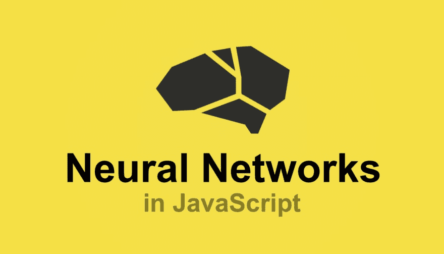
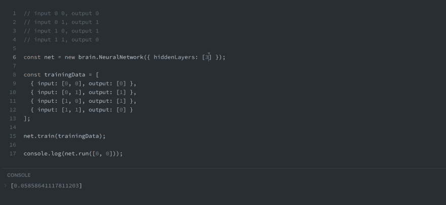
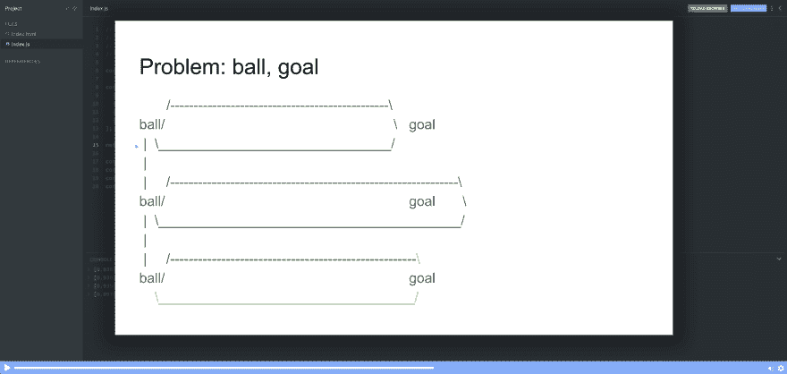
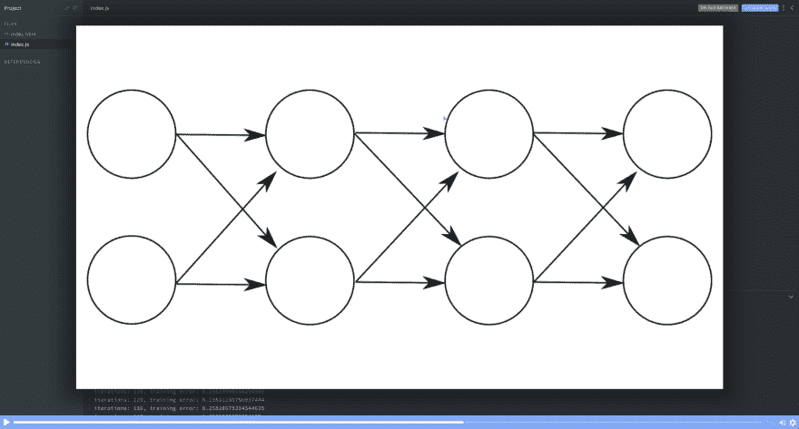
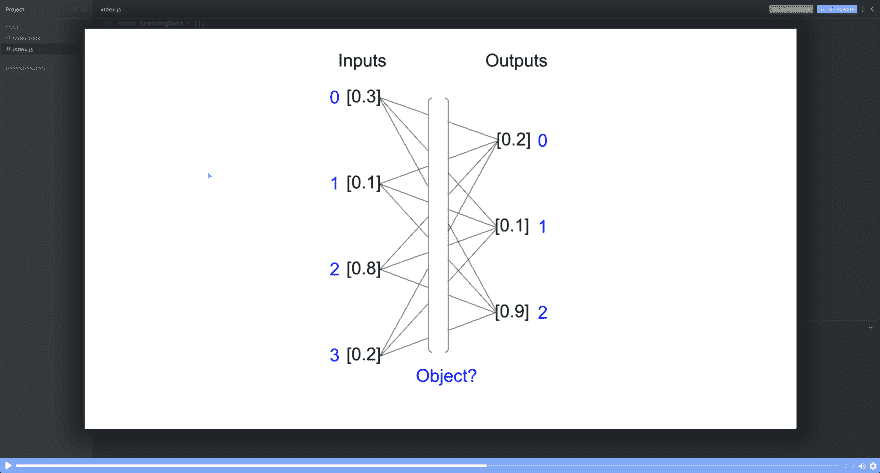
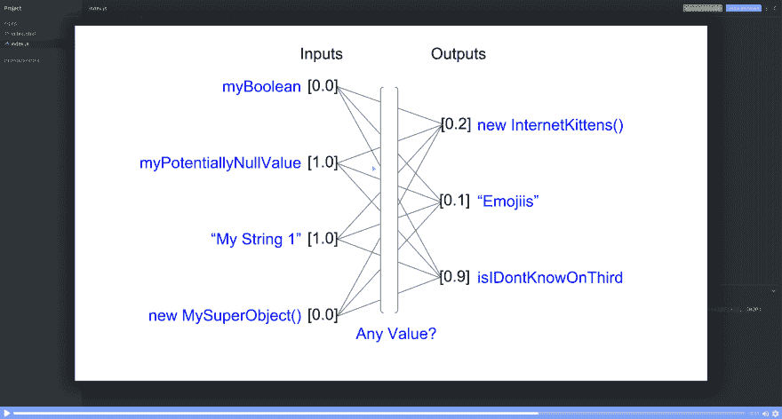
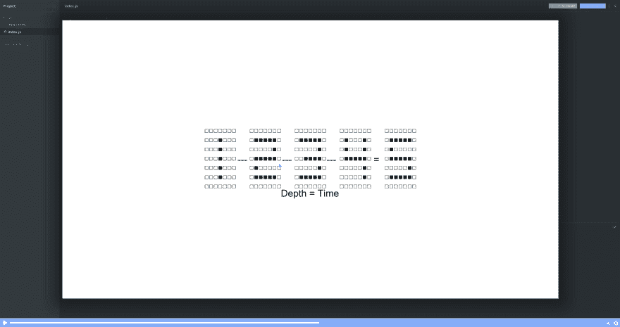
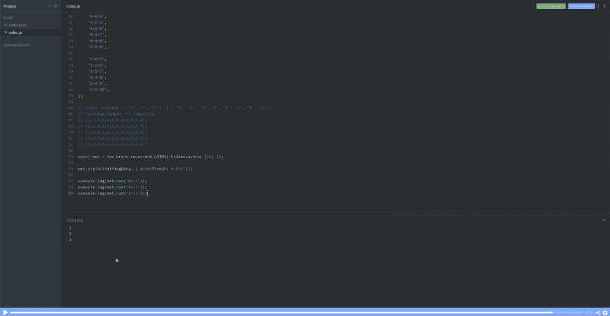
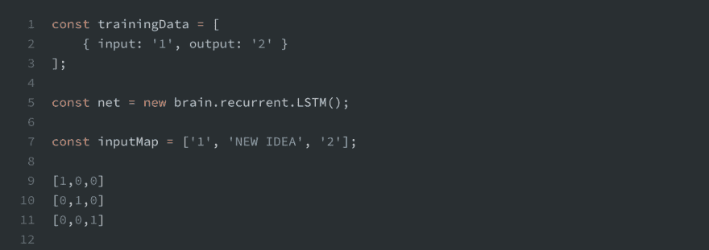
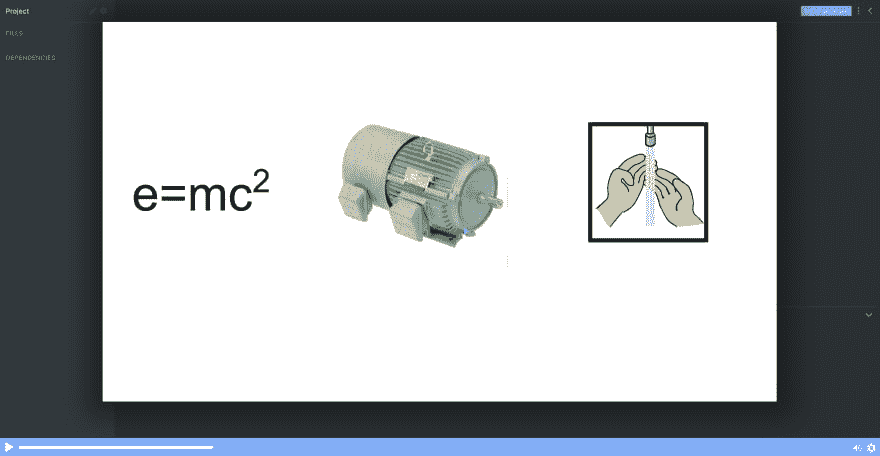

# 你是一个对机器学习感兴趣的网站开发者吗？这里有 Brain.js 的免费课程！

> 原文：<https://dev.to/scrimba/are-you-a-web-dev-interested-in-machine-learning-here-s-a-free-course-on-brain-js-57fp>

在过去的几年里，机器学习已经从一项有前途的技术变成了我们每天都在身边的东西。许多机器学习系统的核心是神经网络。

神经网络是自动驾驶汽车、世界上最好的棋手以及你从 YouTube、网飞和 Spotify 等应用程序获得的许多推荐的动力。

然而，该领域的大多数学习材料都集中在 Python 上，将许多 JavaScript 开发人员排除在外。因此，这就是为什么我们创建了一个免费的 Scrimba 课程，帮助任何网络开发人员轻松开始使用神经网络。

[点击此处参加课程。](https://scrimba.com/g/gneuralnetworks?utm_source=dev.to&utm_medium=referral&utm_campaign=gneuralnetworks_launch_article)

在本课程中，Robert Plummer 通过解决一系列令人兴奋的问题，教您如何使用他广受欢迎的 Brain.js 库，例如:

*   识别图像
*   分析句子的情感
*   甚至写非常简单的儿童读物！

感谢 Scrimba 平台，您将能够直接与示例代码进行交互，并在过程中对其进行修改。

> 这可能是神经网络上有史以来最具互动性的课程。

因此，让我们来看看在这 19 个免费的截屏中你会学到什么。

#### 1。介绍

Robert 首先向您概述了您将学习的概念、您将构建的项目以及课程背后的整体教学理念。这是一门实践课程，重点是让人们能够构建，而不是停留在神经网络背后的理论方面。

#### 2。我们的第一个神经网络！

在这个讲座中，我们将直接进入代码并开始编码。Robert 将带您构建一个 XOR 网络，这是可能构建的最简单的网络。在两分钟的讲座中，你会看到你的第一个神经网络被编码。

你也将被鼓励自己玩网络，只需暂停截屏，编辑数值，然后自己运行网络！

#### 3。他们是如何学习的？传播

罗伯特用一点理论继续这门课程。在这次讲座中，他解释了前向传播和反向传播的概念，这两者都是神经网络的核心。

他用一个简单的例子来解释每个人都能理解的概念。

Robert 还简要介绍了误差函数，这是神经网络的另一个关键组成部分，因为误差会告诉网络在训练期间其预测有多远。

#### 4。他们是如何学习的？第 2 部分—结构

在这次讲座中，罗伯特解释了几个概念。更具体地说，他解释了神经网络的基本结构。

*   输入和输出
*   随机值
*   激活功能(“relu”)

如果您有兴趣更深入地研究这些概念，他还提供了几个链接。但由于这是一门实践课程，而非理论课程，他很快就继续前进。

#### 5。他们是如何学习的？第 3 部分—层

现在是时候熟悉图层了。因此，在本次讲座中，Robert 将向您概述如何配置 Brian.js 层，以及层为何如此重要。

罗伯特还强调了前馈网络神经元内部的计算是多么简单。如果你很好奇，想了解更多这方面的知识，你可以在这节课快结束时点击他分享的链接。

#### 6。使用对象

Brain.js 还有一个很好的特性，允许它处理对象。因此，在本教程中，罗伯特解释了如何做到这一点。为了说明它是如何工作的，他创建了一个神经网络，该网络可以根据颜色中含有多少红色、绿色和蓝色来预测颜色的亮度。

#### 7。学习的不仅仅是数字

当你想解决现实世界中的问题时，你经常不得不处理非数字的值。然而，神经网络只理解数字。所以这是一个挑战。

幸运的是，Brain.js 意识到了这一点，并有一个内置的解决方案。所以在这次讲座中，罗伯特解释了如何使用数字以外的其他值来创建神经网络。

#### 8。用神经网络计数

现在是时候熟悉一种新型的神经网络了，这就是所谓的*递归神经网络。*这听起来很复杂，但是罗伯特用简单的方式教你使用这个工具。他用一个简单易懂的*电影比喻来解释这个概念。*

然后他教一个网络去计数。或者换句话说，网络将一组数字作为输入(例如 5，4，3)，然后适当地猜测下一个数字(例如 2)。这可能看起来微不足道，但它实际上是朝着创造能够记忆和理解上下文的机器迈出的一大步。

#### 9。股票市场预测—标准化

神经网络通常使用范围在 1 左右的值工作得最好。那么当你的输入数据远离 1 时会发生什么呢？例如，如果你预测股票价格，你就会遇到这种情况。在这种情况下，您需要规范化数据。所以在这次演讲中，罗伯特用简单的方式解释了如何做到这一点。

#### 10。股票市场预测—预测下一步

既然我们知道了如何对数据进行规范化，Robert 演示了如何创建一个神经网络来预测第二天的股票价格。我们将使用你在计数教程中记得的那种网络，一种*递归神经网络。*

#### 11。股票市场预测—预测接下来的 3 个步骤

但是仅仅预测未来的某一天并不总是足够的。因此，在本次讲座中，Robert 介绍了 Brain.js 的*预测*方法。它允许我们预测未来的多个步骤。这种能力使得递归神经网络在各种设置中更加有用。

#### 12。递归神经网络学习数学

在这次讲座中，罗伯特教授一个神经网络将数字相加。他只用输入一串字符串就能做到。这个截屏还让您更好地理解递归神经网络如何在运行它之前将其获得的输入转换为数组。

#### 13。Lo-fi 号码检测

神经网络的另一个超级有用的应用是图像识别。在本教程中，Robert 创建了一个可以识别 ASCII 艺术数字的神经网络。这是人工视觉的虚拟版本。

尽管它非常简单，但它仍然是动态的，就像一个合适的解决方案一样。也就是说，你可以在一定程度上修改 ASCII 码，网络仍然会识别你给它的是哪个码。换句话说，它能够*概括。*

#### 14。用循环网写童书

这个项目超级酷。它包括训练一个网络写一本儿童书。同样，这只是一个虚拟的例子，但它明确暗示了递归神经网络的力量，因为它只需查看四个不同的句子就可以开始即兴创作一个新句子。

如果你想知道循环神经网络的惊人力量，看看 Andrej Karpathy 关于这个主题的博客文章。

#### 15。情感检测

机器学习和神经网络的一个非常常见的用例是情感检测。例如，这可能是为了了解人们如何在社交媒体上谈论你的公司。为了让你的工具箱里也有这个工具，罗伯特解释了如何使用 LSTM 网络来探测情绪。

#### 16。具有…输入的递归神经网络？输出？怎么会？

一个递归神经网络将把你的输入数据翻译成所谓的输入图，罗伯特在这个截屏中解释了这一点。这不是你在使用 Brain.js 时需要考虑的事情，因为它是抽象的，但了解这种底层结构是有用的。

#### 17。简单强化学习

强化学习是机器学习的一个非常令人兴奋的前沿领域，在这个讲座中，你会对它有一点了解。在短短的几分钟内，Robert 将使用最简单的网络 XOR 网络——向您展示什么是强化学习的概念。

#### 18。构建推荐引擎

最后，Robert 以一个推荐引擎结束了讲座，该引擎可以学习用户对颜色的偏好。像网飞和亚马逊这样的公司大量使用推荐引擎来给用户提供更多相关的建议，所以这是一个非常有用的课题，需要学习更多。

#### 19。结束语

如果你能做到这一步:恭喜你！你已经向成为机器学习工程师迈出了第一步。但这实际上是你旅程的开始，罗伯特有一些非常有趣的想法，关于你应该如何思考你的机器学习之旅，以及你应该如何使用你的直觉作为指南。

看完这个之后，你将会受到启发并有能力走进世界，用机器学习解决问题！

别忘了[在 Twitter 上关注 Robert](https://twitter.com/robertlplummer)，也感谢他精彩的课程:)