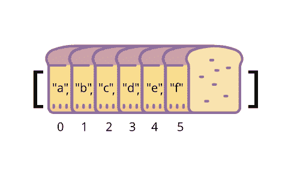
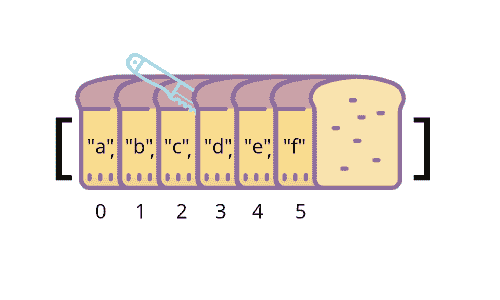
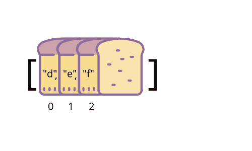
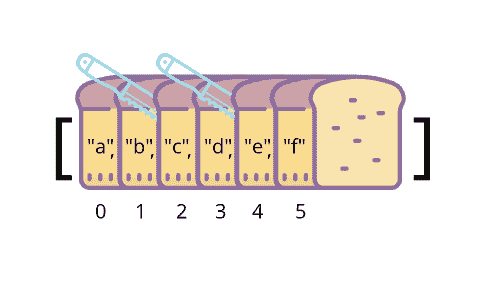
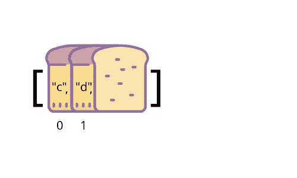
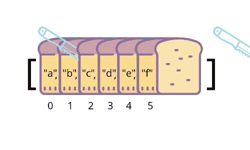
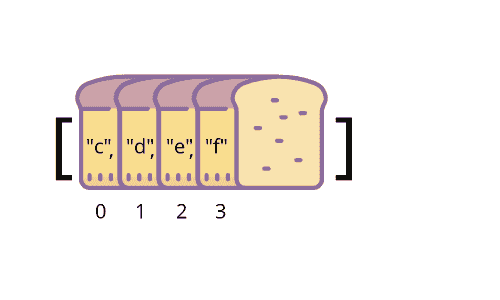
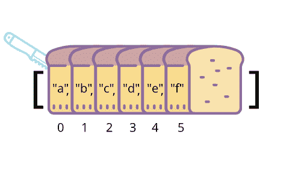

# 数组，无论你怎么分割它

> 原文：<https://dev.to/terabytetiger/arrays-any-way-you-slice-it-1lfl>

# [T1】简介](#intro)

数组有各种各样的内置方法，这些方法可能非常强大，但对初学者来说也非常吓人。在这篇文章中，我们将把`Array.slice()`方法分解成小块来帮助攻克一个有用的数组方法。

# 让我们来揉面包

对于此细分，我们将查看数组`bread = ["a", "b", "c", "d", "e", "f"]`。你可能会问自己:

> "为什么我们要把数组赋给一个变量`bread`？"

原因是我们将使用一条面包作为我们对数组的想象，其中每一片面包都是我们的`bread`数组中的一个元素，每个逗号都是我们可以切面包的一个点。

[](https://res.cloudinary.com/practicaldev/image/fetch/s--bQYMVjoa--/c_limit%2Cf_auto%2Cfl_progressive%2Cq_auto%2Cw_880/https://thepracticaldev.s3.amazonaws.com/i/6rto302vroq2h2e5udm6.png)

请注意，数组中每个元素下面的数字是该元素的索引。

# 磨刀霍霍

使用`slice()`方法，你可以通过指出你想要在哪个逗号处‘剪切’你的数组来操作一个数组。通过将参数传递到`slice()`中，我们将看到 3 种场景。

## 一个论点

当您将一个参数传递到`slice()`中时，您就指明了将面包切片的位置。**第一个参数将从数组的开头移除，直到指定的切片点**。因此，通过使用`bread.slice(3)`，我们表示我们希望在第三个逗号处进行剪切，并删除该逗号之前的所有内容。

```
var bread = ["a", "b", "c", "d", "e", "f"];
var slicedBread = bread.slice(3);

// slicedBread is ["d", "e", "f"] 
```

Enter fullscreen mode Exit fullscreen mode

切片:
[](https://res.cloudinary.com/practicaldev/image/fetch/s--Usn5gK14--/c_limit%2Cf_auto%2Cfl_progressive%2Cq_auto%2Cw_880/https://thepracticaldev.s3.amazonaws.com/i/1wcqqcap541cf3tpqlzn.png)

切片面包:
[](https://res.cloudinary.com/practicaldev/image/fetch/s--T1_e5d_m--/c_limit%2Cf_auto%2Cfl_progressive%2Cq_auto%2Cw_880/https://thepracticaldev.s3.amazonaws.com/i/2m80wneuhc46omi72310.png)

## 两个参数——都小于数组长度

当传递两个参数给`slice()`时，第一个参数的作用和传递一个参数一样，但是第二个参数呢？**第二个参数也指出了你想切面包的逗号，但是这次我们没有删除逗号前面的内容，而是删除了逗号后面的内容。**因此，如果我们使用`bread.slice(2,4)`，我们将在第二个逗号和第四个逗号处切面包，并丢弃不在这些切割点之间的所有内容。

```
var bread = ["a", "b", "c", "d", "e", "f"];
var slicedBread = bread.slice(2,4);

// slicedBread is ["c", "d"] 
```

Enter fullscreen mode Exit fullscreen mode

切片:
[](https://res.cloudinary.com/practicaldev/image/fetch/s--S-a9SOr6--/c_limit%2Cf_auto%2Cfl_progressive%2Cq_auto%2Cw_880/https://thepracticaldev.s3.amazonaws.com/i/xem9xdsv0pnc1ow6q0jl.png)

切片面包:
[](https://res.cloudinary.com/practicaldev/image/fetch/s--tuabcqku--/c_limit%2Cf_auto%2Cfl_progressive%2Cq_auto%2Cw_880/https://thepracticaldev.s3.amazonaws.com/i/w93j2d045n7otzw8vn8q.png)

## 两个参数——第二个参数大于数组长度

如果我们在第二个参数中传递一个很大的值，比如 100，会怎么样？嗯，这就像数出 94 块看不见/不存在的面包，然后在那一点切开- **这就像传入一个参数一样！**

```
var bread = ["a", "b", "c", "d", "e", "f"];
var slicedBread = bread.slice(2,100);

// slicedBread is ["c", "d","e", "f"] 
```

Enter fullscreen mode Exit fullscreen mode

切片:
[](https://res.cloudinary.com/practicaldev/image/fetch/s--7D9hv3LM--/c_limit%2Cf_auto%2Cfl_progressive%2Cq_auto%2Cw_880/https://thepracticaldev.s3.amazonaws.com/i/oac0h5zu71oid9ladvvm.png)

切片面包:
[](https://res.cloudinary.com/practicaldev/image/fetch/s--C3KZzkbp--/c_limit%2Cf_auto%2Cfl_progressive%2Cq_auto%2Cw_880/https://thepracticaldev.s3.amazonaws.com/i/4lhplrsi1syguknz169n.png)

## 其他切片方式

### 0 作为自变量

当你传入 0 时，这相当于在你吃面包之前切开空气- **它什么也不做**。

```
var bread = ["a", "b", "c", "d", "e", "f"];
var slicedBread = bread.slice(0);

// slicedBread is ["a", "b", "c", "d", "e", "f"] 
```

Enter fullscreen mode Exit fullscreen mode

[](https://res.cloudinary.com/practicaldev/image/fetch/s--Z1NJaXyv--/c_limit%2Cf_auto%2Cfl_progressive%2Cq_auto%2Cw_880/https://thepracticaldev.s3.amazonaws.com/i/f5a47grkx1gldptii3f9.png)

### 第一个论点> =第二个论点

当你传入同一个参数(`bread.slice(4,4)`)或者第二个参数小于第一个参数(`bread.slice(4,2)`)时，上面的规则同样适用，你剪切并丢弃第一个参数之前的所有内容，然后剪切并丢弃第二个参数之后的所有内容。**这将总是导致一个空数组**。

# 关闭

希望这个类比有助于消除围绕`Array.slice()`的任何困惑，并使数组更容易理解。如果您对数组或切片方法有任何疑问，请随时联系我们！