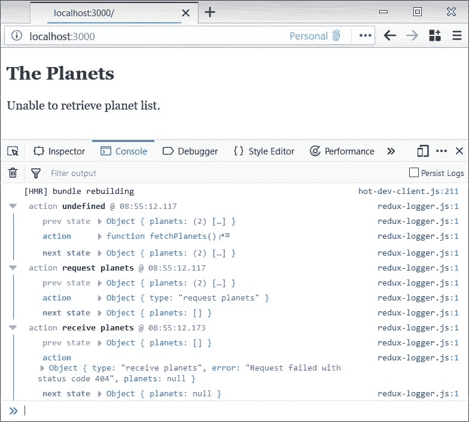
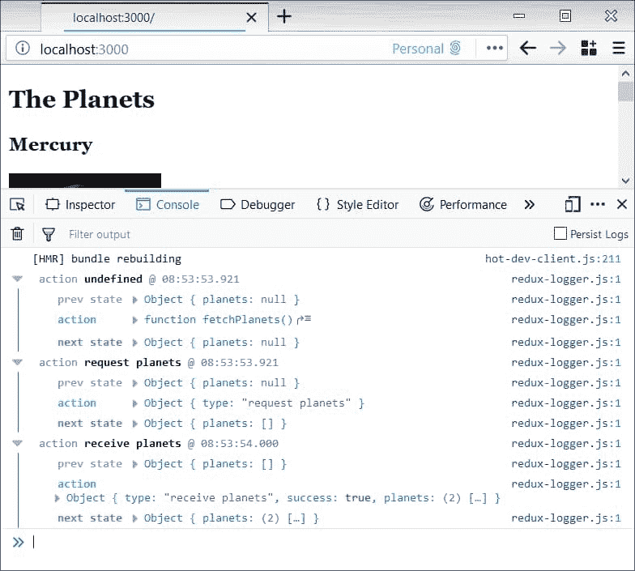

# React-Redux 中的异步操作

> 原文：<https://dev.to/jscrambler/asynchronous-operations-in-react-redux-22o5>

**这篇文章最初由 Camilo Reyes** 发表在 [Jscrambler 博客](https://blog.jscrambler.com/asynchronous-operations-in-react-redux/?utm_source=dev.to&utm_medium=referral)上。

在对浏览器编程时，异步操作是一个困难的挑战。

很难想象发送一个请求，然后等待一个没有阻塞的响应。浏览器可以将请求放在回调之后，继续执行代码。

React-Redux 库在不影响简单性的情况下为您完成了大部分工作。可以把 React 想象成用普通 HTML 呈现 UI 组件的库。Redux 是具有异步功能的状态管理库。

在过去，您可以通过链式回调来委托异步行为。这有局限性，因为大的回调链有回调地狱的风险。为了保持代码尽可能的干净，强烈的纪律性是必要的。当你缺乏坚实的原则时，回调地狱会使任何项目变得一团糟。

但是，有了 React-Redux，异步编程有什么样的改进呢？为此，我们将在太阳系的行星上做一个演示。目标是将它们与图像异步加载到页面上。我们将关注 Redux 的状态管理以及它如何处理异步行为。我们假设你有 npm 和 ES6 的工作知识。为了保持代码示例的重点，我们只展示相关的代码。如果你对更多的管道感兴趣，请随意查看 GitHub 上的整个[演示。](https://github.com/JscramblerBlog/async-operations-react-redux)

本演示的依赖关系如下:如果您正在跟进，请键入:

```
npm install --save next react react-dom prop-types axios redux react-redux redux-thunk redux-logger 
```

确保有一个`package.json`可用于保存所有依赖项。请随意探索每个依赖项将做什么。要记住的两个是发出异步请求的`axios`和管理异步状态的`redux-thunk`。

首先，获取我们将在整个演示中使用的常量。这些常量将驱动异步操作的状态:

```
export const REQUEST_PLANETS = 'request planets';
export const RECEIVE_PLANETS = 'receive planets'; 
```

该请求由组件的`componentDidMount`方法触发，然后触发`fetchPlanets`。为了帮助您直观地看到结果，下面是工作演示:

<center></center>

## 为什么不用 Ajax？

您可以将 Redux-Thunk 视为在浏览器中实现 Ajax 的另一种方式。thunk 描述了一个函数，它可以代替您稍后进行的计算。执行不会立即发生，而是被委托。

例如:

```
const foo = (i) => i + 1; 
```

在 JavaScript 中，您可能认为 thunk 是一个回调函数。回调函数委托计算，以便稍后执行。在 Redux-Thunk 中，您仍然使用同样的回调概念，但是以一种抽象的方式。Redux 的语句管理系统处理所有的实现细节。这消除了长回调链和回调地狱的风险。

在 Redux-Store 中连接 Redux-Thunk 的时间:

```
const logger = createLogger();

const planetStore = createStore(
  reducers,
  applyMiddleware(logger, thunk)
); 
```

至此，您已经为一些异步编程做好了准备。Thunk 现在设置动作调度程序，这样它就可以处理 thunk 回调函数。Redux-Store 是您将 Redux-Thunk 设置为中间件管道的地方。注意，我们借此机会包含了日志记录器，这样我们就可以看到 Redux-Thunk 的运行。记录器捕获调度程序消息，并在浏览器的控制台中打印出来。

## Axios 的异步动作

接下来，让我们设置通过商店发送的动作。在 Redux 中，动作就像在状态管理系统中荡漾的消息。你可以把任何 UI 交互看作一个动作。当您想象激发和接收消息来管理状态时，这非常合适。UI 记录状态变化，触发动作，Redux 通过消息处理状态变化。

`PlanetAction`如下:

```
let PlanetAction = {
  fetchPlanets() {
    return (dispatch) => {
      dispatch({ type: REQUEST_PLANETS });

      axios.get('/static/solar-system-planets.json')
        .then((response) => dispatch({
          type: RECEIVE_PLANETS,
          success: true,
          planets: response.data.planets
        }))

        .catch((error) => dispatch({
          type: RECEIVE_PLANETS,
          error: error.message,
          planets: null
        }));
    };
  }
}; 
```

注意使用`axios`通过承诺在浏览器中封装 Ajax 请求。`.then()`函数处理一个成功的响应。`.catch()`函数处理一个错误。React-Thunk 使您可以使用 Thunk 作为返回类型。底层状态管理系统处理调度程序。注意带`return (dispatch) => { }`的 thunk 的使用。

为了优雅地处理错误，我们选择在调度程序的消息中捕获`error.message`。这有助于我们调试应用程序，因为这条消息显示在控制台中。`.catch()`函数通过 dispatcher 回调函数启用错误处理。

控制台中的消息如下所示:

<center></center>

## 反应还原剂

缩减器接收消息，并通过一个纯函数返回当前状态。一个纯函数就是给定一个输入，你总是得到完全相同的结果。这种范式是函数式编程，它减少了程序中不可预测的行为。

下面是异步运行时改变状态的减速器:

```
const INITIAL_STATE = [];

const planets = (state = INITIAL_STATE, action) => {
  switch (action.type) {
    case REQUEST_PLANETS:
      return INITIAL_STATE;

    case RECEIVE_PLANETS:
      return action.planets;

    default:
      return state;
  }
}; 
```

我们可以重用`INITIAL_STATE`,因为应用程序在页面加载和请求期间有相同的数据。注意，结果总是与给定的输入一一匹配。Reducers 使用纯函数并返回异步操作中给定的状态。然后，动作分派器使用这个纯函数来计算当前状态。注意这个缩减器是 thunk 函数中的回调函数。

现在，下面是快乐之路的控制台消息:

<center></center>

## 结论

Redux-Thunk 有一个包装 Thunk 函数的异步方法。这包含了最好的编程，比如委托和纯函数。

如果您通过回调熟悉遗留 Ajax，那么 thunk 就没什么不同。React-Redux 抓住了你所知道的关于普通 JavaScript 的最好的东西，并将其包装起来以便于使用。这个库没有重新发明轮子，而是通过抽象来自动化声音编程。

最后，但同样重要的是，如果您正在开发 JavaScript 应用程序，并希望保护它们免受代码窃取和逆向工程的影响，请务必查看 [Jscrambler](https://jscrambler.com/code-integrity?utm_source=dev.to&utm_medium=referral) 。