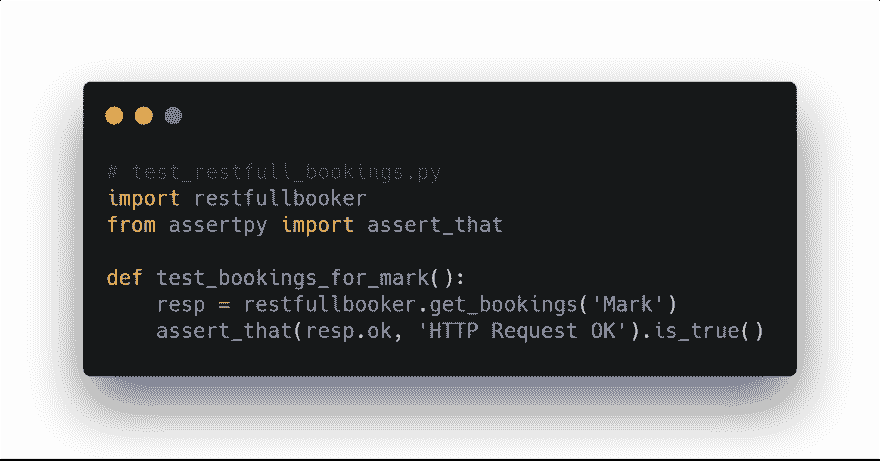

# 使用 Python 进行自动化 REST API 测试

> 原文：<https://dev.to/dowenb/automated-rest-api-testing-with-python-2jm5>

原贴:[https://www . dowen . me . uk/Automated-rest-API-testing-with-python/](https://www.dowen.me.uk/Automated-rest-api-testing-with-python/)

上次我向您介绍了我在 Python 中自动化所有“测试”的旅程的开始。我现在继续这个旅程，将焦点从前端转移到 Restful Web APIs。你可以在这里回头看看我上一篇帖子[。](https://www.dowen.me.uk/how-I-am-learning-to-test-the-internet-with-seleniumbase/)

# 探索、请求、断言

在这段旅程中，我将使用 python 模块[请求](https://pypi.org/project/requests/)和 [pyassert](https://pypi.org/project/pyassert/) 。

## 探索 API

在你提出请求之前，你需要理解你的测试 API。为此，我推荐使用 Rest 客户端。虽然你可能已经有了疯狂的卷发技能，但对于我们其他人，我建议使用[邮递员](https://www.getpostman.com)、[失眠](https://insomnia.rest)或[肥皂推](https://www.soapui.org)。

如果像我一样，您想在任何工作项目之外的一个安全的地方开发您的 API 测试技能，有一些很好的选择！

测试部有一个资源页面，列出了一些选项[网站来练习测试](https://www.ministryoftesting.com/dojo/lessons/websites-to-practice-testing)。我现在用的是[马克·温特汉姆](https://www.mwtestconsultancy.co.uk)的 [Restful Booker](https://restful-booker.herokuapp.com) 。

使用 API 文档开始您的探索。对于 Restful booker，您可以在这里找到。

为了学习更多关于测试 API 和使用 Postman 的知识，我推荐由 [Amber Race](https://twitter.com/ambertests) 编写的免费课程[通过测试自动化](https://testautomationu.applitools.com/exploring-service-apis-through-test-automation/)探索服务 API。

## 发出请求

受文章[Python 中的 API 集成——第 1 部分](https://realpython.com/api-integration-in-python/)的启发，我开始制作一个 Python 客户端来抽象与 Restful Booker API 的交互。本文的重点不是测试，而是向我们展示如何使用请求来构建 API 库。

这种抽象模式很棒，我们可以将它与断言框架一起使用来进行一些健壮的测试。

你可以仔细看看我的 Restful Booker 的 API 库，以及我在 [Pybooker](https://github.com/dowenb/pybooker) GitHub 存储库中的 rest 代码。

这个基本示例向 URL[https://restful-booker.herokuapp.com/booking/1/](https://restful-booker.herokuapp.com/booking/1/)发出 GET 请求，并将结果 JSON 响应体打印到 Python 控制台中。运行它会给我们带来:

因为该方法返回响应对象，所以我们不仅可以获得 JSON 主体，还可以获得有用的信息，如 HTTP 状态代码。

请求可以利用广泛的 HTTP 方法，探索它，看看你能做什么！

## 断言

好了，现在我们可以发出请求，并在对象中访问返回的响应。有了这个，我们可以开始实现一些自动检查，看看我们是否得到了我们所期望的。

为此，我使用了模块 [pyassert](https://pypi.org/project/pyassert/) ，你也可以使用其他断言库，如 [fluentcheck](https://github.com/csparpa/fluentcheck) 。我使用 Pytest 来运行我的测试。

虽然您几乎可以断言响应的每个方面，但最基本的检查是返回“OK”的响应。这意味着我们发出了一个有效的请求，并且服务没有抛出内部服务器错误。

下一步是断言 HTTP 状态代码。例如，对于一个你期望成功的 GET，你可能期望“200 成功”，而对于创建一个带有 POST 的新项目，你可能期望“201 已创建”。

你可以阅读更多关于 http 状态码 [HTTP 状态 DOGS](https://httpstatusdogs.com) 或 [HTTP 猫](https://http.cat)的信息。