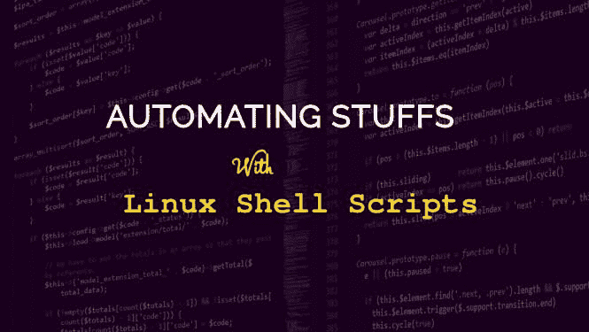

# 自动化:Linux Shell 脚本简介

> 原文：<https://dev.to/xeroxism/automating-stuffs-introduction-to-linux-shell-scripting-43bh>

<figure>[](https://res.cloudinary.com/practicaldev/image/fetch/s--Xp9ftzrX--/c_limit%2Cf_auto%2Cfl_progressive%2Cq_auto%2Cw_880/https://i1.wp.com/fossnaija.com/wp-content/uploads/2019/05/shell-script-banner-5.jpg%3Fresize%3D665%252C375%26ssl%3D1) 

<figcaption>贝壳文横幅——fossnaija.com</figcaption>

</figure>

最近，许多计算机用户习惯于使用点击式(图形)用户界面——GUI(T1)，因此一提到命令就让人害怕和不安。但是作为一个[Linux 用户](https://fossnaija.com/the-linux-user/)命令行[界面](https://fossnaija.com/gui-vs-cli-the-more-you-look-less-you-see/) (CLI)是[操作系统](https://fossnaija.com/installing-a-linux-operating-system/) (OS)不可或缺的一部分，也是非常必要的生产力或性能方面的。仍然有许多操作最好单独使用外壳来完成。这些年来，我们大多数关于[fosnaija](https://www.fossnaija.com/)的文章都突出了许多 Linux 配置和设置的命令解决方案。所以在这篇文章中，我们将讨论 Linux 的一个非常有用的命令行特性——SHELL 脚本。

Linux 命令行，也称为 [*shell*](https://fossnaija.com/the-linux-shell-in-a-nutshell/) ，是操作系统必不可少的一部分。shell 不仅仅是一个简单的 CLI 它有许多高级特性，可以让你在没有 GUI 的情况下与 Linux 交互。在这些特性中，有一个定义良好的(编程)语言语法，可以用来在操作系统上进行编程活动。使用此编程语法；变量可以被定义、赋值、保存在文件中(称为 shell 脚本)并像任何其他命令行程序一样执行。

例如，如果您有一系列经常使用的[Linux 命令](https://dev.to/xeroxism/6-commands-you-must-know-to-be-productive-on-the-terminal-h9a)(指令)，您可以将它们存储在 them 脚本中。然后就有可能让 shell 读取脚本文件并执行其中包含的命令。

Solets 展示了如何使用 bash(*BourneAgain shell*)创建和执行一个简单的 SHell 脚本，bash 是最流行的 Linux shells 之一。

**创建一个 SHELL 脚本**

要创建 shell 脚本，您需要使用您最喜欢的文本编辑器(如 gedit、vi、nano、geany 等)将它编写在文本文件中。

在文件中键入以下内容；

```
 #!/bin/bash

 echo “Hello World!” 
```

Enter fullscreen mode Exit fullscreen mode

然后将文件另存为“ *hello* ”(不带" ")。

**执行外壳脚本**

更改文件*你好*的[文件访问权限](https://fossnaija.com/assigning-and-removing-file-access-permissions/) (FAP)，使其可执行；使用以下命令:

`chmod u+x hello`

1.  然后，您可以使用以下命令执行 shell 脚本:

`./hello`

然后你会得到一个你好世界！ _ 打印在终端上。

刚刚发生了什么？

*   第 **#！**字符应该是解释器执行的任何脚本的前两个字符；在本例中是***/bin/bash***——因为我们使用了 bash shell。如果你想让 */bin/ksh* 成为脚本解释器，你应该写 ***#！脚本开头的/bin/ksh*** 。

*   用于在屏幕上显示消息的 cho 命令。在这种情况下，echo 命令显示双引号(" "， *HelloWorld！*，在屏幕上。

在本系列后面的文章中，我们会看到一些常见的 Linux 任务，我们可以使用 shell 脚本来实现自动化。但是现在我们来谈谈您刚刚学到的关于 shell 脚本的知识。

HappyLinux 'NG！

帖子[自动化:Linux Shell 脚本简介](https://fossnaija.com/automating-stuffs-introduction-to-linux-shell-scripting/)最早出现在 [Foss Naija](https://fossnaija.com) 上。