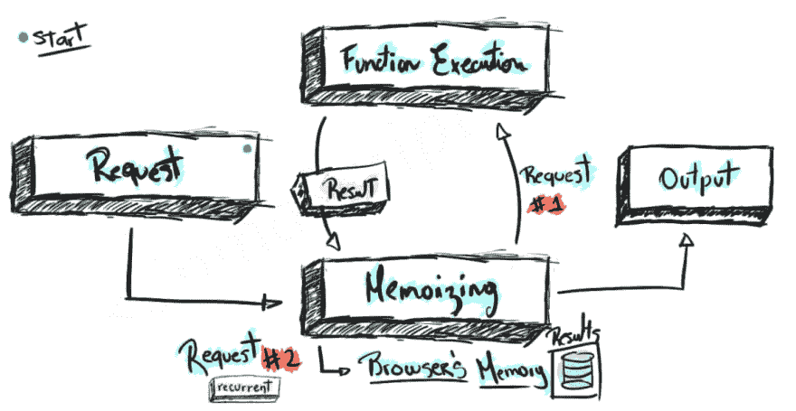
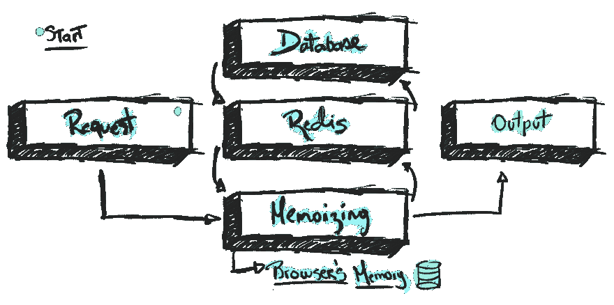

# 通过利用 javascript 中的记忆来避免重新计算繁重的任务

> 原文：<https://dev.to/duranenmanuel/avoid-recomputing-heavy-tasks-by-leveraging-memoization-in-javascript-4bad>

*原发布于[英文脚本](https://enmascript.com/articles/2019/04/22/avoid-recomputing-heavy-tasks-by-leveraging-memoization-in-javascript)T3】*

Javascript 是一种*奇妙的*动态语言；它允许我们在节点的后端层或应用程序的前端做很多事情。我们在 javascript 中做得最多的事情之一是端点调用，这些调用后来被用来计算信息，并最终以一种友好而优雅的方式显示给用户。我们通常会不惜一切代价避免额外的请求和计算，以使我们的应用程序以最佳状态运行。在这篇文章中，我们将探索一种技术，这将有助于我们改善这一问题，所以没有进一步的麻烦，让我们进入它。

## 前提

这个想法是利用浏览器的内存来存储通常需要大量计算才能获得的数据，并且这些数据很可能在未来被重用，这样我们就可以随时访问这些信息，而不必重新运行任务来获取这些信息，这种技术被称为*记忆化*。

## 了解背后的动态

下图解释了记忆化背后的基本流程，以便更好地理解它在我们的应用中的应用:

**我们来分析一下这张图片:**

[](https://res.cloudinary.com/practicaldev/image/fetch/s--ehQYpatP--/c_limit%2Cf_auto%2Cfl_progressive%2Cq_auto%2Cw_880/https://enmascript.cimg/2019-04-20-memoizing-explained.png)

我们试图用参数 A 和 b 调用一个记忆化的函数。在执行它之前，记忆化层检查过去是否用相同的参数调用过它，但是，因为不是这样，它传递信息并在第一个请求(请求#1)时执行它。然后，该函数进行计算，并将结果返回到存储层，以备后用。现在，下一次我们试图用相同的参数运行函数时，记忆层将检查参数是否重复出现，因为它们会重复出现，所以我们将从内存中获取信息(请求#2 ),然后直接返回给我们。

## 何时申请

当我们的功能满足以下要求时，建议我们采用这种技术:

1.  执行繁重的任务，因此存储结果可以帮助我们在应用程序中节省一些处理时间。

2.  始终收到相同的参数，这样我们就可以避免重复计算数据。

## 记忆我们的功能需要什么？

理想情况下，要记忆一个函数，它应该遵循 **purity** 的原则，这意味着它不应该包含副作用，它应该明确地依赖于它的参数，并为传递的相同参数返回相同的输出。这样，我们可以保证一个成功的记忆层，它是自动的和参数相关的；*这是这项技术持续发挥作用的关键*。

## 一个用例

正如开头提到的，内存化的一个很好的用例是，当我们需要的数据已经获取，并且清理和显示这些数据的计算已经执行时，避免发出额外的网络请求。

如果你有一个我们称之为“健壮”的体系结构，你可能在后端有一个缓存层，比如 Redis，以避免每次用户请求重复信息时都收到连续的数据库点击。如果我们将这种技术应用于执行 GET 请求的函数，我们甚至可以避免进行端点调用，这意味着网络不会被任务聚集。让我们来看看如何解释这一点:

[](https://res.cloudinary.com/practicaldev/image/fetch/s--aYwq3CBA--/c_limit%2Cf_auto%2Cfl_progressive%2Cq_auto%2Cw_880/https://enmascript.cimg/2019-04-20-memoizing-with-requests.png)

现在，也就是说，当你注意到你的函数[满足需求](http://localhost:8000/articles/2019/04/19/avoid-recomputing-heavy-tasks-by-leveraging-memoization-in-javascript#when-to-apply)时，记忆化就是你将在你的应用中应用的东西。

## 实现一个简单的记忆器

好了，已经有了足够的绘图和理论，让我们创建自己的定制记忆。

就我们所知，我们知道 *memoizer* 应该接收一个函数作为参数，然后，我们需要将结果存储在一些数据结构中，以便能够在以后基于传递的函数和参数检索它们，让我们看看:

```
/**
 * Receives a function which would be memoized
 */
function memoize(fn) {
    /* we'll use this object to store the results */
    let cache = {};

    /**
     * Returns a function that will receive the arguments
     * that will be passed to the memoized function (fn).
     */
    return (...args) => {
        /* We stringify the arguments in case they're non-primitive values */
        const cacheKey = JSON.stringify(args);

        /* were the arguments already passed? if no, then store the result */
        if (!(cacheKey in cache)) {
            cache[cacheKey] = fn(...args);
        }

        /* We then return the stored result */
        return cache[cacheKey];
    };
} 
```

然后我们会这样使用它:

```
/* A simple add function that will be memoized */
function add(a,b) {
    console.log('Executing the sum');

    return a + b;
}

/* we pass the function definition to the memoizer */
const memoizedAdd = memoize(add);

/* we now run the memoized add function */
memoizedAdd(1,2); // logs "Executing the sum" and returns 3
memoizedAdd(1,2) // doesn't log anything, returns 3 directly. 
```

在`memoize`函数的实现中，由于闭包,`cache`对象被存储在内存中，由于变量`memoizedAdd`,我们能够执行返回的函数并获得所需的结果。如果你在试图理解这个概念时有问题，我推荐你阅读关于[高阶函数](https://enmascript.com/articles/2019/02/27/higher-order-functions-and-some-great-applications-in-javascript)的文章。

## 更好的实现

**如果你稍微分析一下前面的实现，你会发现我们需要担心几件事情:**

<mark>**内存消耗**，如果我们正在存储的结果和键是大型数据集，并且我们多次存储它们，这*可能会*在未来导致内存问题，这不会经常发生，但记住这一点很重要。</mark>

了解了这一点，这里有一个更完整的实现，它允许你清除缓存的元素。

```
function memoize(fn) {
    let cache = {};

    function clear() {
        cache = {};
    }

    function get() {
        return Object.freeze(Object.assign({}, cache));
    }

    function count() {
        return Object.keys(cache).length;
    }

    function process() {
        const cacheKey = JSON.stringify(arguments);

        if (cacheKey in cache) {
            return cache[cacheKey];
        }

        cache[cacheKey] = fn.apply(null, arguments);

        return cache[cacheKey];
    }

    return Object.freeze({
        process,
        clear,
        count,
        get
    });
} 
```

有了它，我们可以在需要的时候手动清除缓存，使用示例:

```
const memoizedAdd = memoize(add);

memoizedAdd.process(1,2); // Executes the function
memoizedAdd.process(1,2); // Hits the cache

memoizedAdd.get(); // returns the object with the memoized elements
memoizedAdd.count(); // returns the number of elements stored so far
memoizedAdd.clear(); // clears the cache 
```

就这样，我们有了一个更完整的实现。此外，感谢`count`和`clear`方法，我们可以在认为相关时清除缓存。

值得一提的是，这种技术被广泛使用，如果你过去在 redux 中使用过选择器，你会发现 [Reselect](https://github.com/reduxjs/reselect) 应用了记忆化；像`lodash`这样的库也有自己的实现...

<mark>**重要的是要知道:**你并不明确需要一个叫做 *memoize* 的函数或者一个孤立的函数来应用这种技术，只要你的实现尊重记忆化背后的原则，你就可以基于你正在处理的函数以一种定制的方式来实现它，本文中的例子只是应用这一原则的一种可重用的方式。</mark>

好了，伙计们，我想这就是现在，我希望你喜欢这篇文章...如果是这样的话，记得与你的朋友和同事分享。如果有任何问题，记得你可以在推特上联系我，电话是 [@duranenmanuel](https://twitter.com/duranenmanuel) 。

下一集再见！