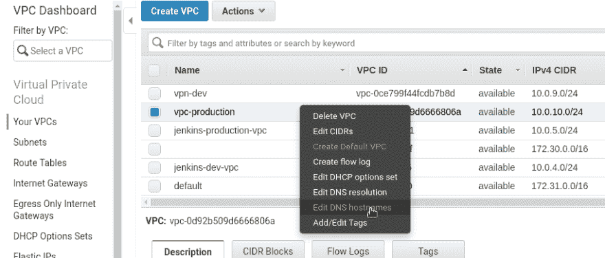
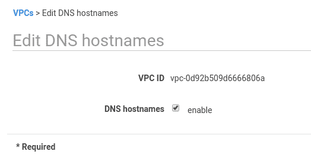
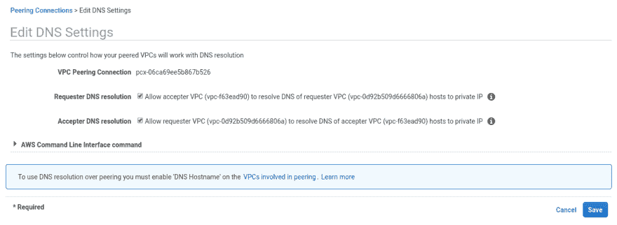
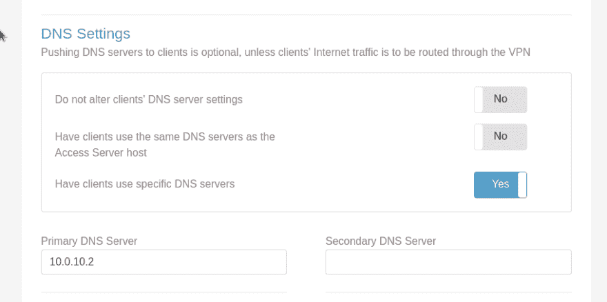

# AWS:OpenVPN 访问服务器的 VPC 对等 DNS 解析和 DNS 设置

> 原文：<https://dev.to/setevoy/aws-vpc-peering-dns-resolution-and-dns-settings-for-openvpn-access-server-pnp>

[](https://res.cloudinary.com/practicaldev/image/fetch/s---dkzETw5--/c_limit%2Cf_auto%2Cfl_progressive%2Cq_auto%2Cw_880/https://rtfm.co.ua/wp-content/uploads/2014/11/aws-logo-square-02-e1417012834176-1.png) 我们有一台运行着 OpenVPN 接入服务器的 VPC。此 VPC 与我们 AWS 帐户中的其他 VPC 相关联。

目前的问题是，当用户连接到 VPN 以将 DNS 解析为 EC2 实例私有 IP 时，我们在 VPN 主机上使用`dnsmasq`服务，该 VPN 主机有一个`/etc/dnsmasq.hosts`文件，其中手动添加了必要域的私有 IP。

你可以在[OpenVPN:настрокиDNSиdnsmasq](https://rtfm.co.ua/openvpn-nastrojki-dns-i-dnsmasq/)帖子(Rus)中了解更多关于当前设置的信息。

更正确的方法是使用 AWS VPC 的 DNS 解析选项。你可以在 [DNS: установка BIND，DNS 负载平衡и基于网络的路由через视图](https://rtfm.co.ua/dns-ustanovka-bind-dns-load-balancing-i-network-based-routing-cherez-view/#DNS_AWS)帖子(Rus)中阅读更多关于 AWS VPC 中 DNS 的内容。

VPC DNS 解析文档—[为 VPC 对等连接启用 DNS 解析支持](https://docs.aws.amazon.com/en_us/vpc/latest/peering/modify-peering-connections.html)。

下面的帖子描述了用 OpenVPN 配置 VPC 和用ес2 配置 VPC 之间的 DNS 解析，其中我们运行了我们的 Bitwarden 密码管理器(参见 [Bitwarden:在 AWS EC2](https://dev.to/setevoy/bitwarden-an-organization-s-password-manager-self-hosted-version-installation-on-an-aws-ec2-1plg) 上安装一个组织的密码管理器自托管版本)。这个ес2 有弹性 IP 附加，有域名【accounts.example.com】T2 通过 A 记录指向这个 EIP。

### DNS 主机名

docs—[您的 VPC 中的 DNS 支持](https://docs.aws.amazon.com/en_us/vpc/latest/userguide/vpc-dns.html#vpc-dns-support)。

如果 VPC 没有启用 *DNS 主机名*,首先需要将其打开。

然后，VPC 会将公共域名分配给该 VPC 中的公共 IP，然后可以使用这些公共域名将它们解析为私有 IP。

也就是说，当从全球解析域时，它将被解析为其公共 IP，但如果从 VPC 调用它，它将被解析为该 VPC 中某个实例的私有 IP。

去 VPC，找到你的 VPC，选择*编辑 DNS 主机名*:

[](https://rtfm.co.ua/wp-content/uploads/2019/05/Screenshot_20190516_111032.png)

启用 *DNS 主机名*:

[](https://rtfm.co.ua/wp-content/uploads/2019/05/Screenshot_20190516_111325.png)

### 通过 VPC 对等进行 DNS 解析

下一步——通过对等在 VPC 之间打开 DNS 解析。

进入 *VPC >对等连接*，选择您的对等，选择*编辑 DNS 设置*:

[](https://rtfm.co.ua/wp-content/uploads/2019/05/Screenshot_20190516_110639.png)

在此启用两个选项:

[](https://rtfm.co.ua/wp-content/uploads/2019/05/Screenshot_20190516_110729.png)

现在让我们检查一下。

首先从办公室开始，检查来自全球的 DNS 解析:

```
[setevoy@setevoy-arch-work ~] $ dig ec2-63-***-***-138.eu-west-1.compute.amazonaws.com +short
63.***.***.138 
```

现在——从运行 OpenVPN 的主机上，通过 VPC 对等来检查解析如何工作:

```
openvpnas@openvpnas2:~$ dig ec2-63-***-***-138.eu-west-1.compute.amazonaws.com +short
172.31.41.159 
```

172 . 31 . 41 . 159–是 Bitwarden 实例的私有 IP，一切正常。

### Route53

接下来，需要更新 accounts.examle.com 域*的 Route53 记录，因为它拥有位管理员 EC2 的公共 IP`IN A`。将其更改为`CNAME`,并设置该实例的公共 DNS 名称:*

[](https://rtfm.co.ua/wp-content/uploads/2019/05/Screenshot_20190516_115441.png)

等待几分钟来传播 DNS，并再次从办公室进行检查:

```
[setevoy@setevoy-arch-work ~] $ dig accounts.examle.com +short
ec2-***-***-252-138.eu-west-1.compute.amazonaws.com.
63.***.***.138 
```

并且从 OpenVPN 实例:

```
openvpnas@openvpnas2:~$ dig accounts.examle.com +short
ec2-63-***-***-138.eu-west-1.compute.amazonaws.com.
172.31.41.159 
```

再次得到 172 . 31 . 41 . 159–所有作品。

### OpenVPN 中的 DNS

进入 *VPN 设置*，在这个 VPC 中设置一个 DNS 的私有 IP。

VPC 中的 DNS 总是作为类似 *.2* 的地址。

在目前的情况下，我们有针对 OpenVPN 的 VPC 和 *10.0.10.0/24* CIDR，因此 DNS 将位于 *10.0.10.2* :

[](https://rtfm.co.ua/wp-content/uploads/2019/05/Screenshot_20190516_120829.png)

您可以检查该 VPC 的任何主机是否提供 DNS:

```
openvpnas@openvpnas2:~$ dig @10.0.10.2 ya.ru +short
87.250.250.242 
```

现在转到 OpenVPN 管理页面并设置 DNS:

[](https://rtfm.co.ua/wp-content/uploads/2019/05/Screenshot_20190516_121007.png)

从办公室连接到 VPN:

```
[setevoy@setevoy-arch-work ~] $ sudo openvpn --config vpnroot-client.ovpn
...
Thu May 16 12:05:31 2019 /etc/openvpn/update-resolv-conf tun0 1500 1553 172.27.240.75 255.255.248.0 init
dhcp-option DNS 10.0.10.2
... 
```

并查看*accounts.examle.com*域:

```
[setevoy@setevoy-arch-work ~] $ dig accounts.examle.com +short
ec2-63-***-***-138.eu-west-1.compute.amazonaws.com.
172.31.41.159 
```

*172.31.41.159* 再次-所有工程。

完成了。

### 类似的帖子

*   <small>02/21/2019</small>[OpenVPN:OpenVPN 接入服务器设置和 AWS VPC 对等配置](https://dev.to/setevoy/openvpn-openvpn-access-server-set-up-and-aws-vpc-peering-configuration-5fpg) <small>(0)</small>
*   <small>02/22/2019</small>[OpenVPN:DNS 和 dnsmasq 配置](https://dev.to/setevoy/openvpn-dns-and-dnsmasq-configuration-225f) <small>(0)</small>