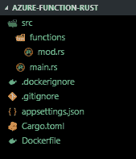
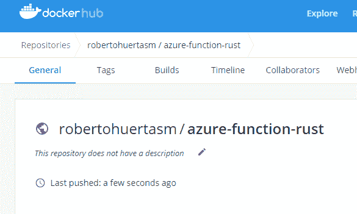
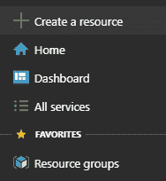
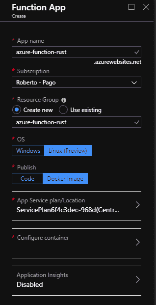
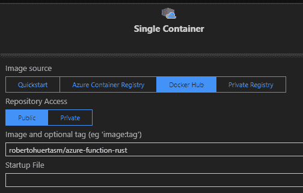

# 用 Rust 写的 Azure 函数

> 原文：<https://dev.to/robertohuertasm/azure-functions-written-in-rust-mjc>

前几天我们讨论了如何在 Rust 中编写 [AWS Lambdas。今天，我们将学习如何使用](https://dev.to/robertohuertasm/aws-lambda-functions-written-in-rust-3bob) [Rust](https://www.rust-lang.org/) 和 [azure-functions-sdk](https://github.com/peterhuene/azure-functions-rs) 库来创建和部署 [Azure 函数](https://docs.microsoft.com/en-us/azure/azure-functions/)。

## 让我们来构建我们的第一个 Azure 函数吧！

在我们继续之前，我想指出我们将要构建的`Azure Function`的代码可以在[这里](https://github.com/robertohuertasm/azure-function-rust)找到，如果你想看的话。

但是，首先。正如我们之前所说的，我们将利用 azure-functions-sdk 库，这是由{\\ lang 1033 ,}的高级软件工程师{\\ lang 1033 {\\ lang 1033 ,} T2 {\\ lang 1033 {\\ lang 1033 ,}彼得·休恩{\\ lang 1033 ,}编写的工具。网核心团队。

这个工具在有很好的[文档记录，使用起来也很简单，但是它只在](https://docs.rs/azure-functions/0.3.0/azure_functions/)的[夜晚得到支持，所以我们必须安装`nightly compiler`，以防我们还没有安装:](https://doc.rust-lang.org/1.5.0/book/nightly-rust.html) 

```
rustup install nightly 
```

Enter fullscreen mode Exit fullscreen mode

然后，我们必须将[夜间](https://doc.rust-lang.org/1.5.0/book/nightly-rust.html)设置为我们的默认分销渠道:

```
rustup default nightly 
```

Enter fullscreen mode Exit fullscreen mode

写这篇帖子的时候，似乎`Azure Functions`根本不支持[锈](https://www.rust-lang.org/)。

要获得支持语言的完整列表，你可以看一下 [Azure 函数文档](https://docs.microsoft.com/en-us/azure/azure-functions/supported-languages)。

希望它支持`Docker containers`的用法！

## 创建我们的 Azure 功能项目

首先，我们必须使用`cargo install` :
安装`Azure Functions for Rust SDK`

```
cargo install azure-functions-sdk 
```

Enter fullscreen mode Exit fullscreen mode

一旦我们安装了这个，我们将有一个新的`func`命令可用，我们可以使用它来创建新的应用程序，构建它们并在本地运行它们。

让我们创建一个新项目并将`cd`放入生成的文件夹:

```
cargo func new-app azure-function-rust
cd azure-function-rust 
```

Enter fullscreen mode Exit fullscreen mode

用您选择的 IDE 打开它，您应该能够看到一个具有以下结构的项目:

[](https://res.cloudinary.com/practicaldev/image/fetch/s--MD5go9nh--/c_limit%2Cf_auto%2Cfl_progressive%2Cq_auto%2Cw_880/https://thepracticaldev.s3.amazonaws.com/i/qc7p0ydna6icy8j73arr.png)

如你所见，`func`命令已经生成了一个脚手架项目，几乎所有东西都准备好运行你的 [Azure 函数](https://docs.microsoft.com/en-us/azure/azure-functions/)！

## 编写我们的第一个函数

我们将创建一个`hello`函数，它将能够从`querystring`和`body`中读取一个`name`参数，然后返回一个包含该名称的句子。我知道这很基本也很简单，但是这个想法是为了关注如何使用这个工具，而不是关于[生锈](https://www.rust-lang.org/)的细节😉。

基本上，我们必须将焦点放在`src > functions`文件夹中。在那里，我们将找到一个`mod.rs`文件，它将作为我们将要创建的所有导出函数的声明(在我们的例子中是一个)。

我们稍后将回到`mod.rs`，但是在此之前，我们必须创建一个包含我们的`hello function`的定制模块。在`functions`文件夹中，只需创建一个`hello.rs`文件，并将其写入:

```
use azure_functions::func;
use azure_functions::bindings::{HttpRequest, HttpResponse};
use serde_derive::Deserialize;

// Struct that will hold information about the body of the request.
#[derive(Deserialize)]
pub struct Body {
  name: String,
}

// The func attribute marks this fn as the function to be used by Azure Functions.
#[func]
// See https://docs.microsoft.com/en-us/azure/azure-functions/functions-triggers-bindings#supported-bindings
// See also https://github.com/peterhuene/azure-functions-rs/blob/master/README.md#azure-functions-bindings
#[binding(name="request", auth_level="anonymous")]
// The function will just check for a name parameter in the querystring
// or for a JSON Body structure in the body of the request.
pub fn hello(request: &HttpRequest) -> HttpResponse {
  // Logs the request on the Azure Functions Host.
  info!("Request: {:?}", request);

  // checking the query string
  if let Some(name) = request.query_params().get("name") {
    return format!("Hello from Rust, my dear {}! (qs)", name).into();
  }

  // checking the body
  if let Ok(body) = request.body().as_json::<Body>() {
    return format!("Hello from Rust, my dear {}! (body)", body.name).into();
  }

  "Hello from Rust, my dear default user with no params!".into()
} 
```

Enter fullscreen mode Exit fullscreen mode

为了正常工作，我们还必须安装一些 [serde 板条箱](https://serde.rs/)。打开您的`Cargo.toml`并插入以下依赖项:

```
[dependencies]
azure-functions = "0.3.0"
log = "0.4.6"
serde = "1.0.82"
serde_derive = "1.0.82"
serde_json = "1.0.33" 
```

Enter fullscreen mode Exit fullscreen mode

最后，我们将返回到我们的`mod.rs`文件，打开它并导出我们全新的`hello.rs`模块:

```
mod hello;

pub const FUNCTIONS: &[&azure_functions::codegen::Function] = azure_functions::export!{
  hello::hello,
}; 
```

Enter fullscreen mode Exit fullscreen mode

## 本地运行 Azure 功能

好了，在本地运行函数超级简单。只要在你的终端上执行这个命令:

```
cargo func run 
```

Enter fullscreen mode Exit fullscreen mode

如果你浏览到`http://localhost:8080`，你应该能看到类似这样的内容:

[](https://res.cloudinary.com/practicaldev/image/fetch/s--bc384s1W--/c_limit%2Cf_auto%2Cfl_progressive%2Cq_auto%2Cw_880/https://thepracticaldev.s3.amazonaws.com/i/xrxamuv3i4g9ky9oqi19.png)

凉爽的🎉，现在，要执行我们的函数，只需使用下面的 url: `http://localhost:8080/api/hello?name=Reader`。

您应该会看到类似下图的内容:

[](https://res.cloudinary.com/practicaldev/image/fetch/s--7AJzr5sO--/c_limit%2Cf_auto%2Cfl_progressive%2Cq_auto%2Cw_880/https://thepracticaldev.s3.amazonaws.com/i/imv84igh32mulauo88pf.png)

## 将我们的功能部署到 Azure

正如我们之前提到的，为了能够使用 [Rust](https://www.rust-lang.org/) ，我们必须利用`Docker containers`的力量。

不幸的是，这是有代价的，因为我们将无法使用[消费计划](https://docs.microsoft.com/en-us/azure/azure-functions/functions-scale#consumption-plan)，这基本上意味着你只有在你的功能运行时才失去支付能力。您马上就会看到，我们必须创建一个自定义的`App Service Plan`。

但在此之前，我们必须构建我们的项目，创建一个`Docker image`并将其推送到`Docker Hub`(或者您的自定义注册表)。

我们开始吧！

### 构建 Azure 功能

让我们建造我们的`Azure Function` :

```
cargo func build 
```

Enter fullscreen mode Exit fullscreen mode

这将创建一个名为`azure-functions/<name_of_your_project>`的`Docker image`。在我们这里，如果你去 T2，你应该能看到一只叫做 T4 的 T3。

现在，为了将其推送到`Docker Hub`，我们必须使用我们的`Docker`帐户登录。

让我们创建一个新的`tag` :

```
docker tag azure-functions/azure-function-rust <username>/azure-function-rust
# eg. docker tag azure-functions/azure-function-rust robertohuertasm/azure-function-rust 
```

Enter fullscreen mode Exit fullscreen mode

如果你再做一次`docker images`，你应该会看到标签。

最后，让我们把它推到`Docker Hub`并检查图像是否已经正确上传:

```
docker push <username>/azure-function-rust 
```

Enter fullscreen mode Exit fullscreen mode

[](https://res.cloudinary.com/practicaldev/image/fetch/s--ZzCFq33C--/c_limit%2Cf_auto%2Cfl_progressive%2Cq_auto%2Cw_880/https://thepracticaldev.s3.amazonaws.com/i/lzbvvbra1rg4do3xhdmz.png)

### 在 Azure 门户中创建我们的 Azure 功能

进入你的 [Azure 门户网站](https://portal.azure.com)，点击`Create a resource`选项。

[](https://res.cloudinary.com/practicaldev/image/fetch/s--_6WXWK0I--/c_limit%2Cf_auto%2Cfl_progressive%2Cq_auto%2Cw_880/https://thepracticaldev.s3.amazonaws.com/i/rd75idryqrgfygal97sp.png)

寻找`Function App`并创建一个。

然后相应地填写表格:

[](https://res.cloudinary.com/practicaldev/image/fetch/s--FLItvdct--/c_limit%2Cf_auto%2Cfl_progressive%2Cq_auto%2Cw_880/https://thepracticaldev.s3.amazonaws.com/i/4ce1s8iabx78ngys6ij6.png)

请确保根据您的位置和价格等级选择适合您的`App Service Plan`。

最后，让我们配置容器并创建`Azure Function`:

[](https://res.cloudinary.com/practicaldev/image/fetch/s--cgN90ymp--/c_limit%2Cf_auto%2Cfl_progressive%2Cq_auto%2Cw_880/https://thepracticaldev.s3.amazonaws.com/i/zf6w4ulx17eae5gouz7m.png)

现在等待它被部署。

## 检查是否一切正常

> **注意**:你会注意到下面的`Azure Function`网址不起作用。由于价格上涨，我决定停止生产`App Service Plan`。

一旦您的`Azure Function`被部署，只需浏览到其对应的 URL 并检查一切正常。在我的例子中，网址是[https://azure-function-rust.azurewebsites.net](https://azure-function-rust.azurewebsites.net)。

如果你只是浏览那里，你会看到与我们在本地测试时看到的相同的蓝屏，所以让我们继续浏览到[https://azure-function-rust.azurewebsites.net/api/hello?name=Reader](https://azure-function-rust.azurewebsites.net/api/hello?name=Reader) 。

你看到了吗？

[](https://res.cloudinary.com/practicaldev/image/fetch/s--7AJzr5sO--/c_limit%2Cf_auto%2Cfl_progressive%2Cq_auto%2Cw_880/https://thepracticaldev.s3.amazonaws.com/i/imv84igh32mulauo88pf.png)

现在尝试提出一个`POST`请求，看看会发生什么！😉

## 结论

如你所见，使用 [Rust](https://www.rust-lang.org/) 创建一个 [Azure 函数](https://docs.microsoft.com/en-us/azure/azure-functions/)非常简单。然而，不得不为此使用[码头](https://www.docker.com/)和不得不放弃[消费计划](https://docs.microsoft.com/en-us/azure/azure-functions/functions-scale#consumption-plan)感觉有点过分。

在我看来，虽然用 Rust 编写 [AWS Lambdas 感觉有点复杂，但如果你愿意节省一些钱并利用自动缩放功能，这似乎是一个更好的选择。让我们期待](https://robertohuertas.com/2018/12/02/aws-lambda-rust)[微软](https://www.microsoft.com/)尽快增加对 [Rust](https://www.rust-lang.org/) 的支持😜！

-
原载于 2018 年 12 月 22 日[robertohuertas.com](https://robertohuertas.com/2018/12/22/azure-function-rust/)。