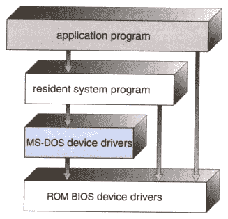
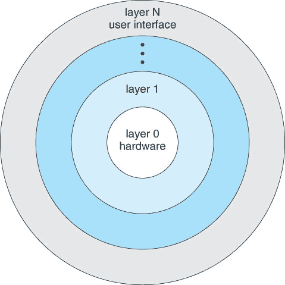

# 基本操作系统服务和结构。

> 原文：<https://dev.to/hrishi2710/basic-operating-system-services-and-structures-275e>

操作系统(OS)为用户提供了与硬件通信的接口。

操作系统主要有三个功能

1.  提供服务
2.  系统调用
3.  用户界面

#### **服务**

文件维护、输入输出、资源分配、通信等服务。这些服务是在系统调用的帮助下完成的。

#### **系统调用**

系统调用为操作系统提供的服务提供了一个接口。几个系统调用是:

*   进程控制——任何载入内存并准备执行的程序都被称为**进程**。操作系统提供对这些过程的控制，如读取输入、错误检测等。
*   文件操作-读取，写入，删除文件等。
*   设备操作-从设备中读取，在存储器中设置适当的参数以写入设备等。
*   信息操作——在用户程序和操作系统之间传递信息，如*时间()*、*日期()*等。
*   通信-为设备之间的数据传递设置通信协议。这可以通过两种方式实现:**消息传递模型**和**共享内存模型**。在前一种模式中，消息在使用 *hostid()* 和 *clientid* 的设备之间传递。在后一种模型中，数据放在共享内存中。消息共享模式主要用于较小的数据量，因为它比共享内存模式花费更多的时间进行通信，因为在后一种模式中，数据以内存传输的速度共享。
*   保护和安全-保护系统免受恶意软件，错误等。

#### **用户和 OS 界面**

用户界面基本上有三种类型:**命令行 UI** (如 UNIX)、**批处理**、 **GUI** (如 Windows)

操作系统界面由用于读取用户命令并相应操作的程序组成。这是通过命令解释器完成的。命令解释器有两种工作方法:

1.  命令解释器本身包含代码并相应地设置参数。删除一个文件的命令可能会导致命令解释器跳转到它自己的代码中设置删除参数的部分，然后进行适当的系统调用。
2.  命令解释器使用系统调用来完成任何工作。比方说，给出了一个命令`rm file.txt`。解释器根本不理解这些代码。它将搜索名为`rm`的文件并将该文件加载到内存中，并使用参数`file.txt`执行该文件。

#### **OS 结构**

1.简单结构- DOS 有这种类型的结构。

DOS 的结构:

在 DOS 下，用户应用程序可能绕过操作系统，直接写入 ROM 本身，这样更容易出错。

2.分层方法——操作系统服务被建模成多个层，硬件是最底层，用户界面是最顶层。

分层结构:

这里，有一点需要注意，顶层只能与下层通信。因此，必须正确地进行图层规划。此外，在这种结构中，调试更加容易，因为调试是逐层进行的，并且可以确定问题的确切位置。

3.微内核——内核变得更小，以使操作系统快速重启，避免冲突。微核是写在只读存储器上的，所以它不能被修改。只有最重要的系统服务和调用被嵌入到微内核中，其余的系统调用被写入并加载到磁盘上。

4.模块——在微内核方法中，系统调用存在于磁盘中，这是一个缺点，因为用户应用程序也存在于磁盘中，所以更不稳定，因此容易被修改，容易出现致命错误。为了解决这个问题，系统调用被写到磁盘上，并以模块的形式出现。当需要时，这些模块被加载以写在 EPROM(可擦除可编程 ROM)而不是 ROM 中的内核，以便在需要时可以修改它。

#### **OS 调试**

每当遇到错误时，操作系统都会将错误信息写入到一个**日志文件**中，该文件可用于以后的调试。操作系统还可以进行**内核转储**——捕获进程的内存——并存储到一个文件中供以后分析。内核中的一个失败叫做**崩溃**。当崩溃发生时，错误信息被保存到日志文件，内存状态被保存到**崩溃转储**。

**性能调优**也是调试的一部分，通过 Windows 任务管理器、DTrace 等工具来完成。

#### **系统启动**

通过加载内核来启动计算机的过程被称为**引导**系统。在大多数计算机上，一小段被称为**引导加载程序**的代码定位内核，将其加载到内存中，并开始执行。
此时系统被称为**运行**。