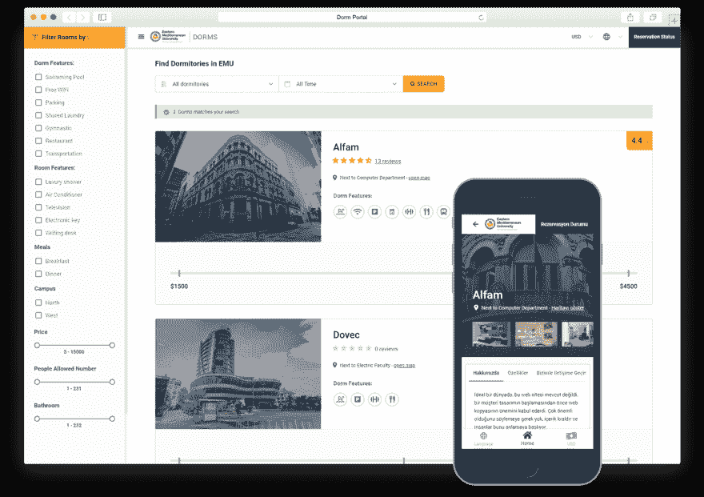
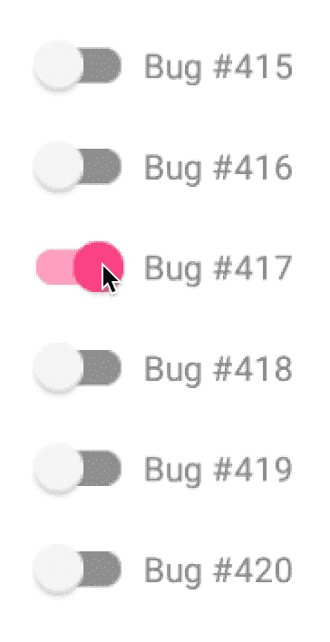
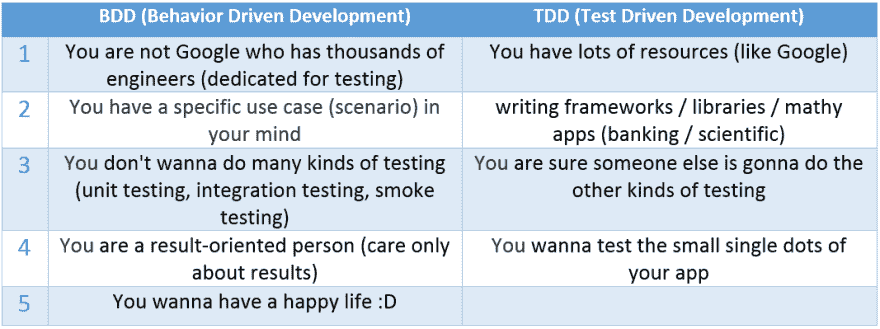

# BDD 而不是 TDD:面向结果的测试

> 原文：<https://dev.to/yaser/bdd-rather-than-tdd-result-oriented-testing-3n67>

### **TDD 不点击，给我解决方案**

我之前谈过 TDD(测试驱动开发)，以及你如何**最终测试你的框架而不是你的应用程序的逻辑**。

如果你没有看过之前的题目，可以在这里找到:[https://dev . to/0x rumple/when-TDD-donts-click-something-else-should-click-harder-2h9h](https://dev.to/0xrumple/when-tdd-doesnt-click-something-else-should-click-harder-2h9h)

### **BDD(行为驱动开发)来拯救**

这一次，我决定无论如何都要进行测试，所以我选择了一种不关注模仿、伪造、接口、依赖注入的方法...但是这一切都是为了检查结果，这就是 BDD 的用途:**行为**。

#### 我试过了吗？

是的，直到我们(我和我的创意朋友 [@alhakem](https://dev.to/alhakem) )完成了这个宿舍管理系统(学生可以搜索/预订房间，管理员可以批准/拒绝预订并管理他们的宿舍)，我才允许自己写这个帖子:

[](https://res.cloudinary.com/practicaldev/image/fetch/s--wx1QFfVn--/c_limit%2Cf_auto%2Cfl_progressive%2Cq_auto%2Cw_880/https://github.com/coretabs/dorm-portal/raw/master/demo.png)

这里是整个项目，“功能”文件夹包含测试:[https://github.com/coretabs/dorm-portal](https://github.com/coretabs/dorm-portal)
随意公关或创建问题。

#### 有趣的事实

我开发了一个有点复杂的过滤引擎(有多选框/单选框/整数过滤标准)，用 BDD 我在大约**一周**内完成了它...所有测试都是绿色的，哇哦！

整个项目在大约**两个月**内完成，并且...全绿😉

### **怎么才能做 BDD？**

这很简单:

#### 1。编写验收标准(场景)

常见的方法是使用小黄瓜语言，现在不要害怕，因为它非常直观，看看这个例子(应该是**不言自明的** ):

```
Feature: Reservation

    Scenario: As a student
              I want to make reservations
              So that I get a room to stay in

        Given we have 2 dormitories (and 1 room each available to reserve)
        Given two students who reserved nothing

        When create a reservation
        Then quota of the room should decrease 
```

Enter fullscreen mode Exit fullscreen mode

#### 2。实施步骤

根据您选择的语言/框架，这可能会有所不同；我正在使用 django(当然是用 python)，有一个很好的方法可以使用 **behave-django 包**。

以下是上述实施的验收标准:

```
from behave import given, when, then
from api.engine.models import RoomCharacteristics
from features.steps.factory import (create_alfam_dovec_with_4_rooms,
                                    create_student,
                                    create_reservation)

@given('we have 2 dormitories (and 1 room each available to reserve)')
def arrange(context):
    create_alfam_dovec_with_4_rooms(context)

@given('two students who reserved nothing')
def arrange(context):
    context.user1 = create_student(context, 'Owen')
    context.user2 = create_student(context, 'Tia')

@when('create a reservation')
def act(context):
    context.previous_quota = context.room1.allowed_quota
    context.reservation1 = create_reservation(context.room1, context.user1)

@then('quota of the room should decrease')
def test(context):
    context.room1 = RoomCharacteristics.objects.get(pk=context.room1.id)
    assert context.room1.allowed_quota == context.previous_quota - 1 
```

Enter fullscreen mode Exit fullscreen mode

#### 3。把它们变成绿色

现在是编写实际代码的部分，目标是通过配额测试。

```
from django.db import (models as django_models, transaction)
from .exceptions import NoEnoughQuotaException

class Dormitory(django_models.Model):
    name = django_models.CharField(max_length=60)

class RoomCharacteristics(django_models.Model):
    allowed_quota = django_models.PositiveIntegerField(default=0)

    dormitory = django_models.ForeignKey(
        Dormitory, related_name='room_characteristics', on_delete=django_models.CASCADE)

    def decrease_quota(self):
        if self.allowed_quota == 0:
            raise NoEnoughQuotaException()

        self.allowed_quota -= 1

class Reservation(django_models.Model):
    user = django_models.ForeignKey(
        User, related_name='reservations', on_delete=django_models.CASCADE)

    room_characteristics = django_models.ForeignKey(
        RoomCharacteristics, related_name='reservations', on_delete=django_models.CASCADE)

    @classmethod
    def create(cls, *args, **kwargs):
        room_characteristics = kwargs['room_characteristics']
        result = cls(*args, **kwargs)

        with transaction.atomic():
            room_characteristics.decrease_quota()
            result.save()
            room_characteristics.save()

        return result 
```

Enter fullscreen mode Exit fullscreen mode

### **当真？！那听起来很乏味！**

不要。相信我，因为我参与过其他项目，在这些项目中，添加功能或改变一个简单的东西可能会破坏项目中的许多其他部分，这实际上变成了:

[](https://i.giphy.com/media/11ZSwQNWba4YF2/source.gif) 
*图片来源:giphy*

你将会意识到，一旦你添加了 X 特性，而客户来到你面前大喊:“注册不起作用”...**不测试就编码很烂**。

### **什么时候做 BDD vs TDD？**

[](https://res.cloudinary.com/practicaldev/image/fetch/s--64PAZD4_--/c_limit%2Cf_auto%2Cfl_progressive%2Cq_auto%2Cw_880/https://thepracticaldev.s3.amazonaws.com/i/0ce0eu6mss3w7shjdkng.png)

#### **参考文献**

1.  小黄瓜语言:[https://docs.cucumber.io/gherkin/reference/](https://docs.cucumber.io/gherkin/reference/)
2.  多元视觉上的 BDD 课程:[https://www.pluralsight.com/courses/pragmatic-bdd-dotnet](https://www.pluralsight.com/courses/pragmatic-bdd-dotnet)
3.  不同类型的测试解释:[https://dev . to/the jessleigh/different-type-of-testing-explained-1ljo](https://dev.to/thejessleigh/different-types-of-testing-explained-1ljo)