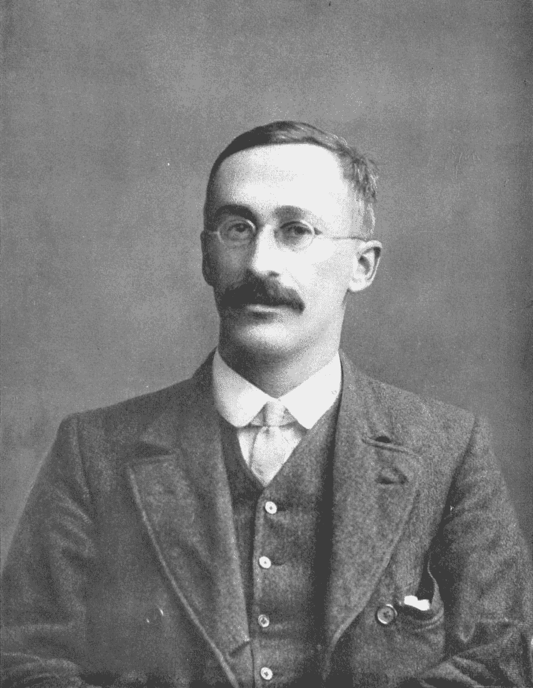
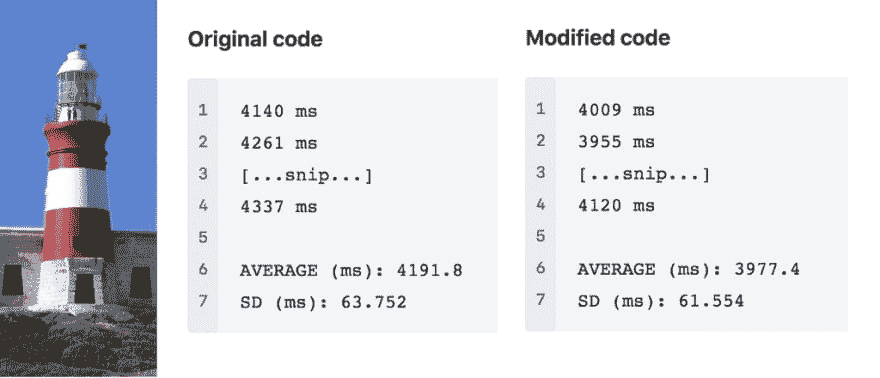
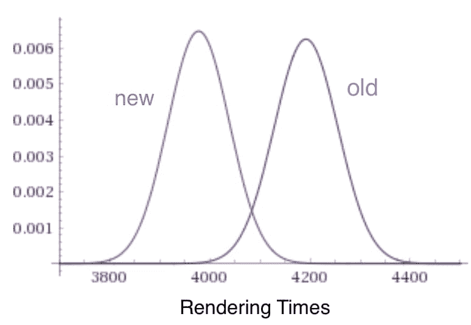

# 啤酒、虚张声势和比特桶:用数据驱动代码决策

> 原文：<https://dev.to/atlassian/beer-bravado--bitbucket-using-data-to-drive-code-decisions-10am>

产品团队和营销团队不断使用数据来推动决策。但是我们作为软件工程师呢？除了为别人引入指标，我们还能做什么？

### “你提到了啤酒。我相信会有啤酒。”

[](https://res.cloudinary.com/practicaldev/image/fetch/s--acz_xR_V--/c_limit%2Cf_auto%2Cfl_progressive%2Cq_auto%2Cw_880/https://cdn-images-1.medium.com/max/1024/1%2A1czQ2b5BzonNzSK8Im9Q_A.jpeg) 

<figcaption>来源:【Guinness.com】</figcaption>

T4

人们非常喜欢吉尼斯。到 1914 年，他们的年产量几乎达到 10 亿品脱。

这将需要大量的质量控制。聪明的克劳德·吉尼斯先生决定雇佣聪明的毕业生来做这项工作，就像现在的科技公司一样。

看到照片里的人了吗？那是比利。或者威廉·希利·戈塞给他不太亲密的朋友。23 岁的科学家，精力充沛，虽然有点疯疯癫癫。

[](https://res.cloudinary.com/practicaldev/image/fetch/s--z2GMFK3f--/c_limit%2Cf_auto%2Cfl_progressive%2Cq_auto%2Cw_880/https://cdn-images-1.medium.com/max/1024/1%2AtqaIanim_FHZTUSfuZ4HVQ.jpeg) 

<figcaption>来源:[【维基百科】](https://en.wikipedia.org/wiki/William_Sealy_Gosset)</figcaption>

为了帮助他保持超过 10 亿品脱的质量，我们的朋友比利发明了一种方法来回答重要的问题，通过采取啤酒的小样本和使用一些聪明的数学。我们聪明的比利发明的方法成为医生如何决定一种新的[药物是否会救你](https://www.sciencedirect.com/science/article/pii/S0140673603129480)(或杀你)[脸书如何决定如何操纵你](https://www.pnas.org/content/111/24/8788)以及这个世界上无数其他[使用的根本基础。](https://ntrs.nasa.gov/archive/nasa/casi.ntrs.nasa.gov/19980045313.pdf)

### “这跟代码有什么关系？”

Bitbucket(和公司的其他部门)对性能有很大的推动作用。在前端，我们做了一些改变来提高拉请求页面的性能。特别是，我们希望加快渲染代码差异。

呈现差异使用 Chunks 组件，该组件呈现大量单独的 codeline 组件。

我想，**我们是否可以通过将 CodeLinemarkup 直接合并成块来加快速度？**

但是这降低了模块性和可维护性。既然有成本，我想知道渲染时间有没有真正的好处。但是我怎么分辨呢？目前我只有一个想法。

当然，我可以在更改前后加载几次拉请求页面。但是由于很多很多原因，这很难算是一个严格的检查。如果改善很小(但确实存在)，那就很难说了。

### “现在告诉我更多。”

我需要比刷新几次浏览器更好的东西。因此，我使用了 [Lighthouse](https://developers.google.com/web/tools/lighthouse) ，这是一个非常棒的工具，用于测量前端性能和收集指标。现在可以在命令行中使用它了。

我写了一个“自定义审计”,让我可以测量拉请求页面的不同呈现时间，以及一个用于执行多次运行的批处理工具。为**可靠的前端指标收集**欢呼！

在这种情况下，审计测量我们的差异呈现时间。这是分享给大家享受的(大家都爱代码对吧？)但是请记住，这是作为内部开发工具编写的。生产代码会有很好的错误处理。还要注意这是针对灯塔的 **v3.2.1** 的。

首先，您正在测量的代码应该标记和测量灯塔拾取的[用户计时](https://developer.mozilla.org/en-US/docs/Web/API/User_Timing_API/Using_the_User_Timing_API)事件:

```
performance.mark("DIFFSET.RENDER.START");

(...time passes..)

performance.mark("DIFFSET.RENDER.END");
performance.measure("DIFFSET.RENDER.DURATION", "DIFFSET.RENDER.START", "DIFFSET.RENDER.END"); 
```

接下来，自定义审计。

```
// diff-rendering-only-audit.js

'use strict';

const { Audit } = require('lighthouse');

// Custom audits are provided to Lighthouse as classes
class DiffRenderingOnlyAudit extends Audit {

 // Tell Lighthouse about this audit
 static get meta() {
 return {
 id: 'diff-rendering-only-audit',
 title: 'Diffs rendered',
 failureTitle: 'Diff rendering slow',
 description: 'Time to render a diffset',
 requiredArtifacts: ['traces'],
 };
 }

 // Lighthouse will call this static method
 static audit(artifacts) {
 return new Promise(resolve =\> {
 getAuditResult(artifacts, resolve);
 });
 }
}

// Lighthouse produces a 'trace' of the page render.
// Process the trace to get the timing information.
async function getAuditResult(artifacts, resolveAuditResult) {
 const trace = artifacts.traces.defaultPass;

 const tabTrace = await artifacts.requestTraceOfTab(trace);
 const duration = extractDuration(tabTrace);

 // Tell Lighthouse the result
 resolveAuditResult({
 rawValue: duration,
 displayValue: duration,
 score: 1,
 scoreDisplayMode: 'manual',
 });
}

// Compute the duration of the specific User Timing measurement
function extractDuration(tabTrace) {
 let duration;

 // Find the User Timing measurement event
 const durationEvents = tabTrace.processEvents.filter(
 event =\> event.name === 'DIFFSET.RENDER.DURATION'
 );

 // Lighthouse records 'begin' and 'end' events for a measure
 const begin = durationEvents.find(event =\> event.ph.toLowerCase() === 'b');
 const end = durationEvents.find(event =\> event.ph.toLowerCase() === 'e');

 // Event duration in milliseconds
 duration = end.ts - begin.ts;
 duration = Math.ceil((end.ts - begin.ts) / 1000);

 console.info('\>\>\> Diff Rendering Only duration (ms): ', duration);

 return duration;
}

module.exports = DiffRenderingOnlyAudit; 
```

为 Lighthouse 创建一个运行上述审计的配置文件。

```
// example-config.js
module.exports = {
 extends: 'lighthouse:default',
 settings: {
 throttlingMethod: 'provided',
 onlyAudits: [
 'user-timings',
 'diff-rendering-only-audit',
 ],
 emulatedFormFactor: 'desktop',
 logLevel: 'info',
 },

 audits: [
 'diff-rendering-only-audit',
 ],

 categories: {
 pullRequestMetrics: {
 title: 'Pull Request Metrics',
 description: 'Metrics for pull request page',
 auditRefs: [
 { id: 'diff-rendering-only-audit', weight: 1 },
 ],
 },
 },
}; 
```

运行一次上述审计。

```
lighthouse \<your url\> --config-path=./config.js --emulated-form-factor=desktop --chrome-flags="--headless" 
```

接下来，一个示例节点脚本批量运行 Lighthouse 审计。

```
const commandLineArgs = require('command-line-args');
const lighthouse = require('lighthouse');
const chromeLauncher = require('chrome-launcher');
const log = require('lighthouse-logger');
const { mean, sampleStandardDeviation } = require('simple-statistics');
const lighthouseConfig = require('./config.js');

// Command line arguments
const argsDefintion = [
 // n: number of runs to execute 
 { name: 'n', type: Number },

 // url: url to test against
 { name: 'url', type: String, defaultOption: true },
];
const args = commandLineArgs(argsDefintion);

if (!args.url) {
 console.error('No url specified');
 return;
}

const lighthouseFlags = {
 logLevel: 'info',
};

go();

async function go() {
 const n = args.n || 10;
 const diffRenderTimes = [];

 // Launch Chrome
 const chromeFlags = ['--headless'];
 const chrome = await chromeLauncher.launch({ chromeFlags });
 lighthouseFlags.port = chrome.port;

 // Run lighthouse n-times
 for (let i = 0; i \< n; i++) {
 console.log(`Start run ${i + 1}...`);
 diffRenderTimes.push(await runLighthouse());
 }

 // Compute statistics
 console.log('All render times:');
 console.log(diffRenderTimes.join('\n'));
 console.log('MEAN (ms):', mean(diffRenderTimes).toFixed(2));
 console.log('SD (ms):', sampleStandardDeviation(diffRenderTimes).toFixed(2));

 await chrome.kill();
}

async function runLighthouse() {
 const results = await lighthouse(args.url, lighthouseFlags, lighthouseConfig);
 delete results.artifacts;

 return results.lhr.audits['diff-rendering-only-audit'].rawValue;
} 
```

最后，运行批处理脚本。

```
node batch.js \<your url\> --n=\<the number of executions\> 
```

运行我的新定制 Lighthouse 审计给了我这两组数字(渲染时间以毫秒计):

[](https://res.cloudinary.com/practicaldev/image/fetch/s--mxnsPGeV--/c_limit%2Cf_auto%2Cfl_progressive%2Cq_auto%2Cw_880/https://cdn-images-1.medium.com/max/1024/1%2AxhQ0ROVJAQBJiTAy88PtzQ.png) 

<figcaption>来源(灯塔图片):【Wikimedia.org】</figcaption>

T4

因此，平均时间降低了约 5%。万岁！！一切都好！

### “不过没那么快……平均下来也没低多少，渲染时间都有点不一样。你怎么知道这显示了真正的进步？？还有，回到啤酒上来。”

[](https://res.cloudinary.com/practicaldev/image/fetch/s--KjexEi8A--/c_limit%2Cf_auto%2Cfl_progressive%2Cq_auto%2Cw_880/https://cdn-images-1.medium.com/max/774/1%2AYmFkXN4ucGsiqZGIiCTnhw.png)

你抓到我了！发现得很好！这才是问题的核心！渲染时间*和*都有点不同。我需要确信渲染时间的提高不仅仅是这个例子的一个随机的怪癖。

幸运的是，我们的朋友啤酒酿造商比利给了我们一个叫做 ***t-test*** 的工具。比利就是这样算出哪种啤酒花能给他最好的啤酒的！

这让我不禁要问:给定我的示例渲染时间中的“噪声”量，**平均值之间的差异可能是真实的*T2 差异***还是只是随机波动？你听到的措辞是:它*重要吗？*

使用 Billy 的工具，我得到了这两个值:

t = 10.5457， **p < .0001**

这告诉我:**我改进的渲染时间来自随机机会的概率小于万分之一** 1 **。**我可以得出这样的结论:代码的改变平均只带来了大约 5%的速度提升，但很有可能是 a _real _5% ****** 。

***警告:我忽略了许多优秀实验设计的细节。这只是高度简化的例子！仅供参考，结果在真实的，非开发，世界(医学等。)永远不会像这个例子那样整洁。他们表现出更多的噪音。*

### “有什么外卖？”

这篇文章是关于开发人员如何看待统计和编码之间的联系。(这并不是一个详细的操作方法。)

核心信息是:利用啤酒赋予我们的力量**做出数据驱动*代码*决策。**

许多小的性能改进可以累积成大的改进——只要这些小的改进是真实的，而不是偶然的。为了确保它们是真实的:

1.  从您自己的代码中收集指标。
2.  进行显著性测试，看看你是否真的有所改变。

### “那么，我现在可以喝杯啤酒了吗？”

是的。

这篇文章是由 Christian Doan 写的——“*我是 Bitbucket 前端团队的高级开发人员。我目前的项目是将遗留代码迁移到现代 SPA 堆栈。我热衷于出色的用户体验和快速性能。在* [*linkedin*](https://www.linkedin.com/in/christianadoan/) *上和我联系。”*

*原载于 2019 年 2 月 26 日*[*【bitbucket.org】*](https://bitbucket.org/blog/beer-bravado-bitbucket-using-data-to-drive-code-decisions)*。*

* * *