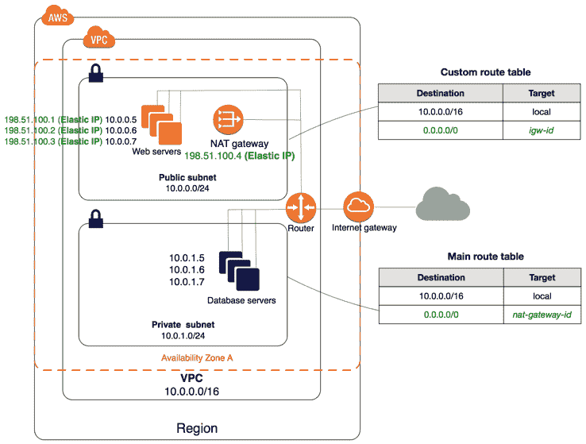

# AWS 初学者指南-第 1 部分

> 原文：<https://dev.to/cyberquixote/beginners-guide-to-aws-part-1-5688>

### 我们开始之前

所以我最近拿了 AWS SysOps 认证回到今年 3 月。这是一次艰难的考验，但我已经做好了充分的准备。测试的最大部分之一是在亚马逊的虚拟私有云上，这只是 AWS 允许你在你的帐户下设置的虚拟网络的一个花哨的名称。请记住，在继续阅读之前，先了解一些基本的网络知识会很有帮助。这是面向新人的，只是为了体验一下 AWS。

如果您计划学习如何使用 AWS 及其数量惊人的特性，了解如何使用、配置和部署 VPC 是关键。在某种程度上，它几乎就像是 AWS 操作的主干。为了帮助你，我会尽我所能给你清楚简明的信息。本文的另一部分将解释 CloudFormation 以及如何用它部署您自己的 VPC。这将是一个两部分的系列。开始第一部分吧。

### 骨干

AWS 中的一切都依赖于一个或多个虚拟网络的存在，以便使事情发生。现在默认情况下，你有一个 AWS 会自动为你生成后，你结束创建你的帐户。你可以免费制作一个，这对于运行实验室和教程来说是一个巨大的好处。最终我们会看到如何制造我们自己的。在我们回答了以下问题之后:什么是 [**VPC？**T3】](https://docs.aws.amazon.com/vpc/latest/userguide/what-is-amazon-vpc.html#what-is-vpc-subnet)

VPC 是一个虚拟网络，独立于 AWS 基础设施中的其他虚拟网络。有 [**区域**](https://docs.aws.amazon.com/AWSEC2/latest/UserGuide/using-regions-availability-zones.html) ，帮助划分基础设施的不同区段。在这些区域内存在称为 [**可用性区域**](https://docs.aws.amazon.com/AWSEC2/latest/UserGuide/using-regions-availability-zones.html) 的物理位置，它们通过低延迟连接连接在一起。请记住，所有区域都是彼此独立工作的。

在每个可用性区域中，您定义一个**子网**，可以是公共的，也可以是私有的。在这些子网中驻留着您的 [**EC2 实例**](https://docs.aws.amazon.com/AWSEC2/latest/UserGuide/concepts.html) ，您可以将其视为虚拟机。出于安全目的，您还需要一个 [**NAT 网关**](https://docs.aws.amazon.com/vpc/latest/userguide/vpc-nat-gateway.html) ，它将允许您的**私有子网**与互联网通信，而不会被您网络之外的任何人自由访问。如果您想更好地了解 VPC 的结构，请查看下图。我发现视觉教具总是有用的，尤其是当你在学习一个新概念的时候。

这并不意味着是对 AWS 的全面报道，因为 AWS 太大了。如果你渴望了解更多信息，一定要看看 AWS 官方文档。我建议你养成给你经常访问的网页和网站做书签的习惯，这样可以节省你的打字时间。这里的 [**是**](https://docs.aws.amazon.com/) 的主页面。

感谢你花时间通读这篇文章的第一部分。我希望我能为您提供一些帮助，并期待您在第 2 部分回来，在那里我们将亲自了解云的形成。如果你想问我问题或发表评论，请在 Twitter 上查看[**@网络堂吉诃德**](https://twitter.com/CyberQuixote) 。第二部见！