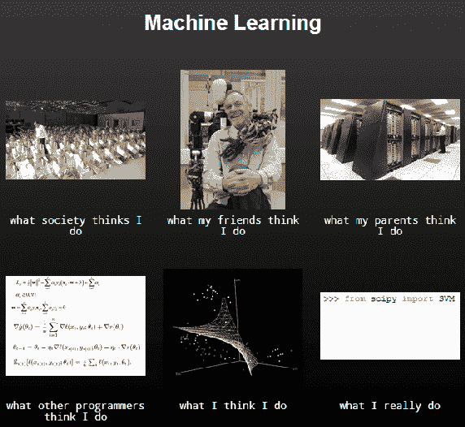
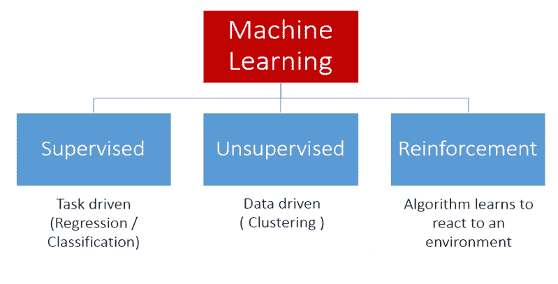

# 从机器学习开始-第 1 部分

> 原文：<https://dev.to/apoorvadave/beginning-with-machine-learning---part-1-pbl>

几乎每个想玩这项新技术的人都会想到这个问题。我自己想知道我应该从哪里开始，我应该覆盖什么，我怎样才能学得快！

我在这里不是给你一个可以阅读或探索的文章列表。但我会帮你度过难关。对几乎每一个重要的概念都有一个基本的了解，这样你也可以深入了解。我们开始吧！

1.  什么是机器学习？
2.  机器学习的重要类型
3.  分类算法
4.  回归算法
5.  使聚集
6.  成本函数
7.  共线性
8.  污染控制局(Pollution Control Agency)
9.  梯度下降
10.  ML 上的一些项目可以帮助你开始

 

<figcaption>图片致谢:[http://qingkaicon . blogspot . com/2017/04/machine-learning-10-funny-pictures . html](http://qingkaikong.blogspot.com/2017/04/machine-learning-10-funny-pictures.html)</figcaption>

上面的主题列表将在近 5 篇文章中涵盖，以帮助您开始学习 ML。

## 什么是机器学习？

在 ML 中，你从数据中学习，就这么简单。我们不必针对问题编写任何自定义代码。相反，我们将数据输入算法，它会根据数据构建自己的逻辑。

假设您想要识别哪些水果是苹果，哪些不是。你不能继续写你的苹果的具体尺寸、颜色或大小。因为每个苹果可能看起来很相似，但它们没有完全相同的尺寸。这是 ML 最基本的用例之一。这里我们将为算法提供所有类型的苹果，即不同类型苹果的一组特征。我们的算法学习这些特征，并将水果分类为苹果或不是苹果！

## 机器学习的类型

 

<figcaption>机器学习的类型</figcaption>

1.  **受监督的**:在这种方法中，我们有一个带标签的数据集。我们的模型可以从这些标记的数据中学习，并帮助分类、预测等。在上面的苹果示例中，当我们为模型提供一组特征时，数据集的每一行都被标记为这些特征是否构成苹果。监督分类和回归问题。

2.  **无监督的**:这里我们有一个未标记的数据集。也就是说，我们不知道一个苹果的所有特征是什么。一个例子是集群，我们将相似类型的对象聚集或创建成组。

3.  **强化学习**:在这种情况下，代理人通过与环境互动来学习，并通过执行行动获得奖励。它试图通过执行一个动作来移动到一个状态。他通过对每个行动的积极或消极的回报来学习。

在开始讨论分类和回归算法之前，我将列出一组术语来帮助我们更好地理解。

1.  模型:人们经常对模型这个术语感到困惑。它只是一个由训练过程产生的人工制品。你向机器学习算法提供训练数据，数据被学习，我们得到一个训练好的模型。

2.  **训练和测试数据**:提供给算法学习的数据称为训练集。这些预测是在一个名为测试数据的独立数据集上做出的。正是基于这些数据，我们检查了训练模型的准确性。

3.  **过拟合和欠拟合**:如果一个模型很好地学习了训练数据，但不能进行归纳，则称该模型过拟合。即使它在训练数据上给出了好的结果，它也不能在测试数据上提供好的预测。如果一个模型不能自己学习训练数据，那么这个模型就被认为是不合适的😄。欠拟合模型在可见数据上表现不佳，忘掉不可见数据吧😝。

4.  偏差和方差:许多人(包括我)想知道这些错误到底意味着什么。因此，简单地说，偏差是由于做出错误的假设而产生的误差。这导致了欠拟合模型。我们可能假设数据是线性的，但事实上，它是二次的。这将导致拟合不足。另一方面，方差会导致过度拟合。这是由于模型对训练数据的微小变化过于敏感。偏差和方差之间总是有一个权衡。因为减少一个误差会增加另一个误差，反之亦然。

有很多关于 ML 的文章比较好。但在这里，我努力巩固所有重要的东西，同时也学习和发展我的 ML 技能。个人比较喜欢用 Python 和 Scikit-Learn。随着我们的深入，我们可能会探索其他语言和库，如 R、Keras、Tensorflow。

请继续关注本系列的下一篇文章，在那里我们将学习回归算法。在那之前，祝你学习愉快！😃