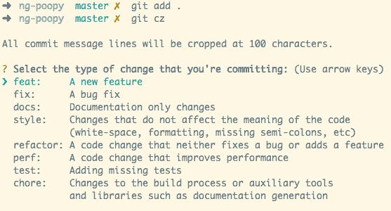

# 有意提交

> 原文：<https://dev.to/erinbush/being-intentional-with-commits--59a3>

有一天，我在 github 的一个仓库里闲逛，发现了这个提交消息:

并不是说我需要知道这个人当时在做什么，但是我忍不住想如果有人需要了解这个项目，这个提交信息会是多么无用。

我也犯过创建描述性不足的提交消息的错误——我肯定我们都有过这种经历。如果你想看一些真正有趣的提交信息，你可以看看 whatthecommit.com 的。

在我的工作中，我们开始使用基于[常规提交](https://www.conventionalcommits.org/en/v1.0.0-beta.3/)规范的[提交](https://github.com/commitizen/cz-cli)。这需要一分钟来适应，但几天后，我可以看到它为代码库增加了多少价值。

## 分解提交大小

因为它将提交分成几个类别，所以它迫使您只将相关文件添加到一个类别中。

再见，编辑 30 个文件，然后一次性全部提交。我的意思是，你仍然可以这样做，但是每当你在测试中加入一个特性变化时，你会感到一丝内疚。

在使用这个工具几天后，我开始思考在我的工作中可以提交的好的停止点——目的是让我的信息最有意义。例如，当处理一个包含一些重构工作的特性时，我会尝试先进行重构，提交它，然后开始处理新的功能。在浏览文件时回顾提交消息并查看所做的更改类型，对于粒度和了解特定提交的预期效果非常有帮助。

## 更多描述性消息

虽然互联网上的其他人可能已经把他们的提交信息分成了主题和正文，但我没有。我现在意识到，正文中较长的描述对于描述你所做的细微变化非常有帮助。即使只是让你在提出拉取请求之前看一遍，它也能帮助你更透彻地理解你为什么要这么做——前提是你真的添加了一份详尽的描述。

在我的工作中，我们更进了一步，创建了一个定制的命令行工具，它可以在 Github 上为您生成 pull 请求，pull 请求描述是您的 git 提交列表。起初，我担心这还不够。100 个字符的提交消息怎么能告诉你关于代码更改你需要知道的一切呢？但是后来，我灵光一现:提交应该已经告诉了你关于代码变更的一切。我只是没有做好我的承诺。一旦我开始按提交类别进行分解，并提供更好的提交消息(主要是通过更长的描述)，我的拉请求就恢复到以前的水平，那时我会自己编写描述，提交消息不足。

我鼓励每个人设置 Commitizen 并试用几天。我认为当你回头看你的代码并思考“我到底在想什么？”的时候，这会让未来的你更加快乐