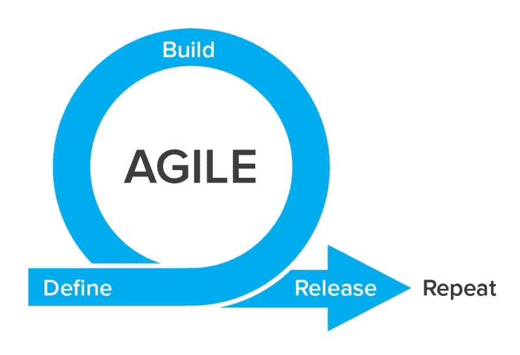

# 敏捷数据库开发的最佳实践

> 原文：<https://dev.to/blizzerand/best-practices-of-agile-database-development-2fi8>

当以适当的方式和建议的方法完成时，敏捷开发可以改变系统的交付。这允许用户在更接近他们需要的时候收到他们需要的东西。

不幸的是，与数据库相关的培训、资源和工作实践往往坚持不太有效的方法。这导致政府和商业组织承担更大的成本，并给数据库衍生产品带来市场上的坏名声。

尽管绝大多数应用程序开发人员认为敏捷是一种主流方法，但是许多专门研究数据库(尤其是关系数据库)的开发人员在采用敏捷方法方面仍然进展缓慢。这主要是由于在变更部署时缺乏对数据库状态的了解。

这导致数据库专业人员不得不依赖手动过程，而手动过程在涉及到更快的开发周期时无法达到敏捷的水平。

除非数据库开发过程，尤其是包括 SQL Server、Oracle 和 DB2 在内的关系数据库的开发，没有升级到更高的水平，否则它们将继续是敏捷组织前进道路上的一个障碍。

消除这种瓶颈需要自动化的数据管道，开发团队可以解决风险领域，确保质量标准，并加快整个业务的开发周期。为此，当涉及到敏捷数据库的开发时，这里有一些需要关注的关键领域。

## 敏捷数据库开发的最佳实践

### 版本控制

当涉及到[云数据库开发](https://www.enterprisedb.com/edb-postgres-cds)项目时，版本控制的角色完全不同。然而，这仍然是跟踪每个阶段对[数据定义语言(DDL)](https://en.wikipedia.org/wiki/Data_definition_language) 的变更的一种有意义的方式。

随着时间的推移，跟踪对保存的过程和函数所做的修改的能力使得当用户需要对它们进行评估或相互比较以识别和标记可能在生产过程中突然出现的问题时变得简单。

### 自动化测试

手动测试比自动化测试要慢得多。在加速数据库部署方面，自动化测试为开发人员提供了一个安全网，因为自动化测试提供了一个几乎即时的保证，即修改将按预期工作。

此外，自动化允许在登记时执行流程。每当中断发生时，通过即时反馈通知开发人员，并建议修复问题的最佳方法以及对中断进行故障排除的预期成本。

### 分析静态代码

在大多数情况下，开发人员会对他们的代码进行同行评审。这是为了确保他们开发的系统没有遗漏可能的安全漏洞、错误计算逻辑或无意中降低代码的逻辑速度。

静态代码分析允许相关软件显著地加快处理过程，并确保它符合公司设定的特定标准。静态代码分析通读代码，并识别同行开发人员正在寻找的相似模式。

### 部署阶段

为了减少数据丢失等灾难的危险，在大多数情况下，数据库开发路径在部署阶段包括一个 DBA。这是为了在代码投入生产之前检查代码的更改。

虽然自动化 DBA stop 的过程可能并不总是一个好主意，但是确保自动化创建用于部署的 [ALTER scripts](https://www.techopedia.com/definition/32178/alter-script) 有助于在尝试加快整个开发周期时节省宝贵的一步。

DBA 用于管理部署路径，并且可以在尝试自动化用于收集相关排队变更的工具时使用，这些变更已经通过了不同的回归测试以及静态代码分析。然后将其与各自的生产环境进行比较，以生成可用于提交它们的脚本。

这提高了 DBA 的效率，也缩短了开发周期。它还确保项目中指定的变更能够毫发无损地进入生产阶段。

### 自动化

随着组织从各种手工过程转向自动化工具，数据库开发周期开始缩短，同时团队理解敏捷的优势。

在一个系统化的方法中使用不同的软件工具使得整个方法更快更有效，并不断改进。

### 不要忽视产品测试

在当今时代，公司经常被推动将产品推向市场。这种关注的竞争原因非常明显。然而，作为快速生产发布版本的结果，可能出现的问题可能并不像它们应该的那样清楚。

未经适当测试和检查就发布的软件可能会导致诸如安全缺陷、质量差以及易用性问题等问题。规避这一问题的方法包括，在软件和相关产品投放市场供大众消费之前，对它们进行彻底的测试。

## 结论

当涉及到测试过程时，团队可以仅仅利用敏捷方法。正如研究公司“Frost & Sullivan”去年 5 月的一份报告所观察到的，“软件市场正在开发新产品，这在很大程度上是基于 IT 趋势，如‘大数据’和‘物联网’的流行。这导致了考试市场的转变。在接下来的几年中，预计 CAGR 将以 14%的速度增长，这在很大程度上要归功于 DevOps 和敏捷概念。

当谈到敏捷时，测试已经嵌入到开发过程中。软件开发人员被训练在他们编写代码之前或者与代码一起开发测试。这确保了标记和隔离流程的方法不会被忽略。鉴于软件产品开发的动态性，这是测试的一个特别的方面。

敏捷中存在许多不同的软件测试方法。这些包括行为驱动开发(BDD)，探索性测试，以及验收测试驱动开发。对于相关的团队来说，了解如何选择最合适的方法来满足他们组织的标准和需求是至关重要的。

与敏捷中的其他领域类似，在开发生命周期的不同阶段，当涉及到人员及其角色和职责时，必须有正确的映射。

当敏捷已经使用已建立的最佳实践实施时，敏捷可以导致-

1.  团队协作水平的提高
2.  开发团队和软件最终用户之间的密切合作
3.  客户对最终产品满意的可能性增加
4.  新软件产品的加速开发路径及其特性