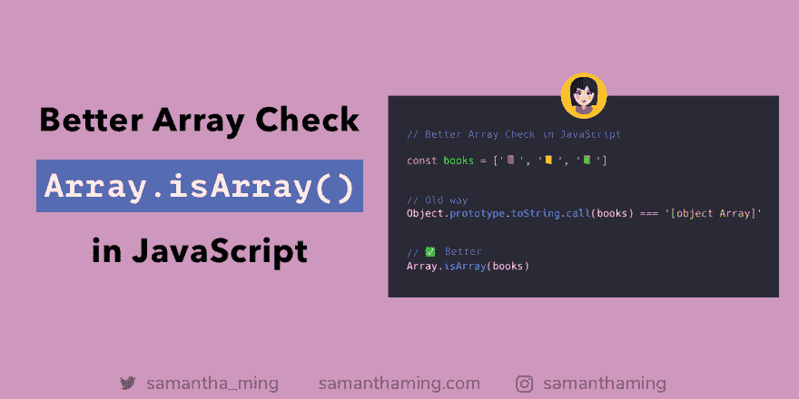

# 使用 Array.isArray 进行更好的数组检查

> 原文：<https://dev.to/samanthaming/better-array-check-with-array-isarray-a17>

[](https://res.cloudinary.com/practicaldev/image/fetch/s--dMiP4bbR--/c_limit%2Cf_auto%2Cfl_progressive%2Cq_auto%2Cw_880/https://thepracticaldev.s3.amazonaws.com/i/2vl16vmr13v5wbfyiif5.png)

在 JavaScript 中，数组不是真正的数组。它们实际上是物体。所以不能简单的做一个`typeof`检查。因为它会返回`object`😱

但不是问题！使用`Array.isArray()`——最后，有一种更简单的方法来检查一个值是否是一个实际的数组🎉

```
const books = ['📕', '📙', '📗'];

// Old way
Object.prototype.toString.call(books) === '[object Array]';

// ✅ Better
Array.isArray(books); 
```

## 数组不是真正的数组

看看我这么说是什么意思，`array`不是真数组。

```
const array = [];

typeof array; // 'object' 
```

☝️That's 为什么不能用你的典型`typeof`。因为数组是一个`object`类型😕

## Array.isArray 演示

好的，让我们在其他值上试试这个方法，看看我们会得到什么👩‍🔬

### 这些都是数组，会返回`true`

```
// Empty Array
Array.isArray([]); // true

// Array
Array.isArray(['📓']); // true

// Array Constructor
Array.isArray(new Array('📓')); // true 
```

### 这些不是数组，将返回`false`

```
// Object
Array.isArray({}); // false

// Object
Array.isArray({book: '📓'}); // false

// Number
Array.isArray(123); // false

// Boolean
Array.isArray(true); // false

// Boolean
Array.isArray(false); // false

// String
Array.isArray('hello'); // false

// Null
Array.isArray(null); // false

// Undefined
Array.isArray(undefined); // false

// NaN
Array.isArray(NaN); // false 
```

## instance of vs . array . is array

另一个流行的选择是使用`instanceof`

```
const books = ['📕', '📙', '📗'];

books instanceof Array; // true 
```

### 但是...

问题是它不适用于多种上下文(例如框架或窗口)。因为每个框架都有不同的作用域和自己的执行环境。因此，它有不同的全局对象和不同的构造函数。因此，如果您试图根据该帧的上下文测试一个数组，它将不会返回`true`，它将错误地返回为`false`。

🤯你在说什么？？？👈如果这在你脑海中浮现。别担心，我也是。要理解这一点，你需要理解 JavaScript 的执行上下文。这里有一个很棒的视频来解释它，[对函数、执行上下文和调用栈](https://youtu.be/exrc_rLj5iw)的介绍。这是一个更高级的话题，所以如果你只是一个初学者，请随意跳过它。当您对 JavaScript 更加熟悉时，请务必回到这个主题。同时，让我试着用非开发术语来解释这个“多重环境”。

### **非开发**术语解释

你可以把框架想象成不同的星球。每个星球都有自己的系统，有不同的引力和组成。所以`instanceof`只适用于我们的星球，地球。如果你把它带到火星上，它就不起作用了。然而，有了`Array.isArray()`它可以在任何星球上工作。这是普遍现象。这就是为什么你应该使用`Array.isArray()`。

```
// Creating our new "planet" called mars
const mars = document.createElement('iframe');
document.body.appendChild(iframe);
xArray = window.frames[window.frames.length-1].Array;

// Let's make an array in our new "planet", mars
var marsArray = new xArray('👩', '👨');

// Using the instanceof tool to test the marsArray
marsArray instanceof Array;
//  false --> ❌ doesn't work

// Now, let's try using our universal tool
Array.isArray(marsArray)
// true --> ✅ great, it works! 
```

## 社区输入

*   代码示例由 [@_botol](https://www.instagram.com/_botol/)

[https://jsfiddle . net/botol/Ryu 324 GW](https://jsfiddle.net/botol/ryu324gw)

## 资源

*   [MDN Web Docs:array . isarray()](https://developer.mozilla.org/en-US/docs/Web/JavaScript/Reference/Global_Objects/Array/isArray)
*   [w3schools:array . isarray()](https://www.w3schools.com/jsref/jsref_isarray.asp)
*   [MDN Web Docs: instanceof 和多上下文](https://developer.mozilla.org/en-US/docs/Web/JavaScript/Reference/Operators/instanceof#instanceof_and_multiple_context_(e.g._frames_or_windows))
*   [MDN Web Docs:instance of vs is array](https://developer.mozilla.org/en-US/docs/Web/JavaScript/Reference/Global_Objects/Array/isArray#instanceof_vs_isArray)
*   [2 真实性:实例 of](http://2ality.com/2013/01/categorizing-values.html)
*   [StackOverflow:在 JavaScript 中如何检查变量是否为数组？](https://stackoverflow.com/questions/767486/how-do-you-check-if-a-variable-is-an-array-in-javascript)
*   [StackOverflow:如何检查一个对象是否是数组？](https://stackoverflow.com/questions/4775722/how-to-check-if-an-object-is-an-array)
*   [StackOverflow:使用 Array.isArray 和 instanceof Array 的区别](https://stackoverflow.com/questions/22289727/difference-between-using-array-isarray-and-instanceof-array)
*   [stack overflow:JavaScript 中 instanceof Array 是否比 isArray 更好？](https://stackoverflow.com/questions/28779255/is-instanceof-array-better-than-isarray-in-javascript)
*   [GitHub 问题讨论:具有多个窗口/iframe 的 instanceof】](https://github.com/mrdoob/three.js/issues/5886)
*   被认为有害的实例
*   [如何更好地检查 javascript 中的数据类型](https://webbjocke.com/javascript-check-data-types/)

* * *

**感谢阅读❤**
问好！[insta gram](https://www.instagram.com/samanthaming/)|[Twitter](https://twitter.com/samantha_ming)|[脸书](https://www.facebook.com/hisamanthaming) | [媒体](https://medium.com/@samanthaming) | [博客](https://www.samanthaming.com/blog)