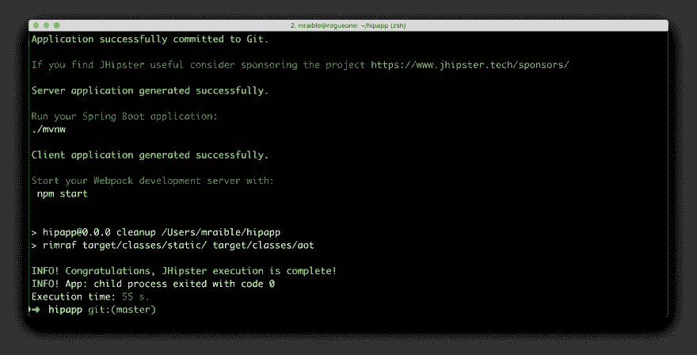
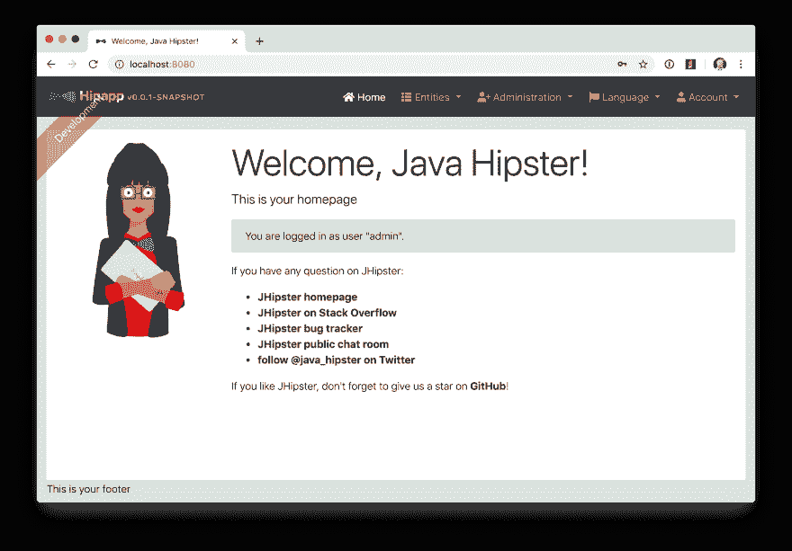
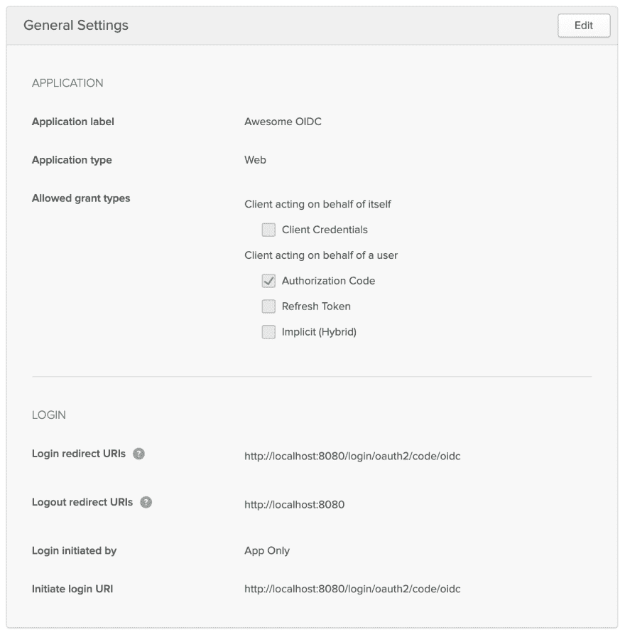
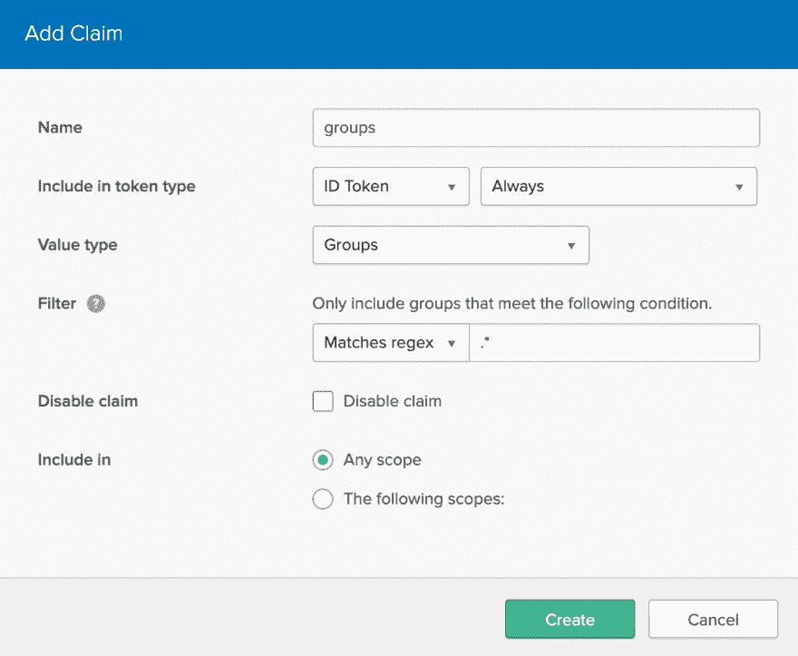
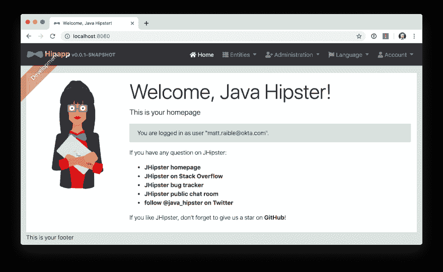

# 使用 Java 12 和 JHipster 6 的更好、更快、更轻的 Java

> 原文：<https://dev.to/oktadev/better-faster-lighter-java-with-java-12-and-jhipster-6-5a4>

最近 Java 生态系统中发生了很多事情。现在主要的 Java 版本每六个月发布一次，这可能很难跟上。就个人而言，我使用 Spring Boot 开发了我的大部分 Java 应用程序。正因为如此，我在 Java 8 上停滞不前，直到 Spring Boot 2.1 发布。

Spring Boot 2.1 增加了 Java 11 支持，以及性能改进、新的度量实现、新的执行器端点和 Spring Security 的一流 OIDC 支持。

在成为 Java 开发人员之前，我是一名 web 开发人员。我开发 Java 已经 20 年了，所以这已经很说明问题了！如果您是一名 Java 开发人员，您可能会对 JavaScript 世界的变化速度感到困惑。如果你觉得 Java 很难跟上，那就试试跟上 JavaScript 和它的生态系统吧！好消息是有一个很好的方法来同时满足这两种需求:只需使用 [JHipster](https://www.jhipster.tech) 。

JHipster 6 使用 Spring Boot 2.1 作为其后端 API，这意味着您可以使用 Java 11+来开发您的 JHipster 应用程序！

如果你想看视频，我制作了这篇博文的[截屏。](https://youtu.be/Ktnvqoouulg)

## JHipster 如何让 Java 和 JavaScript 开发变得更简单？

JHipster 是我最喜欢的开源项目之一。这是一个生成、开发和部署 Spring Boot + Angular 应用程序的开发平台。此外，它支持 React、Vue，并通过网飞操作系统、弹性堆栈和 Docker 创建微服务架构。

Java 开发人员倾向于不喜欢 JavaScript，但是很多人都喜欢 TypeScript。你猜怎么着？JHipster 的所有 UI 框架实现都使用 TypeScript！

JHipster 通过为您配置一切并使用其底层框架的最新版本，使 Java 和 JavaScript 开发变得更加容易。想要升级您的应用程序以使用最新版本吗？只需运行`jhipster upgrade`。

## 安装 Java 11 或 Java 12

在你担心安装 JHipster 之前，先安装 Java 11。我推荐用 [SDKMAN！](https://sdkman.io/)对于这个任务。如果你没有安装，它只是一个命令:

```
curl -s "https://get.sdkman.io" | bash 
```

一旦你安装了它，你可以使用`sdk list java`看到所有可用的 Java 11 版本。

安装 OpenJDK 版本:

```
sdk install java 11.0.2-open 
```

如果你更愿意使用亚马逊的 Corretto，只需使用`11.0.2-amzn`作为名称。如果想尽可能的潮人，甚至可以用 Java 12！

```
sdk install java 12.0.0-open 
```

**提示:**如果你用`12.0.0-zulu`作为名字，Azul 的 Zulu 也可以。

## 安装 JHipster 6

JHipster 6 的一个测试版[于 2019 年 5 月 3 日](https://www.jhipster.tech/2019/04/04/jhipster-release-6.0.0-beta.0.html)发布。您可以使用下面的命令安装它。

```
npm install -g generator-jhipster@beta 
```

**注意**:`npm`命令是 [Node.js](https://nodejs.org) 的一部分。您需要有 Node 10.x 来安装 JHipster 并运行有用的命令。

## 创建一个运行在 Java 11+上的 Spring Boot + Angular App

开始使用 JHipster 的最基本的方法是创建一个新目录，放入 cd，然后运行`jhipster`。系统会提示您回答一些关于您想要创建的应用程序的问题。问题范围从你的应用程序的名称，到你想使用的身份验证类型，到 SQL 与 NoSQL。

JHipster 也有一种领域语言(JHipster 领域语言的 JDL)，你可以用它来定义你的应用程序。

```
application {
  config {}
} 
```

如果您使用上述代码创建您的应用程序，它将使用默认值:

*   基本名称:`jhipster`

*   应用程序类型:`monolith`

*   databaseType: `sql`

*   等等。

**提示:**你可以在 [JHipster 的 JDL 文档](https://www.jhipster.tech/jdl/#available-application-options)中看到所有的默认值。

要使用 JHipster 生成支持 OAuth 2.0 的应用程序，请在新的项目目录中创建一个`app.jh`文件(例如`~/hipapp` ):

```
application {
  config {
    baseName hipapp
    authenticationType oauth2
  }
} 
```

打开终端窗口，导航到与该文件相同的目录。运行以下命令来生成一个带有角度 UI 的 Spring Boot API。

**警告:**确保你不在你的主目录中！您的项目将在与`app.jh`相同的目录中生成。

```
jhipster import-jdl app.jh 
```

这将创建大量文件并使用`npm install`安装依赖项。当您运行此命令时，您的终端应该类似于以下内容:

[](https://res.cloudinary.com/practicaldev/image/fetch/s--GBpudOO5--/c_limit%2Cf_auto%2Cfl_progressive%2Cq_auto%2Cw_880/https://developer.okta.com/assets-jekyll/blog/java-12-jhipster-6/import-jdl-7db81bd6575856b5ad3769531b8d5f358d67dae3a1c975aefd2fea6aeb8c99bc.png)

如果你想看看这个命令实际上是什么样子，你可以看看下面的录音。

[https://www.youtube.com/embed/sbwD697nHwM](https://www.youtube.com/embed/sbwD697nHwM)

由于您将`oauth2`指定为认证类型，因此将为 Keycloak 安装 Docker Compose 配置。

[Keycloak](https://www.keycloak.org/) 是一个 Apache 许可的开源身份和访问管理解决方案。除了为 Docker Compose 创建一个 [`src/main/docker/keycloak.yml`](https://github.com/jhipster/generator-jhipster/blob/master/generators/server/templates/src/main/docker/keycloak.yml.ejs) 文件之外，JHipster 还会生成一个 [`src/main/docker/config/realm-config`](https://github.com/jhipster/generator-jhipster/tree/master/generators/server/templates/src/main/docker/config/realm-config) 目录，其中包含配置 Keycloak 以与 JHipster 一起使用的文件。

## 运行您的 JHipster 应用程序，并使用 Keycloak 登录

您的 JHipster 应用程序必须运行 Keycloak 才能成功启动。这是因为 Spring Security 5.1 的[一级 OIDC 支持](https://developer.okta.com/blog/2019/03/05/spring-boot-migration)在 JHipster 6 中得到了利用。

这种 OIDC 支持包括 discovery，这意味着 Spring Security 与一个`/.well-known/openid-configuration`端点对话来配置自己。我自己完成了[迁移](https://github.com/jhipster/generator-jhipster/pull/9416)，删除的代码比我添加的还多！

使用 Docker Compose 启动 key cloak:

```
docker-compose -f src/main/docker/keycloak.yml up -d 
```

**提示:**如果你没有安装 Docker Compose，参见[这些说明](https://docs.docker.com/compose/install/)了解如何安装。

然后使用 Maven:
启动您的应用程序

```
./mvnw 
```

当你的应用启动并运行时，在你最喜欢的浏览器中打开`http://localhost:8080`，点击**登录**。你将被重定向到 Keycloak，在那里你可以输入`admin/admin`登录。

[](https://res.cloudinary.com/practicaldev/image/fetch/s--sSdj379L--/c_limit%2Cf_auto%2Cfl_progressive%2Cq_auto%2Cw_880/https://developer.okta.com/assets-jekyll/blog/java-12-jhipster-6/welcome-java-hipster-f98915cd9e41341e9bea62953d579dd0cdbe25dbdba7a5d1a55037f2ec310427.png)

很圆滑，是吧？您刚刚创建了一个现代的单页面应用程序(SPA ),它使用了 Angular 的最新发布版本！不仅如此，它还使用了 OAuth 2.0 最安全的形式- [授权码流](https://developer.okta.com/blog/2018/04/10/oauth-authorization-code-grant-type)。

**注意:**如果你对 OAuth 2.0 和 OpenID Connect (OIDC)如何协同工作感到困惑，请参见[OAuth 到底是什么？](https://developer.okta.com/blog/2017/06/21/what-the-heck-is-oauth)简而言之，OIDC 是 OAuth 2.0 之上增加身份的一个薄层。

## 使用 [Okta](https://developer.okta.com) :我们永远在线！

Keycloak 是一个优秀的项目，非常适合开发和测试。但是，如果您在生产中使用它，您将负责维护它，将其更新到最新版本，并确保它全天候运行。基于这些原因，我推荐在生产中使用 [Okta](https://developer.okta.com) 。毕竟，我们的*永远在！*😃

### 创建一个 OpenID 连接 Web 应用程序

首先，注册一个[永远免费的 Okta 开发者账户](https://developer.okta.com/signup/)(或者[如果你已经有账户，登录](https://login.okta.com/?SAMLRequest=fc%2B7CsJAEAXQXvAflu1NNJUMeZBGELTx1a%2FrYILJTtyZGD%2FfSBRiYzlw77lMnD3rSj3Qc0ku0YtgrhU6S5fSXRN9PKxmS52l00nMpq6iBvJWCrfDe4ss6vStRe9aDzmGIZfo1jsgwyWDMzUyiIV9vt1AH4XGk5ClSvewUgMNa%2BYW%2FVj5jxhm9NLP67QQaSAMu64L6CYmsFSHlnzT4ZlLwTgcL6Sf8%2FeX9AU%3Dhttps://login.okta.com/?SAMLRequest=fc%2B7CsJAEAXQXvAflu1NNJUMeZBGELTx1a%2FrYILJTtyZGD%2FfSBRiYzlw77lMnD3rSj3Qc0ku0YtgrhU6S5fSXRN9PKxmS52l00nMpq6iBvJWCrfDe4ss6vStRe9aDzmGIZfo1jsgwyWDMzUyiIV9vt1AH4XGk5ClSvewUgMNa%2BYW%2FVj5jxhm9NLP67QQaSAMu64L6CYmsFSHlnzT4ZlLwTgcL6Sf8%2FeX9AU%3D)到`{yourOktaDomain}`)。

登录 Okta 后，注册您的客户端应用程序。

*   在顶部菜单中，点击**应用**

*   点击**添加应用**

*   选择**网页**，点击**下一步**

*   输入`Awesome OIDC`作为**名称**(这个值无关紧要，可以随意更改)

*   将登录重定向 URI 更改为`http://localhost:8080/login/oauth2/code/oidc`

*   点击**完成**，然后**编辑**并添加`http://localhost:8080`为注销重定向 URI

*   点击**保存**

完成后，您的设置应该类似于下面的截图。

[](https://res.cloudinary.com/practicaldev/image/fetch/s--dVVdpDQI--/c_limit%2Cf_auto%2Cfl_progressive%2Cq_auto%2Cw_880/https://developer.okta.com/assets-jekyll/blog/java-12-jhipster-6/app-settings-36cee2d55fa2872188a92e5c2c3c8d9d20ad2082d86b8fe6c7433c89567c3145.png)

在项目的根目录下创建一个`okta.env`文件，并用 Okta 应用程序中的值替换`{..}`值:

```
export SPRING_SECURITY_OAUTH2_CLIENT_PROVIDER_OIDC_ISSUER_URI="https://{yourOktaDomain}/oauth2/default"
export SPRING_SECURITY_OAUTH2_CLIENT_REGISTRATION_OIDC_CLIENT_ID="{clientId}"
export SPRING_SECURITY_OAUTH2_CLIENT_REGISTRATION_OIDC_CLIENT_SECRET="{clientSecret}" 
```

**提示:**将`*.env`添加到你的`.gitignore`文件中，这样这个文件就不会出现在你的源代码控制系统中。

### 创建组并将它们作为声明添加到 ID 令牌中

JHipster 默认配置为与两种类型的用户一起工作:管理员和用户。Keycloak 会自动配置用户和组，但是您需要为您的 Okta 组织进行一些一次性配置。

创建一个`ROLE_ADMIN`和`ROLE_USER`组(**用户** > **组** > **添加组**)并向其中添加用户。您可以使用您注册的帐户，或者创建一个新用户(**用户** > **添加人员**)。导航到 **API** > **授权服务器**，点击`default`服务器。点击**索赔**标签和**添加索赔**。将其命名为`groups`，并包含在 ID 令牌中。将值类型设置为`Groups`，并将过滤器设置为`.*`的正则表达式。点击**创建**。

[](https://res.cloudinary.com/practicaldev/image/fetch/s--85G8f9Ss--/c_limit%2Cf_auto%2Cfl_progressive%2Cq_auto%2Cw_880/https://developer.okta.com/assets-jekyll/blog/java-12-jhipster-6/add-claim-915f54ead19da14f9117ac982daa317f6782c0f8d9fe9fcb5de68f7beb2d6f90.png)

使用以下命令启动您的应用程序:

```
source okta.env
./mvnw 
```

导航到`http://localhost:8080`并用您的 Okta 凭证登录。

[](https://res.cloudinary.com/practicaldev/image/fetch/s--Fzvd1D28--/c_limit%2Cf_auto%2Cfl_progressive%2Cq_auto%2Cw_880/https://developer.okta.com/assets-jekyll/blog/java-12-jhipster-6/authenticated-by-okta-c114234313c83a96ea1415c77dd665c626e49ac88487ab51513b9524176f6b9d.png)

Spring Boot 和 Spring Security 让更换 OIDC 提供商变得很容易，这难道不酷吗？！

## 用 JHipster 进行 CRUD

在这篇文章中，我几乎没有涉及到 JHipster 所能提供的服务。例如，您可以为实体创建 CRUD 功能(通过测试！)使用 JDL。例如，用下面的代码创建一个`blog.jh`文件。

```
entity Blog {
  name String required minlength(3),
  handle String required minlength(2)
}

entity BlogEntry {
  title String required,
  content TextBlob required,
  date Instant required
}

entity Tag {
  name String required minlength(2)
}

relationship ManyToOne {
  Blog{user(login)} to User,
  BlogEntry{blog(name)} to Blog
}

relationship ManyToMany {
  BlogEntry{tag(name)} to Tag{entry}
}

paginate BlogEntry, Tag with infinite-scroll 
```

然后在您的项目中运行`jhipster import-jdl blog.jh`。jdl-samples GitHub 库有更多的例子。

## 用 JHipster 做更多事情

我要感谢春天安全团队的乔·格兰贾和 T2·罗布·温奇。没有他们的帮助，JHipster 不可能迁移到使用 Spring Security 5.1。你们这些*摇滚！！*

我没有为这篇文章创建 GitHub 库，因为所有的代码都是自己生成的。你可以在 GitHub 上找到 [JHipster 的源代码。](https://github.com/jhipster/generator-jhipster)

感谢 JHipster 及其所有出色的[贡献者](https://github.com/jhipster/generator-jhipster/graphs/contributors)。你们都在空闲时间做了大量的工作，这非常值得赞赏。

还没有准备好过渡到 JHipster 6 和 Java 11+？我写过几个使用 JHipster 5 和 Java 8 的教程。

*   与 React、Spring Boot 和杰普斯特一起建立照片库 PWA

*   [使用 OAuth 2.0 和 JHipster 开发微服务架构](https://developer.okta.com/blog/2018/03/01/develop-microservices-jhipster-oauth)

*   [使用 Ionic for JHipster 创建带 OIDC 认证的移动应用](https://developer.okta.com/blog/2018/01/30/jhipster-ionic-with-oidc-authentication)

*   [用 React Native 和 Spring Boot 构建移动应用](https://developer.okta.com/blog/2018/10/10/react-native-spring-boot-mobile-app)

我还为 InfoQ 写了一本关于 JHipster 的免费迷你书。

如果您想了解更多关于 Spring Security 5.1 及其 OIDC 支持的信息，我们也有一些:

*   [使用 Spring Security 的 OAuth 2.0 快速指南](https://developer.okta.com/blog/2019/03/12/oauth2-spring-security-guide)

*   [将你的 Spring Boot 应用迁移到最新最好的 Spring Security 和 OAuth 2.0](https://developer.okta.com/blog/2019/03/05/spring-boot-migration)

*   [Spring Boot 2.1:出色的 OIDC、OAuth 2.0 和反应式 API 支持](https://developer.okta.com/blog/2018/11/26/spring-boot-2-dot-1-oidc-oauth2-reactive-apis)

关注我们的 [@oktadev](https://twitter.com/oktadev) ，了解 Java 和领先的 JavaScript 框架的最新动态。