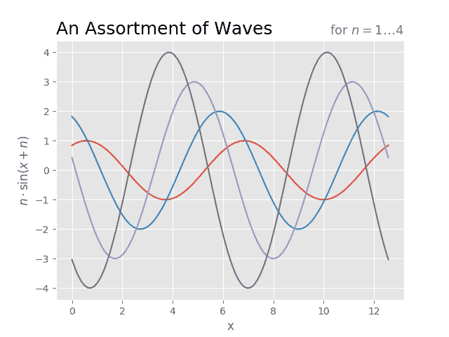

# 更好的剧情(三行！)

> 原文：<https://dev.to/pj_trainor/better-plots-in-three-lines-2eb7>

[](https://res.cloudinary.com/practicaldev/image/fetch/s--ETMFW5X2--/c_limit%2Cf_auto%2Cfl_progressive%2Cq_auto%2Cw_880/https://thepracticaldev.s3.amazonaws.com/i/nnbgeeir3pgi6i7rsbhv.png)

如果你用 python 做过任何绘图，你几乎肯定用过 matplotlib。虽然它提供了一个简单的方法来制作情节，他们有时...默认情况下，它们可能有点丑。

我将快速介绍两个技巧，让你的情节更有个性:

1.  替换默认样式
2.  制作更漂亮的标题

> **注意**有很多其他的绘图选项，它们有自己的风格(seaborn，plotly，bokeh 等)。)，但 matplotlib 是使用最广泛的，所以这是我要重点介绍的
> 
> 你可以跳到下面的 repl.it 来体验这些风格！

# 1。替换默认样式

下次键入导入语句时，可以考虑再添加一行:

```
import matplotlib.pyplot as plt
plt.style.use('ggplot') 
```

现在当你绘图时，它将使用在 r 中流行的绘图库 [ggplot](https://ggplot2.tidyverse.org/) 中找到的样式。

还有很多其他的选择，比如 fivethirtyeight 和 seaborn-colorblind！

**注**:如果你不想每个情节都套用一种风格，可以做:

```
with plt.style.context('ggplot'):
  plt.plot(x, y) 
```

# 2。制作更漂亮的标题

Matplotlib 将标题放在正上方的中央。你知道你可以移动标题吗？你知道你可以有多个头衔吗？我们可以同时使用*和*来制作更好的标题:

```
plt.title("The Main Title", loc='left', fontsize=18)
plt.title("a subtitle", loc='right', fontsize=13, color='grey') 
```

如果你已经有了计划，那么这将把你的主标题移到左边，并在右边增加一个更小的灰色副标题。这是一个给你的情节更多的背景，并使它们看起来更好的好方法！

我甚至会留给你一个更容易实现的函数:

```
def fancy_titles(t1, t2, ax=None):
  if ax:
    ax.set_title(t1, loc='left', fontsize=18)
    ax.set_title(t2, loc='right', fontsize=13, color='grey')
  else:
    plt.title(t1, loc='left', fontsize=18)
    plt.title(t2, loc='right', fontsize=13, color='grey')

plt.plot(x, y)
fancy_titles("A Cool Title", "a cooler subtitle") 
```

最后，这里有一个 repl.it，您可以尝试不同的风格:

[https://repl.it/@PjTrainor/matplotlib-styles?lite=true](https://repl.it/@PjTrainor/matplotlib-styles?lite=true)