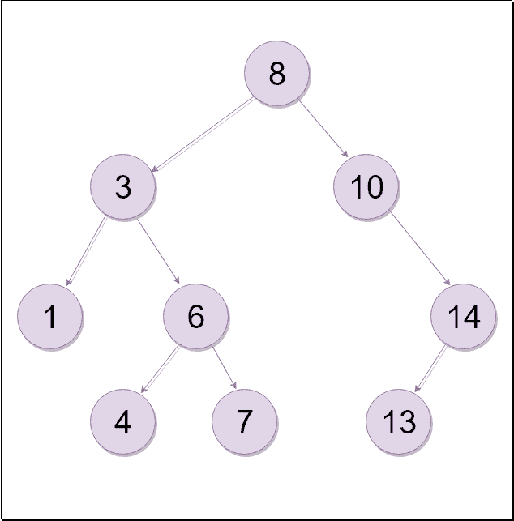

# Javascript 中的二叉树

> 原文：<https://dev.to/thevenicelive/binary-tree-in-javascript-2n92>

让我们看看二叉查找树是如何工作的，以及它们是如何在 Javascript 中实现的。
[T3】](https://res.cloudinary.com/practicaldev/image/fetch/s--hLa-0xfp--/c_limit%2Cf_auto%2Cfl_progressive%2Cq_auto%2Cw_880/https://thepracticaldev.s3.amazonaws.com/i/s3h65yq1qwkciff5nwf1.png)

## **树形结构基础**

### 在二叉树中，首先应该知道三件事:

**根:**这是树结构的顶层节点，它没有父节点。在上面的示例图像中，8 是根节点。
**父节点:**它是一个节点的前任节点。在上面的例子中，3，10，6，14 是父节点。
**子节点:**是父节点的后继节点。在上面的例子中，1 和 6 是 3 的孩子，依此类推。

## **二叉树**

在二叉树结构中，每个节点最多可以有两个子节点。左子树上的孩子称为左子树，右子树上的孩子称为右子树。

## **二叉查找树**

### BST 是一个二叉树，但有几个条件:

**1)** 所有的键(节点内的数据)都是不同的。
T3)2)在每一个父节点中，左子键值都小于父节点键值。
**3)** 在每一个父节点中，右子键值都大于父节点键值。

## **节点的插入**

对于插入带有键值的新节点，程序会找到正确的位置，并为数据创建一个新的空节点。如果键值已经存在，插入将被拒绝，插入操作会立即终止而不插入——因为 BST 不允许有重复的键。

## **二叉查找树在 Javascript 中的实现**