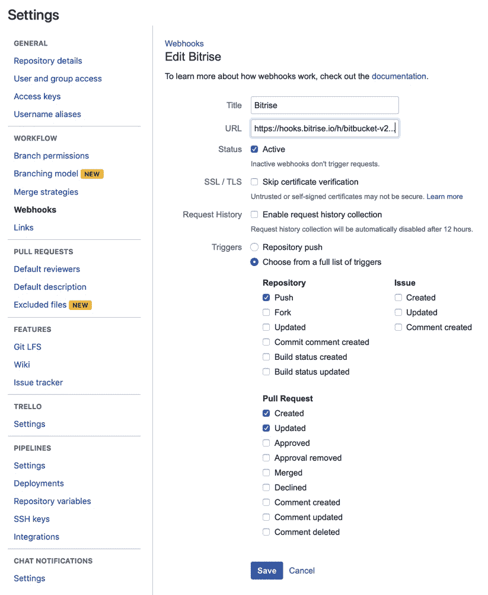
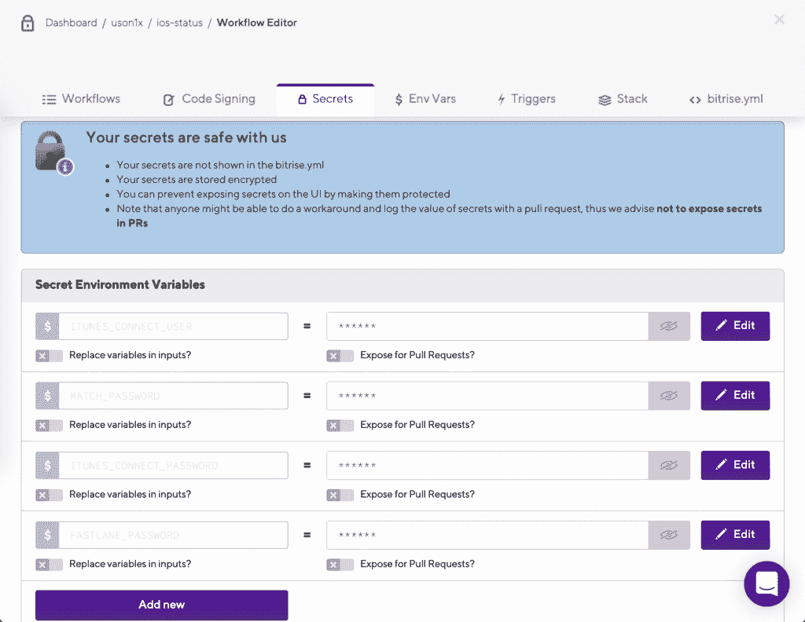

# Bitbucket + Bitrise:为 iOS 应用程序配置持续集成

> 原文：<https://dev.to/atlassian/bitbucket-bitrise-configuring-continuous-integration-for-an-ios-app-34m1>

这是 Ivan Parfenchuk 为 Bitbucket 撰写的客座博文。Ivan 是一名独立的 iOS 和 Ruby 开发人员，热衷于构建愉快的体验。和他在 Twitter 上联系[*@ gazebushka*](https://twitter.com/gazebushka)*。*

当 iOS 应用程序开始增长时，在某个时候，拥有一个快速的开发-发布-测试反馈循环变得至关重要。您可以通过手动完成所有工作来创建这个循环，但是如果您使用持续集成(CI)工具，它会更快更高级。

使用 CI 工具，您可以构建发布的历史，并快速查看哪个构建包含了什么。您可以对每个构建自动运行测试，并捕捉一些不可避免的错误。您可以在发行说明中保持一致性。您还可以简化您的发布周期，从而自动化您的清单。

听起来有趣吗？让我们尝试使用 Bitbucket Webhooks、Bitrise 和 fastlane 来构建这个反馈回路。

### 部署流程

我们将用于持续集成的流程如下所示:

1.  在 Bitbucket 中创建和合并拉请求
2.  [Bitbucket](https://bitbucket.org/product) 对 Bitrise 执行“web hook”HTTP 请求
3.  [Bitrise](https://www.bitrise.io/) 开始构建流程并推出 fastlane
4.  [fastlane](https://fastlane.tools/) 构建应用程序并将其发送到 App Store Connect
5.  App Store Connect 处理构建，并在 TestFlight 中可用

### Bitbucket Webhooks 和 git 分支模型

每次部署都从我们创建一个拉取请求开始。

假设您的团队正在使用主 git 分支来处理处于可发布状态的代码。它还通过将这个主分支合并到发布分支来生成新的发布。

以下部分描述了如何手动创建 Webhook。但是，如果你使用 Bitrise，它可以自动为你创建一个 Webhook，所以，请随意跳到 Bitrise 部分。

### 手动 Webhook 配置

接下来，让我们配置 Bitbucket Webhooks，以便每当有人推送释放分支或合并 Pull 请求以释放分支时，都会触发 Webhook。

要做到这一点，请进入您的 Bitbucket 存储库，然后单击侧边菜单中的“设置”。然后点击“工作流程”部分的“Webhooks”，然后点击“添加 webhook”

填写标题、URL(见下文)，将状态设置为活动，并为触发器选择“从完整的触发器列表中选择”。我们将使用的触发器是:

1.  存储库:推送
2.  拉式请求:创建、更新

要获取我们的 Webhook 的 URL:

1.  去 Bitrise，创建一个新的应用程序
2.  打开仪表板->您的应用->代码选项卡
3.  滚动到 Incoming Webhooks 部分，然后单击手动设置。
4.  选择“Bitbucket Webhooks”并复制 Webhook URL

[](https://cdn-images-1.medium.com/max/823/0*mGhsp9fuqfcOBHh6.png)

### Bitrise 和自动 Webhook 配置

Bitrise 是一个持续集成的平台。您可以在其中配置不同的部署“工作流”，并让 Bitrise 服务器构建和发布您的应用程序。下面是为我们的 CI 设置创建新部署工作流的步骤。

[https://www.youtube.com/embed/UeIekFewrKM](https://www.youtube.com/embed/UeIekFewrKM)

1.  首先在 Bitrise 注册，进入仪表盘，点击“添加新应用”
2.  如果您希望您的配置和日志保持私有，请选择“私有”
3.  选择 Bitbucket 并将其连接到您的帐户
4.  点按“自动添加 SSH 密钥”或手动配置 SSH 访问
5.  在“选择分支”步骤中输入`release`作为分支名称
6.  在项目构建配置中选择“快速通道”，检查浪子通道是否设置为`ios release`。
7.  选择您通常用来构建应用程序的堆栈或最新可用的 Xcode/macOS，然后点按“确认”。
8.  在最后一步“Webhook 设置”中，点击“为我注册 Webhook”

最后一步在 Bitbucket 中创建了一个 Webhook，所以您不需要手动做任何事情。你可以去 Bitbucket repository，在 Settings -> Webhooks 中检查 Webhook 的配置。

在我们的设置中，我们将使用 fastlane 构建应用程序并将其发布到 App Store Connect。

### 浪子配置

浪子是一套自动化开发和发布过程的工具。

按照本指南安装 fastlane: [设置— fastlane 文档](https://docs.fastlane.tools/getting-started/ios/setup)

简而言之，您需要安装 Xcode 开发工具:

```
xcode-select --install 
```

然后通过 RubyGems 安装 fastlane

```
sudo gem install fastlane -NV 
```

或者通过 brew:

```
brew cask install fastlane 
```

然后在终端打开你 app 的工作目录，初始化 fastlane。

```
cd /path/to/your/app 
fastlane init 
```

选择“3。🚀自动化应用商店分发”

然后按照配置要求进行操作。浪子可以为您创建和配置新的应用程序 Id，并创建一个示例部署“通道”Lane 只是完成某些场景所需的步骤的集合。

一旦配置完成，让我们打开已经创建的 Fastfile 并配置我们的第一个部署脚本。浪子有一大套自动化各种过程的工具，比如代码签名、上传截图、运行测试等等。但是，我们将从一个简单的设置开始:

```
default\_platform(:ios)  

platform :ios do   
  desc "Push a new release build to the App Store"   
  lane :release do     
    build\_app(scheme: "CITest")     
    upload\_to\_app\_store(force: true, skip\_metadata: true, skip\_screenshots: true)   
  end 
end 
```

“释放”车道将

1.  执行项目 build_app 的构建(方案:“CITest”)
2.  将生成的 ipa 文件上传到 App Store Connect upload _ to _ App _ Store。在本指南中，我们将跳过浪子元数据上传。

您可以通过在“终端”中打开项目目录并运行 fastlane release 来测试您的设置:

```
cd /path/to/your/app/directory 
fastlane release 
```

### 代码签名

如果您发现代码签名有问题，请从这里开始:[故障排除—快速通道文档](https://docs.fastlane.tools/codesigning/troubleshooting)。您可以使用 fastlane match 来管理代码签名，但是要小心:如果您已经生成了证书和预置描述文件，match 可能会出错。然而，如果这是一个全新的设置，或者你不太关心现有的配置文件，match 将大大加快速度。

我们将在示例中使用快速通道匹配:

```
cd /path/to/your/app/directory 
fastlane match development 
fastlane match adhoc 
fastlane match appstore 
```

然后打开 Xcode，关闭自动代码签名，选择 match 生成的预置描述文件。

之后，我们可以将 match 添加到我们的 Fastfile:

```
default\_platform(:ios)

platform :ios do 
  desc "Push a new release build to the App Store" 
  lane :release do 
      match(type: "appstore", readonly: true) 
    build\_app(scheme: "CITest") 
    upload\_to\_app\_store(force: true, skip\_metadata: true, skip\_screenshots: true) 
  end 
end 
```

### 完成 Bitrise 设置

[](https://cdn-images-1.medium.com/max/1024/0*v17Nea3yHD2Jgdv6.png)

Bitrise 正在其服务器上构建该项目，这些服务器上没有代码签名和上传应用程序到 App Store Connect 所需的任何密码和凭据。因此，我们必须分享其中一些，确切地说是这两个:

1.  App Store Connect 用户的登录名/密码
2.  解密匹配存储库的密码(如果使用匹配)

App Store Connect 用户不必是您用来控制应用程序的用户。您可以在 App Store Connect 中创建新用户，该用户只能访问您自动化的应用程序，并且至少拥有开发人员角色。

一旦你设置了新的应用商店连接用户，前往 Bitrise，打开工作流编辑器标签，然后秘密。添加两个新秘密:

ITUNES_CONNECT_USER 和 ITUNES_CONNECT_PASSWORD 以及此新用户的 App Store 凭据。另外，将相同的密码输入 FASTLANE_PASSWORD secret。

如果您使用 match，那么再添加一个名为 MATCH_PASSWORD 的密码，这个密码就是您用来加密 match repository 的密码。

### 结论

应该就是这样了。尝试创建一个新的 Pull 请求并合并它，看看 Bitrise 是否会触发新的构建。如果一切顺利，您将在 TestFlight 中看到新版本，并能够为您的新 iOS 应用程序版本选择它。

[](https://cdn-images-1.medium.com/max/1024/0*mq3JtlN9KrLcFM_f.png)

通过自动化部署，您可以做更多的事情，例如:

1.  使用快速通道扫描进行测试
2.  自动化内部版本号递增
3.  dSYM 上传到 Crashlytics_Raygun_etc

然而，首先从简单的事情开始。希望这个指南对你有帮助！

喜欢分享你的技术专长吗？了解更多关于 [*Bitbucket 编写程序*](http://bitbucket.org/product/write) *。*

*原载于 2019 年 4 月 29 日*[*【https://bitbucket.org】*](https://bitbucket.org/blog/bitbucket-bitrise-configuring-continuous-integration-for-an-ios-app)*。*

* * *