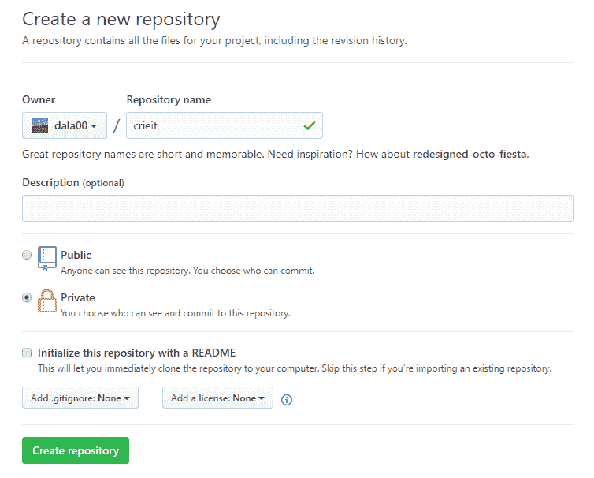
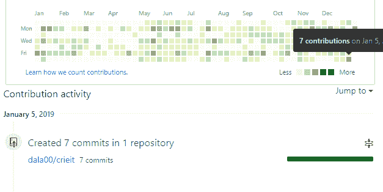

# 从 BitBucket 搬到了 GitHub 的专用资源库

> 原文：<https://dev.to/dala00/bitbucketgithub-2n4a>

GitHub 的私人储存库现在可以免费制作了！ 虽然可以免费共享的人最多只有 3 人，但是像我做的个人开发大多是一个人使用，所以非常高兴。

我一直使用 BitBucket 作为专用资源库，但是因为我对它太重和不好用感到不满，所以想使用 GitHub，所以先从 BitBucket 开始使用最频繁的 Crieit 资源库

## 用 GitHub 制作私人信息库

首先，在 GitHub 中创建一个空的专用资源库。

[](https://res.cloudinary.com/practicaldev/image/fetch/s--mTdnRe6K--/c_limit%2Cf_auto%2Cfl_progressive%2Cq_auto%2Cw_880/https://thepracticaldev.s3.amazonaws.com/i/zcferkvse0xvxaaaweer.png)

## 变更各环境的 remote 参照

更改 Git 引用的远程的 URL，如开发环境、生产环境等。 总之先看看现状的 URL。

```
$ git remote -v
origin  git@bitbucket.org:alphabrend/dev.git (fetch)
origin  git@bitbucket.org:alphabrend/dev.git (push) 
```

Enter fullscreen mode Exit fullscreen mode

更改 URL。

```
git remote set-url origin git@github.com:dala00/crieit.git 
```

Enter fullscreen mode Exit fullscreen mode

再次确认后会发现已经变更了。

```
$ git remote -v
origin  git@github.com:dala00/crieit.git (fetch)
origin  git@github.com:dala00/crieit.git (push) 
```

Enter fullscreen mode Exit fullscreen mode

实际推送时，也需要在 GitHub 上注册密钥。 虽然本地可能已在 BitBucket 或 GitHub 中注册，但生产环境可能需要单独注册。

各项准备就绪后，请尝试 fetch 或 push。 (因为还只粗略地试了一下，所以如果做不好的话很抱歉…)

## 草似乎也会移动

大概草也好好地移动了(？ )。

[](https://res.cloudinary.com/practicaldev/image/fetch/s--Xipl-BEA--/c_limit%2Cf_auto%2Cfl_progressive%2Cq_auto%2Cw_880/https://thepracticaldev.s3.amazonaws.com/i/r78a0ma2hm9vaadwto1l.png)

## 总结

还有 CI 之类的也需要搬家，所以再应对的话就写报道。

因为 Crieit 是参考 dev.to 和 Qiita 制作的，所以变成了 dev 这个奇怪的存储库名称，利用这个机会能成为像样的存储库名称也是很好的。