# bit warden:AWS EC2 上组织的密码管理器自托管版本安装

> 原文：<https://dev.to/setevoy/bitwarden-an-organization-s-password-manager-self-hosted-version-installation-on-an-aws-ec2-1plg>

[](https://res.cloudinary.com/practicaldev/image/fetch/s--2Gnb_9ud--/c_limit%2Cf_auto%2Cfl_progressive%2Cq_auto%2Cw_880/https://rtfm.co.ua/wp-content/uploads/2019/04/bitwarden-logo-png.png) 我们认为 Bitwarden 是我们项目的密码管理员，主要目标是能够通过用户角色和/或 ACL 独立访问机密。

也就是说，Pass 或 KeePass 适合一个人自己使用，但它们没有主要的东西——普通的 web 界面和基于角色的数据访问。当然有 1Password/LastPass，但是他们把数据保存在自己的服务器上，这对我不太好。

Bitwarden 是开源的，可以作为基于云的版本使用，也可以安装在自己的服务器上。

它有个人免费版和付费附加功能。

除了个人使用之外，它还可以用于具有用户角色的业务-稍后将会尝试。

首页这里是[>>>](https://bitwarden.com/)。

我喜欢比特沃顿的主要原因是:

*   拥有适用于для Linux、macOS 和 Windows 的桌面应用程序
*   所有浏览器扩展
*   Android 和 iOS 应用程序
*   RESTful API(在企业版中)，即理论上可以从 Jenkins 使用来填充它的秘密
*   具有 CLI 实用程序
*   MFA 授权
*   基于角色/组的访问(企业版)
*   文件存储器
*   从其他密码管理器(Chrome、KeePass、1Password 等)导入数据

快速安装文档可在此处[此处> > >](https://help.bitwarden.com/article/install-on-premise/#install-bitwarden) 和完整的——[此处> > >](https://help.bitwarden.com/article/install-on-premise/#manual-docker-installations) 。

在这篇文章中，Bitwarden 将被安装在 AWS EC2 实例上，额外的 EBS 卷被安装到`/bitwarden`上，Bitwarden 将在那里存储其数据，并将由 [AWS 数据生命周期管理器](https://rtfm.co.ua/aws-bekap-ebs-po-raspisaniyu-cherez-cloudwatch-rules-ili-data-lifecycle-manager/)进行备份。

在 EC2 上将有 NGINX 作为前端运行，带有来自 Let's Encrypt 的证书的 SSL 会话将在这里终止。

尽管 Bitwarden 运行在 Docker Compose 堆栈中，具有自己的 NGINX 和加密证书支持，但我会以更传统的方式来做，即主机上的 NGINX 将代理对 Bitwarden 堆栈中的 NGINX 的请求，而这个 NGINX 又将代理对其内部服务的请求。

### 目录

*   自动警报系统
    *   创建 EC2
    *   创建 EBS
    *   安全组
    *   安装 EBS
*   域名服务器(Domain Name Server)
*   主持人准备好了
    *   让我们加密
    *   NGINX
    *   坞站和坞站组成
*   Bitwarden 安装
    *   Bitwarden 配置
    *   电子邮件配置
    *   在 Bitwarden 注册
    *   Bitwarden 管理员和用户
    *   用户设置
*   与 Bitwarden 合作
    *   Chrome 插件
    *   Linux 桌面
    *   从 KeePass 导入
    *   多因素授权
    *   备份和恢复 Bitwarden 存储

### AWS

#### 创建 EC2

将在这里使用 Debian。阿美族可以在这里找到[>>>](https://wiki.debian.org/Cloud/AmazonEC2Image/Stretch)。

起初，我启动了 t3.nano，但这还不够——一个实例在启动 Bitwarden 后就挂了，这并不奇怪，因为它使用 MSSQL 并有 9 个容器在运行。比特沃顿本身就是比特沃顿。用 C#编写的. NET 应用程序。

使用 t3 运行 EC2。中等类型:

```
$ aws --profile bm-backend  ec2 run-instances --region eu-west-1 --image-id ami-01820e22b83de8d0d --key-name setevoy-testing --instance-type t3.medium --tag-specifications 'ResourceType=instance,Tags=[{Key=Name,Value=bitwarden-dev}]' 
```

获取其可用区域:

```
$ aws --profile bm-backend ec2 describe-instances --region eu-west-1 --filters "Name=tag:Name,Values=bitwarden-dev" --query "Reservations[\*].Instances[\*].[Placement.AvailabilityZone]" --output text

eu-west-1a 
```

#### 创建 EBS

创建一个 EBS 卷(默认情况下，将使用*标准*，即 HDD，如果您想要 SSD–添加`--volume-type gp2` ):

```
$ aws --profile bm-backend ec2 create-volume --region eu-west-1 --availability-zone eu-west-1a --size 5 --tag-specifications 'ResourceType=volume,Tags=[{Key=Name,Value=bitwarden-dev-ebs}]' 
```

在这里，我们设置了相同的区域(`--region eu-west-1`)和相同的可用性区域(`--availability-zone eu-west-1a`)，ес2 在这里启动，磁盘大小为 5 GiB。

获取此 EBS ID:

```
$ aws --profile bm-backend ec2 describe-volumes --region eu-west-1  --filters "Name=tag:Name,Values=bitwarden-dev-ebs" --query "Volumes[\*].VolumeId" --output text

vol-0621e68897eb2a3d8 
```

EC2 的 ID:

```
$ aws --profile bm-backend ec2 describe-instances --region eu-west-1 --filters "Name=tag:Name,Values=bitwarden-dev" --query "Reservations[\*].Instances[\*].InstanceId" --output text

i-0ac18e298768e2c4b 
```

将该 EBS 附在 EC2 上:

```
$ aws --profile bm-backend ec2 attach-volume --region eu-west-1 --volume-id vol-0621e68897eb2a3d8 --instance-id i-0ac18e298768e2c4b --device xvdb 
```

#### 安全组

创建一个安全组——通过 WebUI 快速创建。

在创建此 SG 的过程中，请注意 VPC ID–必须与您的 EC2 所用的 ID 相同:

[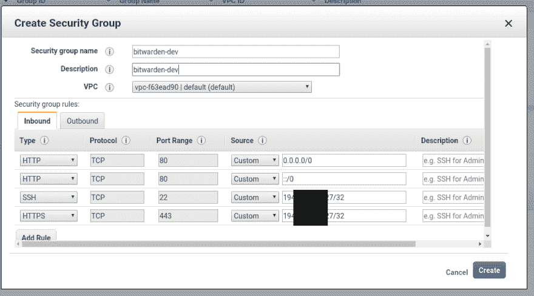](https://rtfm.co.ua/wp-content/uploads/2019/04/Screenshot_20190430_130854.png)

允许从任何地方访问 80 端口，让我们加密授权工作。

仅允许我们办公室使用 443 和 22 端口。

将这个 SG 连接到 EC2-*网络>变更安全组*:

[](https://rtfm.co.ua/wp-content/uploads/2019/04/Screenshot_20190430_131106.png)

[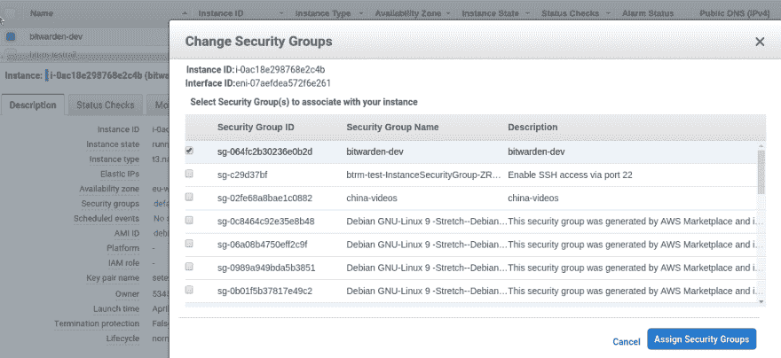](https://rtfm.co.ua/wp-content/uploads/2019/04/Screenshot_20190430_131130.png)

#### 安装 EBS

登录服务器:

```
$ ssh admin@34.240.14.78 -i setevoy-testing-eu-west-1.pem 
```

检查磁盘:

```
$ admin@ip-172-31-36-249:~$ lsblk
NAME        MAJ:MIN RM SIZE RO TYPE MOUNTPOINT
nvme0n1     259:0    0   8G  0 disk
└─nvme0n1p1 259:1    0   8G  0 part /
nvme1n1     259:2    0   5G  0 disk 
```

是我们的 EBS。

创建`/bitwarden`目录:

```
admin@ip-172-31-36-249:~$ sudo -s
root@ip-172-31-36-249:/home/admin# mkdir /bitwarden 
```

在`/dev/nvme1n1` :
上创建一个分区

```
root@ip-172-31-36-249:/home/admin# sgdisk -n 1 /dev/nvme1n1
Creating new GPT entries.
The operation has completed successfully. 
```

创建文件系统:

```
root@ip-172-31-36-249:/home/admin# mkfs.ext4 /dev/nvme1n1p1 
```

现在检查分区:

```
root@ip-172-31-36-249:/home/admin# fdisk /dev/nvme1n1
...
Device         Start      End  Sectors Size Type
/dev/nvme1n1p1  2048 10485726 10483679   5G Linux filesystem 
```

将其安装到`/bitwarden` :

```
root@ip-172-31-36-249:/home/admin# mount /dev/nvme1n1p1 /bitwarden/
root@ip-172-31-36-249:/home/admin# ls -l /bitwarden/
total 16
drwx------ 2 root root 16384 Apr 30 10:15 lost+found 
```

获取分区 ID:

```
root@ip-172-31-36-249:/home/admin# blkid /dev/nvme1n1p1
/dev/nvme1n1p1: UUID="5e3972d4-c742-4224-80d6-8239e5201ae1" TYPE="ext4" PARTUUID="929f264c-ac03-4f9f-9071-056c1511de0e" 
```

使用这个 UUID，通过`--nofail`选项向`/etc/fstab`添加一个新的挂载点:

```
root@ip-172-31-36-249:/home/admin# cat /etc/fstab
UUID=3866caa4-0449-4478-899b-60eb6f71dd26       /       ext4    rw,discard,errors=remount-ro    0       1
UUID="5e3972d4-c742-4224-80d6-8239e5201ae1" /bitwarden ext4 nofail 0 0 
```

卸载手动挂载的分区:

```
root@ip-172-31-36-249:/home/admin# umount /bitwarden/ 
```

并使用`fstab` :
将其装回

```
root@ip-172-31-36-249:/home/admin# mount -a 
```

检查:

```
root@ip-172-31-36-249:/home/admin# findmnt /bitwarden/
TARGET     SOURCE         FSTYPE OPTIONS
/bitwarden /dev/nvme1n1p1 ext4   rw,relatime,data=ordered 
```

现在可以重新启动实例以检查装载是否正常工作。

另外，安装所有更新:

```
root@ip-172-31-36-249:/home/admin# apt update && apt -y upgrade && reboot 
```

### [DNA](#dns)

创建要使用的域名:

[](https://rtfm.co.ua/wp-content/uploads/2019/04/Screenshot_20190430_134008.png)

### 主机的设置

#### 让我们加密

安装客户端:

```
root@ip-172-31-36-249:/home/admin# apt install -y git
root@ip-172-31-36-249:/home/admin# git clone https://github.com/letsencrypt/letsencrypt /opt/letsencrypt 
```

使用独立验证器获取证书:

```
root@ip-172-31-36-249:/home/admin# /opt/letsencrypt/letsencrypt-auto certonly -d dev.bitwarden.setevoy.org.ua

Saving debug log to /var/log/letsencrypt/letsencrypt.log

How would you like to authenticate with the ACME CA?
- - - - - - - - - - - - - - - - - - - - - - - - - - - - - - - - - - - - - - - -
1: Spin up a temporary webserver (standalone)

2: Place files in webroot directory (webroot)
- - - - - - - - - - - - - - - - - - - - - - - - - - - - - - - - - - - - - - - -

Select the appropriate number [1-2] then [enter] (press 'c' to cancel): 1
Plugins selected: Authenticator standalone, Installer None

Enter email address (used for urgent renewal and security notices) (Enter 'c' to
cancel): admin@example.com

- - - - - - - - - - - - - - - - - - - - - - - - - - - - - - - - - - - - - - - -

Please read the Terms of Service at
https://letsencrypt.org/documents/LE-SA-v1.2-November-15-2017.pdf. You must
agree in order to register with the ACME server at
https://acme-v02.api.letsencrypt.org/directory

- - - - - - - - - - - - - - - - - - - - - - - - - - - - - - - - - - - - - - - -
(A)gree/(C)ancel: A
- - - - - - - - - - - - - - - - - - - - - - - - - - - - - - - - - - - - - - - -

Would you be willing to share your email address with the Electronic Frontier
Foundation, a founding partner of the Let's Encrypt project and the non-profit
organization that develops Certbot? We'd like to send you email about our work
encrypting the web, EFF news, campaigns, and ways to support digital freedom.

- - - - - - - - - - - - - - - - - - - - - - - - - - - - - - - - - - - - - - - -

(Y)es/(N)o: N

Obtaining a new certificate
Performing the following challenges:
http-01 challenge for dev.bitwarden.setevoy.org.ua
Waiting for verification...
Cleaning up challenges

IMPORTANT NOTES:

- Congratulations! Your certificate and chain have been saved at:
/etc/letsencrypt/live/dev.bitwarden.setevoy.org.ua/fullchain.pem
Your key file has been saved at:
/etc/letsencrypt/live/dev.bitwarden.setevoy.org.ua/privkey.pem
... 
```

#### NGINX

安装 NGINX:

```
root@ip-172-31-36-249:/home/admin# apt -y install nginx 
```

为 SSL 生成密钥:

```
root@ip-172-31-36-249:/home/admin# openssl dhparam -out /etc/nginx/dhparams.pem 2048 
```

添加虚拟主机的配置-`/etc/nginx/conf.d/dev.bitwarden.setevoy.org.ua.conf`:

```
server {

    listen 80;

    server_name dev.bitwarden.setevoy.org.ua;

    # Lets Encrypt Webroot
    location ~ /.well-known {
        root /var/www/html;
        allow all;
    }

    location / {

        # office1
        allow 194.***.***.24/29;
        # office2
        allow 91.***.***.78/32;
        # arseny home
        allow 188.***.***.48/32;
        deny  all;

        return 301 https://dev.bitwarden.setevoy.org.ua;
    }
}
server {
    listen       443 ssl;
    server_name  dev.bitwarden.setevoy.org.ua;
    root /var/www/html;
    access_log  /var/log/nginx/dev.bitwarden.setevoy.org.ua-access.log;
    error_log /var/log/nginx/dev.bitwarden.setevoy.org.ua-error.log warn;

    # office1
    allow 194.***.***.24/29;
    # office2
    allow 91.***.***.78/32;
    # arseny home
    allow 188.***.***.48/32;
    deny  all;

    ssl_certificate /etc/letsencrypt/live/dev.bitwarden.setevoy.org.ua/fullchain.pem;
    ssl_certificate_key /etc/letsencrypt/live/dev.bitwarden.setevoy.org.ua/privkey.pem;
    ssl_protocols TLSv1 TLSv1.1 TLSv1.2;
    ssl_prefer_server_ciphers on;
    ssl_dhparam /etc/nginx/dhparams.pem;
    ssl_ciphers "EECDH+AESGCM:EDH+AESGCM:ECDHE-RSA-AES128-GCM-SHA256:AES256+EECDH:DHE-RSA-AES128-GCM-SHA256:AES256+EDH:ECDHE-RSA-AES256-GCM-SHA384:DHE-RSA-AES256-GCM-SHA384:ECDHE-RSA-AES256-SHA384:ECDHE-RSA-AES128-SHA256:ECDHE-RSA-AES256-SHA:ECDHE-RSA-AES128-SHA:DHE-RSA-AES256-SHA256:DHE-RSA-AES128-SHA256:DHE-RSA-AES256-SHA:DHE-RSA-AES128-SHA:ECDHE-RSA-DES-CBC3-SHA:EDH-RSA-DES-CBC3-SHA:AES256-GCM-SHA384:AES128-GCM-SHA256:AES256-SHA256:AES128-SHA256:AES256-SHA:AES128-SHA:DES-CBC3-SHA:HIGH:!aNULL:!eNULL:!EXPORT:!DES:!MD5:!PSK:!RC4";
    ssl_session_timeout 1d;
    ssl_stapling on;
    ssl_stapling_verify on;
    location / {
        proxy_pass http://localhost:8000/;
        proxy_set_header Host $host;
        proxy_set_header X-Real-IP $remote_addr;
        proxy_set_header X-Forwarded-For $proxy_add_x_forwarded_for;
        proxy_set_header X-Forwarded-Proto $scheme;
        client_max_body_size 0;
        add_header Strict-Transport-Security "max-age=31536000; includeSubDomains; preload";
        add_header Referrer-Policy "same-origin";
    }
} 
```

检查其语法并重新加载配置:

```
root@ip-172-31-36-249:/home/admin# nginx  -t && systemctl reload nginx
nginx: the configuration file /etc/nginx/nginx.conf syntax is ok
nginx: configuration file /etc/nginx/nginx.conf test is successful 
```

检查:

```
root@ip-172-31-36-249:/home/admin# curl -vL dev.bitwarden.setevoy.org.ua
...

* Connected to dev.bitwarden.setevoy.org.ua (34.240.14.78) port 80 (#0)
< HTTP/1.1 301 Moved Permanently
...
< Location: https://dev.bitwarden.setevoy.org.ua
...
curl: (7) Failed to connect to dev.bitwarden.setevoy.org.ua port 443: Connection timed out 
```

一切都好。

*连接超时*——因为我们还没有运行后端。

#### 坞站和坞站复合

要运行 Bitwarden，需要安装 Docker 和 Docker Compose。

码头工人:

```
root@ip-172-31-36-249:/home/admin# curl -L get.docker.com | bash 
```

检查:

```
root@ip-172-31-36-249:/home/admin# docker -v
Docker version 18.09.5, build e8ff056dbc 
```

将`admin`用户添加到`docker`组:

```
root@ip-172-31-36-249:/home/admin# usermod -aG docker admin 
```

安装坞站组成:

```
root@ip-172-31-36-249:/home/admin# curl -L "https://github.com/docker/compose/releases/download/1.24.0/docker-compose-$(uname -s)-$(uname -m)" -o /usr/local/bin/docker-compose
root@ip-172-31-36-249:/home/admin# chmod +x /usr/local/bin/docker-compose
root@ip-172-31-36-249:/home/admin# docker-compose -v
docker-compose version 1.24.0, build 0aa59064 
```

### Bitwarden 安装

去[bitwarden.com/host](https://bitwarden.com/host/)拿钥匙:

[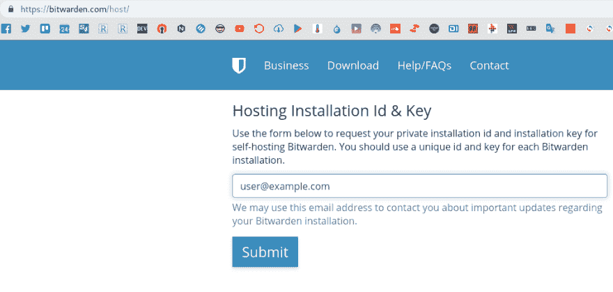](https://rtfm.co.ua/wp-content/uploads/2019/04/Screenshot_20190430_141155.png)

[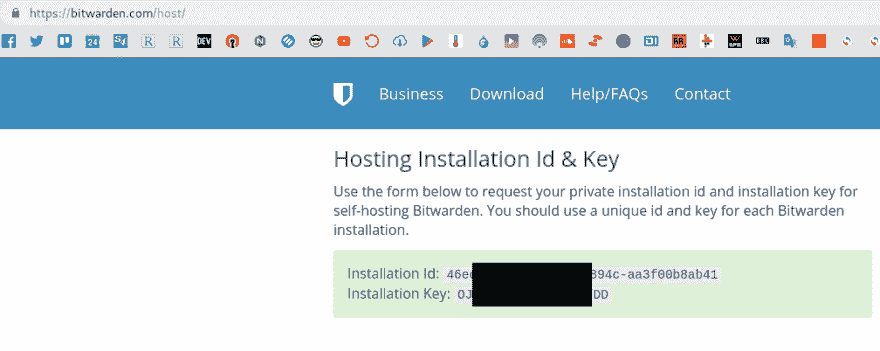](https://rtfm.co.ua/wp-content/uploads/2019/04/Screenshot_20190430_141214.png)

每个位管理员都需要有自己的一组密钥。

下载安装、配置和管理脚本:

```
root@ip-172-31-36-249:/home/admin# cd /bitwarden/
root@ip-172-31-36-249:/bitwarden# curl -s -o bitwarden.sh https://raw.githubusercontent.com/bitwarden/core/master/scripts/bitwarden.sh
root@ip-172-31-36-249:/bitwarden# chmod +x bitwarden.sh 
```

这个脚本将从[https://github.com/bitwarden/server](https://github.com/bitwarden/server)仓库下载文件，然后使用`install`选项调用[https://github . com/bit warden/server/blob/master/scripts/run . sh](https://github.com/bitwarden/server/blob/master/scripts/run.sh)脚本。

`bitwarden.sh` :
的所有选项

```
| Command | Description |
| --- | --- |
| install | Start the installer. |
| start | Start all containers. |
| restart | Restart all containers (same as start). |
| stop | Stop all containers. |
| updatedb | Update/initialize the database. |
| update | Update all containers and the database. |
| updateself | Update this main script. |
| rebuild | Rebuild generated installation assets from `config.yml`. | 
```

开始安装:

```
root@ip-172-31-36-249:/bitwarden# ./bitwarden.sh install
...

(!) Enter the domain name for your Bitwarden instance (ex. bitwarden.company.com): dev.bitwarden.setevoy.org.ua

(!) Do you want to use Let's Encrypt to generate a free SSL certificate? (y/n): n

1.30.1: Pulling from bitwarden/setup
...
Status: Downloaded newer image for bitwarden/setup:1.30.1
...
(!) Enter your installation id (get at https://bitwarden.com/host): 46ec2f0b-\*\*\*-\*\*\*-aa3f00b8ab41
(!) Enter your installation key: OJ0\*\*\*fDD
(!) Do you have a SSL certificate to use? (y/n): y
...
(!) Is this a trusted SSL certificate (requires ca.crt, see docs)? (y/n): y
Generating key for IdentityServer.
Generating a RSA private key
...
writing new private key to 'identity.key'
-----
Building nginx config.
Building docker environment files.
Building docker environment override files.
Building FIDO U2F app id.
Building docker-compose.yml.
Installation complete
...

Next steps, run:

`./bitwarden.sh start` 
```

#### Bitwarden 配置

该脚本会将所有 Bitwarden 的数据保存到`bwdata`目录:

```
root@ip-172-31-36-249:/bitwarden# ll
total 24
-rwxr-xr-x  1 root   root     2535 Apr 30 11:07 bitwarden.sh
drwxr-xr-x 11 nobody nogroup  4096 Apr 30 11:13 bwdata

root@ip-172-31-36-249:/bitwarden# ll bwdata/
total 40
drwxr-xr-x 2 nobody nogroup 4096 Apr 30 11:10 ca-certificates
-rw-r--r-- 1 nobody nogroup 3323 Apr 30 11:13 config.yml
drwxr-xr-x 2 nobody nogroup 4096 Apr 30 11:13 docker
drwxr-xr-x 2 nobody nogroup 4096 Apr 30 11:13 env
drwxr-xr-x 2 nobody nogroup 4096 Apr 30 11:13 identity
drwxr-xr-x 2 nobody nogroup 4096 Apr 30 11:10 letsencrypt
drwxr-xr-x 2 nobody nogroup 4096 Apr 30 11:13 nginx
drwxr-xr-x 2 nobody nogroup 4096 Apr 30 11:10 scripts
drwxr-xr-x 3 nobody nogroup 4096 Apr 30 11:13 ssl
drwxr-xr-x 2 nobody nogroup 4096 Apr 30 11:13 web 
```

主配置文件是`bwdata/config.yml`。

另外，在`./bwdata/env/global.override.env`文件中可以设置额外的变量，稍后会检查它们。

Docker 构建堆栈将使用`./bwdata/docker/docker-compose.yml`文件启动:

```
version: '3'
services:
  mssql:
    image: bitwarden/mssql:1.30.1
    container_name: bitwarden-mssql
    restart: always
    volumes:
      - ../mssql/data:/var/opt/mssql/data
      - ../logs/mssql:/var/opt/mssql/log
      - ../mssql/backups:/etc/bitwarden/mssql/backups
    env_file:
      - mssql.env
      - ../env/uid.env
      - ../env/mssql.override.env
  web:
    image: bitwarden/web:2.10.0
    container_name: bitwarden-web
    restart: always
    volumes:
      - ../web:/etc/bitwarden/web
    env_file:
      - global.env
      - ../env/uid.env
... 
```

更新`config.yml`文件——禁用 SSL，因为我们有自己的 NGINX 和 SSL，并更改 HTTP 和 HTTPS 端口:

```
...
# Docker compose file port mapping for HTTP. Leave empty to remove the port mapping.
# Learn more: https://docs.docker.com/compose/compose-file/#ports
http_port: 8000
# Docker compose file port mapping for HTTPS. Leave empty to remove the port mapping.
# Learn more: https://docs.docker.com/compose/compose-file/#ports
https_port: 8001
...
# Configure Nginx for SSL.
ssl: false
... 
```

更新应用程序配置:

```
root@ip-172-31-36-249:/bitwarden# ./bitwarden.sh rebuild 
```

启动位元服务:

```
root@ip-172-31-36-249:/bitwarden# ./bitwarden.sh start
...
Bitwarden is up and running! 
```

在浏览器中签入:

[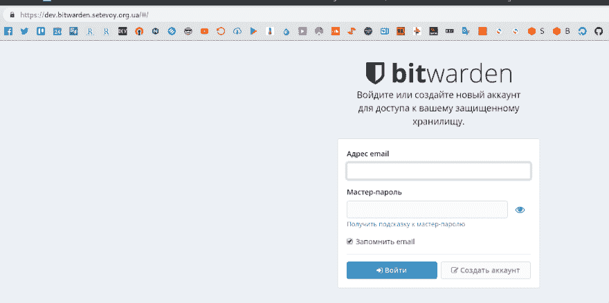](https://rtfm.co.ua/wp-content/uploads/2019/04/Screenshot_20190430_143833.png)

检查容器:

```
root@ip-172-31-36-249:/bitwarden# docker ps

CONTAINER ID        IMAGE                            COMMAND             CREATED             STATUS              PORTS                                                    NAMES

b196ee0f81ff        bitwarden/nginx:1.30.1           "/entrypoint.sh"    About an hour ago   Up About an hour    80/tcp, 0.0.0.0:5178->8080/tcp, 0.0.0.0:5179->8443/tcp   bitwarden-nginx

ef03f591491d        bitwarden/admin:1.30.1           "/entrypoint.sh"    About an hour ago   Up About an hour    5000/tcp                                                 bitwarden-admin

d4fa88921cce        bitwarden/api:1.30.1             "/entrypoint.sh"    About an hour ago   Up About an hour    5000/tcp                                                 bitwarden-api

408c5f0bd370        bitwarden/notifications:1.30.1   "/entrypoint.sh"    About an hour ago   Up About an hour    5000/tcp                                                 bitwarden-notifications

9bec10bc09d8        bitwarden/icons:1.30.1           "/entrypoint.sh"    About an hour ago   Up About an hour    5000/tcp                                                 bitwarden-icons

f87789cc4da4        bitwarden/mssql:1.30.1           "/entrypoint.sh"    About an hour ago   Up About an hour    1433/tcp                                                 bitwarden-mssql

143370f979c5        bitwarden/web:2.10.0             "/entrypoint.sh"    About an hour ago   Up About an hour    5000/tcp                                                 bitwarden-web

acdc220a7c29        bitwarden/identity:1.30.1        "/entrypoint.sh"    About an hour ago   Up About an hour    5000/tcp                                                 bitwarden-identity

925d047b6321        bitwarden/attachments:1.30.1     "/entrypoint.sh"    About an hour ago   Up About an hour    5000/tcp                                                 bitwarden-attachments 
```

在这些容器中，Bitwarden 将从主机挂载目录，例如`mssql` :

```
root@ip-172-31-36-249:/bitwarden# docker inspect bitwarden-mssql | jq .[].Mounts
[
{
  "Type": "bind",
  "Source": "/bitwarden/bwdata/logs/mssql",
  "Destination": "/var/opt/mssql/log",
  "Mode": "rw",
  "RW": true,
  "Propagation": "rprivate"
},
{
  "Type": "bind",
  "Source": "/bitwarden/bwdata/mssql/data",
  "Destination": "/var/opt/mssql/data",
  "Mode": "rw",
  "RW": true,
  "Propagation": "rprivate"
},
{
  "Type": "bind",
  "Source": "/bitwarden/bwdata/mssql/backups",
  "Destination": "/etc/bitwarden/mssql/backups",
  "Mode": "rw",
  "RW": true,
  "Propagation": "rprivate"
}
] 
```

因此，对于一个备份来说，仅仅存储`bwdata`目录就足够了。

#### 邮件配置

电子邮件设置在`bwdata/env/global.override.env`文件中设定。

我们将使用 [AWS SES](https://rtfm.co.ua/aws-ses-simple-email-service-i-workmail-nastrojka-akkaunta-i-otpravka-pochty/) ，更新变量:

```
...
globalSettings__mail__replyToEmail=no-reply@example.com
globalSettings__mail__smtp__host=email-smtp.us-east-1.amazonaws.com
globalSettings__mail__smtp__port=587
globalSettings__mail__smtp__ssl=false
globalSettings__mail__smtp__username=AKI***MJI
globalSettings__mail__smtp__password=BKR***z2G
... 
```

只有在`config.yml`:
发生变化后，才需要重启 Bitwarden ( `rebuild`)

```
root@ip-172-31-36-249:/bitwarden# ./bitwarden.sh restart 
```

如果邮件发送出现问题——检查`bwdata/logs/api/Api/`目录或`bitwarden-api`容器
中的日志

```
root@ip-172-31-36-249:/bitwarden# docker logs -f bitwarden-api 
```

#### 在 Bitwarden 中注册

现在，您可以在您的 Bitwarden 安装中注册。

点击*创建账户*:

[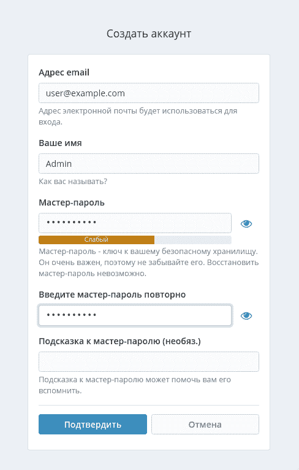](https://rtfm.co.ua/wp-content/uploads/2019/04/Screenshot_20190430_171223.png)

点击*确认*。

#### Bitwarden 管理员和用户

将管理员邮箱添加到`adminSettings__admins=`字段中的`bwdata/env/global.override.env`文件。

注意，[文档](https://help.bitwarden.com/article/admin-portal/)说:

> 这些管理员电子邮件地址不需要在您的 Bitwarden 安装上注册帐户

使用此邮箱登录后，您将收到一封电子邮件，其中包含进入管理页面的授权链接。本链接有效期为 15 分钟:

```
...
adminSettings__admins=admin@example.com,anotheradmin@example.com
... 
```

重新启动服务:

```
root@ip-172-31-36-249:/bitwarden# ./bitwarden.sh restart 
```

并进入页面:

[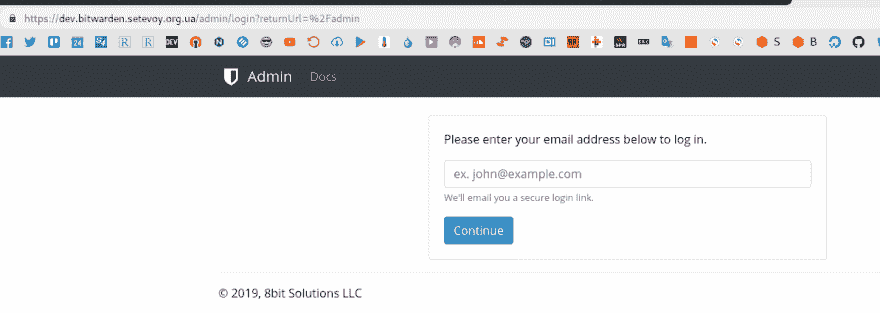](https://rtfm.co.ua/wp-content/uploads/2019/04/Screenshot_20190430_155258.png)

使用`adminSettings__admins`中指定的邮箱登录，获取电子邮件，点击链接:

[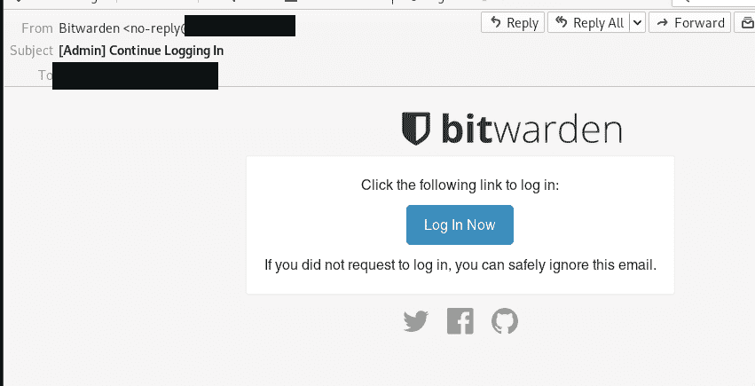](https://rtfm.co.ua/wp-content/uploads/2019/04/Screenshot_20190430_171646.png)

[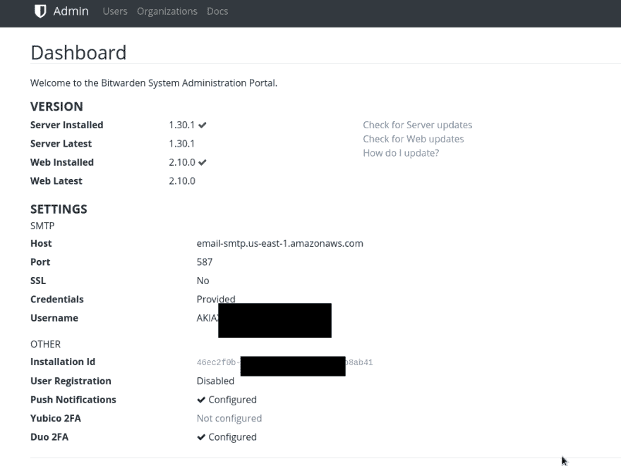](https://rtfm.co.ua/wp-content/uploads/2019/04/Screenshot_20190430_171732.png)

#### 用户设置

在表单中使用普通*登录，将会看到通常的用户空间:*

[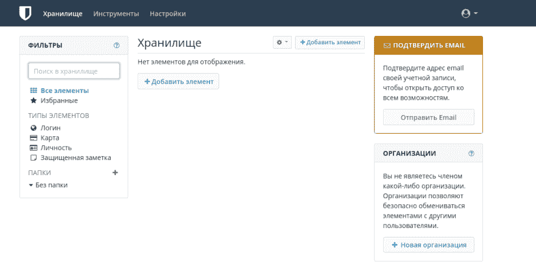](https://rtfm.co.ua/wp-content/uploads/2019/04/Screenshot_20190430_171934.png)

在*工具*中，您可以从 KeePass 等各种密码管理器中导入数据:

[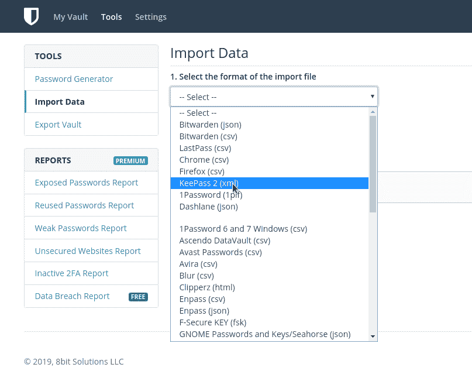](https://rtfm.co.ua/wp-content/uploads/2019/04/Screenshot_20190430_172154.png)

手动添加密码:

[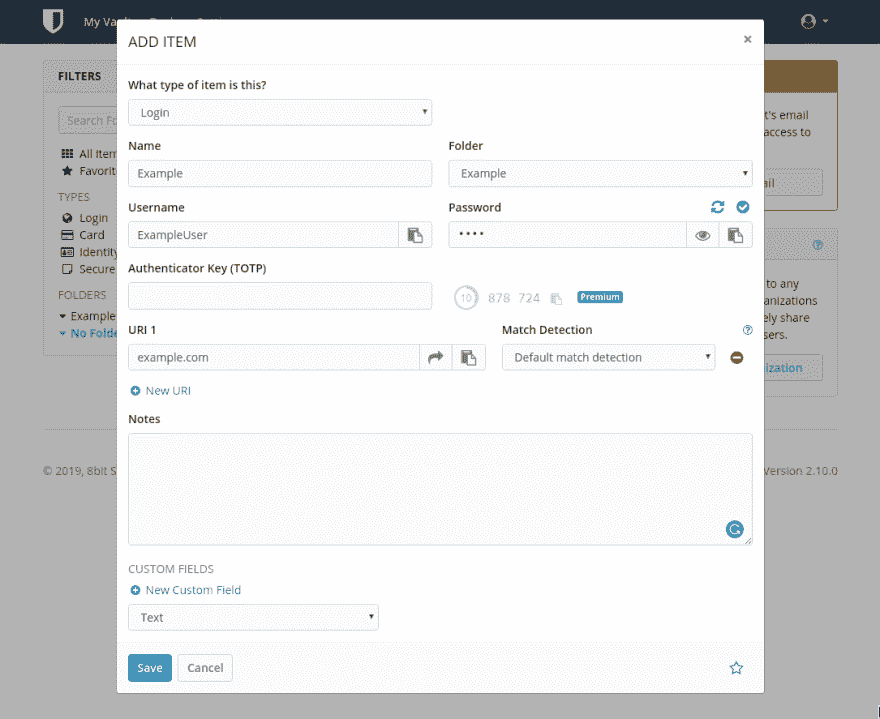](https://rtfm.co.ua/wp-content/uploads/2019/04/Screenshot_20190430_172527.png)

获取密码:

[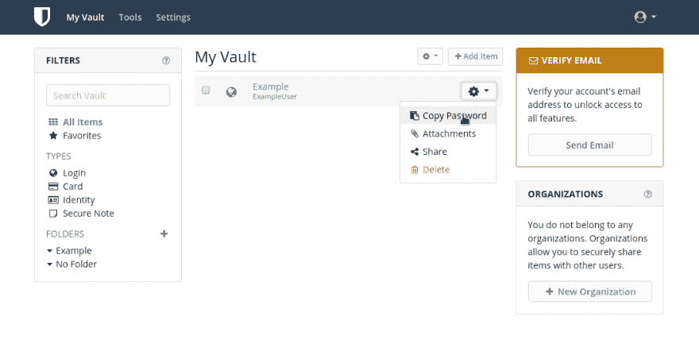](https://rtfm.co.ua/wp-content/uploads/2019/04/Screenshot_20190430_172605.png)

### 与 Bitwarden 合作

#### Chrome 插件

从 [Chrome 网上商店](https://chrome.google.com/webstore/detail/bitwarden-free-password-m/nngceckbapebfimnlniiiahkandclblb?hl=en)安装 Chrome 扩展:

[](https://rtfm.co.ua/wp-content/uploads/2019/04/Screenshot_20190430_173858.png)

点击*设置*:

[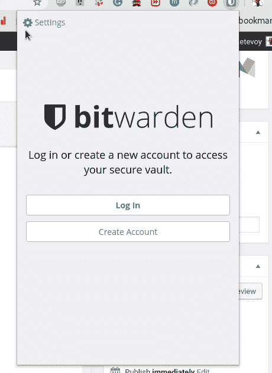](https://rtfm.co.ua/wp-content/uploads/2019/04/Screenshot_20190430_174015.png)

设置服务器的 URL:

[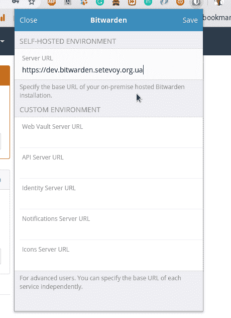](https://rtfm.co.ua/wp-content/uploads/2019/04/Screenshot_20190430_174059.png)

登录:

[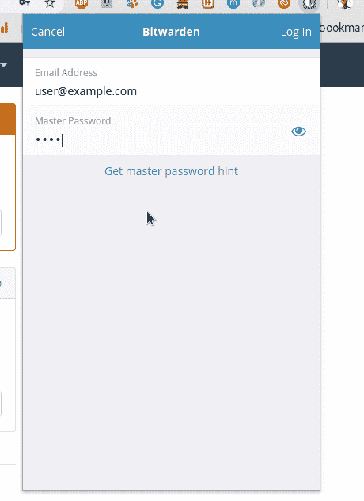](https://rtfm.co.ua/wp-content/uploads/2019/04/Screenshot_20190430_174139.png)

直接从浏览器获取所有密码:

[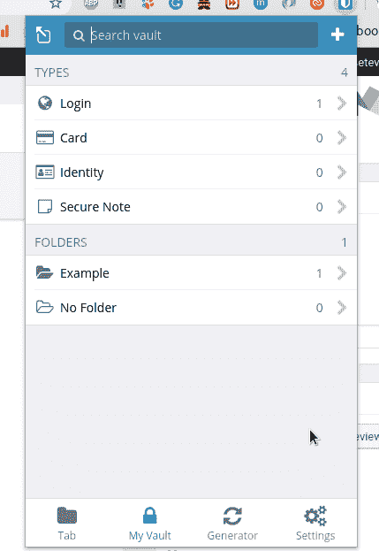](https://rtfm.co.ua/wp-content/uploads/2019/04/Screenshot_20190430_174217.png)

此外，它将建议在登录时存储密码，作为一个常用的密码管理器:

[](https://rtfm.co.ua/wp-content/uploads/2019/05/Screenshot_20190501_105832.png)

#### Linux 桌面

我猜它有任何基于 Linux 系统的客户端

在 Arch Linux 可以从 [AUR](https://aur.archlinux.org/packages/bitwarden-bin/) :
安装

```
$ yaourt -S bitwarden-bin 
```

并以与 Chrome 扩展相同的方式登录:

[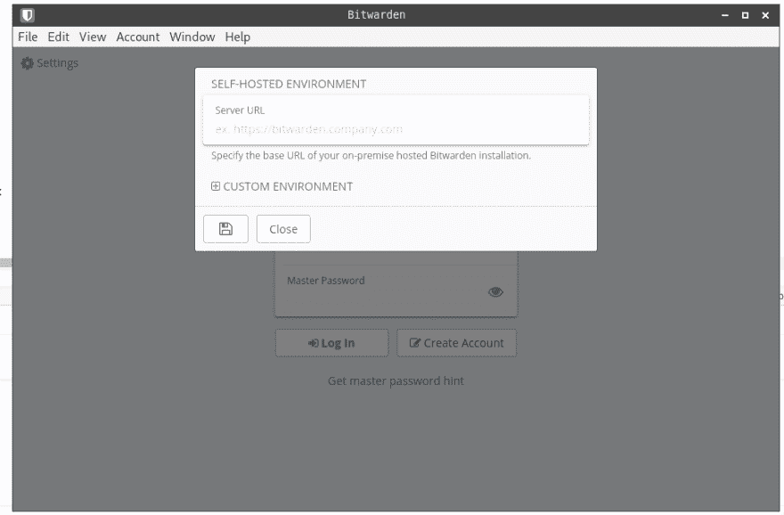](https://rtfm.co.ua/wp-content/uploads/2019/04/Screenshot_20190430_174623.png)

[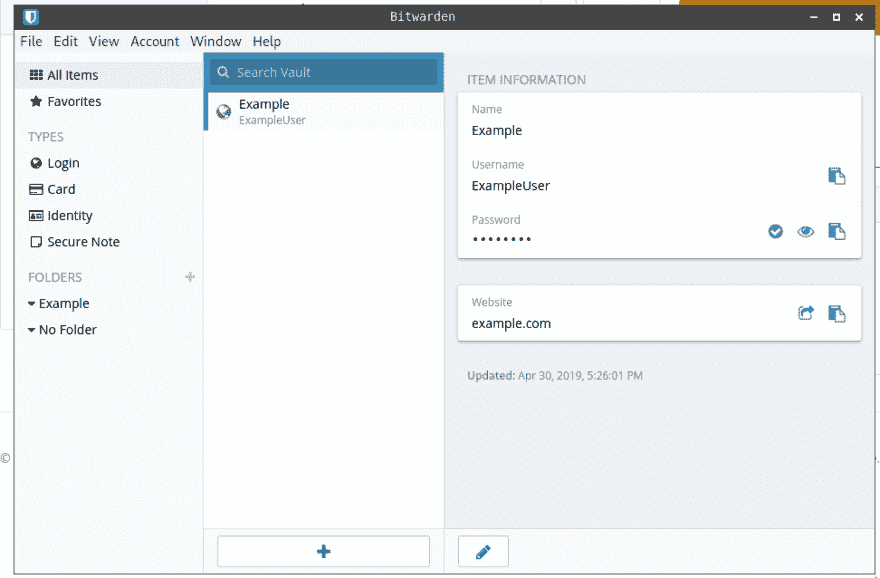](https://rtfm.co.ua/wp-content/uploads/2019/04/Screenshot_20190430_174709.png)

#### 从 KeePass 导入

让我们看看导入是如何工作的

在 KeePass 中将数据导出到 XML 文件:

[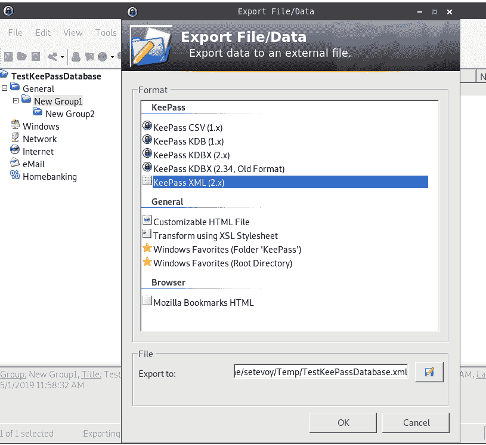](https://rtfm.co.ua/wp-content/uploads/2019/05/Screenshot_20190501_120003.png)

然后去 bit warden-*工具>导入数据*:

[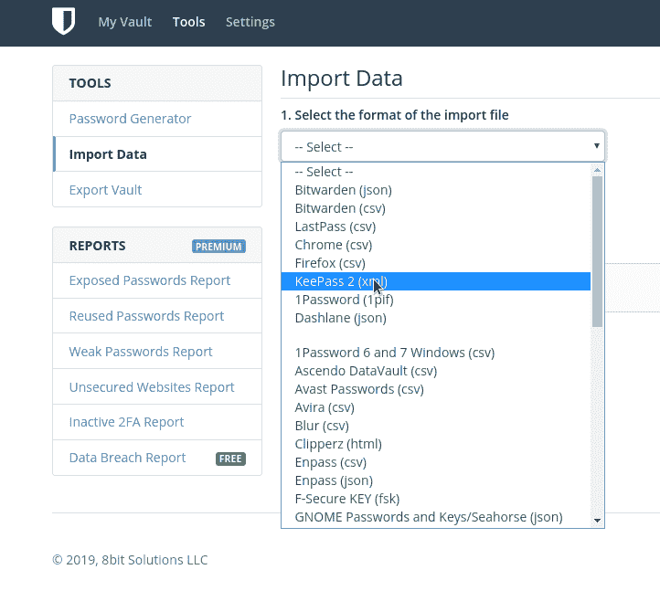](https://rtfm.co.ua/wp-content/uploads/2019/05/Screenshot_20190501_120109.png)

[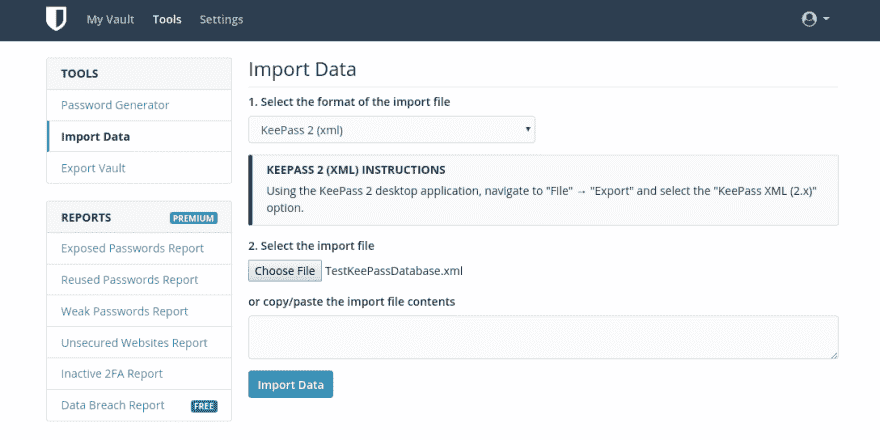](https://rtfm.co.ua/wp-content/uploads/2019/05/Screenshot_20190501_120142.png)

就绪–即使有目录结构:

[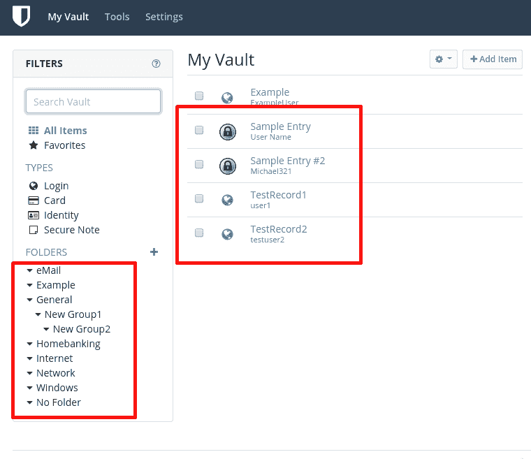](https://rtfm.co.ua/wp-content/uploads/2019/05/Screenshot_20190501_120206.png)

导出可以用同样的方式完成——您可以从 Bitwarden 上传 JSON 或 CSV 文件中的数据，CSV 文件可以导入到本地 KeePass。这样一个额外的备份。

请记住，导出的文件将对所有密码进行加密。

#### 多因素授权

MFA 可以在*我的帐户-两步登录*中配置，一切都以标准方式进行:

[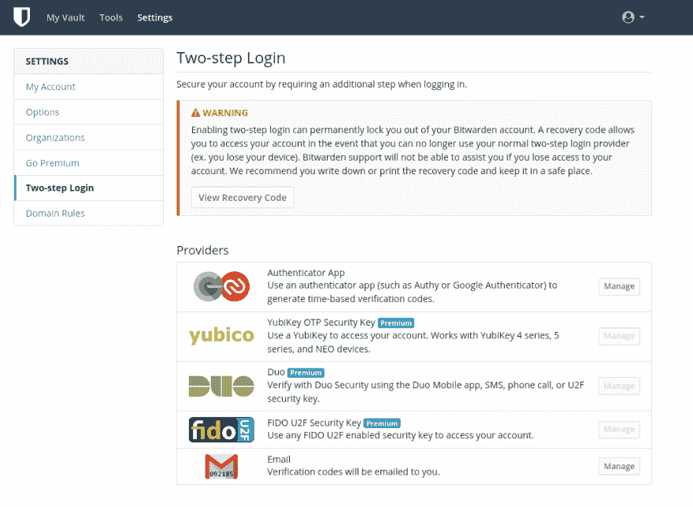](https://rtfm.co.ua/wp-content/uploads/2019/05/Screenshot_20190501_121058.png)

[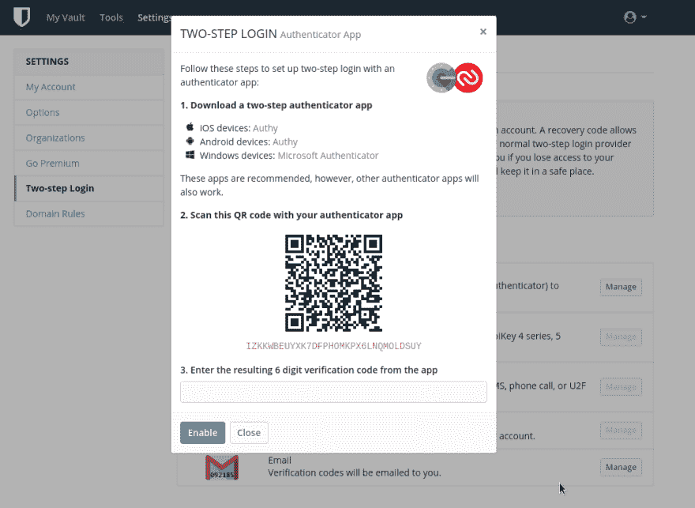](https://rtfm.co.ua/wp-content/uploads/2019/05/Screenshot_20190501_121118.png)

#### 备份和恢复 Bitwarden 存储

没有人希望丢失组织的所有密码，所以让我们来看看备份和恢复将如何工作。

由于我们已经从专用 EBS 卷安装了`/bitwarden`,因此它可以由 [AWS 数据生命周期管理器](https://rtfm.co.ua/aws-bekap-ebs-po-raspisaniyu-cherez-cloudwatch-rules-ili-data-lifecycle-manager/)每天拍摄快照，然后在出现问题的情况下，可以创建一个新卷，并使用新的 Bitwarden 安装将其安装到新的 EC2 实例。

所以检查的步骤是，快速地:

1.  手动创建快照
2.  使用此快照创建新的 EBS
3.  开始新的ес2
4.  连接该 EBS 并将其安装到`/bitwarden`
5.  获取一个加密证书
6.  安装 NGINX，设置虚拟主机
7.  安装坞站，复合坞站
8.  如果一个域被改变——更新`/bitwarden/bwdata/config.yml`,改变`url`参数
9.  运行`./bitwarden.sh rebuild`
10.  运行`./bitwarden.sh start`
11.  …
12.  利润！

[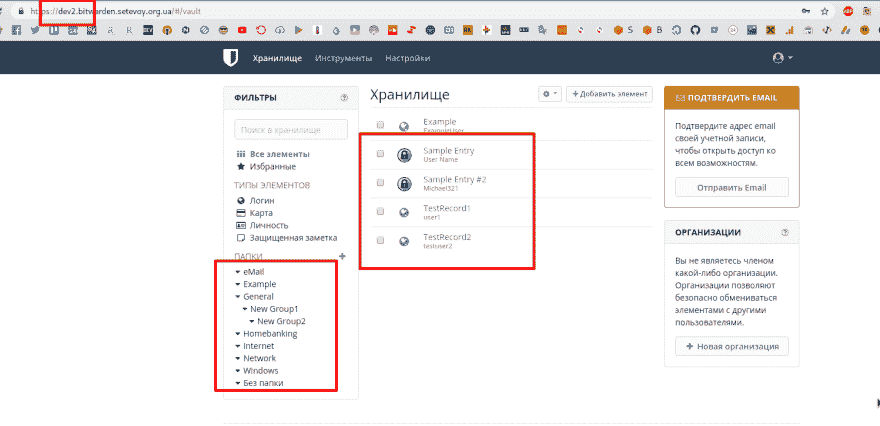](https://rtfm.co.ua/wp-content/uploads/2019/05/Screenshot_20190501_124549.png)

目前就这些。

何时获得试用许可证–将扮演用户和角色。

### 类似的帖子

*   <small>04/25/2019</small>[Linux:GPG-密匙，Pass 密码管理器，从 KeePass 数据库导入密码](https://dev.to/setevoy/linux-gpg-keys-the-pass-passwords-manager-and-passwords-import-from-the-keepass-database-1j8f)<small></small>
<small>*   <small>03/22/2019</small>[TestRail:Linux 上的 QA 测试用例管理安装](https://dev.to/setevoy/testrail-qa-test-case-management-installation-on-linux-5caa)<small></small><small>*   <small>02/10/2018</small>[ansi ble:миграцияrtfm 2.10——让我们加密，NGINX SSL，主机名и exim](https://rtfm.co.ua/ansible-migraciya-rtfm-2-10-lets-encrypt-nginx-ssl-hostname-i-exim/)<small></small><small></small></small></small>

<small><small><small></small></small></small>