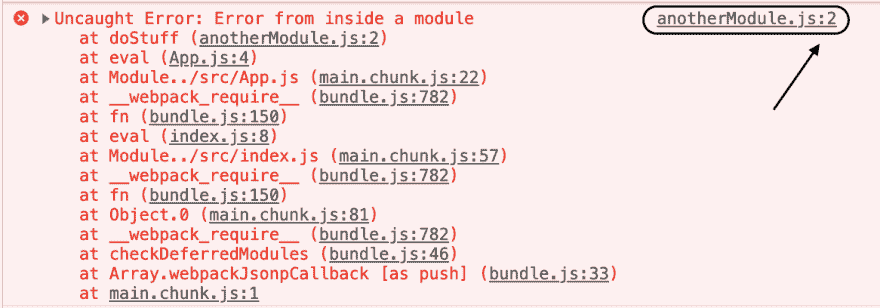
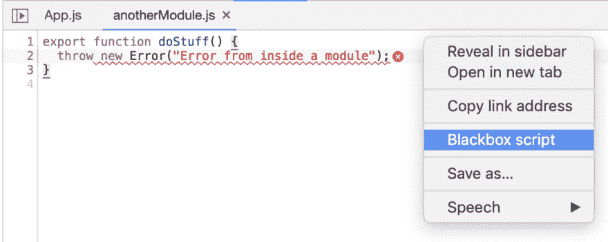
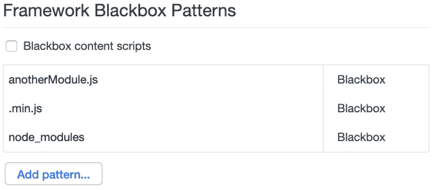
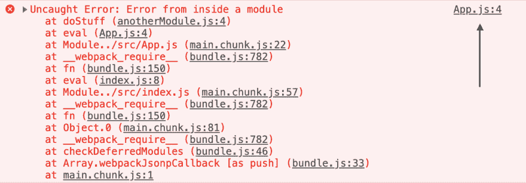
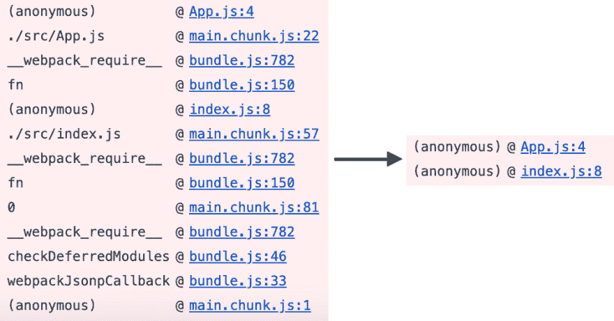

# 使用 DevTools 实现黑盒化

> 原文：<https://dev.to/awnton/blackboxing-with-devtools-3pie>

现代浏览器中的大多数开发工具都支持一个叫做黑盒的特性。它是一个工具，用来为调试器表示特定的源文件，以便它可以绕过它。例如，您可以使用它来改进错误的堆栈跟踪，或者避免进入框架源代码。

让我们先来看一个改进的堆栈跟踪和错误的简化示例。假设我们有一个 React 应用程序，它只有一个组件(`App.js`)，这个组件调用第三方库(`anotherModule.js`)的一个函数。如果第三方库抛出一个错误，我们将得到一个堆栈跟踪，指向库内导致错误的那一行。

您自己可能也遇到过这个问题，错误指向了`react.min.js`、`angular.min.js`或任何其他框架源代码中一个模糊的行。

### 黑盒一个源文件

> 这些例子使用了 Chrome DevTools，但是你也可以在 Firefox 中黑盒子文件。

有两种方法可以对文件进行黑盒处理，一种是在源代码面板或设置面板中打开并右键单击文件。

当您选择此选项时，实际发生的是文件被添加到应该被黑盒化的模式列表中。如果我们在 DevTools 设置(`F1`)和黑盒下查找，你应该会找到你的源文件列表。这是你可以添加源文件到 blackbox 的另一个地方，但是最重要的是你也可以添加模式。例如,`.min.js`取消选中所有缩小的文件，或者`node_modules`取消选中 node_modules 文件夹中的所有文件。

所以当第三方`anotherModule.js`被黑盒化后，DevTools 现在指向我们自己的源文件，而不是库源码。

请注意，这个示例是非常人为的，因此在这种情况下，我们可以查看错误，并看到我们的源是跟踪中的第二个文件，但在更现实的情况下，这可能会更难。

### 改善堆叠痕迹

说到堆栈跟踪，它们在黑盒化脚本时也得到改进。左边是来自上述 React 应用程序的堆栈跟踪，左边是相同的堆栈跟踪，带有黑色的`main.chunk.js`和`bundle.js`文件。

### 单步执行黑盒代码

最后，正如在本文开头简单提到的，黑盒化也意味着当你使用调试器单步执行/进入/退出任何代码时，你将自动跳过黑盒化的脚本。这意味着你不再会突然不知道自己身在何处，也不知道自己是谁！😍

## 结论

总的来说，通过对源文件进行黑盒处理，您将收到带有相关源代码行的错误和日志，堆栈跟踪将更加简洁，并且当您单步执行代码时，您将只在相关源代码中结束。

让我知道你对这篇文章的看法！在使用开发工具时，你还有其他提高效率的技巧吗？