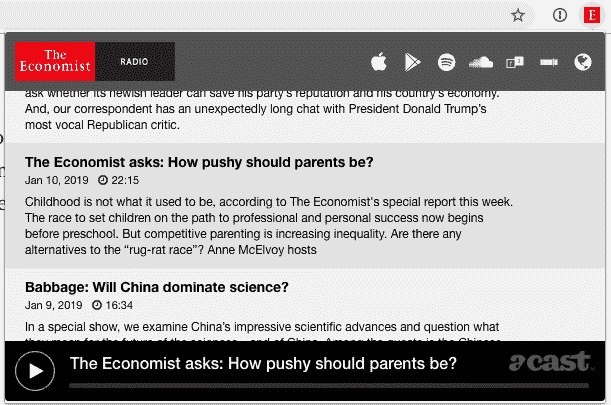
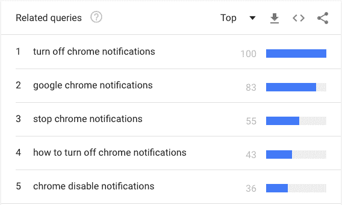
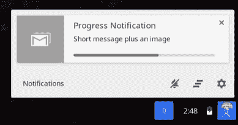
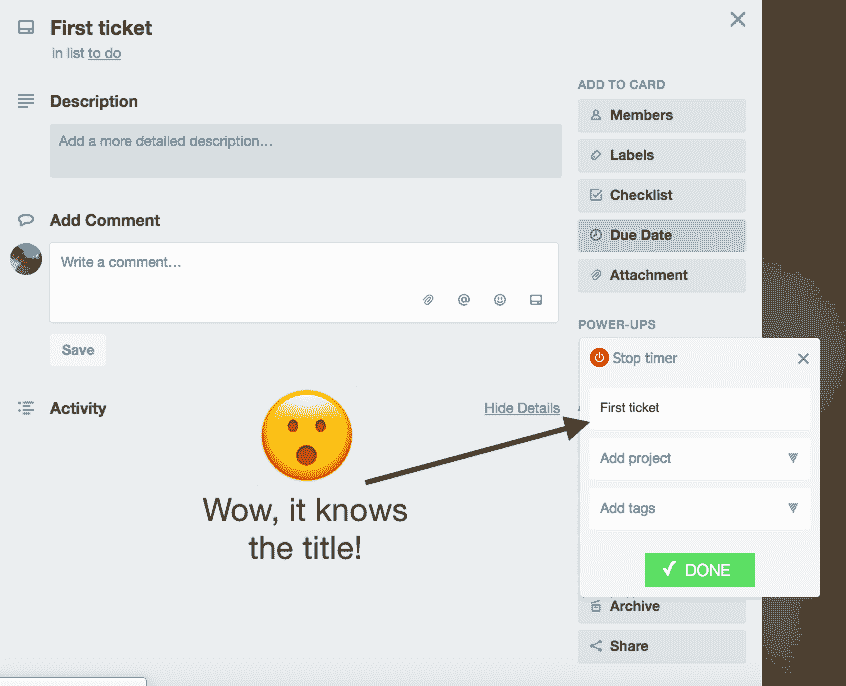

# 浏览器扩展:当您的产品需要时

> 原文：<https://dev.to/_elergy_/browser-extensions-when-your-product-needs-it-ip9>

### 浏览器扩展:当您的产品需要时

这篇文章是关于浏览器扩展的第一篇文章。

在这个周期中，我将尝试回答企业和开发者可能会问的关于扩展的常见问题。

我将从最流行的一个开始:“**为什么我的产品需要扩展？并将在后续文章中更深入地讨论技术细节。**

但是在我开始之前，让我快速解释一下为什么我决定写它。

浏览器扩展是一个被很好记录的领域。Chrome 和 Firefox 这两个最流行的浏览器为开发者提供了很好的资源([https://developer.chrome.com/extensions](https://developer.chrome.com/extensions)和[https://developer . Mozilla . org/en-US/docs/Mozilla/Add-ons/web extensions](https://developer.mozilla.org/en-US/docs/Mozilla/Add-ons/WebExtensions))，其中不仅包含关于 API 的信息，还有很好的示例教程。

此外，如果你搜索“浏览器扩展”(*或“Chrome 扩展”，或“web 扩展”，我稍后会描述它们的区别*)你会发现很多很棒的教程和例子，涵盖了所有的基本需求。

开始并构建可以工作的东西非常简单。但是你会意识到这是一个新的领域，有新的规则和限制，与网络应用略有不同。例如，您可能会发现:

*   经典的 UX 模式不好用
*   在 extension 的弹出窗口中渲染你的花哨的 Angular 应用程序需要很长时间，用户会看到延迟
*   在您最近更新后，Chrome 禁用了一个扩展
*   浏览器似乎支持类似的 API，但是你仍然需要复制大量的代码

诸如此类。这离问题的完整列表太远了，所以如果你有任何问题，请随时在评论中提问或在 Twitter 上 ping 我。

### 你的产品为什么需要它？

很可能，没有。

但这绝对值得考虑。

2019 年的今天，人们与产品的交互方式不止一种。这只是可用选项的一个子集:

1.  经典网站
2.  移动应用
3.  桌面应用程序
4.  语音助手
5.  聊天机器人
6.  网站上的聊天助手
7.  可穿戴设备(如手表)
8.  通知(桌面或移动)
9.  与其他产品集成(直接集成或通过 IFTTT 等服务集成)
10.  电子邮件

浏览器扩展只是您产品的另一个可用选项。你可以拥有全部，也可以只拥有一个。

当你决定实现一种与产品交互的新方式时，你脑海中会有一个现有媒体无法覆盖的用例。

> 网站是提供信息的一个很好的工具，但是它也有缺点:它需要被用户打开。在用户决定访问该网站之前，您不能告诉她有关新公告的信息。
> 
> 但通过通知或电子邮件简讯可以轻松实现。

在本文的其余部分，我将介绍浏览器扩展可以覆盖的一些情况。

#### 1。总是在后台工作

这项功能深受音乐和广播服务的喜爱。如果你有一个传统的网站，用户可以在后台听一些东西，他们总是需要保持网站开放。

这是最流行但不是唯一的一个用例。不同种类的定时器、聊天和游戏在你关闭它们打开的标签页时并不友好。

<figure> 

<figcaption>【学人电台】Chrome</figcaption>

</figure>

但是这可以通过扩展来解决:代码可以在后台运行，这意味着没有必要打开一个网站。更重要的是，你可以关闭所有的浏览器窗口，继续收听。

> 例子: [Noisli](https://chrome.google.com/webstore/detail/noisli/klejemegaoblahjdpcajmpcnjjmkmkkf?hl=en) ，[经济学家电台](https://chrome.google.com/webstore/detail/economist-radio/jbooignbehgkkjfeiojiijijdpjoinco)

#### 2。更好的通知选项

浏览器通知很烦人。这是 chrome 中与通知相关的热门搜索查询列表:

幸运的是，扩展有另一种方式来通知用户，而不会向他们发送垃圾通知— **浏览器动作**。

<figure> 

<figcaption>浏览器在 Chrome 中的动作</figcaption>

</figure>

浏览器动作是扩展的主要按钮。它有两个东西你可以配置来吸引用户的注意:一个图标(可以是动画)和一个徽章(文本和背景可以改变)。

如果你真的需要一个通知，扩展提供了更多的选项。扩展可以访问支持不同模板的[富通知](https://developer.chrome.com/apps/richNotifications):

<figure> 

<figcaption>进度通知显示一个进度条(例子来自[【https://developer.chrome.com】](https://developer.chrome.com))</figcaption>

</figure>

#### 3。与其他服务的集成(即使它们没有 API)

这个选项最好用一个例子来解释。假设你有一个允许自由职业者跟踪他们的时间并生成报告的产品。这可以通过一个简单的网站来实现。

你的客户越多，他们抱怨的就越多:总是打开网站跟踪时间非常不方便。如果你能把你的产品和他们已经在使用的任务追踪器结合起来，那就太好了。

虽然听起来可行，但并不像看起来那么简单:

1.  世界上有数百个追踪器——支持所有追踪器真的很难
2.  并非所有的跟踪器都有公共 API
3.  有时公司会把追踪器放在自己的私人服务器上。在这种情况下，您的后端将无法访问它们

[*Toggl*](https://toggl.com) 是如何用扩展解决这个问题的一个很好的例子。他们只是在你的任务跟踪器的一个界面上增加了一个新的按钮“开始计时”，再也不需要打开他们的网站了:

<figure> 

<figcaption>如何看待特雷罗</figcaption>

</figure>

<figure> 

<figcaption>标题已经自动填充</figcaption>

</figure>

您所能实现的几乎没有限制:如果用户可以在他们的浏览器中看到某些东西，扩展就可以访问它。甚至不需要打开页面——扩展可以在后台加载内容。当然，用户应该明确允许，但技术上是可能的。

它帮助您构建类似于以下内容的应用程序:

*   Taco——Chrome 定制的新标签，显示你使用的所有服务中的所有任务。
*   Keepa——跟踪亚马逊网站上的价格，并在有变化时通知你
*   在你阅读时监视你，并向你展示你最喜欢的话题的统计数据

#### 4。扩展其他产品并自动化日常工作流程

现有产品中的很多问题都可以通过浏览器扩展解决。如果你不喜欢 JIRA 的界面或者你不想在 Youtube 上看视频，这是给你的。

在前面的例子中，Toggl 扩展向第三方服务添加了新元素。

[精制的 GitHub](https://chrome.google.com/webstore/detail/refined-github/hlepfoohegkhhmjieoechaddaejaokhf) 走得更远——它给 GitHub 界面增加了**很多新功能**。例如，您可以一次打开所有通知，或者再次将它们标记为未读。

甚至更多——这里有一个由 GitHub 实现的功能列表，所以你可以看到扩展是在早期采用者身上测试新特性的一个好方法。

浏览器扩展可以覆盖更多的用例。我没有提到任何可能对您的产品有用的非常具体的 API，比如访问浏览器历史记录、设置代理设置或捕获屏幕截图。

扩展可以是你产品的核心技术(AdBlock，Pocket)，也可以是为用户增加更多选项，让用户体验更好的一种方式(Gmail checker，Todoist)。

在接下来的文章中，我将写更多关于这些用例，如何实现它们以及如何避免最常见的问题。欢迎在 [Twitter](https://twitter.com/_elergy_) 上提出任何问题，所有更新也会在那里。