# 用 Firebase 和 React Native 构建一个聊天应用

> 原文：<https://dev.to/jscrambler/build-a-chat-app-with-firebase-and-react-native-56jh>

**最后更新日期:2021 年 11 月 26 日**

在本教程中，您将使用 React Native、Expo 和 Firebase 作为后端服务来构建一个聊天应用程序。该应用程序将包含一个简单的登录系统，使用每个特定用户的电子邮件地址。用户将被允许上传个人资料图片。聊天应用程序将更像一个全球聊天室，但却是实时的。

您可以在这个 [GitHub 资源库](https://github.com/amandeepmittal/react-native-examples/tree/master/RNFirebaseChat)找到本教程的完整源代码。

## 安装依赖项

要开始使用，您必须在本地计算机上安装 Expo CLI。从您的终端运行以下命令，以便安装 CLI 并使用它生成新项目。

```
# To install expo-cli
npm install -g expo-cli

# To generate new project
expo init RNfirebase-chat

# Choose blank template when asked

# traverse inside the project directory
cd RNfirebase-chat 
```

Enter fullscreen mode Exit fullscreen mode

项目生成后，您可以在 iOS 模拟器或 Android 模拟器中运行它，以验证一切正常。Android 开发人员应该确保在执行下面的命令之前，Android 虚拟设备正在运行。

```
# for iOS simalulor
yarn ios

# for Android device/emulator
yarn android 
```

Enter fullscreen mode Exit fullscreen mode

接下来，安装一个名为 [`react-native-gifted-chat`](https://github.com/FaridSafi/react-native-gifted-chat) 的依赖项，为聊天应用程序提供一个可定制的 UI。为了在不同的屏幕之间导航，我们将使用 [`react-navigation`](https://reactnavigation.org/) ，最后，为了连接 Firebase 项目，我们需要 Firebase SDK。

```
npm install @react-navigation/native @react-navigation/stack react-native-gifted-chat

# OR is using yarn 

yarn add @react-navigation/native @react-navigation/stack react-native-gifted-chat

# after the above dependencies install successfully 

expo install firebase expo-constants dotenv react-native-gesture-handler react-native-screens react-native-safe-area-context @react-native-community/masked-view 
```

Enter fullscreen mode Exit fullscreen mode

为了构建应用程序，我们需要:

*   用户认证服务
*   存储用户电子邮件的服务
*   存储消息的服务

Firebase 将利用所有这些服务。在构建认证流程时，我们不会深入讨论如何用 Expo 实现 Firebase 认证。我们已经在单独的教程[中对此进行了深入的讨论。](https://blog.jscrambler.com/how-to-integrate-firebase-authentication-with-an-expo-app/?utm_source=dev.to&utm_medium=referral&utm_campaign=chat-app-react-native)

## 设置 Firebase

Firebase 是 Google 的一个应用程序开发工具，它为 SDK 提供了电子邮件和社交媒体认证、实时数据库、机器学习工具包、API 等服务。Firebase 可以与云服务 Google Cloud Platform 集成。

在应用程序中，我们将使用电子邮件认证和云存储。要建立一个 Firebase 自由层项目，请访问[Firebase 控制台](https://console.firebase.google.com/)并创建一个新项目，输入名称，然后单击按钮**添加项目**按钮。

<center>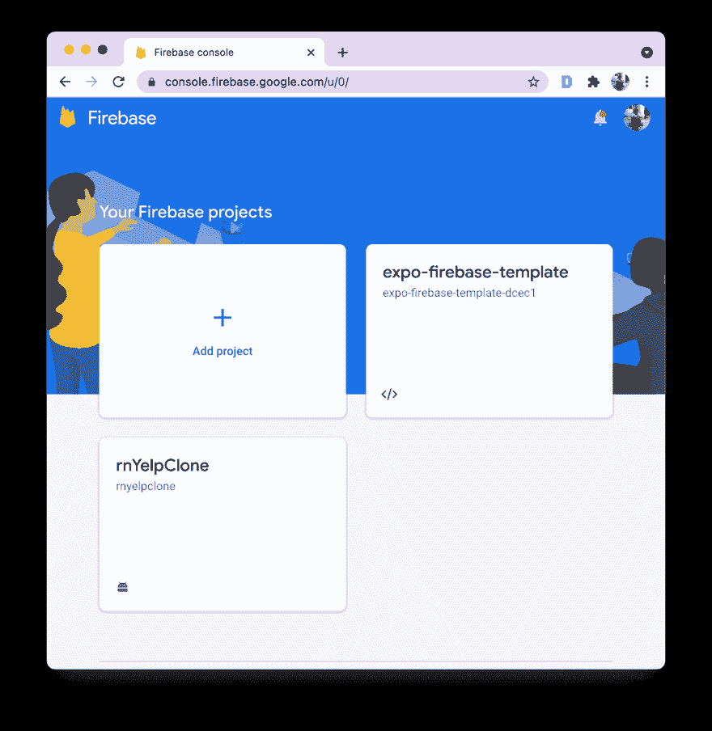</center>

接下来，添加新 Firebase 项目的名称，然后单击**继续**。当询问 Google Analytics 设置时，您可以禁用它，因为本例中不会用到它。然后点击**创建项目**。

一旦 Firebase 项目被创建，你将会看到如下所示的主屏幕。

<center>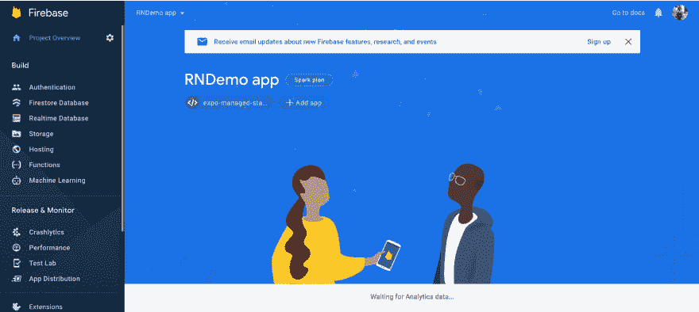</center>

看看左侧的侧面菜单栏。这是任何 Firebase 项目中的主要导航。首先，我们需要启用身份验证。点击**构建**部分下的**认证**选项卡，然后点击**登录方式**。使用**电子邮件/密码**启用验证，然后点击**保存**按钮。

<center>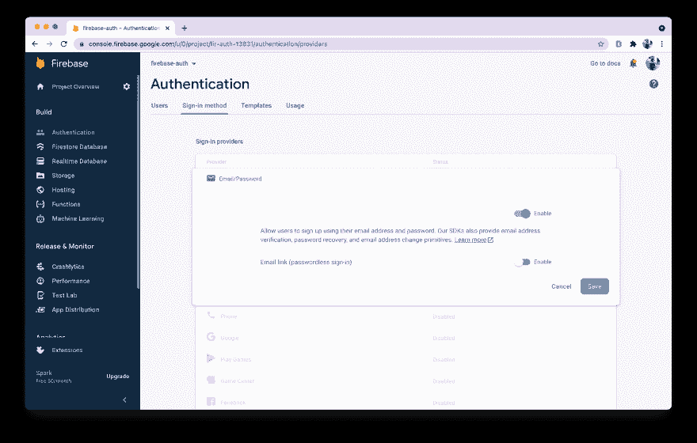</center>

在仪表板屏幕上，在左侧菜单中，单击设置图标，然后转到*项目设置*页面，然后查找*常规>您的应用*部分。如果是新项目，不会有任何 app。

<center>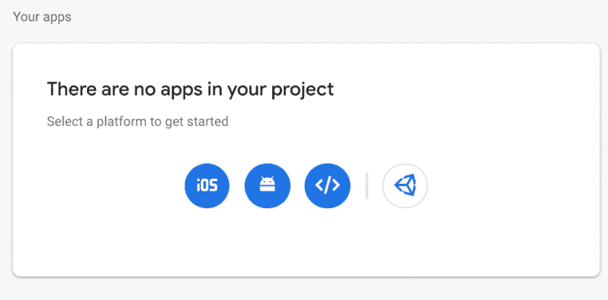</center>

单击 Web 按钮。它会提示您输入应用程序的详细信息。输入应用的昵称，然后点击*注册应用*按钮。

<center>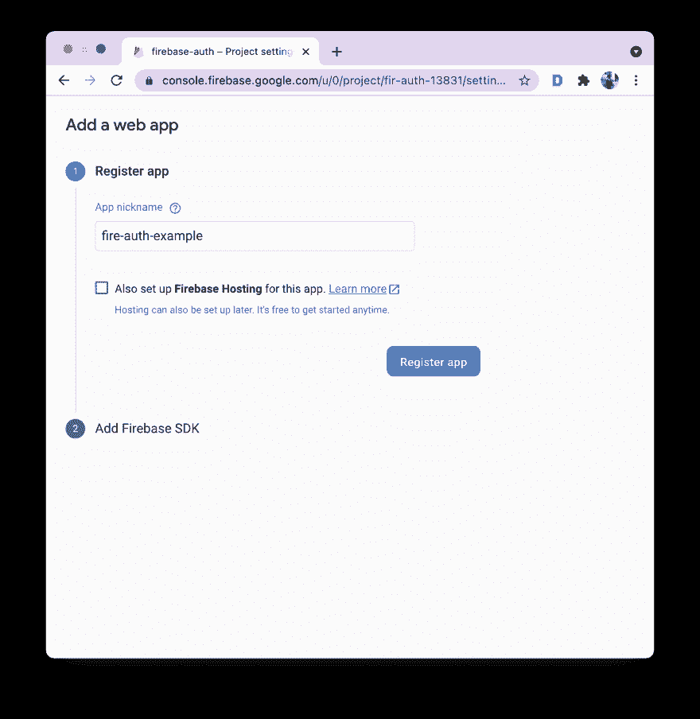</center>

然后，Firebase 将为配置对象提供使用不同 Firebase 服务所需的 API 密钥和其他密钥。

<center>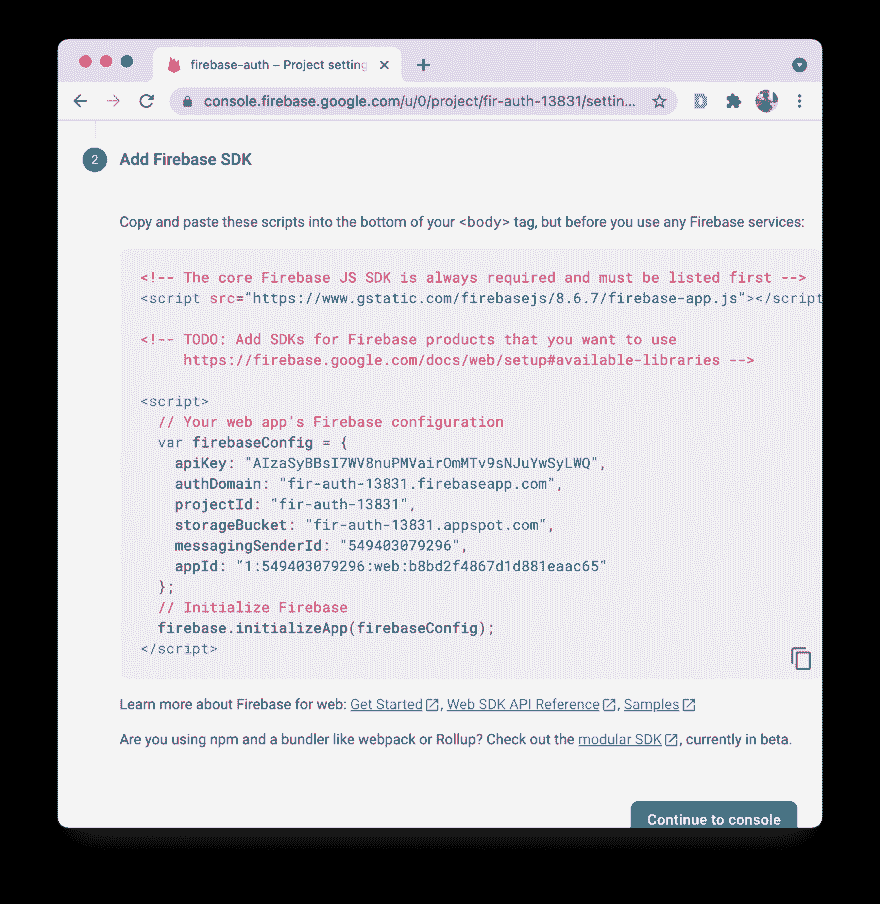</center>

这些 API 键可以包含在 React 本机应用程序中，因为它们不用于访问 Firebase 服务的后端资源。这只能通过 Firebase 安全规则来实现。
这并不意味着您应该将这些密钥暴露给版本控制主机，比如 GitHub。
在帖子[如何将 Firebase 认证与 Expo 应用](https://blog.jscrambler.com/how-to-integrate-firebase-authentication-with-an-expo-app/?utm_source=dev.to&utm_medium=referral&utm_campaign=chat-app-react-native)集成中，我们讨论了如何在`.env`中设置环境变量，并通过`expo-constants`包使用它们。我们将遵循同样的方法。

在 React 本地项目的根目录下创建一个`.env`文件。用你从 Firebase 得到的真实钥匙替换掉 X 的 T2。

```
API_KEY=XXXX
AUTH_DOMAIN=XXXX
PROJECT_ID=XXXX
STORAGE_BUCKET=XXXX
MESSAGING_SENDER_ID=XXXX
APP_ID=XXX 
```

Enter fullscreen mode Exit fullscreen mode

接下来，在项目的根目录下将`app.json`文件重命名为`app.config.js`。使用`dotenv`配置添加 import 语句来读取环境变量。因为它是一个 JavaScript 文件，所以您必须导出所有 Expo 配置变量，并且还要添加一个包含 Firebase 配置键的`extra`对象。下面是这个步骤后的文件外观:

```
import 'dotenv/config';

export default {
  expo: {
    name: 'expo-firebase-auth-example',
    slug: 'expo-firebase-auth-example',
    version: '1.0.0',
    orientation: 'portrait',
    icon: './assets/icon.png',
    splash: {
      image: './assets/splash.png',
      resizeMode: 'contain',
      backgroundColor: '#ffffff'
    },
    updates: {
      fallbackToCacheTimeout: 0
    },
    assetBundlePatterns: ['**/*'],
    ios: {
      supportsTablet: true
    },
    android: {
      adaptiveIcon: {
        foregroundImage: './assets/adaptive-icon.png',
        backgroundColor: '#FFFFFF'
      }
    },
    web: {
      favicon: './assets/favicon.png'
    },
    extra: {
      apiKey: process.env.API_KEY,
      authDomain: process.env.AUTH_DOMAIN,
      projectId: process.env.PROJECT_ID,
      storageBucket: process.env.STORAGE_BUCKET,
      messagingSenderId: process.env.MESSAGING_SENDER_ID,
      appId: process.env.APP_ID
    }
  }
}; 
```

Enter fullscreen mode Exit fullscreen mode

现在，`extra`对象中的所有键都可以使用`expo-constants`在应用程序范围内读取。这个包允许从`app.json`中读取值——或者在这种情况下，从`app.config.js`文件中读取值。

在 React 本地项目中，在根目录下创建一个名为`config/`的新目录，并添加一个名为`firebase.js`的文件。编辑文件如下所示:

```
import { initializeApp } from 'firebase/app';
import { getAuth } from 'firebase/auth';
import { getFirestore } from 'firebase/firestore';
import Constants from 'expo-constants';

// Firebase config
const firebaseConfig = {
  apiKey: Constants.manifest.extra.apiKey,
  authDomain: Constants.manifest.extra.authDomain,
  projectId: Constants.manifest.extra.projectId,
  storageBucket: Constants.manifest.extra.storageBucket,
  messagingSenderId: Constants.manifest.extra.messagingSenderId,
  appId: Constants.manifest.extra.appId,
  databaseURL: Constants.manifest.extra.databaseURL
};

// initialize firebase
initializeApp(firebaseConfig);

export const auth = getAuth();
export const database = getFirestore(); 
```

Enter fullscreen mode Exit fullscreen mode

## 设置 Firestore 数据库

下一步是启用数据库规则。从侧边栏菜单访问名为 **Firestore 数据库**的第二个选项卡。

<center>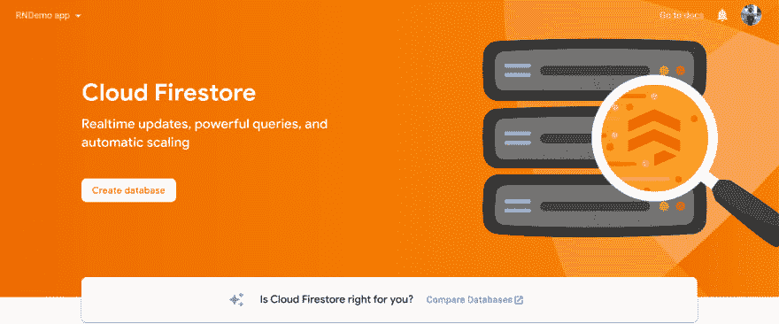</center>

点击**创建数据库**。当询问安全规则时，选择本例中的**测试模式**。你可以在这里了解更多关于 Firebase [的安全规则，并在以后相应地更新你的规则。](https://firebase.google.com/docs/database/security)

<center>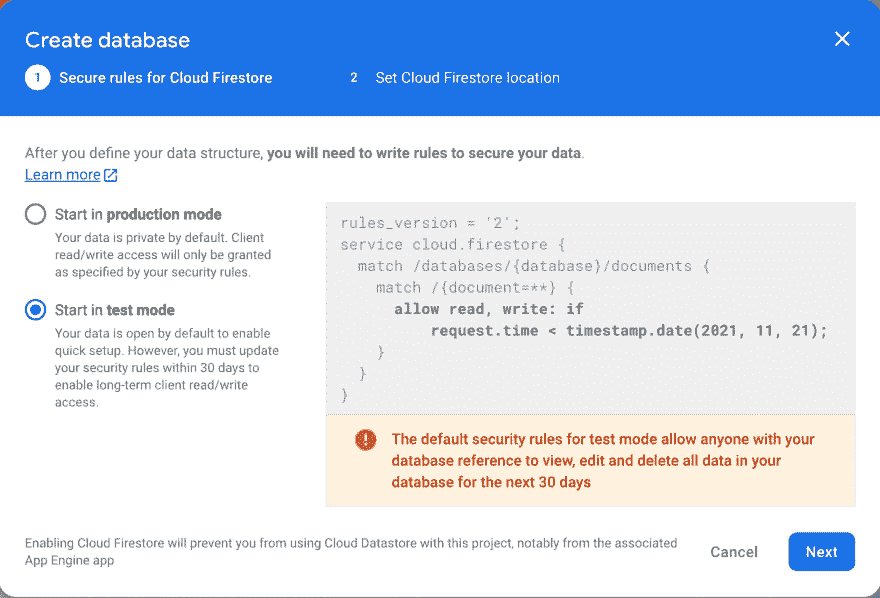</center>

接下来，将该位置设为默认位置，并点击**启用**。

设置部分到此为止。在下一节中，让我们开始构建应用程序。

## 聊天画面

组件允许我们显示不同用户将要发送的聊天消息。首先，创建一个名为`screens`的新目录。这是我们将要存储所有屏幕组件的地方。在这个目录中，用下面的代码片段创建一个新文件`Chat.js`。

```
import React from 'react'
import { GiftedChat } from 'react-native-gifted-chat'

export default function Chat() {
  return (
    <GiftedChat />
  )
} 
```

Enter fullscreen mode Exit fullscreen mode

现在打开`App.js`文件，添加逻辑，使用`react-navigation`模块创建一个导航组件。这个文件将包含一个`RootNavigator`，一个仅包含一个屏幕的`ChatStack`导航器，稍后我们将添加一个具有业务逻辑的`AuthStack`导航器，以处理认证用户仅查看聊天屏幕。

```
import React from 'react';
import { NavigationContainer } from '@react-navigation/native';
import { createStackNavigator } from '@react-navigation/stack';

import Chat from './screens/Chat';

const Stack = createStackNavigator();

function ChatStack() {
  return (
    <Stack.Navigator>
      <Stack.Screen name='Chat' component={Chat} />
    </Stack.Navigator>
  );
}

function RootNavigator() {
  return (
    <NavigationContainer>
      <ChatStack />
    </NavigationContainer>
  );
}

export default function App() {
  return <RootNavigator />;
} 
```

Enter fullscreen mode Exit fullscreen mode

现在，如果您运行模拟器设备，您会注意到有一个裸露的最小聊天屏幕，它有一个普通的白色标题和背景，在屏幕的底部，用户可以输入消息的输入区域。当输入内容时，会自动出现一个**发送**按钮。

<center>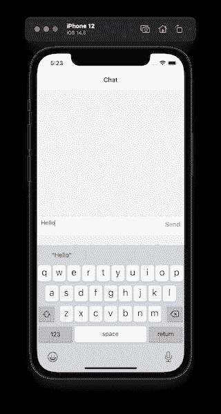</center>

然而，这个**发送**按钮现在没有任何功能。

[](https://blog.jscrambler.com/how-to-protect-react-native-apps-with-jscrambler/?utm_source=dev.to&utm_medium=referral&utm_campaign=chat-app-react-native)

## 添加登录屏幕

在`screens/`目录中创建一个名为`Login.js`的屏幕组件。该组件文件将包含登录屏幕上组件的结构。

该屏幕本身包含两个输入字段，供应用程序用户输入他们的凭据和一个按钮登录到应用程序。另一个按钮用于在用户没有注册应用程序的情况下导航到注册屏幕。所有这些组件都是使用 React Native 创建的。

首先从 React 本机核心导入必要的组件，从`config/firebase.js`文件导入`auth`对象。

`onHandleLogin`方法将使用 Firebase Auth 的`signInWithEmailAndPassword()`方法来验证用户的凭证。如果凭证准确，用户将导航到聊天屏幕。否则，您的终端窗口中会显示一些错误。您可以添加自己的业务逻辑来处理这些错误。

下面是`Login.js`文件的完整代码片段:

```
import React, { useState } from 'react';
import { StyleSheet, Text, View, Button, TextInput } from 'react-native';
import { signInWithEmailAndPassword } from 'firebase/auth';
import { auth } from '../config/firebase';

export default function Login({ navigation }) {
  const [email, setEmail] = useState('');
  const [password, setPassword] = useState('');

  const onHandleLogin = () => {
    if (email !== '' && password !== '') {
     signInWithEmailAndPassword(auth, email, password)
        .then(() => console.log('Login success'))
        .catch(err => console.log(`Login err: ${err}`));
    }
  };

  return (
    <View style={styles.container}>
      <Text style={styles.title}>Welcome back!</Text>
      <TextInput
        style={styles.input}
        placeholder='Enter email'
        autoCapitalize='none'
        keyboardType='email-address'
        textContentType='emailAddress'
        autoFocus={true}
        value={email}
        onChangeText={text => setEmail(text)}
      />
      <TextInput
        style={styles.input}
        placeholder='Enter password'
        autoCapitalize='none'
        autoCorrect={false}
        secureTextEntry={true}
        textContentType='password'
        value={password}
        onChangeText={text => setPassword(text)}
      />
      <Button onPress={onHandleLogin} color='#f57c00' title='Login' />
      <Button
        onPress={() => navigation.navigate('Signup')}
        title='Go to Signup'
      />
    </View>
  );
}

const styles = StyleSheet.create({
  container: {
    flex: 1,
    backgroundColor: '#fff',
    paddingTop: 50,
    paddingHorizontal: 12
  },
  title: {
    fontSize: 24,
    fontWeight: '600',
    color: '#444',
    alignSelf: 'center',
    paddingBottom: 24
  },
  input: {
    backgroundColor: '#fff',
    marginBottom: 20,
    fontSize: 16,
    borderWidth: 1,
    borderColor: '#333',
    borderRadius: 8,
    padding: 12
  }
}); 
```

Enter fullscreen mode Exit fullscreen mode

屏幕看起来是这样的:

<center>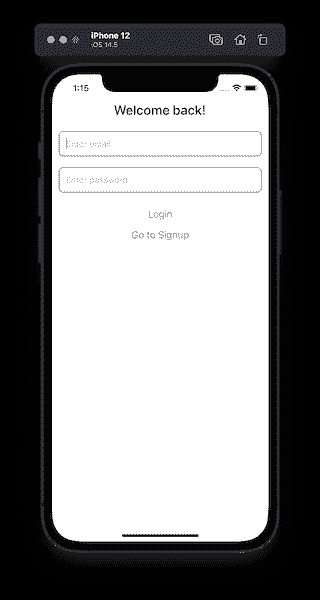</center>

## 创建注册屏幕

注册屏幕类似于登录屏幕。它有完全相同的输入字段和按钮，只有一个例外。在这个名为`onHandleSignup`的文件中定义的 handler 方法使用 Firebase 中的`createUserWithEmailAndPassword()`方法来创建一个新的用户帐户。

在`screens`目录中创建一个新文件，命名为`Signup.js`。添加以下代码片段:

```
import React, { useState } from 'react';
import { StyleSheet, Text, View, Button, TextInput } from 'react-native';
import { createUserWithEmailAndPassword } from 'firebase/auth';
import { auth } from '../config/firebase';

export default function Signup({ navigation }) {
  const [email, setEmail] = useState('');
  const [password, setPassword] = useState('');

  const onHandleSignup = () => {
    if (email !== '' && password !== '') {
  createUserWithEmailAndPassword(auth, email, password)
        .then(() => console.log('Signup success'))
        .catch(err => console.log(`Login err: ${err}`));
    }
  };

  return (
    <View style={styles.container}>
      <Text style={styles.title}>Create new account</Text>
      <TextInput
        style={styles.input}
        placeholder='Enter email'
        autoCapitalize='none'
        keyboardType='email-address'
        textContentType='emailAddress'
        value={email}
        onChangeText={text => setEmail(text)}
      />
      <TextInput
        style={styles.input}
        placeholder='Enter password'
        autoCapitalize='none'
        autoCorrect={false}
        secureTextEntry={true}
        textContentType='password'
        value={password}
        onChangeText={text => setPassword(text)}
      />
      <Button onPress={onHandleSignup} color='#f57c00' title='Signup' />
      <Button
        onPress={() => navigation.navigate('Login')}
        title='Go to Login'
      />
    </View>
  );
}

const styles = StyleSheet.create({
  container: {
    flex: 1,
    backgroundColor: '#fff',
    paddingTop: 50,
    paddingHorizontal: 12
  },
  title: {
    fontSize: 24,
    fontWeight: '600',
    color: '#444',
    alignSelf: 'center',
    paddingBottom: 24
  },
  input: {
    backgroundColor: '#fff',
    marginBottom: 20,
    fontSize: 16,
    borderWidth: 1,
    borderColor: '#333',
    borderRadius: 8,
    padding: 12
  }
}); 
```

Enter fullscreen mode Exit fullscreen mode

屏幕看起来是这样的:

<center>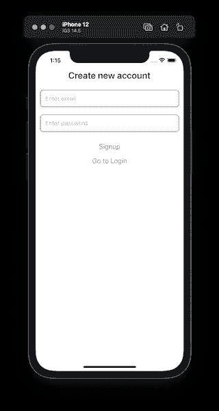</center>

## 添加认证用户提供者

在 Reactjs 中，[上下文 API](https://reactjs.org/docs/context.html#reactcreatecontext) 被设计为共享被认为是 React 组件树的全局数据。当您创建一个上下文时，需要传递一个默认值。当组件没有匹配的提供程序时，将使用该值。

提供者允许 React 组件订阅上下文更改。这些上下文变化可以帮助我们确定用户在聊天应用程序中的登录状态。

在本节中，我们将把`App.js`文件修改为两个堆栈导航器，用于聊天和授权相关的屏幕。让我们从添加导入语句开始，然后定义一个`ChatStack`和一个`AuthStack`导航函数。

```
import React, { useState, createContext, useContext, useEffect } from 'react';
import { NavigationContainer } from '@react-navigation/native';
import { createStackNavigator } from '@react-navigation/stack';
import { View, ActivityIndicator } from 'react-native';
import { onAuthStateChanged } from 'firebase/auth';
import { auth } from './config/firebase';

import Login from './screens/Login';
import Signup from './screens/Signup';
import Chat from './screens/Chat';

const Stack = createStackNavigator();

function ChatStack() {
  return (
    <Stack.Navigator>
      <Stack.Screen name='Chat' component={Chat} />
    </Stack.Navigator>
  );
}

function AuthStack() {
  return (
    <Stack.Navigator screenOptions={{ headerShown: false }}>
      <Stack.Screen name='Login' component={Login} />
      <Stack.Screen name='Signup' component={Signup} />
    </Stack.Navigator>
  );
} 
```

Enter fullscreen mode Exit fullscreen mode

要创建一个 auth provider，需要导出一个名为`AuthenticatedUserProvider`的函数。这个提供者将允许屏幕组件访问应用程序中的当前用户。定义一个名为 user 的状态变量。

添加以下代码片段:

```
const AuthenticatedUserContext = createContext({});

const AuthenticatedUserProvider = ({ children }) => {
  const [user, setUser] = useState(null);

  return (
    <AuthenticatedUserContext.Provider value={{ user, setUser }}>
      {children}
    </AuthenticatedUserContext.Provider>
  );
}; 
```

Enter fullscreen mode Exit fullscreen mode

接下来，修改`RootNavigator`函数。在这个函数中，我们将使用 Firebase 方法`onAuthStateChanged()`来处理用户登录状态的变化。使用`useEffect`钩子，您可以订阅这个状态改变函数，并确保在组件卸载时取消订阅。此方法允许您在用户执行操作时订阅实时事件。这里的操作可以是登录、注销等等。

```
function RootNavigator() {
  const { user, setUser } = useContext(AuthenticatedUserContext);
  const [isLoading, setIsLoading] = useState(true);

   useEffect(() => {
    // onAuthStateChanged returns an unsubscriber
    const unsubscribeAuth = onAuthStateChanged(
      auth,
      async authenticatedUser => {
        authenticatedUser ? setUser(authenticatedUser) : setUser(null);
        setIsLoading(false);
      }
    );

    // unsubscribe auth listener on unmount
    return unsubscribeAuth;
  }, [user]);

  if (isLoading) {
    return (
      <View style={{ flex: 1, justifyContent: 'center', alignItems: 'center' }}>
        <ActivityIndicator size='large' />
      </View>
    );
  }

  return (
    <NavigationContainer>
      {user ? <ChatStack /> : <AuthStack />}
    </NavigationContainer>
  );
} 
```

Enter fullscreen mode Exit fullscreen mode

最后，用`AuthenticatedUserProvider`将`RootNavigator`包裹在`App`函数:
中

```
export default function App() {
  return (
    <AuthenticatedUserProvider>
      <RootNavigator />
    </AuthenticatedUserProvider>
  );
} 
```

Enter fullscreen mode Exit fullscreen mode

我们的应用程序中实现了 Firebase 身份验证:

<center>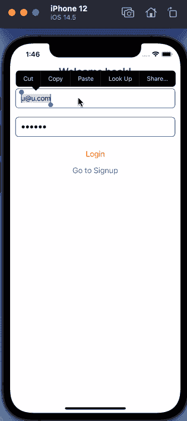</center>

## 添加聊天功能

由于我们的聊天应用程序中的身份验证现在正在工作，我们可以继续添加聊天功能本身。该组件将需要来自 Firebase 的用户信息，以便创建并发送聊天消息。

首先从 React Native Gifted Chat 库中导入必要的组件，从 firebase 配置文件中导入`auth`和`database`对象，从`firebase/firestore`中导入其他方法来获取数据并将数据添加到集合中。

```
import React, {
  useState,
  useEffect,
  useLayoutEffect,
  useCallback
} from 'react';
import { TouchableOpacity, Text } from 'react-native';
import { GiftedChat } from 'react-native-gifted-chat';
import {
  collection,
  addDoc,
  orderBy,
  query,
  onSnapshot
} from 'firebase/firestore';
import { signOut } from 'firebase/auth';

import { auth, database } from '../config/firebase'; 
```

Enter fullscreen mode Exit fullscreen mode

在`Chat`函数中，创建一个`messages`状态和一个使用`useLayoutEffect`处理注销动作的函数，以及在`onSignOut`处理程序方法中注销用户的业务逻辑。

```
export default function Chat({ navigation }) {
  const [messages, setMessages] = useState([]);

const onSignOut = () => {
    signOut(auth).catch(error => console.log('Error logging out: ', error));
  };

  useLayoutEffect(() => {
    navigation.setOptions({
      headerRight: () => (
        <TouchableOpacity
          style={{
            marginRight: 10
          }}
          onPress={onSignOut}
        >
          <Text>Logout</Text>
        </TouchableOpacity>
      )
    });
  }, [navigation]); 
```

Enter fullscreen mode Exit fullscreen mode

为了从 Firestore 数据库中检索旧消息，必须对数据库集合进行 API 调用。我们将集合名称设置为`chats`，并使用`useLayoutEffect`钩子来进行这个数据库调用。

为了发送消息，我们将创建一个名为`onSend`的自定义处理程序方法。这个方法将使用`useCallback`钩子，并将消息存储在名为`chats`的 Firestore 集合中。当发送新消息时，它使用 Firestore 的`addDoc`方法创建一个带有自动生成的 id 的新文档。

```
useLayoutEffect(() => {
    const collectionRef = collection(database, 'chats');
    const q = query(collectionRef, orderBy('createdAt', 'desc'));

    const unsubscribe = onSnapshot(q, querySnapshot => {
      setMessages(
        querySnapshot.docs.map(doc => ({
          _id: doc.data()._id,
          createdAt: doc.data().createdAt.toDate(),
          text: doc.data().text,
          user: doc.data().user
        }))
      );
    });

return unsubscribe;
  });

const onSend = useCallback((messages = []) => {
    setMessages(previousMessages =>
      GiftedChat.append(previousMessages, messages)
    );
    const { _id, createdAt, text, user } = messages[0];    
    addDoc(collection(database, 'chats'), {
      _id,
      createdAt,
      text,
      user
    });
  }, []); 
```

Enter fullscreen mode Exit fullscreen mode

最后，我们将使用`GiftedChat`组件及其不同的道具。第一个道具是`messages`来显示消息。下一个道具`showAvatarForEveryMessage`被设置为真。对于这个例子，我们将为每个登录并发送消息的用户设置一个随机的`avatar`。您可以用自己的逻辑替换它，以添加更好的头像生成解决方案。

`onSend`道具负责发送消息。`user`对象用于识别哪个用户正在发送消息。

```
return (
  <GiftedChat
    messages={messages}
    showAvatarForEveryMessage={true}
    onSend={messages => onSend(messages)}
    user={{
      _id: auth?.currentUser?.email,
      avatar: 'https://i.pravatar.cc/300'
    }}
  /> ); 
```

Enter fullscreen mode Exit fullscreen mode

这是此步骤后的输出:

<center>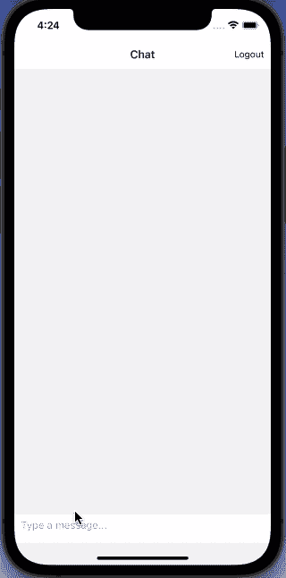</center>

## 结论

Firebase 在节省时间和更快的应用程序开发方面是一个很好的服务。将它与特定的用例(*如本教程中演示的*)集成在一起，而无需从头构建一个完整的后端，这对于任何 React 本地开发人员来说都是一个优势。

**最后，如果你正在用敏感逻辑构建 React 原生应用，确保用 [Jscrambler](https://jscrambler.com/code-integrity?utm_source=dev.to&utm_medium=referral&utm_campaign=chat-app-react-native)** 保护它们免受代码窃取和逆向工程。

最初发表在 Aman Mittal 的 Jscrambler 博客上。